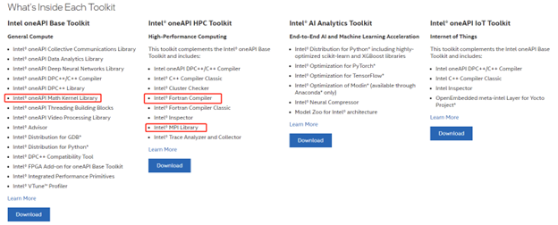
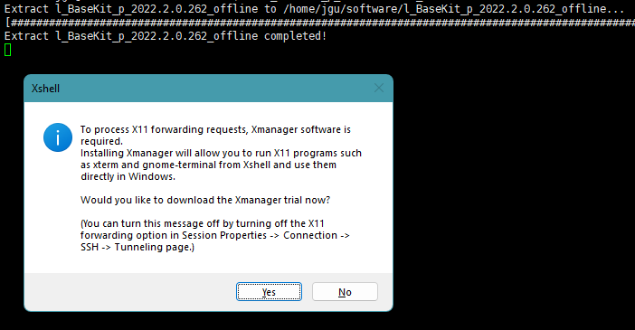
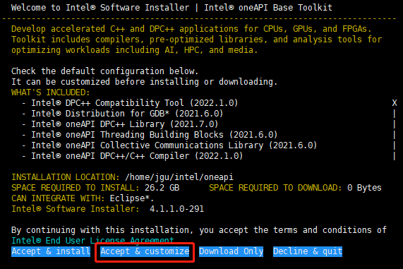
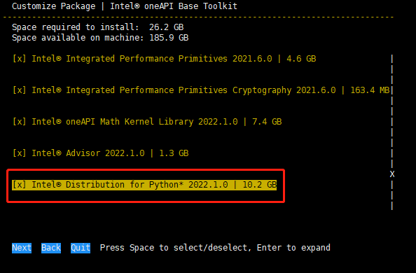
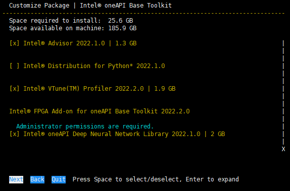
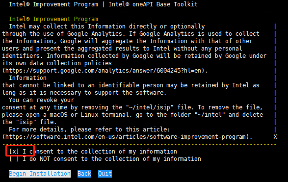
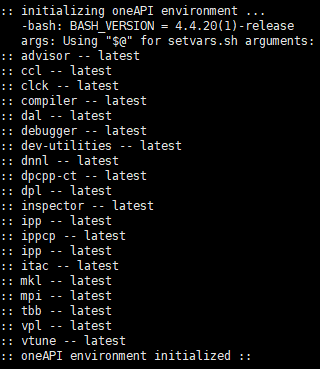

# 用 Intel OneAPI toolkit 编译和安装VASP

VASP的安装过程现在已经被大大简化了。下面的内容将给大家介绍如何用 `Intel OneAPI toolkit` 来编译和安装VASP。

## 服务器架构
先来看一下目前本例所用的服务器的架构。大家可以在终端输入 `lscpu` 命令查看自己服务器的架构。这个只用作了解，具体的架构应该不影响接下来的编译和安装。

```bash
[xxx software]$ lscpu

Architecture:        x86_64
CPU op-mode(s):      32-bit, 64-bit
Byte Order:          Little Endian
CPU(s):              4
On-line CPU(s) list: 0-3
Thread(s) per core:  1
Core(s) per socket:  1
Socket(s):           4
NUMA node(s):        1
Vendor ID:           AuthenticAMD
CPU family:          25
Model:               1
Model name:          AMD EPYC 7763 64-Core Processor
Stepping:            1
CPU MHz:             2445.406
BogoMIPS:            4890.81
Hypervisor vendor:   VMware
Virtualization type: full
L1d cache:           32K
L1i cache:           32K
L2 cache:            512K
L3 cache:            32768K
NUMA node0 CPU(s):   0-3
Flags:               fpu vme de pse tsc msr pae mce cx8 apic sep mtrr pge mca cmov pat pse36 clflush mmx fxsr sse sse2 syscall nx mmxext fxsr_opt pdpe1gb rdtscp lm constant_tsc rep_good nopl tsc_reliable nonstop_tsc cpuid extd_apicid pni pclmulqdq ssse3 fma cx16 pcid sse4_1 sse4_2 x2apic movbe popcnt aes xsave avx f16c rdrand hypervisor lahf_lm extapic cr8_legacy abm sse4a misalignsse 3dnowprefetch osvw topoext cpb invpcid_single ibpb vmmcall fsgsbase bmi1 avx2 smep bmi2 invpcid rdseed adx smap clflushopt clwb sha_ni xsaveopt xsavec xgetbv1 xsaves clzero wbnoinvd arat umip pku ospke vaes vpclmulqdq rdpid overflow_recov succor
```

## 下载 Intel OneAPI toolkit
以前大家在编译 VASP 的时候一般用 `intel` 编译器。近些年来，Intel公司将旗下的一些代码重新整合成了一个叫 `Intel OneAPI toolkit`的软件包。它是一款免费，功能强大，且全面的软件包。大家可以去官网看看相关介绍。链接在[这儿](https://www.intel.com/content/www/us/en/developer/tools/oneapi/toolkits.html#gs.85oi1s)：




因为编译 VASP 需要用 `Math Kernel Library` 和 `MPI Library`，我们需要下载 `Base toolkit` 和 `HPC toolkit`。大家可以用下面的命令去下载离线安装包
```shell
wget https://registrationcenter-download.intel.com/akdlm/irc_nas/18673/l_BaseKit_p_2022.2.0.262_offline.sh

wget https://registrationcenter-download.intel.com/akdlm/irc_nas/18679/l_HPCKit_p_2022.2.0.191_offline.sh
```

以下载 `HPC toolkit `为例：
```shell
[xxx software]$ wget https://registrationcenter-download.intel.com/akdlm/irc_nas/18679/l_HPCKit_p_2022.2.0.191_offline.sh

--2022-08-03 14:11:06--  https://registrationcenter-download.intel.com/akdlm/irc_nas/18679/l_HPCKit_p_2022.2.0.191_offline.sh
Resolving registrationcenter-download.intel.com (registrationcenter-download.intel.com)... 23.206.199.219, 23.206.199.217
Connecting to registrationcenter-download.intel.com (registrationcenter-download.intel.com)|23.206.199.219|:443... connected.
HTTP request sent, awaiting response... 200 OK
Length: 1538034717 (1.4G) [application/octet-stream]

Saving to: ‘l_HPCKit_p_2022.2.0.191_offline.sh’
l_HPCKit_p_2022.2.0.191_offline.sh                                 100%[===============================================================================================================================================================>]   1.43G   366MB/s    in 4.6s    

2022-08-03 14:11:11 (320 MB/s) - ‘l_HPCKit_p_2022.2.0.191_offline.sh’ saved [1538034717/1538034717]
```

假设大家已经下载好了两个如下所示的离线安装包，就可以进行安装了。
```shell
[xxx software]$ ls
l_BaseKit_p_2022.2.0.262_offline.sh  l_HPCKit_p_2022.2.0.191_offline.sh
```
## 安装 Intel OneAPI toolkit
先安装 `Base toolkit`。运行以下命令首先会解压这个安装包。结束后，如果是用 `xshell` 远程登陆的话，会问要不要`run X11`图形界面。大家有图形界面的话就用，没有的话就选择`No`。

```shell
[xxx software]$ sh l_BaseKit_p_2022.2.0.262_offline.sh
```




接下来出现这个画面：



**重点来了!!!**

`Base toolkit` 有 Intel 自带的 Python 解释器，安装起来特别费劲，大家可以选择 `Accept & Customize` 从而取消安装 Python 解释器。

如下图所示，选择到 Python 这个地方的时候按回车键进入下一菜单，按空格键去掉勾选，再回到上一级菜单。



再按下一步进行安装。



有一些其他的选项，使用默认设置就行。最后再接受条款，选择安装即可。



很快就完成了，完成之后 close 掉安装窗口就行。

安装 `Base toolkit` 之后再以类似的方法安装 `HPC toolkit` 就行。`HPC toolkit` 不需要自己`customize`。

## 设置 Intel OneAPI 环境变量

设置 `Intel OneAPI` 环境变量需要用到 `/home/xxx/intel/oneapi/setvars.sh` 文件。大家把 `source /home/xxx/intel/oneapi/setvars.sh` 添加到 `~/.bashrc` 文件中即可。xxx 为`username`。比如用户名为`bigbro`:

```shell
echo 'source /home/bigbro/intel/oneapi/setvars.sh' >> ~/.bashrc
```
重新启动终端，如果出现以下代码就说明成功了。




## 编译VASP
本例还是选择编译 `VASP 5.4.4` 版本

```shell
[xxx software]$ tar zvxf vasp.5.4.4.tar.gz
[xxx software]$ cd vasp.5.4.4/
[xxx software]$ cp arch/makefile.include.linux_intel makefile.include
[xxx software]$ make all
```
静待安装成功即可。


## 注意事项
+ 安装 `Base toolkit` 的时候，大家可以选择 `Accept & Customize` 取消安装 `Python` 解释器，从而节省时间。
+ 其他没有什么需要注意的。


