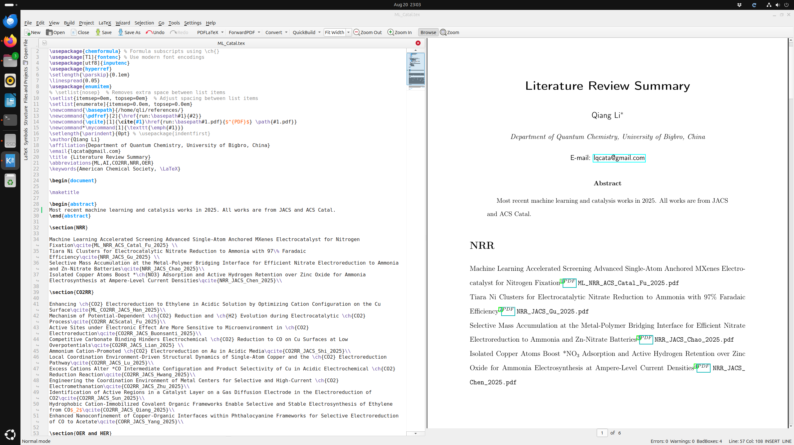

分享2025年JACS和ACS Catal关于ML和催化的一些文章

以下是本人最近整理的一批文献，主要来自 **2025 年的 JACS 和 ACS Catalysis** 期刊，涉及的研究方向包括：

- 电催化（CO₂RR, OER, NRR）
- 机器学习与材料发现

如有兴趣，可通过以下链接下载整理好的 PDF 文件压缩包： [cat2025.zip](../Downloads/cat2025.zip)

本压缩包为大师兄本人整理文献时使用 LaTeX 制作的汇总文档，内容结构清晰，排版专业，非常适合作为科研笔记或写作模板。主要包含：

- `ML_Catal.tex`：主 LaTeX 文件，负责文档结构与内容编排
- `reference.bib`：BibTeX 数据库，包含全部文献信息
- `ML_Catal.pdf`：编译生成的 PDF 文件，供直接阅读

如你正在学习 LaTeX 排版，或希望搭建自己的文献汇总系统，这会是一个非常有参考价值的实例。

对于新手学习LaTex， 以下是大师兄的建议（适用于 **Windows 和 Ubuntu** 系统）：：

#### 1. 安装 TeX Live（LaTeX 编译引擎）

TeX Live 是最常用的 LaTeX 发行版，支持所有宏包，适合科研用途。

- **Windows 用户**：
   前往官网下载安装程序： https://tug.org/texlive/acquire-netinstall.html
- 安装方法参考： [如何在 Windows 安装 TeX Live](https://chat.openai.com/share/32e3e7d1-4b71-4053-b50c-d32a10b4dc85)
- 安装时间较长（约 4~6 GB），请耐心等待。

#### 2. 安装 LaTeX 编辑器（推荐使用 Kile）

- **Kile（推荐）**：功能强大，支持代码补全和 PDF 预览。
- Ubuntu 下使用 `sudo apt install kile` 安装即可。
- 其他可选编辑器：自己找喜欢的。

#### 3. 编译文档

1. 将 `cat2025.zip` 文件解压缩
2. 打开 `ML_Catal.tex` 文件
3. 使用编辑器编译（使用 `pdflatex` + `bibtex`，多次运行即可生成完整文档）

