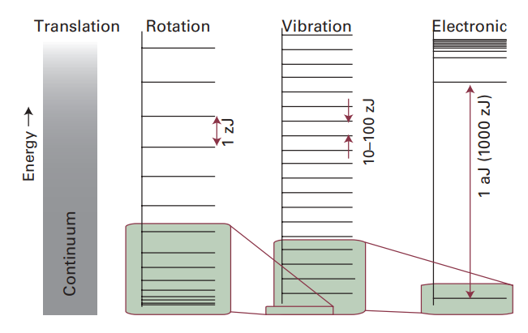
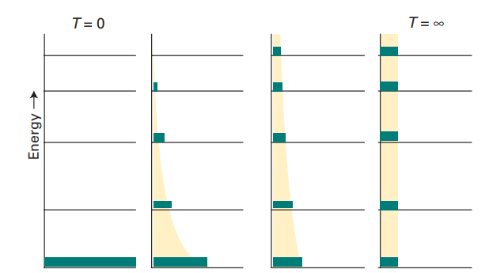

# 能量、温度与化学  

能量是化学中广泛使用的一个概念，用来讨论分子结构、反应以及许多其他过程。能量从一种形式向另一种形式的转化由热力学定律描述。热力学定律适用于由大量原子和分子组成的物质。热力学的“第一定律”是关于能量守恒的陈述；“第二定律”则是关于能量分散的陈述。 为了讨论构成块体物质的所有原子和分子的能量，必须使用量子力学。根据量子理论，粒子能量是“量子化”的，即能量只能取特定值，而不能是连续任意的。一个粒子可能有三种不同类型的运动：  

- **平移**（在空间中移动）  
- **转动**（取向的改变）  
- **振动**（键的周期性伸缩与弯曲）  

- **图1**：不同类型的分子运动（平移、转动、振动、电子）的允许能级相对间距。（1 zJ = 10⁻²¹ J；以摩尔为单位，1 zJ 大约相当于 0.6 kJ·mol⁻¹。） 

图1展示了这些不同运动所对应的能级的相对大小和间距，并将它们与典型原子、分子的能量进行比较。对于处在普通大小容器中的分子而言，平移能级极其密集，几乎可以认为是连续的。相比之下，电子能级之间的间隔则非常大。  单个分子的能量与块体物质的能量之间的联系由化学中最重要的概念之一——**玻尔兹曼分布**。块体物质由大量分子组成，每个分子处于某个能级。所有这些分子中，某个能级上的分子数称为该能级的“布居数”。通常，最低能级布居最多，高能级布居越来越少。玻尔兹曼分布给出了布居数与能量和温度的关系（k是玻尔兹曼常数）：  

\[
N_e \propto e^{-\epsilon_e / kT}
\]

图2展示了不同温度下能级的布居情况：随着温度升高，高能级逐渐被更多分子占据，而低能级相对减少。  

- **图2**：当温度从零升高到无穷大时，一个具有五个能级的体系在玻尔兹曼分布下的布居数变化。

---

玻尔兹曼分布除了揭示能量随温度的分布规律外，还对理解温度的意义至关重要。大多数分子在低温下只占据低能态，这解释了化合物的稳定性以及液体和固体的存在。而在高温下，高能级逐渐可及，这为化学反应的发生提供了可能。  因此，温度不仅决定了物质能量的分布，还决定了物质能否从一种状态转变为另一种状态。这两个方面将在全书中详细探讨。  在解读块体物质性质和温度作用时，你应始终牢记玻尔兹曼分布，理解能量的流动，以及能量如何依据玻尔兹曼分布被分配，是掌握热力学、分子结构以及化学变化的关键。  
