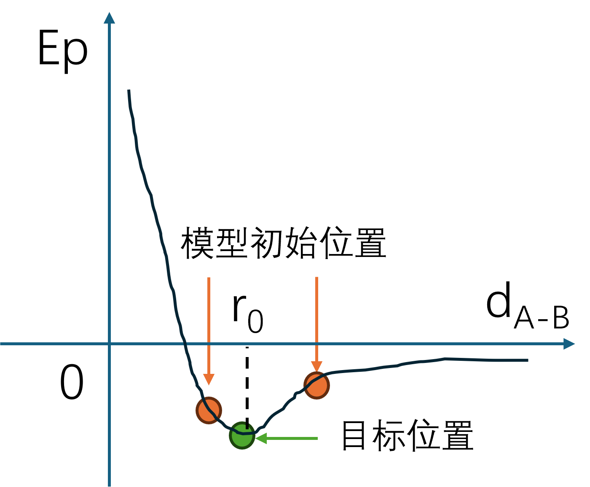

# Ex3.3 VASP的输出文件 OSZICAR

上一节，我们学习了`CONTCAR`的一些基本内容。本着从简到易，从最常用到最不常用的原则，这一节学习VASP的另外一个简单，但又很重要的的输出文件：`OSZICAR`。 

首先，推荐一个QE学习的视频：https://www.bilibili.com/video/av36194036 （用良心带人入坑）

### `OSZICAR` 的含义

师兄，`OSZICAR`是什么的缩写？为什么起这么一个名字？

OSZICAR 文件是输出文件之一，记录了电子自洽迭代过程（SCF，即 Self-Consistent Field）和离子步（ionic steps）中的能量变化信息，其文件名来自 "OSZI"（表示震荡，来自德语 "oszillieren"）和 "CAR"（表示卡片/记录） 的组合。


### 什么是优化？

在介绍`OSZICAR`的内容和功能之前，有必要先给大家澄清一个计算中常见的词：优化（`optimization`）。

计算一个体系，我们有`2`个优化过程：

* **电子结构**的优化： 可以理解为对某一固定的几何结构，迭代求解薛定谔方程来获得体系能量极小值的一个过程。这个迭代过程，每一次迭代求解都可以认为是电子结构的一个优化。（通常被大伙称为：电子步）
* **几何结构**的优化：可以理解为在电子结构优化的结果上，获取原子的受力情况，然后根据受力情况，调节原子的位置，再进行电子结构优化，获取新的受力情况，然后再调节原子位置，一直重复这样的过程，直至找到体系势能面上一个极小值的过程。（通常被大伙称为：离子步）



思考一下，我们当前学习的`O`原子体系，我们只可能对它进行电子结构的优化，因为它的几何结构不会发生变化。

### `OSZICAR`是干什么的？

当VASP迭代求解`O`原子电子结构的时候，整个过程就会记录在OSZICAR中。下面我们就看一下VASP官网对`OSZICAR`的解释说明：https://www.vasp.at/wiki/index.php/OSZICAR

```
Information about convergence speed and about the current step is written to stdout and to the **OSZICAR** file. Always keep a copy of the **OSZICAR** file, it might give important information.
```

也就是说：`OSZICAR`是用来记录优化过程一些信息的文件。这里的优化过程既包括电子结构，又包括几何结构。而且官网也强调了该文件的重要性：`Always keep a copy`。

### `OSZICAR`长什么样子？

在Linux的终端中，使用Vim打开`OSZICAR`（不会Vim，就把文件下载到本地电脑，用文本编辑器打开），会看到类似下面的信息：

```bash
       N       E                     dE             d eps       ncg     rms          rms（c）
DAV:   1     0.324969965196E+02    0.32497E+02   -0.10270E+03    48   0.977E+01
DAV:   2     0.501749892771E+00   -0.31995E+02   -0.31995E+02    72   0.202E+01
DAV:   3    -0.182605770767E-01   -0.52001E+00   -0.50521E+00    48   0.521E+00
DAV:   4    -0.203547758465E-01   -0.20942E-02   -0.20860E-02    96   0.333E-01
DAV:   5    -0.203547873947E-01   -0.11548E-07   -0.11210E-07    48   0.844E-04    0.307E-01
DAV:   6    -0.213726161828E-01   -0.10178E-02   -0.17884E-03    48   0.111E-01    0.155E-01
DAV:   7    -0.214708381542E-01   -0.98222E-04   -0.23522E-04    48   0.459E-02
   1 F= -.21470838E-01 E0= -.13757722E-01  d E =-.154262E-01
```

* 第一行中各项的含义：（没汉语解释的，大师兄也翻译不出来）

  1） `N` 代表电子结构的迭代步数，通常被大家称为电子步, SCF 迭代步数；

  2） `E` 代表当前电子步的体系能量 (不包括零点震动能);

  3） `dE`当前电子步和上一步的能量差值;

  4） `d eps` 本次迭代中能带占据数变化的估计误差（电子密度收敛指标）; 

  5）`ncg`: number of conjugate gradient。 共轭梯度（conjugate gradient）循环次数（解 Kohn-Sham 方程的内部迭代数)；

  6） `rms`: 所有电荷密度网格点上的均方根误差（RMS error），表示密度收敛程度 

  7） `rms (c)`: 输入和输出电荷密度之间的差异

* 第二行中`DAV`的含义：

  1） `Blocked Davidson algorithm`的缩写。看不懂不要紧，简单点：就是一个电子迭代求解的自洽算法。在对电子结构迭代求解的过程，前人们发展出了很多不同的算法。就好比是，从北京到南京，有很多种出行选择一样，可以坐火车，汽车，乘飞机，也可以步行，骑马，骑驴，骑自行车，等等。每一种出行方式都是一种算法。大家可以根据自己的情况，选择适合自己的出行方式。所以，对自己的研究方向，也需要找一个适合自己体系的合适的算法。

  2） 除了`DAV`，今后你还会看到`RMM` （residual minimization scheme） 和 `CG` （conjugate-gradient algorithm）等等。选择不同的算法，第二行以及后面显示的也会有所区别。这点大家掌握即可。具体到每个算法怎么回事，当你计算算起来了，有余力，慢慢开始学习量化基础知识的时候再仔细琢磨。

  3） 前面我们说了，要找一个适合自己体系的算法，是选`DAV`，`RMM`还是`CG`，亦或是其他的呢？ 这个可以在`INCAR`中通过参数`ALGO`设置，参考链接：https://www.vasp.at/wiki/index.php/ALGO 。一般来说，使用`ALGO = Fast`可以满足大部分的需求。可以理解为北京到南京出行，大家最常用的火车。有一点要记住，如果在后面课题开展过程中，遇到电子结构很难收敛的情况要这么做：

  * 检查几何结构是否合理？不合理的几何结构导致离子步难收敛
  * 如果合理，可能是体系本身的电子结构比较复杂，这时候就需要换一些更加稳定可靠的算法了，比如`ALGO = ALL`。需要特别注意的是：越稳定对应的也就是计算的时间或者消耗的计算资源越多，有时候会超出你的预算，鱼和熊掌不可兼得。

  4） 师兄：这个氧原子的计算中，我们没有在`INCAR`中设置`DAV`这个算法相关的参数啊，为什么`OSZICAR`中还会出现`DAV`呢？

  原因在于：同很多软件一样，`VASP`也有很多`默认的参数`，这就避免了当你不设置某个参数的时候VASP罢工的尴尬局面。当然，有些相关的参数，你不设置的时候VASP也会罢工，这个我们以后再说。此时的计算，对于电子结构收敛的算法来说，默认的是`DAV`这个方法，也就是INCAR中： `ALGO = N`。

  5）划重点：

  我们知道`VASP`的`INCAR`设置中，有很多相应的参数。而新手恰恰在学习的过程中，由于不能在短时间了解这些参数的具体含义，使用方法，从而导致了不知道怎么去选择的情况。而就是在这种情况下，选择了胡搞。也就是`INCAR`中参数，认识的写上去，不认识的也写上去。这也恰恰是新手在计算过程中容易出错的一个主要原因。前面我们说了`VASP`有很多默认的参数，而新手在学习的时候，不能图快，要一步一个脚印地走。看见一个参数，就好好琢磨琢磨，争取理解透了，或者知道这个参数大体上怎么回事。如果你不认识的参数，千万不要写上去，使用默认的就可以。

  另外，很多人还喜欢花里胡哨地往`INCAR`中加一堆可有可无的解释说明，整的`INCAR`文件冗长而且不简洁。虽然写注释可以帮助我们更好地进行选择参数，避免出错，但一步一步学习，把参数的用法记在脑子里，看一个简洁的界面不更好么？

* 最后一行：

  1） `F`前面的 1 代表几何结构优化的次数（也称为离子步的步数），本练习只有1步。

  2） `F =` 是体系的总能量, 与`OUTCAR`中 `free energy  TOTEN` 后面的值相等；（`OUTCAR`还没讲，暂且记住）

  3） `E0` 后面的能量对应`OUTCAR`中 `energy (sigma->0)`后面的能量。

  4)  如果看了一头雾水，只要记住这一点就可以了： E0 后面的能量就是你所需要的数值，这是最关键的信息之一，其他的可以都忽略掉。
  
  

### `OSZICAR` 的作用

Always keep a copy of the OSZICAR file, it might give important information. 官网既然这么说，这表明OSZICAR确实很重要，重要在哪里呢？ 

* 整个体系的电子优化过程都记录下来了（当然结构信息没有在这里保存）。（当然后面我们要讲的`OUTCAR`也以更加详细的方式将优化过程记下来了）但`OSZICAR`可以更加直观地观测我们体系优化过程中能量的变化过程。

* 通过`OSZICAR`获取体系的能量，也就是`E0`后面的那一项。**很多人在使用`VASP`的时候，不知道该选择哪个能量**，这里大师兄就告诉你：选择`E0`后面的即可。不管你有什么疑问，不管别人怎么跟你争论，都不要管，先老老实实记住：我们选`E0`后面的这个能量。随着你的学习，很多疑问自己就解开了。命令使用方式：

  ```
  qli@bigbrosci:~/LVASPTHW/ex3.3$ grep E0 OSZICAR  
     1 F= -.21470838E-01 E0= -.13757722E-01  d E =-.154262E-01
  ```

### 总结

后面的学习中，我们会经常讲解`OSZICAR`相关的内容，对新手来说，才刚刚接触计算，先保证脑子不被这么多的参数，文件搞晕是头等大事，本节就不做过多的解释。需要了解和学习的内容主要有以下几个方面：

1） `VASP`计算中的优化：几何和电子结构优化大体有个了解，本节主要是电子步的优化；

2）`OSZICAR`中各项的含义，争取多理解几个；

3）`DAV`对应的`INCAR`中`ALGO`是怎么设置的；一般来说`ALGO=FAST`可以满足大部分人的计算需求；越稳定的算法消耗越多的计算资源（耗时）

4）知道`VASP`有默认的参数，自己不要画蛇填足。

5）保持`INCAR`干净整洁，不知道的，模糊不清的参数坚决不往`INCAR`里面写，乱七八糟的注释，能不写就不要放。

6）知道怎么从`OSZICAR`中获取体系的能量: 'E0' 后面的能量。记住第6条并且会写一个脚本去提取这个能量，本节就完成任务。
