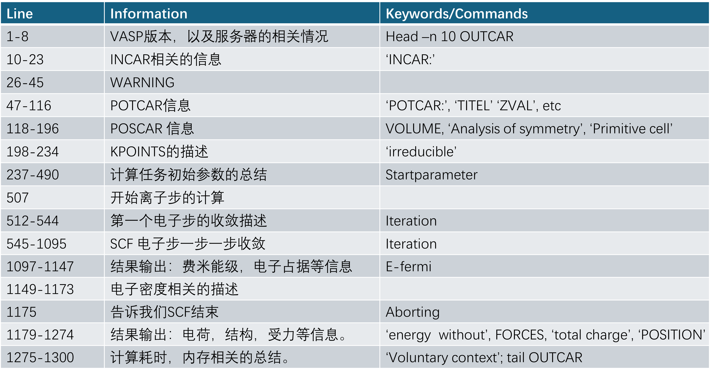

# Ex3.4 VASP的输出文件 OUTCAR 

OUTCAR是VASP的主要输出文件，但官网并没有给出太多详细具体的说明。大师兄对这一点也存在疑虑，思考了下其中的两个原因：
1） VASP可以计算的性质很多，每一个特定的任务都有其对应的输出内容，这就导致了OUTCAR的复杂多样性，比如说优化结构、频率、声子谱，能带、DOS等计算等，这些都会有特定的输
出，需要用户根据自己的计算内容去学习；
2） 另外一个原因就是里面的条目太多了，每一项单独解释都需要花费大量的时间，工作人员偷懒，也就把这个问题留给了用户自己去解决。

我们主要通过下面的这个计算的例子中的OUTCAR进行讲解（当然你也可以用你自己的例子），简单介绍一下OUTCAR的基本结构以及输出内容，给大家一个大体的印象，不至于看到这么多行的结果眼花缭乱。

[O.tar.gz](../Downloads/O.tar.gz)

1) 大家下载这个例子，解压文件。
```bash 
tar -zxvf O.tar.gz 
```

2) 打开OUTCAR文件，可以通过VIM, 也可以通过文本编辑器。最好是可以显示行数。（后面的讲解以下载的OUTCAR为准，行数都是固定好的，方便大家查询并理解。）
vim显示行数小窍门：在 Vim 命令模式下（按 Esc 回到命令模式），输入 `:set number` , 关闭行数：则输入`:set nonumber`。 输入中的 number 可以简化为nu。

3) 首先要告诉大家的是，VASP各个输出部分之间用横杠分割（---------------------），当你看到横杠的时候，就知道要进入结果的下一个部分内容了。


4) 下面是例子中的OUTCAR的一些简单介绍，大家对着行数去查看，去理解。大体知道每个部分的信息是怎么样的。

1-8: VASP会列出来其版本，时间，以及服务器的相关情况。所以，如果你不知道，自己的任务是VASP哪个版本计算的，也不知道如何去VASP的安装目录查找版本信息，可以运行一下，然后在OUTCAR的开头去找。

10-23: 我们的INCAR信息。

26-45: 警告信息：每次运行的时候（即使你的输入是正确的），VASP都会输出一个大大的WARNING来吓唬你，大家可以忽略它。但如果你的计算失败了，这个警告信息对你排查错误可能会有所帮助。

47-116: POTCAR基本信息，如果你想通过OUTCAR查看POTCAR中的元素时，可以使用下面的命令：
```
grep POTCAR OUTCAR
grep TIT OUTCAR
grep ENMAX OUTCAR
grep ZVAL OUTCAR
```
57行中：ZVAL是该POTCAR中对应元素的价电子，这里氧原子含有6个外层价电子。

118-196: POSCAR 相关的信息，也就是你的模型的一个相关描述，坐标格式，原子位置，以及晶胞的形状大小,体系的对称性以及点群操作相关的信息

198-234: KPOINTS的相关描述。

237-490: 计算任务参数的总结,这里会列出来所有与本任务相关的参数，如果你没有在INCAR中设置，它们就显示默认值。
这个地方大家仔细看下, 大体有些印象即可。
强调一下，不知道的参数，不要瞎往INCAR里面放，采用默认值就好。新手的话经常会加一些乱七八糟的参数，导致计算错误。

507：第一个离子步的计算开始。

512-544： 第一个电子步的收敛描述。

545-1095: SCF 电子步一步一步收敛

1097-1147: 结果输出：费米能级，能带上电子占据等信息,
Band 1 对应的是2个 2s 电子， band 2,3,4 对应的是4个2P电子。固体物理中，费米能级对应的是最高电子占据轨道的能量，也就是HOMO，大家可以对比下band 2 3 4 和费米能级的能量。

1149-1173: 电子密度相关的描述

1175: 告诉我们SCF结束

1179-1274: 结果输出：电荷，结构，受力等信息。

1275-1300: 计算耗时，内存相关的总结。

分析完前面的内容,大家会发现:具体到里面各项的含义以及各个细节上,还有很多值得讨论的地方,比如群论,薛定谔方程求解过程,POTCAR的相关信息等。对于新手来说,看完本节,能大体浏览下来,知道各个部分包含什么内容就很不错了。 下面的图重复了一下前面的内容，并且加了一些相关的关键词，它们 在你通过使用 `grep` 命令提取OUTCAR中有效信息的时候非常有用，  也可以帮你快速定位查找的范围，节约时间。希望大家都能掌握如何获得关键词，以及如何使用它们提取信息。



**总结：**
本练习中，带领大家粗略浏览了一遍OUTCAR中各部分的信息。大家在浏览的时候时刻要思考，这部分包含的什么内容，具有什么物理或者化学意义？ 怎么用grep 关键词获取有用的信息等。
由于计算内容的多样性，对于OUTCAR的详细解释，目前没有办法全部都展示，当然，在后续的计算过程中，我们还会结合具体的例子进行讲解。一般来说,等你计算上手之后,OUTCAR里面的很多内容,可能等课题结束或者毕业了,都不会用到,更进一步说,你可能都不会打开OUTCAR了。因此,完全不用担心里面的很多内容不理解。但,这不是你偷懒的理由,如果你想把VASP学好,学精,这些都需要自己下功夫去琢磨,理解。

