---
Ex00 为什么是"The Hard Way"
categories: 
- LVASPTHW
---

在学习本书时,大师兄们会默认读者掌握了一些基本的电脑操作技能,以及化学的基本常识。本章列举出一些常用的计算工具和软件,以及假设大家掌握的一些技能。如果没有达到基本的要求,那么请在学习前面几章的同时,抓紧提升自己的能力。 化学的基本知识如果没有掌握,不建议学习本书。 

# 心态

## 1） 主动行动,主动思考

学习过程中要时刻抱着**主动**的心态去解决问题。

* 遇到不会的问题,**主动**去查找解决方法;
* 遇到不懂的基础知识,**主动**去找教科书;
* 遇到什么好的资源,书籍,课件等,**主动**去网上搜索,下载;
* 本书中的练习，看到别人有意思的计算，**主动**去重复重复。
* 没事就**主动**去官网溜达,
* VASP计算出错，**主动**去google或者官网的论坛找答案!

#### **但是**

* 前面说的**主动**是对于你自己来说的,别碰到不会的就主动求助别人,这样你很难得到提升。

##  2）被算（ji）计（suan）了该怎么办？

很多人在的课题组都是做实验的,老板头脑发热的时候，就安排做起了计算。但老板除了一颗乐观的心，屁都不懂啊。这时候的你，除非脑子很好用，否则就会陷入一种叫天天不应，叫地地不灵的境界。在这里,大师兄建议你：

* 说服老板，找个计算靠谱的组，合作一下，避免自己直接算；
* 说服不了，找个计算靠谱的组，让老板派你去交流学习一段时间,别自己在那里瞎捣鼓。

* 总之，时间和精力的成本，自己心里要有个数。

## 3）计算 = 转行？

* 很多人吐槽计算化学是个坑告诉你，既然选择了这条路，就准备改行吧。请避开这些负能量的说法，拿出自己的主见。无论放弃或者坚持，都要拿出你自己的判断力出来，请不要再听别人在你耳边瞎磨。也就是我的人生我做主。

* 每一行的人都会说自己这一行是个坑，不管你怎么跳，都是坑。引用我老婆的原话：之前带两个孩子的时候，感觉自己每天都很累，现在孩子父母帮忙看着，自己工作了，但每天还是很累。美好的生活，累总是一路同行。
* 个人的理解是，学习理论计算可以使你的视野更加开阔，思维方式更加灵活，对事物本质的把握和理解上，比别人要更胜一筹。也就是一眼就能找到问题的关键所在。不论是否继续相关的研究，转行与否，对今后的发展总会有所帮助。当然，我这个穷酸书生说的话，大家也可以一笑了之。


# 2  **操作系统**

做计算，有三个操作系统可以选择：

- Windows 系统:会使用Windows系统:会开机,打字,安装软件;
- Linux 系统, 推荐使用 Ubuntu16.XXX版本的系统(强烈推荐使用linux系统,但不局限于Ubuntu系统);

- Mac系统(大师兄周围很少用的,这里就忽略掉了....)。


##### 给重点照顾对象：Windows用户的第一个提醒：

Windows用户在进行计算的时候，只要计算出错了，就要本能地记起第一个解决的办法： dos2unix 

这个命令干什么的不要紧，先死死记住即可。


# **文本编辑工具**

### 1）[vim](https://www.vim.org/) 

这个必须要学会，linux下面自带。原因是绝大多数的计算都是在linux下面进行的，学会vim的基本操作可以极大提高你的文字处理能力和工作效率。


### 2) [notepad++](https://notepad-plus-plus.org/)

* 这个是对于Windows用户来说的，要求会创建文件,输入内容并保存文件，**这个软件必须学会使用!**

原因在于：Windows下面自带的记事本保存的文件与linux下的文件格式不匹配，提交任务的时候经常出问题，用notepad++则不会出现这个问题。

**因此**，记事本杜绝使用。为了安全，即使用了notepad++，Windows用户在进行计算的时候，也需要注意下面两点：

* Windows下面编辑的输入文件，如果想在linux服务器上运行，最好先执行: dos2unix 这个命令。

* Windows用户计算出错了，一定要首先想到 dos2linux 这个命令来解决问题!!!


### 3） [Atom](https://atom.io/)

这个Atom是文本编辑工具，不是原子的意思。Windows，Linux，Mac系统均可使用。要求会输入文件，保存文件。


# **常用建模相关软件:**

本书默认大家已经在自己的电脑里安装了下面三个软件：

### **1) Material Studio** 

* 这个软件，百度里面一大堆下载链接，安装教程，大家自行下载安装即可。

*  本书默认大家已经安装成功，会不会使用暂且不要求；
* 不要问我从哪里下载，安装出现问题也不要找我解决。


### 2）[**p4vasp**](http://www.p4vasp.at)

* 链接：[http://www.p4vasp.at/](http://www.p4vasp.at/)

- Windows版本，好像很久没有更新了，点击此处下载，解压,双击图标即可运行。也可以在大师兄QQ群或者其他QQ群文件中下载。

- Linux版本功能更加强大。可以

  Ubuntu用户使用命令一键安装： **sudo apt-get install p4vasp**

  也可以按照官网的说明，安装最新的版本：p4vasp 0.3.30

- Mac系统：本人没有经验，希望土豪分享下经验。

- 

### 3）**[VESTA](http://jp-minerals.org/vesta/en/)**  

* 来自日本的良心软件，Linux，Windows，Mac系统均可使用。链接：http://jp-minerals.org/vesta/en/
* Windows下面安装就不再介绍了，下载程序，解压，双击图标即可运行，相信大家都能搞定。

* Linux下安装: 

  - 下载binary程序文件，本人解压后放到了/opt/VESTA-x86_64目录

  - 编辑 ~/.bashrc 文件，在文件最后，添加下面2行。

  ```
  export VESTA=/opt/VESTA-x86_64 
  export PATH="$PATH:$VESTA"
  ```

  - 在终端里面进行的操作如下：第一行打开~/.bashrc文件, 自己添加上面提到的两行即可，第二行更新下~/bashrc文件，第三行运行VESTA。

  ```
  $ vim ~/.bashrc
  $ . ~/.bashrc
  $ VESTA
  ```


# 服务器相关

### 1) 知道怎么连接自己组内或者租赁的服务器;

### 2) 初步学习使用基本的linux命令:   

*  进入目录 : cd 

* 移动文件(夹): mv 
* 复制文件: cp 
* 复制文件夹用: cp -r ; 注意 cp 和 -r 之间有个或者N个空格
* 创建文件夹:mkdir     
* 删除文件: rm ;    
* 删除文件夹: rm  -r    
* 强制删除文件夹: rm -fr  或者 rm -rf  (f 和 r 的顺序可以颠倒 )        
* 显示目录下文件: ls,等命令;   
* 这里大师兄就不再啰嗦了,老司机们自动略过,新手自行百度:linux 命令,你会得到铺天盖地的信息。

### 3) 手上有可以正常运行的VASP程序

*  组里面已经安装好vasp程序，或者使用超算中心的VASP程序，只要手上有可以正常运行的VASP即可。因为我们在本书里，**不讨论**：
* - 1) 怎么下载VASP？
  - 2) 去哪里下载VASP?
  - 3) 去哪里下载VASP的pseudo potentials?
  - 4) 怎么安装VASP?
  - 5) 前三条命令禁止在大师兄群里提问，第四条VASP安装遇到问题可以交流。

*  知道怎么提交VASP任务
* - 自己组里已经有提交任务的脚本，如果没有的话,
  - - 1) 找组里的师兄师姐帮忙;
    - 2) 第一个啃螃蟹的人,找老师解决或者服务器商求助
    - 3) 自行百度解决  


# **程序语言学习**

建议大家学习两个语言: bash 和 python

* bash语言：日常terminal里面常用的基本命令，比如cd，ls这些，以及结合基本的逻辑语法，可以让你写出一些简单的小脚本，提高自己的工作效率；
* Python 语言：python是一款语法简单，很容易上手的程序，有着丰富的数据库支持，目前深受科研人员的喜爱。**注意**，这里我们不讨论类似：python是一门高级语言，运行的时候跟机器交互性差，需要时间比C++长这样的问题。因为这是专业程序员的事。不出意外，看这本书的大部分人，能够用python写个小脚本，方便地处理自己的任务和数据，就已经非常棒了，快和慢，对于我们来说，顶死了也就几秒的问题，完全可以接受。
* 学习程序语言，一方面可以极大地提高自己的工作效率，另一方面也可以改变自己看待事物的思维方式。  
* 如果不喜欢Python，当然也可以学习其他的程序语言，C++，R等。


# **总结:** 

* 初学者学习本书,所必须具有的技能:

* - 熟练使用一个操作系统；
  - 会编辑文本，写入和保存文件；
  - - **Windows 用户Notepad++必须掌握**,
    - linux用户可以vim或者其他编辑器，比如Atom
  - 安装好或者会初步使用一款建模软件。-
    - **p4vasp **安装在Windows和Ubuntu系统上；
    - **VESTA** 安装在Windows，Ubuntu，Mac系统上；
    - **Materials Studio** 安装在Windows或者Mac上。
  - 会连接服务器，使用的vasp程序并且会提交任务
    - 这个大师兄帮不了你，自行找服务器商或者其他售后人员解决。

* 所具有的心态：

  * 主动去面对遇到的问题和困难，冰冻三尺,非一日之寒，遇到问题，主动解决，日积月累就会收获良多；
  * 对自己要有自信，即使自己是彻头彻底的小白,也不必要担心。相对于那些积累了很多错误经验的人来说，什么都不知道则具有更好的可塑性。
  * 不要盲目相信他人，有自己的理解。如果你在网上搜索问题的答案，会找到很多人的回答，但实际熵很多人水平都可能没有你高，而你却把他们的话当成真理一般去相信，这是致命的。

* 大师兄的要求：

  * 新手认真阅读序言里面推荐的那本参考书；

  * 尽可能多地浏览VASP官网，对某些参数有疑惑，认真查阅手册；

  * 最重要的是不要偷懒，遇到不会的东西或者困难，立刻记下来或者去解决，否则明天你就会忘掉；

  * 好东西要学会分享，可以在QQ群里分享自己的心得，帮助其他正在入门的小师弟，妹们。


在BB了这么多节的Learn VASP系列教程之后，感觉时候再强调下本书的重点了：The Hard Way.

The Hard Way 在本人的眼里，类似于书山有路勤为径，学海无涯苦作舟的感觉，类似于经过无数瞎折腾终于尝到一点点小胜利甜头的感觉，类似于苦尽甘来，柳暗花明又一村的感觉。所以：Hard Way是本书的重点，也是痛苦学习的一个过程。


本人学习和使用VASP教程已经5年多了，开始写本书的时候也有4年的经验了。我进入课题组之前，不会用Ubuntu系统，也不会用脚本，也不会用python写脚本，也没用过VASP。我的VASP入门，是花了一个月看了Davide Sholl的书后，老板又手把手花了一个多月的时间学会的，学习的资料是老版本的Hand on Session系列。每天做的是系列中的练习，准备老板布置的作业，思考老板预留的问题，然后第二天听老板解释每个参数的含义，里面的关键点。而真正操作起来进入课题的时候，又有组里细心的博后专门帮忙指导答疑，也有很多人可以进行讨论学习。写这么多并不是在秀自己遇到了一个多好的老板，多好的课题组。在这样的环境中，经过了四年的学习，好几个课题的实战，才变成你们感觉很牛逼的大师兄（其实我只是经验比你们多一点点而已）。而这本书，也是本人这四年来学习到的精华，每一节都要花费差不多4个小时的样子才能完成，或者更多。而这四年的精华，岂能让你把这本书看一遍就掌握了?

到现在为止，瞎BB了76节。每节你花一天的时间去学习，加上其他参考书的学习，也需要2个月的时间。而2个月，对一个新手来说，完全在承受范围之内，请相信时间的力量。这里，我们澄清下对新手的定义：全职搞计算的菜鸟。所以，Hard Way 就是需要你花掉每一个整天的时间，一点点认真琢磨，反复操练，绝对不是什么速成。而现在我们搞科研都很浮躁，什么都喜欢图快，我们也有句古话：欲速则不达。因此，打算朝夕之内就学会VASP的读者，本书可能真的不适合你。


图快的读者中，就有很多来自做实验的。现在大家普遍认为：实验+计算很好发文章，感觉计算就是动动鼠标，操作个软件的活，是个人就能做计算似的。在这种错误的理解，对计算难度过分低估，在高IF文章的诱惑下，安（suan）排（ji）自己的学生去搞计算。写到这里，很多脏话硬生生从嗓子眼憋回去了。骂是解决不了问题的。那么我们就理一理，一个实验的课题组，在没有任何计算背景的条件下，安（Po）排（Hai）一个学生做计算所遇到的问题吧：

* 计算软件的选择：大千世界无奇不有，计算的软件也是多得数不过来，每个软件都有自己适用的体系，哪个更适合你的体系，你不会选择；
* 软件的购买：比如你决定了使用VASP，你需要找代理商购买软件（有些还很贵，舍不得买，用盗版的，发文章的时候还担心版权问题）；
* 服务器的购买：买了软件我们要安装啊。你可能说，这个容易，直接买几台电脑装上就可以了。这里的问题在于：用台电脑就可以算，就可以发文章的时代造就过去了，你可能被淘汰十几年了。所以，
  * 要买服务器，但服务器价格不菲，怎么选你也不知道；
  * 不买服务器，可以买超算中心的机时啊。好吧，就当这一关也过了。

* 软件安装：这也是个麻烦事。计算软件不是QQ，也不是360安全卫士，不是你下载个exe文件双击选择d盘就可以傻瓜式安装成功的。各种环境变量，依赖的库都是需要自己安装的。要不然那么多培训班上来就先给大家介绍软件是怎么安装的呢。

* 熟悉Linux系统：计算软件大部分都是在Linux系统下安装的，所以Linux系统的一些常用命令操作你得学会；而Linux的桌面之所以不如Windows，用户习惯是个难以突破的瓶颈，在没人陪伴的情况下，自己熟练Linux系统也是非常不易；
* 软件学习：这也是本书的重点，纯做计算的菜鸟，每天屁活都不干，就看本书，Linux系统下操练，有人指导的情况下差不多2个月能入门。对号入座，你一个做实验的，每天捣鼓设备，转转反应，就快累的嗝屁了，恨不得回到家或者宿舍就躺着歇会，还要跟朋友出去嗨，陪对象逛，当然还要玩把王者农药。真的能抽出时间来认真学习么？
* 有些体系对软件参数依赖性很强，没人指导，你不会设置，软件出错不会解决，计算结果不会分析，算对算错都不知道，迷迷糊糊就这样得到了一些结果。
* 计算的目的，肯定要跟实验对比啊？怎么对比，从哪方面下手，又没头绪，很多时候都是硬凑，结论反了也傻呵呵地跟别人说实验和理论吻合地很好，可以冲个大文章。
* 折腾完了，要投文章了。因为计算太烂，XJB乱扯结论而被直接拒掉的又有一批；
* 好不容易送审了， 最好去烧烧香，祈求不要落到做计算的人手里。真落到计算的人手里，算的太烂，也是很有可能因此丧命或者大修。
* 就当你运气好，大修了。审稿人抛出来的专业计算问题你可能又答不上来，怎么补数据都无从下手。
* 让你再幸运一把，补上数据，文章接受了。
* 那下一篇还这样弄么？ 可以，但经过上面的折腾，小硕士估计要毕业了，小博士也要滚蛋了。又得找下一个垫背的，也就是因为这样，上一批的不知对和错的经验就传授给了下一代。
* 总结：一个做实验的老师，不把自己在实验方面的专长传授给自己的学生，硬让人家自己去琢磨你什么都不懂的领域，最后造就了一个四不像的怪物出来，何为师道？

这种情况到底怎么办？

1） 自己专心做实验，计算可以跟国内相关领域的老师合作一下，各取所长。

在这里还要吐槽2点：

* 有些做实验的跟计算合作，挂名的时候把计算放到不起眼位置的人，随意挪动计算作者的顺序，甚至是放到了通讯位置上，但没加*。生活不易，给做计算的留条活口，也给自己留个好名声。
* 有些跟实验合作的计算工作者，随随便便优化个结构，做个漂亮的图就完事。只做锦上添花工作，而不深入研究课题机理。做计算的日子本来就难，请不要因为自己的不专业坏了计算的名声。

如果想合作，就双方正儿八经地合作，真正意义的合作至少是通过计算解决了课题中的难点，机理，有助于组里课题的下一步进行，更高级点是实验验证了计算的假设，不过能做到这种程度的也没多少课题组。而对于这种良性的合作，实验和计算都给挂个一作，双方老板都挂个通讯，也无可厚非。

2）不想合作，非让自己的学生做计算。这种情况就不要怕花钱，派学生到做计算的课题组学习上一两个月，然后再回来继续搞。如果有需要，也可以派出去参加参加一些高质量的培训班，暑期学校等，来弥补自己在学生指导方面的不足。


今晚没干活，又XJB扯了一堆。速成思想，快餐文化害死人，这本给人一种DFT极品快餐的感觉；更会越来越"毁了"专业做计算的，让各种做实验的做计算的扰乱市场。虽然有这种负面的作用，但我还是想尽自己可能，稍微提高我们做计算的平均水平。因此，**认真声明一下**：本教程的初衷是给专门做计算菜鸟准备的。对于那些以为靠本书就可以快速入门的筒子们（不管是做计算还是做实验的），劝你们还是趁早放弃本书的学习，科研的路上，从来就没有速成二字。


# **致谢：** 

本教程在写作的过程中，得到了很多人的支持。 有些地方可能描述不清，当然书里面也肯定避免不了错误的出现，也收到了很多人的建议和批评指正。在这里，向他们表示诚挚的谢意。

很多人认为，通过这个教程，学到了很多东西，但请不要过分把功劳归在我身上。引用佛系的观点：**因果，完全是自作自受**。你自己学习了，自己认真练习了，水平的提高完全是你自己辛苦付出的结果。**教程就在这里，你学或者不学，都跟我没有关系。**私以为，收获最大的还是本人。一方面把自己多年的学习的经验整理总结出来，另一方面，很多当时一知半解的地方，在写作的过程中，通过查阅资料，认真分析得到了解决。

教程的宗旨在于快速带领大家入门VASP的使用，这里大师兄想起了金庸笔下的打狗棒法， 本书传授的只是招式，而心法口诀则是你扎实的科研基础功，是自己这些年（高中，大学，硕士，博士）通过坚持不懈学习来积累获得的，对次，本人确实无能为力，而这一点也恰恰是我们最欠缺的部分，希望可以引起大家的重视，在等待任务结束的时候，多多补习自己的基础知识。title: Ex1 VASP基本输入文件的准备（一）
categories:
  - LVASPTHW
tags:
  - VASP 输入文件
date: 2017-10-14 15:30:00
---


基本的输入文件，指的是VASP计算必不可少的输入文件，对新手来说先记住这四个：INCAR，KPOINTS，POSCAR，POTCAR。这几个不懂，不要紧，后面我们会结合例子，慢慢介绍这几个文件的准备工作。


### 基本概念

准备输入文件， 脑子里要有下面几个概念:

* Rubbish in，Rubbish out!  程序只负责算，对错由你决定!

* 遇到不懂的参数： (思考 + 看官网)！ (思考 + 看官网)！ (思考 + 看官网)！
* - 重要的话说三遍，不要去看网上那些乱七八糟的说明书。如果英语不好，那么这是一个锻炼你阅读能力的好机会。通过查阅官网解决问题，可以保证你的血统纯正，进而提高你的杀伤力。

* 所有的输入文件都只是文本而已。这句话的意思是：所有的输入文件都可以通过文本编辑器打开，比如：
* - Linux下面可以用Vim
  - Windows下用Notepad++
  - 杜绝使用Windows自带的文本编辑器：记事本，写字板。

* 所有的输入文本没有尾缀，Windows用户可能习惯了带各种各样尾缀的文件，但是vasp里面的输入文件，没有尾缀且都是文本。 比如你使用Notepad++这个文本编辑器写了一个输入文件，直接并保存成 INCAR就可以了。如果不小心保存成了 INCAR.txt，那么直接将尾缀.txt删除即可。

* 再次强调:对于Windows用户，本书中指的文本编辑器是:Notepad++。免费的软件，大家自己下载并安装。 请不要用写字板，记事本等编辑VASP的输入文件。如果你不听话，还是喜欢用它们，那么:
  - 出错，自己负责，有时候你会死的很惨，折腾很久可能都找不到哪里出错了；
  - 出错，自己检查有没有在提交任务前运行：dos2linux 这个命令转换下格式
* 一步一步按照本书的练习进行操作，有问题，先记下来，如果后面没有得到解答，去**《序言》**找联系方式咨询大师兄。


### VASP输入和输出文件

* 有了上面的概念，我们就可以准备输入文件了。下面是官网列出VASP的输入和输出文件，in 代表输入，out代表输出。先声明一下:大家不要被下面这么多文件吓傻了，脑子里有个印象就行，很多文件可能穷奇你一生的计算都用不到，而且你以后会花很多时间在删这些乱七八糟的文件上面。所以，大家先简单过目一下即可:

  ```
  INCAR      in    **
  STOPCAR    in
  stout      out
  POTCAR     in     **
  KPOINTS    in     **
  IBZKPT     out
  POSCAR     in     **
  CONTCAR    out
  CHGCAR     in/out
  CHG        out
  WAVECAR    in/out
  TMPCAR     in/out
  EIGENVAL   out
  DOSCAR     out
  PROCAR     out
  OSZICAR    out
  PCDAT      out
  XDATCAR    out
  LOCPOT     out
  ELFCAR     out
  PROOUT     out
  ```

* 对于VASP计算来说，前面这一大堆中的 INCAR ， KPOINTS， POSCAR 和POTCAR 是必不可少的输入文件，必须有!

* * INCAR 告诉VASP算什么，怎么算。
  * KPOINTS 包含计算的K点信息(K点是什么，这个问题很抽象，脑子里先记住，计算的时候必须有这个东西)。
  * POSCAR是计算模型结构的文字描述，也就是各个原子在xyz方向的坐标信息。
  * POTCAR对应的是计算过程中每个原子的平面波基组，描述体系中对应的原子核和电子的相关信息。

**注意**

最新版的VASP中可以在INCAR中设置KPOINTS。但在涉及到计算能带的特殊K点时候，INCAR中就不可以直接设置了。所以，在本书中，KPOINTS是认为必须有的。请不要再纠结这个问题，也不要专门找我争论这个问题。如果你认为可以没有，那就是可以没有。至少本书中，我们会介绍KPOINTS文件的准备工作。---
title: Ex1 VASP基本输入文件的准备（INCAR）
categories: 
- LVASPTHW
tags: 
- INCAR
date: 2017-10-15 15:30:16
---


这一节，我们主要通过VASP官网中O原子的计算实例，来学习INCAR的文件准备工作。记住前面我们说的话，INCAR是纯文本。Windows用户，不要用记事本或者写字板打开。推荐使用[Notepad++](https://notepad-plus-plus.org/)。


### 简单说明

INCAR主要是告诉VASP我们要算什么以及计算的细节，INCAR准备的原则是：**越简单越好**，**不知道的，不理解的就不往里面放**。 下面是给新手们的一些建议：

- INCAR 中有很多参数，改变参数来控制计算细节，从而得到我们期望的结果。所以，记住：Rubbish in， Rubbish out。自己算什么，心里要有数。

- 网上很多人发INCAR的教程，列了一堆参数进去，甚至长达两页，有些连默认值也放在里面了，恨不得把所有参数全部放进去。不过，请记住：那些令人眼花缭乱的只是唬人装逼用的，在实际计算中会严重拖你的后腿。 

- 熟知各个参数的数值意义，以及在不同计算任务中的设置至关重要。

- 有人会说，那么多参数，怎么能记得过来？ 放心，完全可以的。
  - 一方面，对于特定的体系，所需要的参数不同。如果你的课题比较稳定，那么你应该不会接触太多的参数。比如你专注于体系的能带结构，那么算过渡态的参数你就不会需要。

  - 另一方面，这些计算参数又不是一天两天能记住的，是一个长期积累的过程。随着时间的增长和个人经验的增加，自然而然地就记住了。


### INCAR 的输入工作

打开编辑器，把下面几行挨个输入进去: 

```
SYSTEM = O atom       # 氧元素符号，不是零!
ISMEAR = 0            # 是零，不是氧元素符号，对于分子或者原子，用0.
SIGMA = 0.01          # 对于分子或者原子，用0.01
```

**INCAR的注意事项：**

* **#**后面写的是汉语，是给大家展示用的，大家在写的时候，最好不要把汉语写进去，有可能会出错！
* **#**号后面的内容对计算不会造成影响，可以不用输入；

*  每个参数后面跟着等号 **=** ， 

* 等号（**=**）前后可以有空格，也可以没有。ISMEAR=0 和 ISMEAR = 0 是一样的，

* 写INCAR的时候，**不要使用 tab**，用空格替换tab；

* 官网有些旧的文件可能用的不是 # 号，而是 !。 大家记住: ! 可能会出错。


### INCAR的详解

#### SYSTEM 

SYSTEM 后面是该计算的说明。你的这个任务算的是什么，目的是什么，体系是什么？等等，这写都可以**随便**写在里面。随便的意思就是可以任意写：

* SYSTEM = O atom 和 SYSTEM = I LOVE BigBro  和 SYSTEM = VASP， 除了多出几个字符外，对计算没有什么影响。
* 不建议大家在这一行里写一堆乱七八糟的东西。
* 当然，这一行有或者没有，对计算结果不会有任何影响，看着不爽也可以直接删除。

#### ISMEAR 

ISMEAR这一项，目前需要记住的是：

* 1）**不同的值对应的是不同的展宽方法**；
* 2）**对于分子，原子的计算用0**。

下面是VASP官网的一些解释，新手暂时看不懂不要紧，把需要记住的这两条死死记住就可以了。

* 对于半导体和绝缘体体系，ISMEAR的值取绝对不能大于0， 一般用0；
* 对所有体系，如果想获取更加精确能量的时候用-5：但使用-5的时候，K点数目小于3则程序会罢工；
* K 点少，半导体或者绝缘体，那么只能用 ISMEAR = 0；
*  在DOS能带计算中，使用ISMEAR= -5 用于获取精确的信息。 
* 对于金属来说，ISMEAR的取值一般为0，1；
* 保守地说，ISMEAR = 0 (Gaussian Smearing) 可以满足大部分的体系（金属，导体，半导体，分子）；
* 如果不知道怎么取ISMEAR，1）直接用0；2）测试不同的值对计算的影响。


#### SIGMA:

SIGMA的取值和ISMEAR息息相关，也就是和ISMEAR这个参数同时出现，设定。下面是一些基本的介绍：

* 如果用了ISMEAR = -5； SIGMA的值可以忽略，也可以不管。（对于所有体系都适用)；

* 对于金属： ISMEAR = 1 或者0，非金属: ISMEAR= 0 的时候，一般取 SIGMA = 0.10 即可，默认值是0.20。不放心的话，用0.05。

* 对于气体分子，原子体系（也就是你把分子或者原子放到一个box里面）：死死记住下面组合就可以了， ISMEAR = 0; SIGMA = 0.01。


不过很多人都不放心，为了保险想测试一番。标准是： SIGMA的取值要保证OUTCAR 中的 entropy T*S 这一项，平均到每个原子上，要小于 1-2 meV。检查的时候可以用这个命令: 

```
grep 'entropy T'  OUTCAR 
```

**注意1：**这里有两个单引号，不要输入的时候漏掉。

用这个命令，得出的能量除以体系中原子的数目（也就是平均到每个原子上），然后再和 0.001 eV 比较。如果小于，SIGMA取值OK，如果大于，再换个小点的数值进行测试。

**注意2：**这里的说的entropy，是因为ISMEAR展宽这个计算方法引入的，跟我们物理化学书里面的entropy完全是两码事。后面我们会介绍如何通过频率分析计算物理化学里面的Entropy。


### INCAR的保存

输入完上面的几行，我们就可以保存INCAR文件了。这里需要注意的是：INCAR后面没有尾缀，**所以：INCAR.txt是错误的。**为避免这个问题：

* Notepad++ 保存的时候，文件名为: INCAR，保存类型选择 Alltypes (*.*)。
* 用Vim的筒子们直接将前面的内容保存成INCAR即可。

前面说了很多，对新手，可能会犯晕。不过不用担心，**只要记住关键三点，我们就圆满完成本节的任务**：

* INCAR是纯文本没有尾缀; 
* 算原子或者分子时：ISMEAR = 0， SIGMA = 0.01
* Windows用户请使用Notepad++作为文本编辑器，不要使用自带的记事本或者写字板!---
title: Ex1 VASP基本输入文件的准备（KPOINTS）
categories: 
- LVASPTHW
tags: 
- KPOINTS
date: 2017-10-16 15:30:16
---


上一节，我们学习了INCAR的简单准备工作。这一节，我们学习另外一个输入文件的写法：***KPOINTS***


### 简单说明

KPOINTS文件在计算中的作用，一方面决定了计算的精度，同时也影响计算所需要的时间。精度高，时间长，精度低，时间短。所以：合理设置KPOINTS文件，可以保证我们使用最少的时间，来获取准确可靠的结果。


### KPOINTS的输入和保存

打开编辑器，把下面几行输入进去: 


```
K-POINTS      #  第一行随便写都行，但不能没有
 0             # 零，格子自动生成
Gamma         #  gamma点centered 
1 1 1         #  1*1*1格子
0 0 0         #  S1 S2 S3， 一般保持 0 0 0 不变。
```


**详解:**

* 该KPOINTS 文件里面，共有5行，#号以及后面的不用输入；

* 同INCAR的注释一样，不要在每一行后面使用 ! 来进行注释，要使用 #，且最好不要写中文。 

* 第一行：可以随便写内容，但不能没有;

* 第二行：数字0，不是字母O，0 在这里表示的是自动生成K点。你可能注意到了，0前面有个空格，不过没关系，对计算不影响，可以删掉，也可以再加一个空格，后面的同样如此。 但是避免用tab输入，VASP有时候不识别tab键输入的空白部分，导致计算出错；

* 第三行：VASP只认第一个字母，大小写均可。在这里Gamma和gamma，Gorge，gorge效果是一样的，当然这一行也可以直接写字母G或者g。

  * G表示的是以gamma点为中心生成网格。
  * 另外一种是原始的Monkhorst-Pack 网格，两者的区别是 M 或者 m 在 G的基础上在三个方向上平移了1/（2N）个单位。
  * G，也叫 gamma centered Monkhorst-Pack Grid；所以，gamma centered 只是MP网格的一种特殊情况。

* 第四行，在xyz三个方向上生成对应数目的K点，本例是111;

  * 对于原子或者分子的计算，K点取一个gamma点就够了（1 1 1），也就是这个KPOINTS文件可以用于绝大多数的原子或者分子计算，不用再修改；
  * 但如果你要用ISMEAR = -5 来计算能量，那么就需要把 1 1 1 改成 2 2 2或者3 3 3。

* 第五行，一般都写成 0 0 0 ，不用动即可；

* 按照前面INCAR的方式保存文件，名字为KPOINTS。


### KPOINTS的建议

K点在VASP计算中非常重要，大师兄给的一个建议是：

* 一直用gamma centered，也就是第三行保持G不变。因为M平移之后，网格的对称性和晶胞的对称性会出现不匹配的情况，从而导致计算出错，尤其是对于六角晶系hexagonal的结构，必须用gamma centered!这一点，vasp官网说的很明确；其他的建议后续慢慢展开讨论。

* 如非六角晶系的计算，如果已经设置的M算起来了，继续用M算就行，没必要改成G再重新算一遍；
* 前面看不懂，没事。**记住这一点，本节就圆满完成任务**：气体分子，原子计算的时候，使用gamma点即可。---
title: Ex1 VASP基本输入文件的准备（POSCAR）
categories: 
- LVASPTHW
tags: 
- POSCAR
mathjax: true
date: 2017-10-17 15:30:16
---

$\require{mediawiki-texvc}$

这一节，我们学习VASP计算中模型的文件：***POSCAR***

### 简单说明

POSCAR 里面包含了你要进行计算的模型结构信息。也就是你要研究的对象。POSCAR有自己固定的格式，每一行都有特定的含义，认真掌握这些，对于搭建模型非常有帮助。对于本节的例子：O原子的计算中，我们要把O原子放到一个格子里面，格子大小为：8 $\times$ 8 $\times$ 8 $\AA{^3}$。那么POSCAR应该这样写。

#### POSCAR的输入

```
O atom in a box 
1.0             # universal scaling parameters 
8.0 0.0 0.0     # lattice vector a(1) 
0.0 8.0 0.0     # lattice vector a(2)  
0.0 0.0 8.0     # lattice vector a(3)  
O               # O element， not zero
1               # number of atoms 
Cartesian       # positions in cartesian coordinates 
0 0 0           #
```

**详解：**

* 第一行：同样随便写，但不能不写；

* 第二行：Scale factor，称为缩放系数，这里是1.0；

* 第三到五行：是组成格子的三条边的坐标信息；从原点出发，在xyz轴上分别取8$\AA$。这个很容易理解；

* 第六行：体系中的元素，这里我们算的是氧原子，所以写：O，即氧的元素符号。需要注意的有以下几点：
  * vasp4.xx版本里面没有这一行，不过现在几乎没人用4.X的版本了；
  *  O的符号和数字0容易混淆，一定要注意；
  * 第一个元素符号要顶格写，前面不要有空格，有可能会出错；
  * 如果计算文件夹里面，已经有与结构相一致的POTCAR，那么POSCAR里面即使删了这一行有不会影响计算，VASP会读取POTCAR中的元素信息，但输出文件CONTCAR中会把该行自动加上。（新手跳过）

* 第七行：与第六行中元素相对应的原子数目，这里我们只有1个氧原子，所以写成1；

* 第八行：体系中原子的坐标系，可以为笛卡尔坐标，也可以为分数坐标系。注意的有以下几点：
  * 这一行同KPOINTS的第三行一样，即只认第一个字母；
  * C或者c代表笛卡尔坐标， D或者d代表分数坐标系；
  * VASP输出文件CONTCAR里面采用的是分数坐标系。

* 第九行：体系中原子的坐标信息。这里我们把O原子放到了原点（0.0 0.0 0.0）的位置，大家也可以随便放一个位置，比如：（4.0 5.0 6.0），（1.1 2.5 6.5）都是可以的。由于周期性的存在，不管你怎么放，相邻两个格子之间氧原子的距离都是一样的。
* 写完之后，和INCAR，KPOINTS文件一样，直接保存成POSCAR即可。

##### 两点说明

* 第二行中的Scale factor还可以写成其他的数字，例如：写成2.0，则后面的格子以及原子坐标相关的数值都要除以2。一般来说，写成1.0即可，这样比较直观，清晰;

* 笛卡尔和分数坐标系的区别是从原子的坐标行开始的（这个例子里面是第8行），即坐标前面的都保持完全一致。 也就是说，如果想从笛卡尔转换成分数坐标，我们只需将Cartesian改成Direct，然后修改后面的原子坐标，而Cartesian行前面的部分保持不变。


### 本节重点：

* 学会写O原子在格子里面这个模型的POSCAR；
* 知道每一行所代表的含义。
---
title: Ex1 VASP基本输入文件的准备（POTCAR）
categories: 
- LVASPTHW
tags: 
- POTCAR
date: 2017-10-18 15:30:16
---


这一节，我们学习VASP计算中的赝势文件：***POTCAR***

### 简单说明

如果组里安装了VASP，则在某个目录下，一定会有对应的一套对应的赝势文件，本书默认大家已经知道去哪里找，不讨论从哪里下载POTCAR（小窍门：一般各个VASP相关的QQ群中，都会有打包的POTCAR文件）。在该目录下， 一般来说，会有LDA，PBE，和PW91这三个文件夹，主流的计算一般都是用PBE。当你进入PBE的文件夹后，就会找到各个元素所对应的POTCAR文件了。


**POTCAR中各项的含义**

POTCAR中有很多信息，对于大部分的参数，本人也是只认识字母，不知具体含义，所以只能介绍一下在实际计算中会用到的一些参数。我们用Fe的POTCAR中前面的几行作为一个例子，简单介绍一下。

```
 PAW_PBE Fe 06Sep2000
 8.00000000000000000
 parameters from PSCTR are:
   VRHFIN =Fe:  d7 s1
   LEXCH  = PE
   EATOM  =   594.4687 eV,   43.6922 Ry

   TITEL  = PAW_PBE Fe 06Sep2000
   LULTRA =        F    use ultrasoft PP ?
   IUNSCR =        1    unscreen: 0-lin 1-nonlin 2-no
   RPACOR =    2.000    partial core radius
   POMASS =   55.847; ZVAL   =    8.000    mass and valenz
   RCORE  =    2.300    outmost cutoff radius
   RWIGS  =    2.460; RWIGS  =    1.302    wigner-seitz radius (au A)
   ENMAX  =  267.883; ENMIN  =  200.912 eV
   RCLOC  =    1.701    cutoff for local pot
   LCOR   =        T    correct aug charges
   LPAW   =        T    paw PP
   EAUG   =  511.368
   DEXC   =    -.022
   RMAX   =    2.817    core radius for proj-oper
   RAUG   =    1.300    factor for augmentation sphere
   RDEP   =    2.442    radius for radial grids
   QCUT   =   -4.437; QGAM   =    8.874    optimization parameters
```

依个人的学习经验，VRHFIN， LEXCH，TITEL，ZVAL，ENMAX是用到最多的几个参数。

* VRHFIN 用来看元素的价电子排布，如果你元素周期表倒背如流，可以忽略这个参数；
* LEXCH 表示这个POTCAR对应的是GGA-PBE泛函；如果INCAR中不设定泛函，则默认通过这个参数来设定。
* TITEL 就不用说了，指的是哪个元素，以及POTCAR发布的时间；
* ZVAL 指的是实际上POTCAR中价电子的数目，尤其是做Bader电荷分析的时候，极其重要。
* ENMAX 代表默认的截断能。与INCAR中的ENCUT这个参数相关。

当然，如果你进入文件夹，使用ls命令后，会发现：即使对于同一个元素来说，也可能会有很多不同的情况。比如：

* 与GW 计算的对应的POTCAR，则标注为：Fe_GW 这样。（GW计算本人没接触过，这里就没有办法继续下去了）；
* 根据价电子的处理方式，分成了诸如：Fe，Fe_pv，Fe_sv的这样的情况。v是valence的缩写。pv代表把内层的p电子作为价电子来处理。sv代表则是把更内层的s电子也作为价电子来处理。具体到自己体系中的元素，可以结合元素周期表，以及ZVAL关键词所对应的价电子数目，来进行推断。
* 此时，我们就需要学习一个非常有用的Linux命令了： grep。 下面是我们使用grep命令，来获取所有与Fe相关POTCAR的价电子信息。

```
$ ls Fe*
Fe:
POTCAR  PSCTR

Fe_GW:
POTCAR  PSCTR

Fe_pv:
POTCAR  PSCTR

Fe_sv:
POTCAR  PSCTR

Fe_sv_GW:
POTCAR  PSCTR

$ grep ZVAL Fe*/POTCAR
Fe/POTCAR:   POMASS =   55.847; ZVAL   =    8.000    mass and valenz
Fe_GW/POTCAR:   POMASS =   55.847; ZVAL   =    8.000    mass and valenz
Fe_pv/POTCAR:   POMASS =   55.847; ZVAL   =   14.000    mass and valenz
Fe_sv/POTCAR:   POMASS =   55.847; ZVAL   =   16.000    mass and valenz
Fe_sv_GW/POTCAR:   POMASS =   55.847; ZVAL   =   16.000    mass and valenz
```

* 还有把内层d轨道考虑到价电子层里面去的，比如：Ge_d。
* 某些元素，还有一些以 _h， _s 结尾的，应该是 hard和soft的缩写。带h的POTCAR中截断能比普通的要高出很多。带s的截断能要小很多。这里我们就可以通过grep 结合 ENMAX来查看一下：

```
$ grep ENMAX Ge*/POTCAR
Ge/POTCAR:   ENMAX  =  173.807; ENMIN  =  130.355 eV
Ge_d/POTCAR:   ENMAX  =  310.294; ENMIN  =  232.720 eV
Ge_d_GW/POTCAR:   ENMAX  =  375.434; ENMIN  =  281.576 eV
Ge_GW/POTCAR:   ENMAX  =  173.807; ENMIN  =  130.355 eV
Ge_h/POTCAR:   ENMAX  =  410.425; ENMIN  =  307.818 eV
Ge_sv_GW/POTCAR:   ENMAX  =  410.425; ENMIN  =  307.818 eV
```


**POTCAR的选择**

既然对于同一个元素，存在那么多的POTCAR类型，计算的时候我们改怎么选择呢？这里大师兄只能给的建议是：如果没有特别的需求，直接采用VASP官网推荐的即可。参考链接：

https://cms.mpi.univie.ac.at/vasp/vasp/Recommended_PAW_potentials_DFT_calculations_using_vasp_5_2.html

我们在计算的时候，根据体系中的元素，将这些元素的POTCAR结合起来，组成一个新的POTCAR，这个结合的步骤，我们需要用到Linux的另一个命令：cat。比如VASP官网的例子，体系中含有Al， C，H三种元素。

```
cat ~/pot/Al/POTCAR ~/pot/C/POTCAR ~/pot/H/POTCAR >POTCAR
```

通过这一行命令就可以把Al，C，H各自的POTCAR结合在一起。OUTCAR中的元素顺序一定要和POSCAR保持一致,否则计算会出错，为了避免计算出错，还有一些高级的方法，这个在后面会慢慢讲解。

本节讲的是O原子的计算，官网推荐的氧原子POTCAR，默认的截断能是400，价层有6个原子。直接把O这个文件夹中的POTCAR直接复制到INCAR所在的目录即可。


**POTCAR检查常用的Linux命令：**

查看POTCAR中的元素:  

```
grep  TIT POTCAR
```

查看POTCAR的截断能: 

```
grep  ENMAX POTCAR
```

查看POTCAR中元素的价电子数目：

```
grep  ZVAL POTCAR
```

举一反三，只要找到了关键词，我们就可以通过grep命令来进行查看。


### 总结：

这一节，我们简单介绍了一下POTCAR中的内容，选取规则，以及通过grep命令和关键词进行查看。如果你能独立完成下面的几点，就圆满完成了本节的学习：

* VRHFIN， LEXCH，TITEL，ZVAL，ENMAX 这几个参数的大体意思；
* 初步了解：Fe_sv，Fe_pv， Ge_d,  Ge_gw，C_s, C_h 这些标记的含义；
* 查看VASP官网，了解VASP推荐的POTCAR；
* 使用grep来获取POTCAR中有价值的信息。---
title: Ex1 VASP基本输入文件的准备（小结）
categories: 
- LVASPTHW
tags: 
- VASP 输入文件
date: 2017-10-19 15:30:16
---


通过本节（Ex01）的学习，大家初步了解VASP四个主要输入文件的是怎么制作的，一些简单参数的含义，以及每个文件所对应的格式和细节。本节我们分成了很多小节，每节内容都很多，但对新手来说，信息量可能有些大。但不需要一次性全部掌握，因为在后面的学习中，我们会逐渐深入。自己在课题进行的过程中，也会加深自己的理解。但书中要求掌握的部分，必须要牢牢记住。

本书的名字为：The Hard Way。意思是，学习VASP并不是一蹴而就的，需要一个长时间的积累过程。所以，新手切勿急躁，很多内容看不懂不要紧，务必要静下心来浏览一遍，自己跟着说明亲自去实践，切不可复制粘贴。 本节所讲解的东西，都务必去VASP官网找对应的说明，认真阅读，反复思考。养成潜心学习官网教程的良好习惯，从而远离网络上那些错误的信息。尤其是对于新手来说，很多都不懂的时候，没有自己的主见，别人一说就被牵着鼻子走了。

**相关的参考资料：**

1. Vim使用练习：自己搜资料学习，百度里面很多，学会怎么输入，保存。
2. VASP文件: http://cms.mpi.univie.ac.at/vasp/guide/node50.html

3. INCAR:    http://cms.mpi.univie.ac.at/vasp/guide/node91.html

4. KPOINTS1:   http://cms.mpi.univie.ac.at/vasp/guide/node55.html

5. KPOINTS2:  https://cms.mpi.univie.ac.at/vasp/vasp/Automatic_k_mesh_generation.html
6. POSCAR1:   http://cms.mpi.univie.ac.at/vasp/guide/node59.html
7. POSCAR2:  https://cms.mpi.univie.ac.at/vasp/vasp/POSCAR_file.html
8. POTCAR1:   http://cms.mpi.univie.ac.at/vasp/guide/node54.html
9. POTCAR2:   https://cms.mpi.univie.ac.at/vasp/vasp/Recommended_PAW_potentials_DFT_calculations_using_vasp_5_2.html
10. ISMEAR1:   http://cms.mpi.univie.ac.at/vasp/guide/node124.html
11. ISMEAR2:   http://cms.mpi.univie.ac.at/vasp/vasp/Number_k_points_method_smearing.html

---
title: Ex02 做计算常用的批量处理方法（一）
categories: 
- LVASPTHW
tags: 
- Linux 基本操作
- 批量处理
date: 2017-10-20 15:30:16
---


### 回顾

前面一节大家已经学习了怎么制作文本格式的输入文件。回顾一下我们所学的东西：

* VASP必须有的输入文件都有哪些？  INCAR、KPOINTS、POSCAR、POTCAR

* 这些文件用什么编辑器修改或者制作？
* 文本内部格式都有哪些需要的注意事项？
* 目前学到的INCAR中各个参数代表的含义？
* KPOINTS， POSCAR文本中每一行所代表的含义？
* POTCAR中几个参数的含义。


### 批量处理

在提交VASP任务之前，我们先学习一下在Linux系统中常用的批量处理任务文件的办法。本书的宗旨是：稳中求快，欲速则不达。因此，不是所谓的速成教材，更不是10分钟学会XXX的理想手册。每一节的内容，都需要认真阅读，亲自上手操作练习。如果耐不住性子，请放弃本书的学习。而大师兄VASP多年的经验告诉我，批量处理在新手学习上有着非常重要的作用，因为很多参数他们不知道怎么去选择，但是，这种情况其实很好处理，只需要测试下就可以了。


#### 大家常用的测试方法

在VASP官网上，亦或者百度里面搜索的VASP教程里面，你可以找到很多个测试参数的小脚本，大部分都是这样的：参考链接：https://cms.mpi.univie.ac.at/wiki/index.php/Cd_Si

```bash
#! /bin/bash
BIN=/path/to/your/vasp/executable
rm WAVECAR SUMMARY.dia
for i in  5.1 5.2 5.3 5.4 5.5 5.6 5.7 ; do
cat >POSCAR <<!
cubic diamond
   $i 
 0.0    0.5     0.5
 0.5    0.0     0.5
 0.5    0.5     0.0
  2
Direct
 -0.125 -0.125 -0.125
  0.125  0.125  0.125
!
echo "a= $i" ; mpirun -n 2 $BIN
E=`awk '/F=/ {print $0}' OSZICAR` ; echo $i $E  >>SUMMARY.dia
done
cat SUMMARY.dia
```


然而，很多新手对linux的基本命令还不是很熟悉，更不用说脚本了。由于对于本书所默认的Linux基础为0的读者来说，上面的脚本会有些难度。因此，本节需要学习在linux系统下（确切点是在一个Terminal，终端里），一些基本的命令以及大师兄本人常用的批量处理任务文件的一个办法。


这时候你要问了，师兄，你的这个方法和VASP官网中的那个比起来，哪个更好啊？

其实本质是一样的。只是操作思路稍微有些区别。这个没有最好的，要根据你所要达到的目标，目前对程序的理解水平来定的。但是，你必须要学会一种，一个好的开始对于大家的后程发力和高效解决日常任务非常重要。


####  Linux里面的一些基本命令


首先：教给大家常用的查看（进入）目录，查看文件的几个相关的命令: ls，  cat，和  grep。


通过这几个命令复习并查看上一节我们制作的输入文件: INCAR， KPOINTS， POSCAR 和POTCAR。

大师兄在超算中心的一些具体的基本操作。大家可以照着命令自己练习下面的几个命令。先敲一遍，看下输出结果。（老司机自动跳过）

```bash
[iciq-lq@ln3%th2 ~]$ ls
bin  LVASPTHW
[iciq-lq@ln3%th2 ~]$ cd LVASPTHW/
[iciq-lq@ln3%th2 LVASPTHW]$ ls
ex01
[iciq-lq@ln3%th2 LVASPTHW]$ cd ex01/
[iciq-lq@ln3%th2 ex01]$ ls
INCAR  KPOINTS  POSCAR  POTCAR
[iciq-lq@ln3%th2 ex01]$ pwd 
/THFS/home/iciq-lq/LVASPTHW/ex01
[iciq-lq@ln3%th2 ex01]$ 
[iciq-lq@ln3%th2 ex01]$ cat INCAR  
SYSTEM = O atom 
ISMEAR = 0       
SIGMA = 0.01      
[iciq-lq@ln3%th2 ex01]$ cat KPOINTS 
K-POINTS  
 0  
Gamma
1 1 1
0 0 0 
[iciq-lq@ln3%th2 ex01]$ cat POSCAR  
O atom in a box 
1.0            
8.0 0.0 0.0   
0.0 8.0 0.0  
0.0 0.0 8.0 
O          
1         
Cartesian
0 0 0           #
[iciq-lq@ln3%th2 ex01]$ 
[iciq-lq@ln3%th2 ex01]$ grep TIT POTCAR  
   TITEL  = PAW_PBE O 08Apr2002
[iciq-lq@ln3%th2 ex01]$ 
[iciq-lq@ln3%th2 ex01]$ grep EMAX POTCAR 
[iciq-lq@ln3%th2 ex01]$ grep ENMAX POTCAR 
   ENMAX  =  400.000; ENMIN  =  300.000 eV
[iciq-lq@ln3%th2 ex01]$ 

```

**详解:** 

1） ls 命令：列出来当前目录下的所有文件和文件夹；

2） cd： 进入文件夹所在的目录；

3） pwd：显示当前所在的绝对目录。

4）  cat 后面加上文件名，就可以在输出里面查看该文件的内容：cat 和文件名之间有空格， 可以是一个，也可以是N个。（上一节，我们也提到使用cat命令来生成VASP的POTCAR）

5） 对于一个大文件来说，里面有很多行， 用cat就不方便查看了， 我们可以用grep这个命令提取出来所需要的信息，比如上一节的POTCAR文件，复习下上节的操作：

* 例子1：我们想知道POTCAR中包含的元素，可以用: grep TIT POTCAR ， 

TIT就是POTCAR中的一个固定的字符，通过提取这个字符，获取我们需要的结果，这里我们知道了 POTCAR中含有O元素;

* 例子2：通过使用：grep ENMAX POTCAR  可以获取POTCAR中O元素的截断能是400 eV;

* **注意：**grep 后面提取的字符，最好在文件中是唯一存在的或者只出现几次。否则我们不容易得到期望的结果; 大家可以运行下面这两个命令，感受下结果;

```bash
grep EMAX POTCAR
grep  PBE POTCAR  
grep  0  POTCAR  （可以是0，也可以是字母O）
```

6） 查看文件的命令还有 more，例如下面的操作：

```bash
[iciq-lq@ln3%th2 ex01]$ ls
INCAR  KPOINTS  POSCAR  POTCAR
[iciq-lq@ln3%th2 ex01]$ 
[iciq-lq@ln3%th2 ex01]$ more  INCAR  
SYSTEM = O atom 
ISMEAR = 0       
SIGMA = 0.01      
[iciq-lq@ln3%th2 ex01]$ more POSCAR  
O atom in a box 
1.0            
8.0 0.0 0.0   
0.0 8.0 0.0  
0.0 0.0 8.0 
O          
1         
Cartesian
0 0 0           #
[iciq-lq@ln3%th2 ex01]$ 
```

7)  或者less， 运行less 命令 后，会显示文件的内容，

* 如果要退出 敲一下 q 键即可;

* 如果想编辑文件，再敲一下键盘上的v键，则可以直接进入vim 的编辑界面。退出时和vim的退出方法是一样的。


### 总结

本节的内容虽名为详解，实为简介！如果想学的更加深入还要靠自己百度查找相关的Linux命令学习手册，ppt等，平时多加操练。但，请不要让我推荐参考书给你。百度搜索关键词： Linux命令 即可。到现在，我们讲到的Linux基本命令有： ls，cd，pwd，cat，grep，more，less 以及vim 这个编辑器。如何才能圆满达到本节的要求呢？

1） 熟练操作使用这些命令；

2） 搜索百度，尝试一些教程相关的学习；

3） 养成遇到不会的命令，就自己**主动**认真搜索学习的习惯。

---
title: Ex02 做计算常用的批量处理方法（二）
categories: 
- LVASPTHW
tags: 
- Linux 基本操作
date: 2017-10-21 15:30:16
---


上一小节，我们学习了一些基本的linux操作，今天我们学习下文件以及文件夹的操作命令：mkdir, cp，mv以及一个简单的for循环。


**文件（夹）的操作命令：**

1 mkdir 是创建文件夹的一个命令，后面紧跟着你要创建的文件夹的名字。mkdir的使用，有很多敲门。大家可以百度关键词查找： mkdir 窍门，小诀窍 等等。创建一个名字为：ex02的文件夹，然后进入，再创建一个birbro的文件夹: 

```
iciq-lq@ln3:/THFS/home/iciq-lq$ ls
bin  LVASPTHW
iciq-lq@ln3:/THFS/home/iciq-lq$ 
iciq-lq@ln3:/THFS/home/iciq-lq$ cd LVASPTHW/
iciq-lq@ln3:/THFS/home/iciq-lq/LVASPTHW$ ls
ex01
iciq-lq@ln3:/THFS/home/iciq-lq/LVASPTHW$ mkdir ex02
iciq-lq@ln3:/THFS/home/iciq-lq/LVASPTHW$ cd ex02
iciq-lq@ln3:/THFS/home/iciq-lq/LVASPTHW/ex02$ ls
iciq-lq@ln3:/THFS/home/iciq-lq/LVASPTHW/ex02$ mkdir bigbro 
iciq-lq@ln3:/THFS/home/iciq-lq/LVASPTHW/ex02$ ls
bigbro
iciq-lq@ln3:/THFS/home/iciq-lq/LVASPTHW/ex02$
```

2 cp这个命令适用于文件以及文件夹的复制。比如：

2.1） 将bigbro 这个文件夹复制名为: bigbra

```
iciq-lq@ln3:/THFS/home/iciq-lq/LVASPTHW/ex02$ cp bigbro bigbra 
cp: omitting directory `bigbro'
iciq-lq@ln3:/THFS/home/iciq-lq/LVASPTHW/ex02$ cp bigbro bigbra -r 
iciq-lq@ln3:/THFS/home/iciq-lq/LVASPTHW/ex02$ ls
bigbra  bigbro
iciq-lq@ln3:/THFS/home/iciq-lq/LVASPTHW/ex02$ 
```

* 如果复制文件夹的时候，如上图，出现**cp: omitting directory**这个错误，在cp命令后，或者前面命令的结尾加上-r即可。

* 复制文件的时候，不用加 -r。

  ```
  cp -r  bigbro bigbra
  cp bigbro bigbra -r
  ```

2.2） 将ex01中的四个输入文件复制到bigbra这个文件夹中：

```
iciq-lq@ln3:/THFS/home/iciq-lq/LVASPTHW/ex02$ cp ../ex01/
INCAR    KPOINTS  POSCAR   POTCAR   
iciq-lq@ln3:/THFS/home/iciq-lq/LVASPTHW/ex02$ cp ../ex01/* bigbr
bigbra/ bigbro/ 
iciq-lq@ln3:/THFS/home/iciq-lq/LVASPTHW/ex02$ cp ../ex01/* bigbra/
iciq-lq@ln3:/THFS/home/iciq-lq/LVASPTHW/ex02$ ls *
bigbra:
INCAR  KPOINTS  POSCAR  POTCAR

bigbro:

```

* 学会用tab键来提高自己在终端输入的速度，最上面2个cp的命令都是tab的结果。
  * 第一次使用tab，可以列出来ex01中所有的文件；
  * 第二次使用tab，可以列出来当前目录下所有以b开头的文件夹；
* 学会用*来查看某个目录下所有的内容。

3 mv 是Linux中： 转移、重命名文件（夹）的一个命令，

```
iciq-lq@ln3:/THFS/home/iciq-lq/LVASPTHW/ex02$ mv bigbra bigbro
iciq-lq@ln3:/THFS/home/iciq-lq/LVASPTHW/ex02$ ls
bigbro
iciq-lq@ln3:/THFS/home/iciq-lq/LVASPTHW/ex02$ cd bigbro/
iciq-lq@ln3:/THFS/home/iciq-lq/LVASPTHW/ex02/bigbro$ ls
bigbra
iciq-lq@ln3:/THFS/home/iciq-lq/LVASPTHW/ex02/bigbro$ mv bigbra/ 0.01
iciq-lq@ln3:/THFS/home/iciq-lq/LVASPTHW/ex02/bigbro$ ls 
0.01
iciq-lq@ln3:/THFS/home/iciq-lq/LVASPTHW/ex02/bigbro$ cd ../
iciq-lq@ln3:/THFS/home/iciq-lq/LVASPTHW/ex02$ ls
bigbro
iciq-lq@ln3:/THFS/home/iciq-lq/LVASPTHW/ex02$ mv bigbro/0.01/ .
iciq-lq@ln3:/THFS/home/iciq-lq/LVASPTHW/ex02$ 
```

* 把bigbra 文件移动到bigbro里面；
* 进入bigbro文件夹；

* 将bigbra文件夹重命名为： 0.01
* 返回上一层的目录；
* 将bigbro中的0.01移动到当前的目录下（当前的目录，命令中用点.来代替。）；


**问题来了：**

现在我们需要完成下面的任务：

1）创建从0.02，0.03到0.10，共9个文件夹，

2）每个文件夹中都有与0.01文件夹中相同KPONTS, POSCAR，POTCAR

3）每个文件夹中都有INCAR，但INCAR中SIGMA这个参数的取值和文件夹的名字一样，其他参数和0.01的相同。


为实现这个小目标，我们可以这样做：将0.01复制成0.02,0.03...0.10，然后挨个修改里面的INCAR文件。如下：

```
cp 0.01 0.02
cp 0.01 0.03
......
cp 0.01 0.10
vi 0.02/INCAR
vi 0.03/INCAR
......
```

* 小窍门：运行完第一个命令后，敲一下键盘的向上箭头，就会出现刚刚运行的命令，直接修改最后一个数字即可。


**神奇的for循环**

但大师兄不想挨个创建这9个文件夹，也不想挨个编辑修改INCAR文件中的SIGMA数值。想必大家都不想这么做，因此，在这里教给大家使用一个for循环来快速实现我们的小目标。

```
iciq-lq@ln3:/THFS/home/iciq-lq/LVASPTHW/ex02$ ls
0.01  bigbro
iciq-lq@ln3:/THFS/home/iciq-lq/LVASPTHW/ex02$ rm bigbro/ -fr 
iciq-lq@ln3:/THFS/home/iciq-lq/LVASPTHW/ex02$ for i in {2..9}; do cp 0.01 0.0$i ; done 
cp: omitting directory `0.01'
cp: omitting directory `0.01'
cp: omitting directory `0.01'
cp: omitting directory `0.01'
cp: omitting directory `0.01'
cp: omitting directory `0.01'
cp: omitting directory `0.01'
cp: omitting directory `0.01'
iciq-lq@ln3:/THFS/home/iciq-lq/LVASPTHW/ex02$ for i in {2..9}; do cp 0.01 0.0$i -r ; done 
iciq-lq@ln3:/THFS/home/iciq-lq/LVASPTHW/ex02$ ls 
0.01  0.02  0.03  0.04  0.05  0.06  0.07  0.08  0.09
iciq-lq@ln3:/THFS/home/iciq-lq/LVASPTHW/ex02$ 
```

上面我们先删掉了bigbro文件夹；

然后使用for循环，发现没有加-r，复制的时候出错了

加上-r之后，for循环顺利的完成了小目标


**for循环详解:**

1）  {2..9} 是为了获取从2到9的所有数字， 有以下几点需要注意:

* for i in {2..9} 和 for i in 2 3 4 5 6 7 8 9 效果是一样的

* 用的是花括号

* 2和9中间有两个点 ..  

* 两个点之间没有空格， 2，9 与两个点之间也没有空格。
* 不要用中文输入法敲命令。

2）大家还可以练习下面这几个命令来看一下效果:  echo是打印输出的命令。

```
echo {1..100} 
echo {A..Z}
echo {a..z}
echo {a..z}{1..10}{A..Z}
```

3） for i in {2..9} : 翻译过来就是:对于从2到9的任意数字 i， i在这里是一个变量；我们给 i 赋值，值的范围是 从2到9 ; 两点需要注意:

*  i 只是个人喜好而已， 你也可以用 for a in  XXX ; for b in XXX;  

* in 后面是一个 集合; 怎么选取这个集合决定了for循环的威力;

4）  for i in XXX  这个句字后面跟着一个分号，如果没有便会出错。分号前后可以有空格，也可以没有，为了让自己写的东西更加直观，建议加上空格; 

5） do 翻译过来就是: 我们要实现什么任务，目的; do 后面跟一个空格， 或者几个空格 

6） cp 0.01  0.0$i   -r

* cp 0.01 把 0.01 这个文件夹复制成 0.0$i 文件夹;

* $i 被替换成for后面变量 i 的值;

7） 复制完成后，后面跟着一个分号;  

8） done 完成任务。

9）大家可以尝试着其他类似的命令： for i in XXX; do XXX ; done  比如: 

```
for bigbro in {A..Z}; do echo bigbro is $bigbro ; done
```

这个例子只是为了说明：

+ for 后面的变量如果你用 i 表示，那么后面就用$i 来引用；

- 如果用bigbro 来表示，后面则用$bigbro; 
- $和后面的变量之间(bigbro)没有空格。（你可以加上空格，看看有什么错误出现！）


**思考下：**

对于一个文件A，我们的目的是将A重命名为B。有下面2种操作可供选择：

第一种） mv A B 

第二种） cp A B 然后 rm A 

从结果上来说，这两种做法都是可以的。这里大师兄想告诉你的是：

i） 尽量找最简单的方法（第一种）实现所期望的目的；

ii） 如果不知道最简单的方法， 那么可以尝试其他方式来解决（第二种）。


**小结:**

通过本小节的学习：一方面我们熟悉文件（夹）创建，复制，移动以及重命名的linux命令：mkdir， mv， cp。另一方面，初步掌握for循环来实现批量处理的效果。请大家务必多加操练，以及完成扩展练习。至少图中的例子要练习一遍，能看懂什么意思。本节的for循环，我们只完成了一半的任务，每个文件夹中的INCAR还没有修改，下一节我们介绍另一个批量处理的方法来实现这个目的。

此外， linux的命令操作有很多的小技巧，大家一定要多多去网上搜集，加以练习，这对于提高工作效率非常有帮助。---
title: Ex03 做计算常用的批量处理方法（三）
categories: 
- LVASPTHW
tags: 
- for 循环
- 批量处理
- sed
date: 2017-10-22 15:30:16
---

 

前面练习中我们在0.01的文件夹基础上，通过一个命令，复制得到了从0.02到0.09的文件夹。但是， 所有文件夹中的输入文件都是一样的，我们还需要把INCAR中的SIGMA参数值 SIGMA = 0.01 改成与文件夹对应的数值。 首先我们可以逐个进行编辑，但太浪费时间，这也不是大师兄的风格。Ex03练习分为2小节：

* 新命令 sed 的学习
* for + sed 组合

最终我们会结合for循环和sed命令，来学会批量处理输入文本的另一个方法。**还是要强调一下：**大家要主动，多去网上找资料，并系统性的学习linux下面的基本命令。光指望着本书中的这么一点，是很难提高的。


### 复习上一节的功课

```
iciq-lq@ln3:/THFS/home/iciq-lq/LVASPTHW$ ls
ex01  ex02
iciq-lq@ln3:/THFS/home/iciq-lq/LVASPTHW$ mkdir ex03 
iciq-lq@ln3:/THFS/home/iciq-lq/LVASPTHW$ cp ex02/0.01 ex03 -r 
iciq-lq@ln3:/THFS/home/iciq-lq/LVASPTHW$ cd ex03/0.01/
iciq-lq@ln3:/THFS/home/iciq-lq/LVASPTHW/ex03/0.01$ cat INCAR  
SYSTEM = O atom 
ISMEAR = 0       
SIGMA = 0.01      
iciq-lq@ln3:/THFS/home/iciq-lq/LVASPTHW/ex03/0.01$ cat INCAR  -n 
     1	SYSTEM = O atom 
     2	ISMEAR = 0       
     3	SIGMA = 0.01      
iciq-lq@ln3:/THFS/home/iciq-lq/LVASPTHW/ex03/0.01$ 

```

上面的操作依次为：

* 新建ex03文件夹

* 将ex02中的0.01 复制到ex03中
* 进入ex03/0.01的目录中
* 使用cat 查看0.01中INCAR的内容
* 使用cat -n 查看INCAR中的内容，该选项在输出中给每一行标出了行数，方便我们查看。

**注意:** 

1）Linux 下面的命令都有很多的选项，用以丰富我们的不同需求，比如上面的 cat -n，可以使用 man cat 这个命令查看 cat 的其他选项。使用这个命令后，如果想退出，敲 q 键即可;

2）另外，我们也可以使用 cat –help 来查看，效果与man cat 一样。


**sed 命令修改INCAR**

前面我们提到，可以使用vim打开INCAR然后修改SIGMA的参数。除了vim当然还有文本编辑器等其他的工具。但这些工具都有个缺点，就是得把文件打开后才能修改。下面我们使用sed命令，不打开文本，直接对里面的内容进行替换操作。

```
iciq-lq@ln3:/THFS/home/iciq-lq/LVASPTHW/ex03/0.01$ sed '3s/0.01/0.02/g' INCAR 
SYSTEM = O atom 
ISMEAR = 0       
SIGMA = 0.02      
iciq-lq@ln3:/THFS/home/iciq-lq/LVASPTHW/ex03/0.01$ cat INCAR  
SYSTEM = O atom 
ISMEAR = 0       
SIGMA = 0.01      
```

**精解：**

1) 	单引号中是我们的操作， 3s 表示的是选择第三行，因为我们知道 0.01 在第三行中出现，s 是substitute 的缩写
2)	3s 后面跟一个斜杠 /  用来和后面被替换的内容分开，这里0.01 表示选择第三行的0.01;

3)	0.01后面再用一个斜杠，将其和替换后的数字分开(0.01  0.02  0.03 等)，表示将0.01替换为斜杠后面的内容;

4)	再加一个斜杠，后面的g 代表 global ，意思是全部替换。

5)	输入完毕后，我们选择要执行该命令的对象(要替换的文件)，也就是当前目录下INCAR 文件。

6)	 命令的意思就是：我们用sed命令，将INCAR中的第三行的0.01全部替换成0.02。


从上面实例中最后的cat INCAR命令结果不难发现，实际上我们并没有将INCAR文件中的0.01替换成0.02。也就是说这个命令只是输出了替换后的结果，但没有更新INCAR文件。那怎么样才可以更新INCAR文件呢？ 我们可以这样做：

```
iciq-lq@ln3:/THFS/home/iciq-lq/LVASPTHW/ex03/0.01$ sed '3s/0.01/0.02/g' INCAR > INCAR_new
iciq-lq@ln3:/THFS/home/iciq-lq/LVASPTHW/ex03/0.01$ cat INCAR_new 
SYSTEM = O atom 
ISMEAR = 0       
SIGMA = 0.02      
iciq-lq@ln3:/THFS/home/iciq-lq/LVASPTHW/ex03/0.01$ mv INCAR_new  INCAR 
iciq-lq@ln3:/THFS/home/iciq-lq/LVASPTHW/ex03/0.01$ cat INCAR  
SYSTEM = O atom 
ISMEAR = 0       
SIGMA = 0.02      
```

箭头（>）的意思是：我们将命令的输出存到一个新的文件INCAR_new中，

通过mv命令之前的INCAR替换掉。


但，这样做也太麻烦了，更简单一点，如下：

前面例子的INCAR中SIGMA的值已经不是0.01了，我们先从ex02/0.01中复制一个过来。

```
iciq-lq@ln3:/THFS/home/iciq-lq/LVASPTHW/ex03/0.01$ cp ../../ex02/0.01/INCAR  .
iciq-lq@ln3:/THFS/home/iciq-lq/LVASPTHW/ex03/0.01$ cat INCAR  -n 
     1	SYSTEM = O atom 
     2	ISMEAR = 0       
     3	SIGMA = 0.01      
iciq-lq@ln3:/THFS/home/iciq-lq/LVASPTHW/ex03/0.01$ sed -i '3s/0.01/0.02/g' INCAR 
iciq-lq@ln3:/THFS/home/iciq-lq/LVASPTHW/ex03/0.01$ cat INCAR  -n 
     1	SYSTEM = O atom 
     2	ISMEAR = 0       
     3	SIGMA = 0.02      
iciq-lq@ln3:/THFS/home/iciq-lq/LVASPTHW/ex03/0.01$ 

```

**详解：**

sed –i 是sed 的命令和其附加选项， -i 表示直接对源文件进行编辑，也就是说编辑之后源文件被新文件替换掉。因此，使用这个参数的时候要小心，小心，再小心。要格外小心！！！

* 最保险的做法就是运行前，先对操作的对象进行备份：如下：

```
iciq-lq@ln3:/THFS/home/iciq-lq/LVASPTHW/ex03/0.01$ cp INCAR  INCAR_back
iciq-lq@ln3:/THFS/home/iciq-lq/LVASPTHW/ex03/0.01$ sed -i '3s/0.01/0.02/g' INCAR 
iciq-lq@ln3:/THFS/home/iciq-lq/LVASPTHW/ex03/0.01$ ls
INCAR  INCAR_back  KPOINTS  POSCAR  POTCAR
```

* 其次是，先不加 -i 运行下sed命令，确保输出的是正确结果后，然后再加上 -i 运行.

```
iciq-lq@ln3:/THFS/home/iciq-lq/LVASPTHW/ex03/0.01$ cp INCAR_back  INCAR 
iciq-lq@ln3:/THFS/home/iciq-lq/LVASPTHW/ex03/0.01$ sed '3s/0.01/0.02/g' INCAR
SYSTEM = O atom 
ISMEAR = 0       
SIGMA = 0.02      
iciq-lq@ln3:/THFS/home/iciq-lq/LVASPTHW/ex03/0.01$ sed -i '3s/0.01/0.02/g' INCAR
iciq-lq@ln3:/THFS/home/iciq-lq/LVASPTHW/ex03/0.01$ cat INCAR  -n 
     1	SYSTEM = O atom 
     2	ISMEAR = 0       
     3	SIGMA = 0.02    
```


**小结:**

sed 是一个非常强大的命令，对于做计算的我们来说，熟练正确地使用sed可以极大的提高我们的工作效率，大家务必硬着头皮掌握这个命令。这个网站列举了一些基本的用法：

**http://man.linuxde.net/sed** 

大家参照着进行练习，也可以百度里面搜索一些其他的 sed 使用技巧，如果你有认为很好的sed 技巧，也可以发邮件分享给大师兄（lqcata@gmail.com）。---
title: Ex03 做计算常用的批量处理方法（四）
categories: 
- LVASPTHW
tags: 
- for 循环
- 批量处理
- sed
date: 2017-10-23 15:30:16
---


本节我们学习2个批量操作：

* 通过sed单个命令进行批量操作
* 以及sed + for循环的批量操作


1  sed 批量将0.01到0.09中所有INCAR中的0.01替换成0.05。到现在为止，相信大家都可以看懂下面的命令操作。就不再啰嗦解释了。有一点需要注意的是grep 命令中的星号，检查输入输出的时候用*非常方便。

```
iciq-lq@ln3:/THFS/home/iciq-lq/LVASPTHW/ex03$ ls
0.01
iciq-lq@ln3:/THFS/home/iciq-lq/LVASPTHW/ex03$ 
iciq-lq@ln3:/THFS/home/iciq-lq/LVASPTHW/ex03$ for i in {2..9}; do cp 0.01 0.0$i -r ; done 
iciq-lq@ln3:/THFS/home/iciq-lq/LVASPTHW/ex03$ ls 
0.01  0.02  0.03  0.04  0.05  0.06  0.07  0.08  0.09
iciq-lq@ln3:/THFS/home/iciq-lq/LVASPTHW/ex03$ grep SIGMA */INCAR
0.01/INCAR:SIGMA = 0.01
0.02/INCAR:SIGMA = 0.01
0.03/INCAR:SIGMA = 0.01
0.04/INCAR:SIGMA = 0.01
0.05/INCAR:SIGMA = 0.01
0.06/INCAR:SIGMA = 0.01
0.07/INCAR:SIGMA = 0.01
0.08/INCAR:SIGMA = 0.01
0.09/INCAR:SIGMA = 0.01
iciq-lq@ln3:/THFS/home/iciq-lq/LVASPTHW/ex03$ sed -i '3s/0.01/0.05/g' */INCAR
iciq-lq@ln3:/THFS/home/iciq-lq/LVASPTHW/ex03$ grep SIGMA */INCAR
0.01/INCAR:SIGMA = 0.05
0.02/INCAR:SIGMA = 0.05
0.03/INCAR:SIGMA = 0.05
0.04/INCAR:SIGMA = 0.05
0.05/INCAR:SIGMA = 0.05
0.06/INCAR:SIGMA = 0.05
0.07/INCAR:SIGMA = 0.05
0.08/INCAR:SIGMA = 0.05
0.09/INCAR:SIGMA = 0.05
```


2 for 循环结合sed 

前面我们使用sed命令，将文件夹中所有的0.01替换成了0.05。但我们的目标是，每个文件夹中的SIGMA值与文件夹相同。既然我们知道了sed可以对单个文件进行操作，那么我们也可以结合for循环，来实现一个批量操作的目的。命令如下：

```
iciq-lq@ln3:/THFS/home/iciq-lq/LVASPTHW/ex03$ ls
0.01  0.02  0.03  0.04  0.05  0.06  0.07  0.08  0.09
iciq-lq@ln3:/THFS/home/iciq-lq/LVASPTHW/ex03$ for i in *; do sed -i "3s/0.05/$i/g" $i/INCAR ; done  
iciq-lq@ln3:/THFS/home/iciq-lq/LVASPTHW/ex03$ grep SIGMA */INCAR
0.01/INCAR:SIGMA = 0.01
0.02/INCAR:SIGMA = 0.02
0.03/INCAR:SIGMA = 0.03
0.04/INCAR:SIGMA = 0.04
0.05/INCAR:SIGMA = 0.05
0.06/INCAR:SIGMA = 0.06
0.07/INCAR:SIGMA = 0.07
0.08/INCAR:SIGMA = 0.08
0.09/INCAR:SIGMA = 0.09

```

**注意：**

* 这里我们用的是双引号 " " ，sed 命令中你会见到大部分都用单引号 ' ' 。但如果这里使用单引号，则所有的 0.01 都会被替换成 $i (单引号中的$i 是纯字符)，因为单引号中的所有内容都会被当做字符来处理，也就是里面是什么就输出什么。使用双引号，则可以读取变量 $i 的值，下面的例子大家一看就知道怎么回事了:

```
iciq-lq@ln3:/THFS/home/iciq-lq/LVASPTHW/ex03$ abc=bigbro
iciq-lq@ln3:/THFS/home/iciq-lq/LVASPTHW/ex03$ echo abc
abc
iciq-lq@ln3:/THFS/home/iciq-lq/LVASPTHW/ex03$ echo '$abc'
$abc
iciq-lq@ln3:/THFS/home/iciq-lq/LVASPTHW/ex03$ echo $abc
bigbro
iciq-lq@ln3:/THFS/home/iciq-lq/LVASPTHW/ex03$ echo "$abc"
bigbro
```

这里单引号中的内容被原封不动地打印出来了。而双引号的话，则可以顺利地把变量调用起来。

* for i in *;  这里的 * 指的是当前目录下所有的文件以及文件夹，本例中没有文件，只有从0.01， 0.02， 0.03 到 0.09 的文件夹；所以： for i in  *  =   for i in 0.01  0.02 0.03  0.04  0.05 0.06  0.07  0.08 0.09

1.5.2 使用sed 命令将INCAR中的 0.05 (所有文件夹中的都是0.05)替换成文件夹的数字;  

```
sed -i "3s/0.05/$i/g" $i/INCAR 
```

当$i的值为0.01的时候，我们就把0.01/INCAR中的0.05替换为0.01；为0.02的时候，就把0.02/INCAR中的0.05替换为0.02，依次类推，直至for循环完成。

1.6 该命令瞬间运行完成，我们使用grep SIGMA 来查看下这些文件夹中的INCAR参数 ，圆满完成任务!

------


### 总结

在ex03的练习中，我们并不着急去提交任务，反正已经走了计算的路，以后提交任务的机会还多着呢，也不差这一两天的学习时间。先从简单到复杂些，逐渐掌握Linux的一节操作命令，对以后的学习帮助很大。

1) 学会 man command 或者 command –help 查看命令的具体参数;

2) 大量使用sed 命令进行操作练习;

3) 知道 * 在for循环中代表的含义

3) 熟知单引号和双引号的使用，以及区别

4) 主动搜索相关的Linux命令的相关知识，积极操练。

5) 学会从单一操作，通过for循环转化成批量操作的思路。

* for i in XXX; do YYY; done 
* XXX就是我们要操作的范围或者对象
* YYY就是单一的一个操作。---
title: Ex05 VASP任务的提交
categories: 
- LVASPTHW
tags: 
- 吕梁
- 超算中心
- 天河二号
date: 2017-10-26 15:30:16
---


前面我们已经准备好了VASP的四个输入文件，学习了一系列的批量操作，那么该如何让vasp 算起来呢？每个课题组都会有自己不同的任务提交系统，大家可以向自己的师兄师姐学习提交任务的方法。此外，超算中心也是大家经常接触到的，本节通过吕梁超算中心资源（天河二号）的计算平台，介绍下具体的提交方法，任务的查看等基本操作。


### 任务提交

首先通过下面的命令，浏览一下具体的提交流程：

```
iciq-lq@ln3:/THFS/home/iciq-lq/LVASPTHW$ ls
ex01  ex02  ex03  ex04
iciq-lq@ln3:/THFS/home/iciq-lq/LVASPTHW$ cp ex03/0.01 ex05
cp: omitting directory `ex03/0.01'
iciq-lq@ln3:/THFS/home/iciq-lq/LVASPTHW$ cp ex03/0.01 ex05 -r 
iciq-lq@ln3:/THFS/home/iciq-lq/LVASPTHW$ cd ex05/
iciq-lq@ln3:/THFS/home/iciq-lq/LVASPTHW/ex05$ ls
INCAR  KPOINTS  POSCAR  POTCAR
iciq-lq@ln3:/THFS/home/iciq-lq/LVASPTHW/ex05$ cp ~/bin/job_check/job_sub  .
iciq-lq@ln3:/THFS/home/iciq-lq/LVASPTHW/ex05$ cat job_sub 
#!/bin/bash
export LD_LIBRARY_PATH=/THFS/opt/intel/composer_xe_2013_sp1.3.174/mkl/lib/intel64:$LD_LIBRARY_PATH
yhrun -p gsc -n 24 /THFS/opt/vasp/5.4.4/vasp.5.4.4/bin/vasp_std 
iciq-lq@ln3:/THFS/home/iciq-lq/LVASPTHW/ex05$ yhbatch -p gsc -N 1 -J test job_sub 
Submitted batch job 983800

```

解释：

* 提交任务的脚本，为~/bin/job_check目录下的job_sub文件。 脚本名字大家随便起，目录可以随便放，只要用的时候能保证找到即可。

  - 脚本里面指定了一些库的位置
  - 使用的队列：这里是gsc，具体以自己购买的为准
  - -n 24 是指定每个节点的核数

* 提交任务的命令为： 

  ```
  yhbatch -p gsc -N 1 -J test job_sub 
  ```

  这里大家需要修改的主要有下面几个地方：

  * gsc 是你计算的队列，这个在购买机时的时候，超算管理员会告诉你用哪个队列；对应的写上就可；
  * -N 后面的1是我们所用节点的个数，一个节点24个核（脚本里面已经指定了）
  * test是计算的任务名字，这个大家随便起；以第一眼能通过这个名字能辨别出是什么任务为佳；
  * job_sub就是脚本名，如果你把job_sub改成bigbro了，那么上面的命令行中，job_sub就需要改成bigbro了。

* 网上也有很多实用的教程，大家可以多多浏览，比如： [天河二号简明使用手册](https://github.com/JiangLiNSCC/TH2-demos/wiki/%E5%A4%A9%E6%B2%B3%E4%BA%8C%E5%8F%B7%E7%AE%80%E6%98%8E%E4%BD%BF%E7%94%A8%E6%89%8B%E5%86%8C)；也可以在超算的使用QQ群中交流，比如：国防科大吕梁超算中心QQ群：**204521798**。

 

### 任务查看


```
iciq-lq@ln3:/THFS/home/iciq-lq/LVASPTHW/ex05$ ls
CHG  CHGCAR  CONTCAR  DOSCAR  EIGENVAL  IBZKPT  INCAR  job_sub  KPOINTS  OSZICAR  OUTCAR  PCDAT  POSCAR  POTCAR  REPORT  slurm-983800.out  vasprun.xml  WAVECAR  XDATCAR
iciq-lq@ln3:/THFS/home/iciq-lq/LVASPTHW/ex05$ yhq
             JOBID    PARTITION                       NAME             USER ST       TIME  NODES NODELIST(REASON)
iciq-lq@ln3:/THFS/home/iciq-lq/LVASPTHW/ex05$ tail OUTCAR
                            User time (sec):        1.991
                          System time (sec):        3.501
                         Elapsed time (sec):        5.931

                   Maximum memory used (kb):      104300.
                   Average memory used (kb):           0.

                          Minor page faults:         8571
                          Major page faults:            0
                 Voluntary context switches:         3090
iciq-lq@ln3:/THFS/home/iciq-lq/LVASPTHW/ex05$

```

* 在上面的操作中，我们使用ls命令，发现目录下多了一堆文件出来，这说明任务运行了。前面已经给大家提了个醒，这些文件大部分都没用，所以不用被它们所吓倒，我们后面会一一解释。

* 由于只有一个O原子，任务很快就算完了。所以使用yhq这个命令查看运行状态时，也就得不到结果了。
* 判断一个任务是否算完，通过一个tail命令就可以完成。如果你发现和上面命令类似的结果，就说明任务算完了。

* 这里tail的命令用来输出某个文件最后的几行，如果想输出文件最前面的几行（通过-n 来实现），可以使用head文件，简单的操作实例如下，自己百度学习下其他相关的用法，熟练掌握。大师兄就不再啰嗦了。

  ```
  iciq-lq@ln3:/THFS/home/iciq-lq/LVASPTHW/ex05$ tail -n 5 OUTCAR
                     Average memory used (kb):           0.
  
                            Minor page faults:         8571
                            Major page faults:            0
                   Voluntary context switches:         3090
  iciq-lq@ln3:/THFS/home/iciq-lq/LVASPTHW/ex05$ head -n 6 OUTCAR
   vasp.5.4.4.18Apr17-6-g9f103f2a35 (build Sep 22 2017 10:53:27) complex
  
   executed on             LinuxIFC date 2018.11.12  03:58:57
   running on   24 total cores
   distrk:  each k-point on   24 cores,    1 groups
   distr:  one band on NCORES_PER_BAND=   1 cores,   24 groups
  iciq-lq@ln3:/THFS/home/iciq-lq/LVASPTHW/ex05$ tail -n 5 OUTCAR | head -n 2
                     Average memory used (kb):           0.
  
  iciq-lq@ln3:/THFS/home/iciq-lq/LVASPTHW/ex05$
  
  ```


### 总结

本节我们通过超算中心简单展示了VASP任务的提交过程，本节需要掌握的内容主要有：

* 会提交任务；
* 会查看任务；
* 知道VASP任务结束后，怎么通过tail命令判断。
* 学会使用：tail 和 head 这2个命令。---
title: Ex06 VASP的输出文件（一）
categories: 
- LVASPTHW
tags: 
- CONTCAR
- 续算
date: 2017-10-27 15:30:16
---

上一节，我们在天河II号顺利提交了VASP的计算，并看到了一堆的输出文件。我们就从简单的开始，一步一步给大家介绍VASP的输出文件，以及里面的细节部分。由于大家还处在一个刚刚接触VASP的阶段。我们先根据目前的计算，挑容易的，重要的进行介绍。最简单的非`CONTCAR`莫属了。


### `CONTCAR` 和 `POSCAR`的区别

在VASP的输入文件中，我们用`POSCAR`来存储模型的结构信息。当我们使用VASP优化完成之后，就会得到一个新的结构，而`CONTCAR`就是用来存储新结构的文件。当然啦，我们这里只有一个O原子，不存在优化这一说法，但VASP只要算上了，就会有CONTCAR出现，不优化的的结果就是：`CONTCAR`和`POSCAR`的结构是一模一样的。但`CONTCAR`和`POSCAR`里面的内容可以一样，也可以不一样。在这里，大师兄把自己的个人经验都写在里面，新手看不懂的话不要紧，先记住这里有`CONTCAR`的相关注意信息，以后用的时候过来直接看即可。如下：

```bash
iciq-lq@ln3:/THFS/home/iciq-lq/LVASPTHW/ex05$ cat -n POSCAR 
     1	O atom in a box 
     2	1.0            
     3	8.0 0.0 0.0   
     4	0.0 8.0 0.0  
     5	0.0 0.0 8.0 
     6	O          
     7	1         
     8	Cartesian
     9	0 0 0           #
iciq-lq@ln3:/THFS/home/iciq-lq/LVASPTHW/ex05$ cat -n CONTCAR 
     1	O atom in a box                         
     2	   1.00000000000000     
     3	     8.0000000000000000    0.0000000000000000    0.0000000000000000
     4	     0.0000000000000000    8.0000000000000000    0.0000000000000000
     5	     0.0000000000000000    0.0000000000000000    8.0000000000000000
     6	   O 
     7	     1
     8	Direct
     9	  0.0000000000000000  0.0000000000000000  0.0000000000000000
    10	 
    11	  0.00000000E+00  0.00000000E+00  0.00000000E+00
```

对于当前的这个例子来说，主要的不同点在于：

* 坐标的小数点位数。对比`POSCAR`和`CONTCAR`中：第1-5、9行的内容。
* 缩进部分：
  * `POSCAR`中，我们每一行都是顶格写的。
  * `CONTCAR`中，从第二行开始，每一行的开头部分都是以空格开始的。此时，就必须要给大家强调一点：`CONTCAR`中开头的是空格，不是tab。第3-5行，你别看前面都空了那么多，都是一个个的空格，而不是tab。
  * 这个一定要死死记住：`CONTCAR`或者`POSCAR`中，每一行中只有空格可以用来分割不同的内容或者开头，绝对不要用tab。否则你任务出错，花很多天都不一定能检查出来这个原因。
* 体系的坐标系也发生了变化： 第8行。`POSCAR`中，我们使用的是笛卡尔坐标系，也就是**Cartesian**或者任何以大写的`C`，小写的`c`开头。但`CONTCAR`中则变成了分数坐标系，也就是**Direct**。 这个给我们的启示就是：
  * 如果想把体系从**Cartesian**转化为**Direct**，我们可以算一个单点。（单点的意思不明白，不要紧，后面我们会介绍）
  * 我们的`POSCAR`可以使用**Cartesian**， 也可以使用**Direct**，这个看大家自己的习惯。本人喜欢用**Cartesian**，看起来更加直观一些。
  * 由于我们的`O`原子在坐标系的原点（0,0,0）的位置，所以**Direct**和**Cartesian**看不出来区别。
* 在`CONTCAR`中，还多了一行内容（第11行），这一行主要描述的是体系中原子在xyz三个方向移动相关的信息。因为我们体系只有一个原子，所以也就只多了一行。
  * 以后当你在优化结构的时候，体系中有多少原子，就会多出多少行出来，但全部都是0。
  * 如果你跑的是分子动力学，那么这些行中就不是0了，代表的是分子移动的速度
  * 如果你用`dimer`方法算过渡态的时候，那么这些行中是与过渡态结构相关的振动方式。
  * 总结下：如果你不跑分子动力学，不用`dimer`方法算过渡态， 那么多出来的这些行都会是0，是可有可无的，对计算无任何影响。看着不爽，直接删掉即可。

### `CONTCAR` 的作用

这里新手暂时不要求，大师兄可能会将其移到其他的章节，只需要记住本书里面有`CONTCAR`的用法，以后再找下即可。通过上面的学习，我们知道，`CONTCAR`和`POSCAR`一样，就是用来保存优化结构的。可能有些地方与我们自己手动写的`POSCAR`有些不同（比如每行开始的空格），但只要你不用tab，这都是无关痛痒的事情。下面我们介绍一下`CONTCAR`的2个用法。

1） 计算完成之后，`CONTCAR`中是最后一步优化的结果。我们可以通过一些可视化的软件打开`CONTCAR`，检查计算的对不对。这个也是大家以后做计算最基本的工作。

2） 如果你的计算半路由于各种各样的原因给停掉了，服务器不稳定，断电，自己手欠误删任务或者将计算的文件夹位置移动了，都会导致计算失败。这个时候，我们就需要**续算**，`CONTCAR`的作用就展示出来了。续算又分为三种情况：

A）第一个离子步没有算完，任务就挂掉了。这种情况，`CONTCAR`是不会更新的，我们再次用原来的输入文件提交一次就行了。

B）我们的计算已经完成了大于或者等于1的离子步，但小于INCAR中设置的NSW的数值。这个时候CONTCAR的内容已经是离任务死掉最近的结构了。我们只需要将其复制成POSCAR，然后再次提交任务即可。具体操作如下：

```bash
mv POSCAR POSCAR_0
mv OUTCAR OUTCAR_0
cp CONTCAR POSCAR 
```

师兄，你不是说只把CONTCAR复制成POSCAR就可以了吗？ 为什么前面还多了一个`mv`的命令?

在这里，大师兄要教给你做计算一个超级重要的原则：**时时刻刻都要努力提高或者保证计算可重复性。**

因为我们的任务是从之前的`POSCAR`（标记为A）开始的，中途断掉了，直接把`CONTCAR`（标记为C_A）复制成`POSCAR`（标记为B）的话，我们就会损失掉前面优化的过程。相当于我们直接搭建了这个B这个结构进行优化计算。而实际上，我们后面的计算的性质是续算，而不是从头直接计算。虽然结果大部分情况都是一样的。所以在将`CONTCAR`复制成`POSCAR`计算之前，我们要尽可能把任务停掉前的计算过程保存记录下来。这就类似于写实验记录本，我们要从开始搭建设备到开展反应一系列的详细信息都记录在上面。而不能从半路直接跳着写。这也是很多人在做计算的时候，任务死掉后续算所忽略的一个很严肃的问题。

下面是大师兄本人在续算的时候所用到的一个保存前面计算的小脚本：

```shell
#!/usr/bin/env bash

mv POSCAR POSCAR-$1
mv OUTCAR OUTCAR-$1
mv OSZICAR OSZICAR-$1
mv vasprun.xml vasprun.xml-$1
mv CONTCAR POSCAR
```

通过这个脚本，我们扩展到第三种情况。

C）我们的计算达到的`INCAR`中所设置的`NSW`的数值。比如设置的`NSW = 1000`，实际上跑了`1000`步，任务停下来了，也就是所谓的结构优化没有收敛。这种情况我们需要做的又有2个步骤：

I）首先，要检查`CONTCAR`中的结构是不是正确的，如果结构跑乱了，体系中原子乱飞，有很大可能会导致不收敛的情况。如果是结构乱了，我们就要找原因去解决。主要还是在以下三个方向下功夫：

* 初始结构是否合理
* `POSCAR`中的元素顺序与`POTCAR`中的是不是一致
* 是不是用的`gamma`点，然后把体系放开了。

II）如果前面检查的结构没问题，这种情况，可能是因为你设置的NSW值太小导致的，或者体系是在是太难收敛，比如过渡态优化的情况。那么我们就需要继续算了。此时，为了保证计算的可重复性，我们必须要将上一步的计算保存记录下来。比如下面，大师兄本人的一个过渡态的优化：

```
qli@tekla2:~/test$ ls
CONTCAR    DOSCAR    EIGENVAL  INCAR    OSZICAR    OSZICAR-2  OUTCAR    OUTCAR-2  PCDAT   POSCAR-1  POSCAR-3  REPORT  sub16  vasprun.xml
CONTCAR-1  DOSCAR-1  IBZKPT    KPOINTS  OSZICAR-1  OSZICAR-3  OUTCAR-1  OUTCAR-3  POSCAR  POSCAR-2  POTCAR    sub12   sub28
qli@tekla2:~/test$ grep NSW INCAR
NSW = 800
qli@tekla2:~/test$ tail OSZICAR -n 3 
RMM:   8    -0.339073663363E+03    0.17227E-04   -0.45367E-05  3703   0.126E-02    0.104E-02
RMM:   9    -0.339073663179E+03    0.18447E-06   -0.78164E-06  2696   0.541E-03
 800 F= -.34272018E+03 E0= -.34270858E+03  d E =0.159932E-02
qli@tekla2:~/test$ ls
CONTCAR    DOSCAR    EIGENVAL  INCAR    OSZICAR    OSZICAR-2  OUTCAR    OUTCAR-2  PCDAT   POSCAR-1  POSCAR-3  REPORT  sub16  vasprun.xml
CONTCAR-1  DOSCAR-1  IBZKPT    KPOINTS  OSZICAR-1  OSZICAR-3  OUTCAR-1  OUTCAR-3  POSCAR  POSCAR-2  POTCAR    sub12   sub28
qli@tekla2:~/test$ save_calculations.sh 4
qli@tekla2:~/$ ls
CONTCAR-1  DOSCAR-1  IBZKPT  KPOINTS    OSZICAR-2  OSZICAR-4  OUTCAR-2  OUTCAR-4  POSCAR    POSCAR-2  POSCAR-4  REPORT  sub16  vasprun.xml-4
DOSCAR     EIGENVAL  INCAR   OSZICAR-1  OSZICAR-3  OUTCAR-1   OUTCAR-3  PCDAT     POSCAR-1  POSCAR-3  POTCAR    sub12   sub28
qli@tekla2:~/test$ vi INCAR
qli@tekla2:~/ru_chbr/ads/high_coverage_br/1Br/ch3br/ts_c-br/test$ qsub sub12
Your job 215093 ("freq-4B2") has been submitted

```

**详解：**

* 前面的脚本名字为： `save_calculations.sh`
* 在使用这个脚本前，大师兄已经算过3次了，每次都跑到了800步，没有收敛，而第四次依然没有收敛，就需要用脚本将当前第四次的计算记录下来下来；
* 脚本使用方法：`save_calculation.sh  N`  N为第几次算，这里用了4，然后就会得到相应的`POSCAR-4`， `OSZICAR-4`， `OUTCAR-4`等文件，记录第四次计算的细节；
* 保存之后，我们就可以提交任务继续苦苦等待了。


### 总结

到这里，CONTCAR的基本介绍以及作用差不多就讲完了。新手们看到后可能会很困惑，因为里面很多内容是大师兄临时加进去给有经验的人写的。只要记住一句话就完成本节的学习任务：CONTCAR的作用跟POSCAR一样，存储的是模型被优化过的结构信息。---
title: Ex06 VASP的输出文件（二）
categories: 
- LVASPTHW
tags: 
- OSZICAR
- 优化
- ALGO
date: 2017-10-28 18:30:16
---


上一节，我们学习了`CONTCAR`的一些基本内容。本着从简到易，从最常用到最不常用的原则，这一节，我们学习VASP的另外一个简单，但又很重要的的输出文件：`OSZICAR`。 

首先，推荐一个QE学习的视频：https://www.bilibili.com/video/av36194036 （用良心带人入坑）

### `OSZICAR` 的含义

师兄，`OSZICAR`是什么的缩写？为什么起这么一个名字？

不好意思，这个我真不知道。也没有认真去考证过。目前只能告诉大家先把这个名字记住。

### 什么是优化？

在介绍`OSZICAR`的内容和功能之前，有必要先给大家澄清一个计算中常见的词：优化。

计算一个体系，我们有`2`个优化过程：

* 电子结构的优化： 可以理解为对某一固定的几何结构，迭代求解薛定谔方程来获得体系能量极小值的一个过程。这个迭代过程，每一次迭代求解都可以认为是电子结构的一个优化。（通常被大伙称为：电子步）
* 几何结构的优化：可以理解为在电子结构优化的结果上，获取原子的受力情况，然后根据受力情况，调节原子的位置，再进行电子结构优化，获取新的受力情况，然后再调节原子位置，一直重复这样的过程，直至找到体系势能面上一个极小值的过程。（通常被大伙称为：离子步）

思考一下，我们的`O`原子，我们只可能对它进行电子结构的优化，因为它的几何结构不会发生变化。

### `OSZICAR`是干什么的？

当VASP迭代求解`O`原子电子结构的时候，整个过程就会记录在OSZICAR中。下面我们就看一下VASP官网对`OSZICAR`的解释说明：https://cms.mpi.univie.ac.at/wiki/index.php/OSZICAR

```fortran
Information about convergence speed and about the current step is written to stdout and to the **OSZICAR** file. Always keep a copy of the **OSZICAR** file, it might give important information.
```

也就是说：`OSZICAR`是用来记录优化过程一些信息的文件。这里的优化过程既包括电子结构，又包括几何结构。

### `OSZICAR`长什么样子？

在Linux的终端中，使用Vim打开`OSZICAR`，你会得到类似下面的信息：

```fortran
       N       E                     dE             d eps       ncg     rms          rms（c）
DAV:   1     0.324969965196E+02    0.32497E+02   -0.10270E+03    48   0.977E+01
DAV:   2     0.501749892771E+00   -0.31995E+02   -0.31995E+02    72   0.202E+01
DAV:   3    -0.182605770767E-01   -0.52001E+00   -0.50521E+00    48   0.521E+00
DAV:   4    -0.203547758465E-01   -0.20942E-02   -0.20860E-02    96   0.333E-01
DAV:   5    -0.203547873947E-01   -0.11548E-07   -0.11210E-07    48   0.844E-04    0.307E-01
DAV:   6    -0.213726161828E-01   -0.10178E-02   -0.17884E-03    48   0.111E-01    0.155E-01
DAV:   7    -0.214708381542E-01   -0.98222E-04   -0.23522E-04    48   0.459E-02
   1 F= -.21470838E-01 E0= -.13757722E-01  d E =-.154262E-01
```

* 第一行中各项的含义：（没汉语解释的，大师兄也翻译不出来）

  1） `N` 代表电子结构的迭代步数，通常被大家称为电子步。

  2） `E` 代表当前电子步的体系能量;

  3） `dE`当前电子步和上一步体系能量的差值;

  4） `d eps` the change in the band structure energy; 

  5）`ncg` the number of evaluations of the Hamiltonian acting onto a wavefunction; 

  6） `rms`  the norm of the residuum of the trialwavefunctions （i.e. their approximate error）

  7） `rms (c)` the difference between input and output charge density.

* 第二行中`DAV`的含义：

  1） `Blocked Davidson algorithm`的缩写。看不懂不要紧，简单点：就是一个电子迭代求解的自洽算法。在对电子结构迭代求解的过程，前人们发展出了很多不同的算法。就好比是，从北京到南京，有很多种出行选择一样，可以坐火车，汽车，乘飞机，也可以步行，骑马，骑驴，骑自行车，等等。每一种出行方式都是一种算法。大家可以根据自己的情况，选择适合自己的出行方式。所以，对自己的研究方向，也需要找一个适合自己体系的合适的算法。

  2） 除了`DAV`，今后你还会看到`RMM` （residual minimization scheme） 和 `CG` （conjugate-gradient algorithm）等等。选择不同的算法，第二行以及后面显示的也会有所区别。这点大家掌握即可。具体到每个算法怎么回事，当你计算算起来了，有余力，慢慢开始学习量化基础知识的时候再仔细琢磨。

  3） 前面我们说了，要找一个适合自己体系的算法，是选`DAV`，`RMM`还是`CG`，亦或是其他的呢？ 这个可以在`INCAR`中通过参数`ALGO`设置，参考链接： https://cms.mpi.univie.ac.at/wiki/index.php/ALGO 。一般来说，使用`ALGO = Fast`可以满足大部分的需求。可以理解为北京到南京出行，大家最常用的火车。

  4） 师兄：这个氧原子的计算中，我们没有在`INCAR`中设置`DAV`这个算法相关的参数啊，为什么`OSZICAR`中还会出现`DAV`呢？

  原因在于：同很多软件一样，`VASP`也有很多`默认的参数`，这就避免了当你不设置某个参数的时候进行不下去的尴尬局面，当然，有些相关的参数，你不设置的时候VASP也会罢工，这个我们以后再说。此时的计算，对于电子结构收敛的算法来说，默认的是`DAV`这个方法，也就是INCAR中： `ALGO = N`。

  5）划重点：

  我们知道`VASP`的`INCAR`设置中，有很多相应的参数。而新手恰恰在学习的过程中，由于不能在短时间了解这些参数的具体含义，使用方法，从而导致了不知道怎么去选择的情况。而就是在这种情况下，选择了胡搞。也就是`INCAR`中参数，认识的写上去，不认识的也写上去。这也恰恰是新手在计算过程中容易出错的一个主要原因。前面我们说了`VASP`有很多默认的参数，而新手在学习的时候，不能图快，要一步一个脚印地走。看见一个参数，就好好琢磨琢磨，争取理解透了，或者知道这个参数大体上怎么回事。如果你不认识的参数，千万不要写上去，使用默认的就可以。

* 最后一行：

  1） `F`前面的 1 代表几何结构优化的次数（也称为离子步的步数），本练习只有1步。

  2） `F =` 是体系的总能量, 与`OUTCAR`中 `free energy  TOTEN` 后面的值相等；（`OUTCAR`还没讲，暂且记住）

  3） `E0` 后面的能量对应`OUTCAR`中 `energy (sigma->0)`后面的能量（下图到数第一行）。


### `OSZICAR` 的作用

Always keep a copy of the **OSZICAR** file, it might give important information. 官网既然这么说，这表明OSZICAR确实很重要，重要在哪里呢？ 

* 整个体系的优化过程都记录下来了。（当然后面我们要讲的`OUTCAR`也以更加详细的方式将优化过程记下来了）但`OSZICAR`可以更加直观地观测我们体系优化过程中能量的变化过程。

* 通过`OSZICAR`获取体系的能量，也就是`E0`后面的那一项。**很多人在使用`VASP`的时候，不知道该选择哪个能量**，这里大师兄就告诉你：选择`E0`后面的即可。不管你有什么疑问，不管别人怎么跟你争论，都不要管，先老老实实记住：我们选`E0`后面的这个能量。随着你的学习，很多疑问自己就解开了。命令使用方式：

  ```
  iciq-lq@ln3:/THFS/home/iciq-lq/LVASPTHW/ex05$ grep E0 OSZICAR  
     1 F= -.21470838E-01 E0= -.13757722E-01  d E =-.154262E-01
  ```

* 后面的学习中，我们会经常讲解`OSZICAR`相关的内容，由于时间的原因，也主要是因为新手才刚刚接触计算，就不做过多的解释。


### 总结

这一节，我们需要了解和学习的内容主要有以下几个方面：

1） `VASP`计算中的优化：几何和电子结构优化大体有个了解

2）`OSZICAR`中各项的含义，争取多理解几个；

3）`DAV`对应的`INCAR`中`ALGO`是怎么设置的；一般来说`ALGO=FAST`可以满足大部分人的计算需求；

4）知道`VASP`有默认的参数，自己不要画蛇填足。保持`INCAR`干净整洁，不知道的，模糊不清的参数坚决不往`INCAR`里面写。

5）知道怎么从`OSZICAR`中获取体系的能量。

---
title: Ex07 VASP的输出文件（三）
categories: 
- LVASPTHW
tags: 
- OUTCAR
date: 2017-10-29 18:30:16
---


`CONTCAR`、`OSZICAR`我们已经大体了解了一下，这一节我们我们学习VASP的另一个极其重要的输出文件：`OUTCAR`。前面我们介绍到`OSZICAR`中包含了体系结构优化，电子结构迭代收敛的简单信息。`OUTCAR`中也包含这些信息，而且比`OSZICAR`的内容更加详细。此外，计算的参数设置（`INCAR`中有的，以及默认的），K点的设置，赝势的基本信息，`VASP`的版本，体系的几何结构以及电子性质相关的内容，计算的时间等，也都包含在`OUTCAR`中。所以说，`OUTCAR`是关于我们当前计算的一个非常全面的，多方位的信息汇总。

信息太多，VASP官网也没有对`OUTCAR`一个很详细地描述，大部分都是穿插在INCAR的计算参数中介绍的。这是因为（本人自己瞎猜的）：

* `VASP`可以计算的性质很多，每一个特定的任务都有其对应的输出内容，这就导致了`OUTCAR`的复杂多样性，比如说优化结构、频率、声子谱，能带、`DOS`等计算等，这些都会有特定的输出，需要用户根据自己的计算内容去学习；
* 另外一个原因就是里面的条目太多了，每一项单独解释都需要花费大量的时间。

信息多，就会容易让人眼花缭乱，不知所措。本节，我们就理一理思路，揭开`OUTCAR`神秘的面纱，让大家心里不至于那么恐慌。之前我们说过，`VASP`有很多输出文件，日常用的也就那么几个，有些估计等你文章发表了都不一定能用上。这也同样适用于`OUTCAR`中的信息，虽然多，但大部分基本用不到。


首先要告诉大家的是，`VASP`各个输出部分之间用很长的横杠分割（---------------------），当你看到横杠的时候，就知道要进入结果的下一个部分内容了。举个`OUTCAR开头`的例子。

```
 vasp.5.4.4.18Apr17-6-g9f103f2a35 (build Sep 22 2017 10:53:27) complex

 executed on             LinuxIFC date 2018.11.12  03:58:57
 running on   24 total cores
 distrk:  each k-point on   24 cores，    1 groups
 distr:  one band on NCORES_PER_BAND=   1 cores，   24 groups


--------------------------------------------------------------------------------------------------------
```

`VASP`的版本信息，在多少个核上运行。所以，如果你不知道，自己的任务是VASP哪个版本计算的，也不知道如何去`VASP`的安装目录查找版本信息，可以运行一下，然后在`OUTCAR`的开头去找。可以看到，后跟着一堆`-`，说明要进入下一部分内容（计算体系，参数）的描述了。分别是：`POTCAR`，`POSCAR`，`KPOINTS`，以及`INCAR`的信息。

```
 -----------------------------------------------------------------------------
|                                                                             |
|           W    W    AA    RRRRR   N    N  II  N    N   GGGG   !!!           |
|           W    W   A  A   R    R  NN   N  II  NN   N  G    G  !!!           |
|           W    W  A    A  R    R  N N  N  II  N N  N  G       !!!           |
|           W WW W  AAAAAA  RRRRR   N  N N  II  N  N N  G  GGG   !            |
|           WW  WW  A    A  R   R   N   NN  II  N   NN  G    G                |
|           W    W  A    A  R    R  N    N  II  N    N   GGGG   !!!           |
|                                                                             |
|      For optimal performance we recommend to set                            |
|        NCORE= 4 - approx SQRT( number of cores)                             |
|      NCORE specifies how many cores store one orbital (NPAR=cpu/NCORE).     |
|      This setting can  greatly improve the performance of VASP for DFT.     |
|      The default，   NCORE=1            might be grossly inefficient         |
|      on modern multi-core architectures or massively parallel machines.     |
|      Do your own testing !!!!                                               |
|      Unfortunately you need to use the default for GW and RPA calculations. |
|      (for HF NCORE is supported but not extensively tested yet)             |
|                                                                             |
 -----------------------------------------------------------------------------

 POTCAR:    PAW_PBE O 08Apr2002
   VRHFIN =O: s2p4
   LEXCH  = PE
   EATOM  =   432.3788 eV，   31.7789 Ry

   TITEL  = PAW_PBE O 08Apr2002
   LULTRA =        F    use ultrasoft PP ?
   IUNSCR =        1    unscreen: 0-lin 1-nonlin 2-no
   RPACOR =    1.200    partial core radius
   POMASS =   16.000; ZVAL   =    6.000    mass and valenz
   RCORE  =    1.520    outmost cutoff radius
   RWIGS  =    1.550; RWIGS  =    0.820    wigner-seitz radius (au A)
   ENMAX  =  400.000; ENMIN  =  300.000 eV
   ICORE  =        2    local potential
   LCOR   =        T    correct aug charges
   LPAW   =        T    paw PP
   EAUG   =  605.392
   DEXC   =    0.000
   RMAX   =    1.553    core radius for proj-oper
   RAUG   =    1.300    factor for augmentation sphere
   RDEP   =    1.550    radius for radial grids
   RDEPT  =    1.329    core radius for aug-charge

```

基本上每次运行的时候，（即使你的输入是正确的），`VASP`都会输出一个大大的`WARNING`来吓唬你，不用担心，无视即可。但如果你的计算失败了，这个警告信息**或许**（个人感觉基本没用）对你排查错误可能会有所帮助。 `WARNING`下面是`POTCAR`的基本信息，如果你想通过`OUTCAR`查看`POTCAR中`的元素时，可以使用下面的命令：

```
grep POTCAR OUTCAR
grep TIT OUTCAR
grep ENMAX OUTCAR
grep ZVAL OUTCAR # 
```

`ZVAL`是该`POTCAR`中对应元素的价电子，这里氧原子含有6个外层价电子。你可以自行对比下`POTCAR`中的内容。再往下，就是`POSCAR`的内容：坐标格式，原子位置，以及晶胞的形状大小。

```
--------------------------------------------------------------------------------------------------------


 ion  position               nearest neighbor table
   1  0.000  0.000  0.000-

  LATTYP: Found a simple cubic cell.
 ALAT       =     8.0000000000

  Lattice vectors:

 A1 = (   8.0000000000，   0.0000000000，   0.0000000000)
 A2 = (   0.0000000000，   8.0000000000，   0.0000000000)
 A3 = (   0.0000000000，   0.0000000000，   8.0000000000)


Analysis of symmetry for initial positions (statically):
=====================================================================
 Subroutine PRICEL returns:
 Original cell was already a primitive cell.


 Routine SETGRP: Setting up the symmetry group for a
 simple cubic supercell.


 Subroutine GETGRP returns: Found 48 space group operations
 (whereof 48 operations were pure point group operations)
 out of a pool of 48 trial point group operations.


The static configuration has the point symmetry O_h .


Analysis of symmetry for dynamics (positions and initial velocities):

```

体系的对称性以及点群操作相关的信息，在这里我们的体系是立方体，为`O_h`的点群，有48个对称操作。群论的知识大师兄早已原封不动地还给老师了，在这里就不再详细介绍了…

K点信息：想查看K点个数：`grep irreducible OUTCAR`  或者 `grep irre OUTCAR`

```
 Subroutine IBZKPT returns following result:
 ===========================================

 Found      1 irreducible k-points:

 Following reciprocal coordinates:
            Coordinates               Weight
  0.000000  0.000000  0.000000      1.000000

 Following cartesian coordinates:
            Coordinates               Weight
  0.000000  0.000000  0.000000      1.000000


--------------------------------------------------------------------------------------------------------
```


**下一部分就是`INCAR`的参数：**

```
 SYSTEM =  O atom
 POSCAR =  O atom in a box

 Startparameter for this run:
   NWRITE =      2    write-flag & timer
   PREC   = normal    normal or accurate (medium， high low for compatibility)
   ISTART =      0    job   : 0-new  1-cont  2-samecut
   ICHARG =      2    charge: 1-file 2-atom 10-const
   ISPIN  =      1    spin polarized calculation?
   LNONCOLLINEAR =      F non collinear calculations
   LSORBIT =      F    spin-orbit coupling
   INIWAV =      1    electr: 0-lowe 1-rand  2-diag
   LASPH  =      F    aspherical Exc in radial PAW
   METAGGA=      F    non-selfconsistent MetaGGA calc.

 Electronic Relaxation 1
   ENCUT  =  400.0 eV  29.40 Ry    5.42 a.u.  13.05 13.05 13.05*2*pi/ulx，y，z
   ENINI  =  400.0     initial cutoff
   ENAUG  =  605.4 eV  augmentation charge cutoff
   NELM   =     60;   NELMIN=  2; NELMDL= -5     # of ELM steps
   EDIFF  = 0.1E-03   stopping-criterion for ELM
   LREAL  =      F    real-space projection
   NLSPLINE    = F    spline interpolate recip. space projectors
   LCOMPAT=      F    compatible to vasp.4.4
   GGA_COMPAT  = T    GGA compatible to vasp.4.4-vasp.4.6
   LMAXPAW     = -100 max onsite density
   LMAXMIX     =    2 max onsite mixed and CHGCAR
   VOSKOWN=      0    Vosko Wilk Nusair interpolation
   ROPT   =    0.00000

```

计算参数详情（默认的参数值以及代表的意义也列出来了，这个地方大家仔细看下， 一些不常见的参数，`VASP`会自动采用默认值。上面给我们的启示就是：不懂就不要写，默认就可，很多默认的参数也没必要在`INCAR`里面再额外写一遍！**强调一下**，不知道的参数，不要瞎往`INCAR`里面放！新手的话经常会加一些乱七八糟的参数，导致计算错误。）


在统计完任务的基本输入后，`VASP`会总结一下本计算的文字描述，任务类型，体系大小，K点数目，计算所需的内存等信息。然后开始进入正式的计算部分：

```
--------------------------------------------------------------------------------------------------------


 Static calculation
 charge density and potential will be updated during run
 non-spin polarized calculation
 Variant of blocked Davidson
 Davidson routine will perform the subspace rotation
 perform sub-space diagonalisation
    after iterative eigenvector-optimisation
 modified Broyden-mixing scheme， WC =      100.0
 initial mixing is a Kerker type mixing with AMIX =  0.4000 and BMIX =      1.0000
 Hartree-type preconditioning will be used
 using additional bands           21
 reciprocal scheme for non local part
 use partial core corrections
 calculate Harris-corrections to forces
   (improved forces if not selfconsistent)
 use gradient corrections
 use of overlap-Matrix (Vanderbilt PP)
 Gauss-broadening in eV      SIGMA  =   0.01


--------------------------------------------------------------------------------------------------------


  energy-cutoff  :      400.00
  volume of cell :      512.00
      direct lattice vectors                 reciprocal lattice vectors
     8.000000000  0.000000000  0.000000000     0.125000000  0.000000000  0.000000000
     0.000000000  8.000000000  0.000000000     0.000000000  0.125000000  0.000000000
     0.000000000  0.000000000  8.000000000     0.000000000  0.000000000  0.125000000

  length of vectors
     8.000000000  8.000000000  8.000000000     0.125000000  0.125000000  0.125000000


 k-points in units of 2pi/SCALE and weight: K-POINTS
   0.00000000  0.00000000  0.00000000       1.000

 k-points in reciprocal lattice and weights: K-POINTS
   0.00000000  0.00000000  0.00000000       1.000

 position of ions in fractional coordinates (direct lattice)
   0.00000000  0.00000000  0.00000000

.
.
.

 total amount of memory used by VASP MPI-rank0    35846. kBytes
=======================================================================

   base      :      30000. kBytes
   nonl-proj :        746. kBytes
   fftplans  :       1114. kBytes
   grid      :       3834. kBytes
   one-center:          3. kBytes
   wavefun   :        149. kBytes

```


对于O原子的计算来说，就是一个离子步内，电子步的迭代。这里我们只展示一个电子步的迭代信息即可，剩下的格式是一样的。大家在自己查看的时候注意能量在不同迭代步数中的变化。

```
--------------------------------------- Iteration      1(   1)  ---------------------------------------


    POTLOK:  cpu time    0.0240: real time    0.0324
    SETDIJ:  cpu time    0.0030: real time    0.0040
     EDDAV:  cpu time    0.0320: real time    0.0397
       DOS:  cpu time    0.0020: real time    0.0020
    --------------------------------------------
      LOOP:  cpu time    0.0610: real time    0.0781

 eigenvalue-minimisations  :    48
 total energy-change (2. order) : 0.3249700E+02  (-0.1026971E+03)
 number of electron       6.0000000 magnetization
 augmentation part        6.0000000 magnetization

 Free energy of the ion-electron system (eV)
  ---------------------------------------------------
  alpha Z        PSCENC =         0.27139542
  Ewald energy   TEWEN  =       -91.92708002
  -Hartree energ DENC   =      -281.84385743
  -exchange      EXHF   =         0.00000000
  -V(xc)+E(xc)   XCENC  =        26.06853627
  PAW double counting   =       346.54947689     -348.34814756
  entropy T*S    EENTRO =        -0.00000000
  eigenvalues    EBANDS =       -50.53652309
  atomic energy  EATOM  =       432.26319604
  Solvation  Ediel_sol  =         0.00000000
  ---------------------------------------------------
  free energy    TOTEN  =        32.49699652 eV

  energy without entropy =       32.49699652  energy(sigma->0) =       32.49699652


--------------------------------------------------------------------------------------------------------

```

每一电子步完成后，输出结果同时在`OSZICAR`中更新一行。

其中各项的具体含义：

alpha Z and the Ewald energy define the electrostatic  interaction of the ions in a compensating electron gas. The alpha Z component deals with the divergent parts (G=0). The following parts are the Hartree and exchange correlation energy as defined in the Kohn-Sham Hamiltonian. The entropy part stems from the smearing (using the free energy as variational parameter， electronic entropy)， EBANDS from Kohn-Sham eigenvalues， and EATOM is the reference energy for the potential (which is defined in the POTCAR file). 

（摘自：https://cms.mpi.univie.ac.at/vasp-forum/viewtopic.php?t=273）


迭代结束，输出主要的结果：费米能级以及能带信息。

`Band 1` 对应的是2个 2s 电子，

`Band 2-4` 对应的是4个2p电子。固体物理中，费米能级对应的是最高电子占据轨道的能量，也就是`HOMO`，大家可以对比下`band 2-4`的能量和费米能级的能量。

```
--------------------------------------------------------------------------------------------------------


 average (electrostatic) potential at core
  the test charge radii are     0.7215
  (the norm of the test charge is              1.0000)
       1 -83.5438


 E-fermi :  -8.9011     XC(G=0):  -0.8049     alpha+bet : -0.1463


 k-point     1 :       0.0000    0.0000    0.0000
  band No.  band energies     occupation
      1     -23.8440      2.00000
      2      -8.9041      1.33333
      3      -8.9041      1.33333
      4      -8.9041      1.33333
      5      -0.4682      0.00000
      6       1.8628      0.00000
      7       1.8628      0.00000
      8       1.8628      0.00000
      9       1.9954      0.00000
     10       2.0322      0.00000
     11       2.0322      0.00000
     12       4.0245      0.00000
     13       4.0245      0.00000
     14       4.0245      0.00000
     15       4.1983      0.00000
     16       4.1983      0.00000
     17       4.1983      0.00000
     18       4.4039      0.00000
     19       4.4039      0.00000
     20       4.4555      0.00000
     21       4.4555      0.00000
     22       4.4555      0.00000
     23       4.7550      0.00000
     24       6.4902      0.00000


--------------------------------------------------------------------------------------------------------

```

费米能级的获取：`grep E-fermi OUTCAR`

各个方向力的大小，体系的坐标（和`CONTCAR`是一样的），以及体系的能量。下面第一行的意思是达到了我们设置的收敛标准，迭代停止了。（后面我们会详细介绍收敛相关的事项，大家先有个印象。）

```
------------------------ aborting loop because EDIFF is reached ----------------------------------------
.
.
.

  FORCE on cell =-STRESS in cart. coord.  units (eV):
  Direction    XX          YY          ZZ          XY          YZ          ZX
  --------------------------------------------------------------------------------------
  Alpha Z     0.27140     0.27140     0.27140
  Ewald     -30.64236   -30.64236   -30.64236     0.00000     0.00000     0.00000
  Hartree    93.90340    93.90340    93.90340    -0.00000    -0.00000    -0.00000
  E(xc)     -27.94710   -27.94710   -27.94710     0.00000     0.00000     0.00000
  Local    -147.84573  -147.84573  -147.84573     0.00000    -0.00000     0.00000
  n-local   -20.54959   -20.54959   -20.54959    -0.00000    -0.00000    -0.00000
  augment     5.55385     5.55385     5.55385    -0.00000     0.00000    -0.00000
  Kinetic   126.51138   126.51138   126.51138     0.00000     0.00000     0.00000
  Fock        0.00000     0.00000     0.00000     0.00000     0.00000     0.00000
  -------------------------------------------------------------------------------------
  Total      -0.74475    -0.74475    -0.74475     0.00000    -0.00000     0.00000
  in kB      -2.33051    -2.33051    -2.33051     0.00000    -0.00000     0.00000
  external pressure =       -2.33 kB  Pullay stress =        0.00 kB

 VOLUME and BASIS-vectors are now :
 -----------------------------------------------------------------------------
  energy-cutoff  :      400.00
  volume of cell :      512.00
      direct lattice vectors                 reciprocal lattice vectors
     8.000000000  0.000000000  0.000000000     0.125000000  0.000000000  0.000000000
     0.000000000  8.000000000  0.000000000     0.000000000  0.125000000  0.000000000
     0.000000000  0.000000000  8.000000000     0.000000000  0.000000000  0.125000000

  length of vectors
     8.000000000  8.000000000  8.000000000     0.125000000  0.125000000  0.125000000


.
.
.


  FREE ENERGIE OF THE ION-ELECTRON SYSTEM (eV)
  ---------------------------------------------------
  free  energy   TOTEN  =        -0.02147084 eV

  energy  without entropy=       -0.00604461  energy(sigma->0) =       -0.01375772

```

上面的能能量有好几个，很多人不知道该用哪一个。前面我们讲解`OSZICAR`的时候，告诉大家要使用E0后面的那个数值，那么在`OUTCAR`中与`E0`对应（相同）的是`energy(sigma->0) =` 后面的那个。所以，在今后的学习中，我们不要再提问使用OUTCAR中的哪个能量的问题了。提取能量的命令：

```
grep  without OUTCAR | tail -n 1
grep '  without' OUTCAR | tail -n 1  # 本人常用的是这个
grep sigma OUTCAR | tail -n 1 
```

之所以用`tail -n 1`是为了保证我们取的是最后一步的能量。O原子肯定就一步，但以后优化结构的时候，就有很多步了。这里有一点需要注意的是：前面出现了一个`entropy`，也就是熵。但这个`Entropy`是采用`ISMEAR`方法而导致的，与物理化学中的熵这个概念不一样，如果你要计算熵，则需要通过计算频率，然后通过公式求解。看不懂不要紧：记住这里的`Entropy`不是物化书中的就OK。


再往下是实际计算的内存和时间等信息，看到下面，说明计算正常结束了。 

```
--------------------------------------------------------------------------------------------------------


 writing wavefunctions
     LOOP+:  cpu time    2.0037: real time    2.1098
    4ORBIT:  cpu time    0.0000: real time    0.0000

 total amount of memory used by VASP MPI-rank0    35846. kBytes
=======================================================================

   base      :      30000. kBytes
   nonl-proj :        746. kBytes
   fftplans  :       1114. kBytes
   grid      :       3834. kBytes
   one-center:          3. kBytes
   wavefun   :        149. kBytes


 General timing and accounting informations for this job:
 ========================================================

                  Total CPU time used (sec):        5.492
                            User time (sec):        1.991
                          System time (sec):        3.501
                         Elapsed time (sec):        5.931

                   Maximum memory used (kb):      104300.
                   Average memory used (kb):           0.

                          Minor page faults:         8571
                          Major page faults:            0
                 Voluntary context switches:         3090
```

分析完前面的内容，大家会发现：具体到里面各项的含义以及各个细节上，还有很多值得讨论的地方，比如群论，薛定谔方程求解过程，`POTCAR`的相关信息等。对于新手来说，看完本节，能大体浏览下来，知道各个部分包含什么内容就很不错了。


### 总结

本练习中，带领大家粗略浏览了一遍`OUTCAR`各部分的信息。大家在浏览的时候时刻要思考：

* 这部分包含的什么内容，具有什么物理或者化学意义？  
* 怎么用`grep 关键词`获取有用的信息等。 
* 怎么获取体系的能量；知道用众多能量中的哪一个。
* 如何将`OUTCAR`的内容与计算的输入和输出文件关联起来。
* 由于计算内容的多样性，对于`OUTCAR`的详细解释，需要很多的时间和精力去完成补充。一次性解释清楚是不可能的事情，所以在后续的计算过程中，我们还会结合具体的例子进行讲解。


 一般来说，等你计算上手之后，`OUTCAR`里面的很多内容，可能等课题结束或者毕业了，都不会用到。更进一步说，你可能都不需要打开`OUTCAR`了。因此，完全不用担心里面的很多内容不理解。但，这不是我们偷懒的理由，如果你想把`VASP`学好，学精，这些都需要自己下功夫去琢磨，理解。---
title: Ex08 氧原子能量的正确计算
date: 2017-10-30 21:41:12
tags: 
- 单点能
- 磁性
- 轨道占据
- 氧
category:
- LVASPTHW
---

# 本节提要

前面的扩展练习中,要求大家结合自己的化学知识,判断计算结果是否正确。相比很多同学已经知道了氧原子含有磁性,我们在计算用需要考虑进去。在本节练习中,大师兄教给你如何分分析氧原子在轨道中的占据情况,判断计算是否合理,并正确进行氧原子能量的计算。

# 氧原子轨道

氧原子的电子构型是 $1s^2 2s^2 2p^4$ ,轨道占据情况如图:

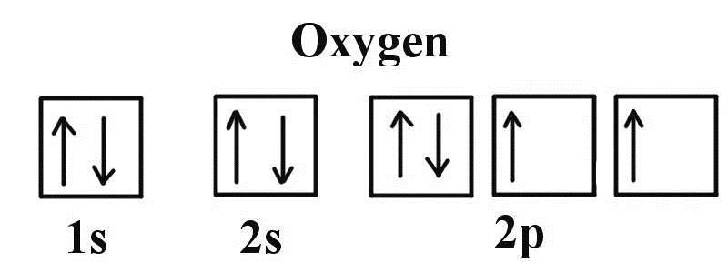

所以氧原子含有两个单电子,具有磁性,且磁矩为2 $μ_B$。

# 计算结果

我们看一下前面的计算结果:

## OSZICAR

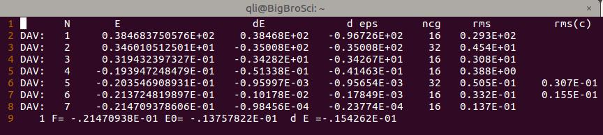

## 能量信息:


## 电子占据情况: (OUTCAR 中查看)

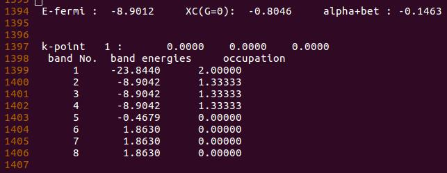

- Band1 含有两个电子, 对应的 $2s^2$ ;
- Band 2-4 为三个简并态,每个能带上有 1.33 个电子, 对应的 $2p^4$ 。

但在这里,电子的占据是不正确的:

- 因为 $2p_x$ 轨道上含有两个电子, 而不是把 $2p_x$ 上的一个电子平均分配到 3 个 p 轨道上;
- 此外,通过这个电子的占据情况,我们不能正确得到氧原子的磁矩信息。

那么怎么解决这个问题呢?

# 分两步解决问题

## 第一步: 
由于氧原子具有磁性, 自旋极化计算要进行考虑, 在 VASP 计算中, 需要在 `INCAR` 中添加一项: `ISPIN = 2`

`ISPIN` 的取值为 `1` 或 `2`: 
​	1. 代表不考虑自旋极化,是VASP的默认值;
​	2. 代表打开自旋极化该选项,计算中考虑。

## 自旋极化什么时候该加呢?

需要考虑自旋极化一般来说有以下几种：（新手记住前面4个即可。）

* 单原子的计算,
* O$_2$ 分子(基态为三重态)
* 自由基相关的计算
* 含Fe,Co, Ni 的体系
* 要计算的体系具有磁性：顺磁，铁磁，反铁磁等，要打开自旋极化。
* 当关注体系的电子性质时，且自己不知道加或者不加的时候，建议加上。

如果你不知道自己的体系是否要考虑自旋极化，可以简单做这样的一个测试：

* 测试1：不加自旋极化，正常算，得到结果1；
* 测试2：加上自旋极化，并在INCAR中添加： `LORBIT = 11` 
<<<<<<< HEAD
* 测试2中'`OUTCAR`的末尾会输出各个原子的磁矩信息：
=======
* 测试2中OUTCAR的末尾会输出各个原子的磁矩信息：
>>>>>>> 6e2ce84518e1be61c275fe32fa33a1df18c0c4c7
  * 如果体系中原子的磁矩不为0，那么需要考虑自旋极化，
  * 如果体系所有原子的磁矩都为0，那么就不需要考虑自旋极化，而且此时，你会发现测试1 和 2的结果中：结构和能量是一样的。


添加该选项后,重新计算,结果如下:

### INCAR

[//]: !INCAR(ex08/INCAR_2.jpg)

```fortran
SYSTEM = O
ISMEAR = 0
SIGMA = 0.01
ISPIN = 2
```

### OSZICAR

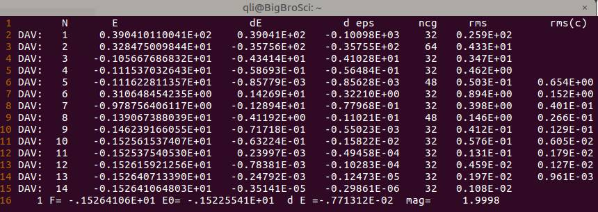

可以看出, 加了自旋极化后, **电子迭代步数增加了**, 这是因为体系中的电子被强制分成了 $\alpha$ 和 $\beta$ 两种, 并分别进行计算, 因此增加了计算量。

体系的磁矩大小在 $OSZICAR$ 中查看, 对应右下角的 `mag=`  该项, 从这里我们可以看到, 磁矩信息与我们已知的 2 $\mu_B$ 吻合, 这一点是合理的, 正确的。

### OUITCAR 中的能量信息:


 考虑自旋极化后,体系的能量降低了。

-----------

 我们重点通过查看体系的电子占据情况, 判断该计算是否合理: 

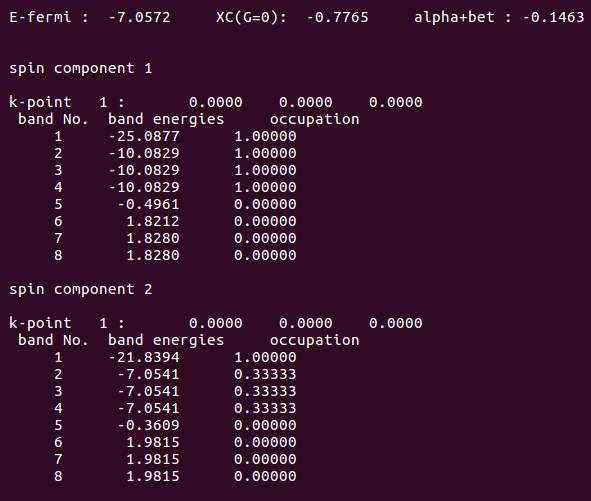

从图中可以看出,结果由两个 `spin` 组成: spin component 1 和 2: 
spin component 1 中含有 4 个电子, 另一个中含有 2 个电子:


参考该图,可以看出 spin component 1 为自旋向上的 $\alpha$ 电子, 另一个是自旋向下的 $\beta$ 电子。

但是:

	1. Spincomponent 1中,能带2-4中3个alpha 电子的能量是一样的。这不正确，因为其中一个2px轨道中的alpha电子已经成对,能量要比py 和 pz 低;描述失败!
	2. spincomponent 2 中,另一个beta电子还是平均分配在了三个能带上面。

电子占据依然不合理。


上面的结果是由于体系的高对称性导致的简并所造成的。 $8 \times 8 \times 8$ 的立方体格子, 在这里具有高阶的点群对称性: $O_h$, 见 `OUTCAR`

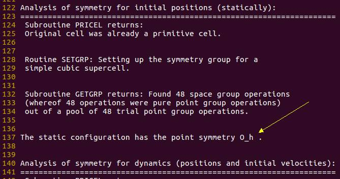

在 GGA 泛函中, 为了获得体系更低的能量,对于原子来说,通常会采用一种 `symmetry broken solution` 的处理方法。 但是在 VASP 计算中, 体系的对称性则是通过晶胞来获得, 即把这个晶胞当成一个原子来处理, 因此我们需要手动改变晶胞的形状来消除对称性造成的简并结果。 (此处的解释可能有些牵强, 有兴趣的可以查找与 symmetry broken solution 相关的文献)

---------

INCAR, KPOINTS, POTCAR等均保持不变。修改POSCAR, 如下:

### POSCAR

```fortran
O
1.0
7.5 0.0 0.0
0.0 8.0 0.0
0.0 0.0 8.9
O
1
Cartesian
0.0 0.0 0.0
```

通过改变格子在三个方向的大小, 降低对称性。 大师兄还尝试了三斜的格子, 结果和这个是一致的。 (有兴趣的可以尝试下)

### POSCAR
```python
O
1.0
	7.5		7.6		0.0
	0.0		8.2564		8.2
	8.5		0.0		8.9
O
	1
Cartesian
	0.0		0.0		0.0
```

----------

下面我们看一下改变晶胞为7.5 x 8.0 x 8.9后的计算结果:

### OSZICAR

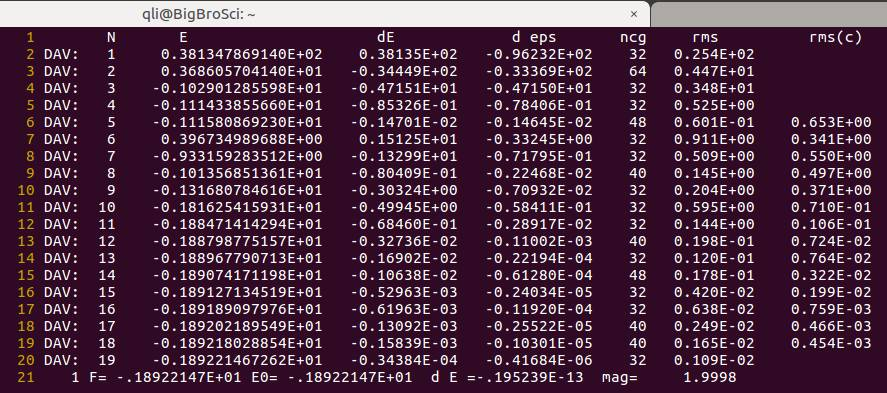

`OSZICAR` 中电子迭代步数又增加了, 这是因为对称性的降低增加了计算量。

磁矩为 $2\mu_B$ ,这一点跟前面一样,正确!

----------

体系的对称性: 从 $O_h$ 降低到了 $D_{2h}$
### OSZICAR


----------

能量信息:

### TOTEN
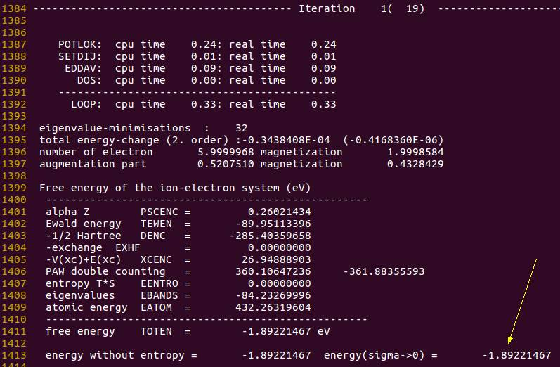

跟前面能量相比, 可以看出, 对称性降低后, **体系的能量进一步降低了**。

----------

电子占据情况:

### OUTCAR
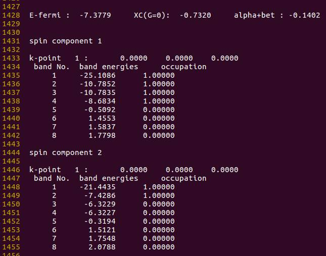

----------

# 分析

1. 在 $\alpha$ 电子(spin component 1)中, 能带1 是 $2s$ 中的 $\alpha$ 电子; 能带2-3为两个简并轨道, 对应 $p_y$ 和 $p_z$ 电子, 能带 4 位于 $p_x$ 中的 $\alpha$ 电子。 这里能带 4 的能量应该比 2 和 3 要低, 但结果恰恰相反, 描述不合理;
2. 在 $\beta$ 电子(spin component 2)中, 能带 1 是 $2s$ 的 $\beta$ 电子, 能带 2 为 $p_x$ 中的 $\beta$ 电子, 此时该 $\beta$ 电子占据了一个轨道, 而不是分布在三个 $p$ 轨道上, 结果是合理的。

- 计算到这里, 已经是 VASP 官网对于单原子能量最为完整和准确的计算了。 虽然上面 $p_x$ 的 $\alpha$ 电子比 $p_y$ 和 $p_z$能量高, 至少电子的轨道电子占据情况是正确的, 且磁矩和简并的错误已经消除。 由此可见, VASP对于单原子的电子占据情况(至少对于 O 原子来说), 虽然取得了部分理想结果, 但还是有不足的地方。

- 此外,体系的对称性可以通过 `ISYM` 来控制( 扩展阅读 [ISYM](http://cms.mpi.univie.ac.at/vasp/guide/node115.html) ), `ISYM = 0` 的时候, 不考虑对称性进行计算.

- 大师兄也尝试过了将 `ISYM = 0` 应用在 $8 \times 8 \times 8$ (test3)以及 $7.5 \times 8.0 \times 8.9$ (test4) 的格子里进行计算。 对于电子占据情况来说, 均得到了与前面 $7.5 \times 8.0 \times 8.9$ 一致的结果。 但是使用 $7.5 \times 8.0 \times 8.9$ 所得到的能量更低(test4 的能量比 test3 低)。

- 使用 $7.5 \times 8.0 \times 8.9$ 格子时, `ISYM = 0` (test4) 和采用默认值, 得到的能量结果是相同的, 因此, 改变晶胞的对称性在计算单原子能量的时候是必须的, 单独通过 `ISYM` 这一项不考虑对称性是远远不够的。

# 扩展阅读

1. `ISYM`: http://cms.mpi.univie.ac.at/vasp/guide/node115.html
2. 重现本节所有练习, 并自己认真分析结果, 查看电子占据情况, 体系的磁性, 以及能量信息。

# 总结

1. 知道什么时候使用自旋极化计算,怎么进行自旋极化计算;
2. 知道为什么自旋极化后计算量增加了;
3. 知道在哪里查看体系的磁性信息;
4. 知道为什么对称性降低后计算量增加了;
5. 会分析单原子中电子轨道的占据情况;判断结果是否合理;
6. 知道通过改变晶格大小调节体系的对称性从而消除简并对能量的影响;
7. 知道ISYM这一个参数,在计算单原子能量中,ISYM的作用远远不及改变晶格大小;
8. 知道vasp也存在自己局限性,不要完全相信。
---
title: Ex09 学会收敛点!
date: 2017-12-02 01:06:48
tags: 
- 单点能
- 收敛
- 轨道占据
- 氧
- 怎么看VASP手册
- 鱼和熊掌
category:
- LVASPTHW
---


前面一节我们学会了正确计算氧原子的能量并分析电子在轨道中的占据情况，这一节稍作总结补充。

 

### 复习上节内容

在VASP计算的O原子的电子结构讨论中，来自不莱梅大学的群友，画了一幅画，大家可以看下:


VASP的结果分析完毕后如下:


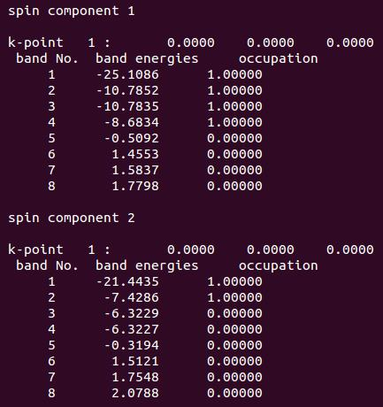


看画填数，照猫画虎：

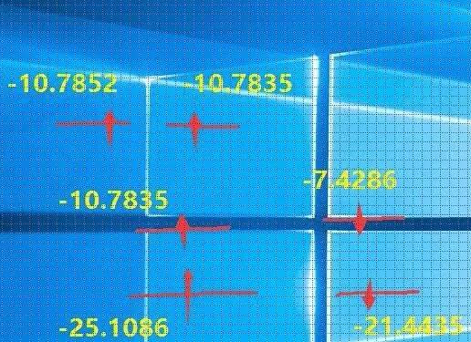


由此可见，VASP对于氧原子的描述不是很准确（不理解的请看上一节的详细描述)。而这一点，VASP官网你是找不到的。因此，在计算的时候，对于自己的体系有一个清晰的化学物理印象很重要。VASP的结果也要有针对的去判断。有的时候，即使计算收敛了，但没有体现出任何正确的物理或者化学意义，那就是单纯的数学收敛，结果是不可取的。VASP是一个计算的工具，如何正确分析和判断它的输出才是关键的。这一点我们在后面的学习中也会反复强调。


### VASP是怎么判断收敛的?

我们看一下VASP的迭代计算过程：

​                                               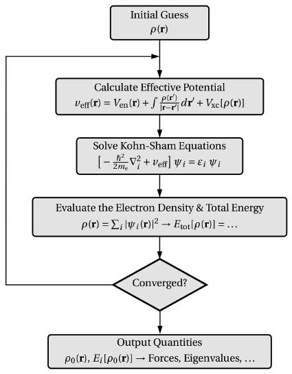


* 首先，它会猜一个初始的电子密度，然后据此计算体系的势能，求解KS方程，并给出体系的总能量以及对应的电子密度，也就是我们之前说的电子步的优化。

* 将最新一步的结果与前面进行对比，当前后两者的差值达到我们预设的收敛标准时，计算结束。

* 这个预设的收敛标准在VASP中通过两个参数来描述：EDIFF 和 EDIFFG。

* EDIFF 控制电子步（自洽）的收敛标准。在O原子的计算中，由于我们不需要优化，直接进行静态计算，完全由EDIFF控制计算的收敛情况。EDIFFG后面我们再介绍。


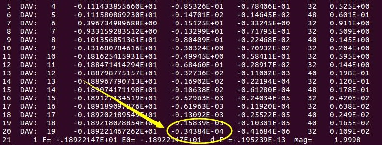


 从图中可以看出：第19步和18步的能量差为：-0.3484 E-04，停止迭代，开始输出结果。这是因为VASP计算中EDIFF的默认值是 1 x 10-4。

 

### 鱼和熊掌的关系

**那么：**

**是不是精度越高，计算越准确呢？ 这是肯定的！**

**是不是计算都需要这么高的精度呢？ 这肯定不是的！**


精度高（鱼：<・)))><<）意味着需要更多的迭代次数，也就是需要更多的计算时间（熊掌）。下图是收敛标准从默认值的1E-4 降低到1E-7后的收敛情况：单迭代次数从19增加到了27，相当于增加了原来1/2的工作量。所以，精度太高，计算量会增加。应了那句流行语：请在wifi下观看，土豪随意。

 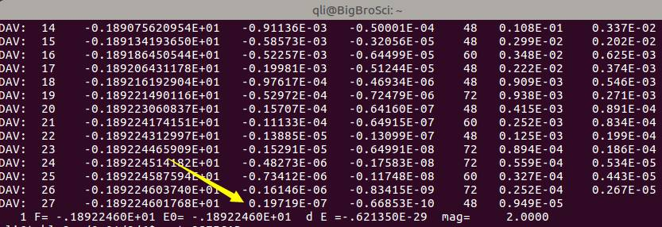


我们看一下扩展阅读的内容:

 

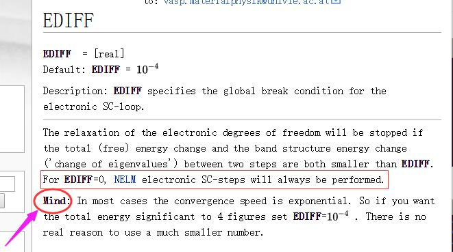


第一点：官网说（红色方框中内容）：如果我们把收敛标准设置成0，那么迭代会永远进行下去。大师兄很感兴趣，便设置：`EDIFF = 0`测试了一番，结果如下:


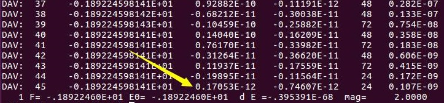


可以看到，在45步迭代之后，精度收敛到1E-12，VASP便停止了，而不是所谓的always! VASP又把俺们给骗了!

骗归骗，但计算量的增加确是铁打的事实，从1E-4的19步，增加到了45步。


思考另外一个问题：既然精度从默认值1E-4提高到1E-12 (8个数量级)，那么我们算出来的氧原子能量有什么变化呢？看下图:

```
iciq-lq@ln3:/THFS/home/iciq-lq/LVASPTHW/ex09$ ls
0  4  7
iciq-lq@ln3:/THFS/home/iciq-lq/LVASPTHW/ex09$ ta.sh
0        -1.89224598
4        -1.89218308
7        -1.89224603
```


图中的0， 4， 7 分别代表EDIFF为 0，  1E-4和 1E-7 的情况，我们可以看出，这三个计算结果中，能量随着EDIFF的减小变化甚微。当然，这也与我们简单的测试体系有关系。倘若计算N多个原子的体系时，不同的精度间的差值会有所增大。上面图中使用了一个小脚本：`ta.sh`，内容如下：

```bash
#!/usr/bin/env bash
for i in *; do
if [ -e $i/OUTCAR ]; then
echo -e  $i "\t" $(grep '  without' $i/OUTCAR |tail -n 1 | awk '{print $7}')
fi
done
```


### 如何看VASP的说明书

那么我们再看一遍VASP官网的说明，注意底部的Mind部分:


大家在浏览VASP官网的时候，凡是带有`Mind`，`Important`字样的，它们后面的文字一定要认真阅读，把握其中的含义。因为这都是大家常见的疑难点以及易错的地方。收敛速度跟`EDIFF`的值成指数关系，在大多数的情况下，`1E-4`足以胜任，没有必要采用其他的数值，如果大伙感觉不放心，大师兄建议`1E-5`即可。

 

### 几何优化的收敛标准


目前还没有介绍几何优化，先简单介绍下EDIFFG这个参数，大家知道即可，后面学习到了再回来看。


我们优化几何结构的时候，当结构前后变化达到我们设定的要求时，便停止优化。而这个设定的要求，就是通过EDIFFG来控制。

* 对于优化，我们可以使用力作为收敛标准，此时EDIFFG为负值。一般来说取值在-0.01到-0.05之间(-0.01对于力收敛来说已经是一个很严格的要求了)。
* 当然，对于较大的体系，我们也可以使用能量作为标准：此时，EDIFFG 为正值，一般取值范围在0.0001-0.001即可。

 **注意:**

不要把正负值弄错了。大师兄见过一个群友这么设置的: EDIFFG = -0.0001。然后在群里咨询为什么他的计算不收敛。这就好比在没有WiFi的时候，装成土豪看视频，卡里的钱扣完了，视频才看到一半…..前面说到，`EDIFFG = -0.01`的时候收敛就已经够费劲了， 你再加个0，莫不是要算到天荒地老？

 

##### 小结一下

EDIFF，EDIFFG 是控制收敛标准的两个参数。前者负责电子自洽过程(单个离子步内)，取值为1E-4或者1E-5即可，没有特殊要求，不建议设置的太低。后者负责结构优化的过程(可正可负)。对于EDIFFG，默认值采用能量收敛，标准为:EDIFFx10。


### 扩展训练:


1 EDIFF: https://cms.mpi.univie.ac.at/wiki/index.php/EDIFF

2 在1的页面中，左侧框中搜索`EDIFFG`，查找相关参数;

3 继续查询之前了解的相关参数，学会使用改网址;

4  根据前面所学，进行O$_2$分子的静态计算，并分析其轨道结果，判断是否合理。


### 总结


* 重温了一下上节的结果，不要完全相信程序的结果，物理，化学意义更为重要;
* 初步了解VASP的迭代过程，
* 必须掌握EDIFF在电子步中的作用，取值大小与收敛速度的联系，也就鱼和熊掌的关系；
* 死死记住EDIFFG代表的含义，取值可正可负及其默认值;
* 经常浏览VASP官网，尤其是Mind，Note， Important等后面的部分;（眼睛要尖！）
* 建议大家浏览VASP的Wiki版网页(左下方原文链接)，搜索相关参数，里面的公式较之前模糊的形式，有了很大的改进。
* 目前VASP官网国内上不去，掌握科学上网的技巧也是做科研的必须技能。---
title: Ex10 O$_2$结构搭建以及POTCAR注意部分
date: 2017-12-02 02:06:48
tags: 
- O2
- 数据库
- Google
- POTCAR
- VASP找错
category:
- LVASPTHW
mathjax: true
---


前面O原子的能量计算已经告一段落，下面我们把体系变得更加复杂些：O${_2}$分子。扩展练习已经做的同学，相信现在已经完成了O${_2}$分子的静态计算。本节我们主要介绍一下:

* O${_2}$分子模型搭建的细节;
* POTCAR和POSCAR的对应关系，注意事项。

 

### 搭建模型

O${_2}$分子模型的搭建其实很简单，将两个原子在一个直线上连起来就行了。 键长大小可以书本上查， 数据库里找，也可以去网上找些参考资料。大师兄推荐常见常用的数据库:

1）[CRC hand book](http://hbcponline.com):  

* 网页版:  http://hbcponline.com/faces/contents/ContentsSearch.xhtml  

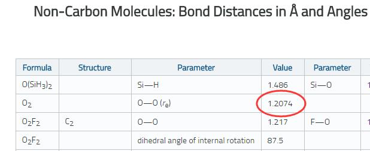

* PDF 电子书，这个网上到处都有，大家自己搜搜就能找见。具体在1403 页(本书有2661页，建议大家查询的时候先把左侧的目录展开，要不然实在是太痛苦!)


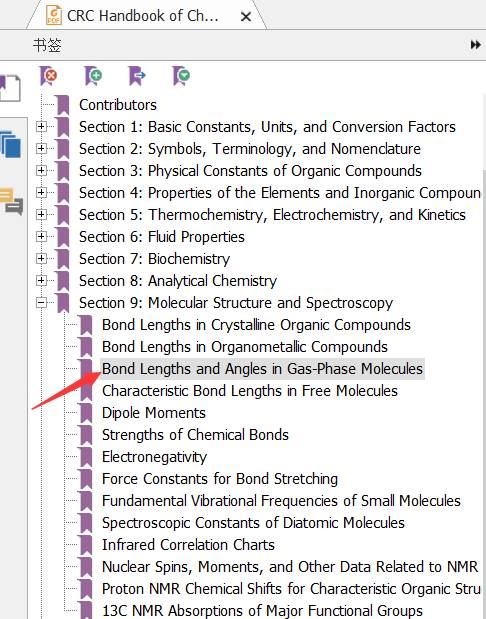

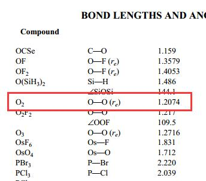

2） NIST 数据库: http://cccbdb.nist.gov/exp2x.asp

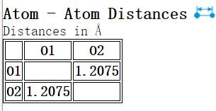

3) Wikipedia，谷歌和百度:

在谷歌或者百度里面直接搜索O$_2$、键长这两个关键词，就可以得出很多的链接，比如下面两个。

https://zhidao.baidu.com/question/101615129.html

http://www.science.uwaterloo.ca/~cchieh/cact/c120/bondel.html 


大师兄你特么在逗我嘛？

氧气原子这么简单的分子，随便一翻，当然到处都能得到结果啦!

哈哈，没有逗你。在这里，大师兄想要告诉你的是：

* 搜索的时候尽量用谷歌，而不用百度；
* 尽量搜英文，不要输汉语，这样你得到的信息会相对多一些。

师兄，你又在逗我，谷歌我们访问不了，怎么用啊？ 

没有逗你，现实是残酷的，没有google，科研会被百度严重拖后腿。虽然我也不想批评国产，谁让它不争气呢？

所以，科学上网的技巧，你要get到。


**划重点：**

前面介绍了一堆，主要目的有3个：

1) 给大家提供一个数据查询手册(CRC handbook)和数据库(NIST)。当然根据自己的研究方向，还有其他更加专业的数据库，随着学习的深入，后面会讲解。 此外，写论文的时候，如果实在不想找相关的参考文献，可以直接引用CRC hand book这本书（前提是你在这本书里面找到了相关的数据）

2) 查找数据库另一个重要的原因是：如果你的初始结构，比较理想，这会大大加速你的计算过程，还会避免一些意想不到的计算错误（后面的章节会具体介绍到）。

3）除了查找数据库，别人发的文章也是初始结构的重要或者主要来源。

 

###  模型搭建


知道了键长信息后，开始结构搭建O$_2$的模型，我们知道它是直线型分子（算大师兄没说），其中一个原子在原点的位置上了，那么我们在三个方向上随便找个坐标就可以了。修改POSCAR如下:


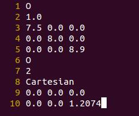


两点要注意：

* 第7行原子个数：把1改成2 ，表示氧元素有2个原子。

* 第10行添加第二个氧原子的坐标：

| 方向  | 坐标               |
| ----- | ------------------ |
| 沿x轴 | 1.2074   0.0   0.0 |
| 沿y轴 | 0.0   1.2074   0.0 |
| 沿z轴 | 0.0  0.0  1.2074   |

上图中为沿着z轴方向。**注意**： 

* xyz三个方向的数值之间可以有1个或者若干个空格，不要用tab分割数字；
* 在搭建模型的时候，脑子里要有一个立体的概念，原子在三维方向上的排列，移动变化等。 


### 关于POTCAR

 

大师兄，氧原子多了一个，POTCAR怎么办？是不是每个原子对应一个POTCAR啊?

不是的。POTCAR 是根据POSCAR中的元素顺序创建的(第6行)，与原子数目无关。


第6行是体系中的元素，只有O元素，所以我们的POTCAR还是用之前O原子练习的那个;

第7行是与上一行相对应的体系中元素的原子数。

 

但是！在你的POSCAR中，如果把O写了两遍，如下图：

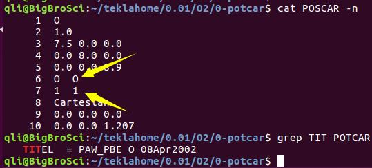


此时，第6行中有2个O，且第7行中有两个O的原子数目分别为1。 POTCAR中就要对应的两个O原子的Potentials!


##### 主动出错： 

如果我们使用上图的POSCAR（O元素写了2次），且POTCAR中只有1个O原子的Potential。

提交任务后，瞬间完成。这么快就算完肯定不是因为你的服务器多么的牛逼! 而是因为出错了!!

那么我们需要找到错误的原因，怎么去找错误信息呢? 


1) 查看OUTCAR

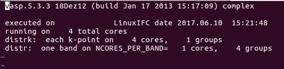


VASP就这么几行，从这里看不出来是哪里错了。


2) 一般来说，VASP计算的时候，会生成两个额外的文件，一个是关于服务器集群计算error的，另一个是VASP运行的out文件。这个out和OUTCAR不太一样，记录着VASP的运行过程和出错信息。看大师兄的文件目录:

```
qli@bigbro:~/test$ ls
CHGCAR   DOSCAR   e_Single.142845   INCAR   o_Single.142845  OUTCAR  POSCAR  PROCAR  sub12    WAVECAR  CHG      CONTCAR  EIGENVAL  IBZKPT   KPOINTS  OSZICAR   PCDAT   POTCAR  REPORT  vasprun.xml  XDATCAR
qli@bigbro:~/test$ cat e_Single.142845
qli@bigbro:~/test$

```

不同的组可能命名不一样，但一般都会有这两个文件。这里的e对应的是服务器的出错信息，o对应的是VASP的out文件。 首先打开查看下服务器出错文件：(图中cat 命令) 发现什么都没有输出，说明服务器没有出错。那我们打开一下 o_Single.142845 文件，如下图

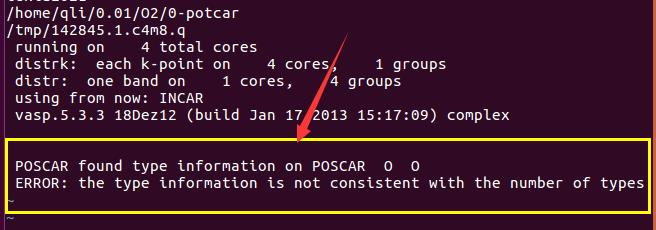


在这个文件里面最后一行，给出了错误的信息：

一般出现这个错误的时候，你就要去检查POSCAR和POTCAR中的元素是否对应了。


##### 解决问题


本例中的错误该怎么解决呢？ 既然POSCAR和POTCAR不一致，解决的话，有2个办法：要么变POSCAR，要么变POTCAR。

1）变POSCAR：

*  第六行中：把`O O`换成`O`; 
* 第七行：氧原子数目改成2，就如刚开始的POSCAR。
* POTCAR保持不变即可（POTCAR中只有1个O的Potential）:

2）变POTCAR

* 使其中的元素与POSCAR中的一致，也就是有两个氧元素的Potentials！

```
qli@bigbro:~/test2$ grep TIT POTCAR
   TITEL  = PAW_PBE O 08Apr2002
qli@bigbro:~/test2$ mv POTCAR POTCAR1
qli@bigbro:~/test2$ cat POTCAR1 POTCAR1  > POTCAR
qli@bigbro:~/test2$ grep TIT POTCAR
   TITEL  = PAW_PBE O 08Apr2002
   TITEL  = PAW_PBE O 08Apr2002
```

 这样，再运行就不会出错了。


### POTCAR 的制备

前面的演示中，大师兄教给你了POTCAR的制备方法: 使用cat 命令将2个POTCAR1 连在一起然后输出新的POTCAR。如果看不明白，继续看下面的操作：

如果你的体系中含有其他的元素，比如: Fe C H O

那么你就要先准备这四个元素的POTCAR：POTCAR-Fe、POTCAR-C、POTCAR-H、POTCAR-O，

然后运行命令:cat POTCAR-Fe POTCAR-C POTCAR-H POTCAR-O > POTCAR  就可以了。

###### 具体操作：

```
qli@bigbro:~/test2$ ls
POTCAR-C  POTCAR-Fe  POTCAR-H  POTCAR-O 
qli@bigbro:~/test2$ grep TIT POTCAR*
POTCAR-C:   TITEL  = PAW_PBE C 08Apr2002
POTCAR-Fe:   TITEL  = PAW_PBE Fe 06Sep2000
POTCAR-H:   TITEL  = PAW_PBE H 15Jun2001
POTCAR-O:   TITEL  = PAW_PBE O 08Apr2002
qli@bigbro:~/test2$ cat POTCAR-Fe POTCAR-C POTCAR-H POTCAR-O > POTCAR
qli@bigbro:~/test2$ grep TIT POTCAR
POTCAR:   TITEL  = PAW_PBE Fe 06Sep2000
POTCAR:   TITEL  = PAW_PBE C 08Apr2002
POTCAR:   TITEL  = PAW_PBE H 15Jun2001
POTCAR:   TITEL  = PAW_PBE O 08Apr2002
```


这四个元素POTCAR数据从哪里找，在哪个目录下面？

这就得问问你们组里的师兄师姐们，或者老师了，网上也有很多。

 

### 扩展练习:

1 正确运行O$_2$分子的静态计算;

2 查找相关的O$_2$分子的轨道排布，并分析结果的合理性;

3 主动制作错误的POSCAR和POTCAR文件，运行查看结果和错误。

 

### 总结

1 整理自己研究方向相关的数据库资料；知道去哪里查询信息；

2 学会怎么根据已知的结构参数搭一些简单的分子模型: CO，H$_2$O， N$_2$， H$_2$ 等;

3 知道去哪里找出错文件;

4 熟练掌握通过 cat命令制备POTCAR的方法;

5 必须掌握POSCAR和POTCAR的对应关系。---
title: Ex11 O$_2$单点计算和优化结果分析
date: 2017-12-03 02:06:48
tags: 
- MAGMOM
- 磁性
category:
- LVASPTHW
mathjax: true
---


前面几节，我们讲解了O分子单点计算和O$_2$的POSCAR和POTCAR的准备。这一节我们主要讲解一下：

1）O$_2$的分子结构分析

2）如何初步进行构型优化计算。


### O$_2$ 的单点计算

首先解释下什么是单点计算：顾名思义就是不优化结构，直接算个能量，电子相关的性质。你也可能会听到很多人说静态计算，或者自冾计算。其实都一样的：几何结构计算前后不发生变化。


首先提交O$_2$ 静态计算任务，运行，等待结束。如果你的任务出错，请跟大师兄的输入文件进行对比、改正，直至计算正常结束。如下图：

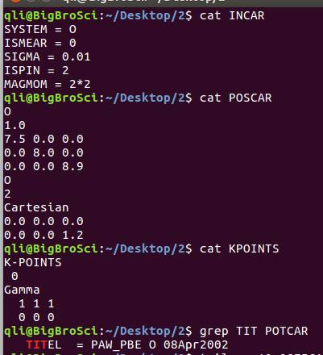


任务结束后查看OSZICAR:

从OSZICAR最后，得到体系的磁矩为2μB，你应该知道这个磁矩是怎么回事，由哪两个电子贡献。

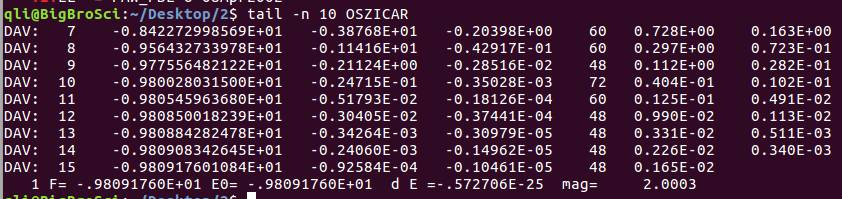


如果不知道，看下图O$_2$的分子轨道结构：

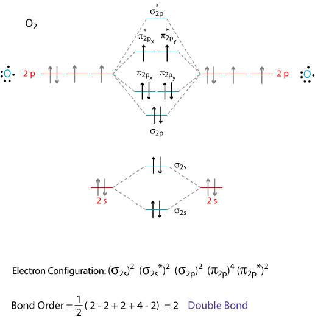

看完该图，相信大家对于O$_2$的成键方式有了一个更加深刻的印象。我们对比下VASP的输出结果。首先分析α电子的排布情况：

 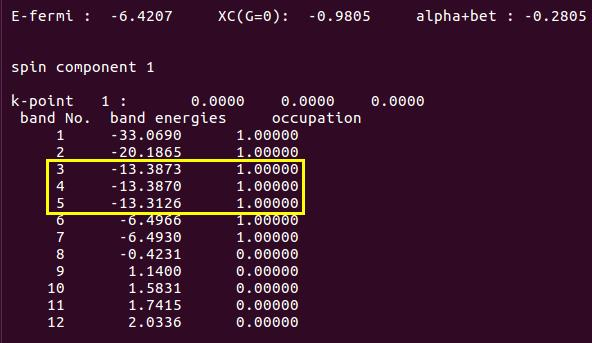


在这里，你会发现能带3和4 是简并的，应该是π(p2x）和π(p2y） 轨道中的α电子。能带 5 对应的应该是σ(2pz) 的电子。在O$_2$分子的电子构型中，两个O原子的2pz轨道以头碰头的方式形成一个σ键，其能量要比2px（2py）以肩并肩方式形成的π键能量要低。但是，能带5的能量（-13.3126）比3和4的（-13.3870）要高些，这与O$_2$的电子构型不一致，表明VASP的单点计算结果是不可靠的。


再看一下β电子的排布情况：

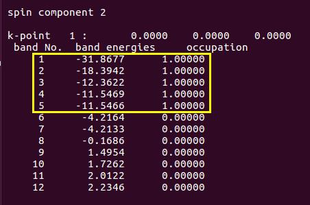

 

能带4和5对应的是应该是π（2px） 和π（2py） 轨道中的β电子。且总的轨道能量与前面图中一致，这说明VASP对β电子的描述是合理的。

 

为什么出现这样的情况呢？难道跟前面O原子的计算一样，VASP又算不准啦？

不是的，VASP怎么着也是个老牌的，响当当的计算程序，总不能让人每天指着鼻子骂算不准！

 

这里的主要原因是：来自于实验的键长值未必就是计算程序所认可的。也就是说，实验值和理论值之间存在偏差，实验的结构不能直接用来计算其性质，只可以作为一个理想的初始值。所以，O$_2$的分子结构需要优化一下。


### VASP 优化分子结构

VASP优化分子结构的时候，需要用到一个参数：`IBRION`。引用官网的话：IBRION determines how the ions are updated and moved. 也就是说IBRION 这个参数决定了结构的优化过程。当你去官网查看的时候（google 搜索VASP IBRION这两个关键词），会发现IBRION有很多值。

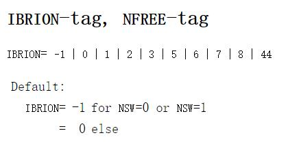


想要正确进行计算，你就需要去硬着头皮去了解各个值的含义了，这个过程必须自己去做，只听别人的建议去设置参数，而不自己去主动学习的，你的能力永远不会得到提升！！！


一般来说，优化结构的时候有3个选择：

IBRION=3：你的初始结构很差的时候；

IBRION=2：共轭梯度算法，很可靠的一个选择，一般来说用它基本没什么问题。

IBRION=1：用于小范围内稳定结构的搜索。

如果你的体系遇到结构不收敛的时候，首先检查自己的结构是否合理，也就是物理化学意义是否清晰。如果结构没问题，可以尝试下换下IBRION的参数。


 下面，我们在INCAR中加上IBRION参数（IBRION=2），其他输入文件保持不变，重新进行计算：

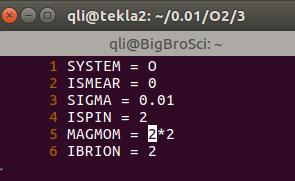


如果是用上图中的INCAR，你会发现任务很快就算完了。而且只有一步，难道输入的结构就是VASP计算出来的的稳定结构吗？有这种可能，但几率极低。

如果我们仔细查看下OUTCAR中的电子构型，发现它的信息和前面的单点计算一样。这说明，vasp并没有优化，而是又运行了一次单点计算。


为什么呢？ 这是因为另一个参数：`NSW`。

 

NSW 控制几何结构优化的步数。也就是VASP进行多少离子步。

官网查看下NSW选项，发现默认值是0，也就是没有进行优化。（默认值，也叫缺省值，英文里面是 Default。 意思是，如果你不输入这个参数，程序将默认使用XXX的数值）

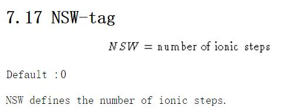

现在原因找到了，继续进行优化任务。问题来了：NSW怎么设置呢？

* 首先，它必须是大于等于0的整数。
* 其次，一般来说，简单的体系200步内就可以正常结束。
* 不知道什么时候收敛，初始结构很差，或者设置了很严格的收敛标准，那么你就要增大一下NSW的取值了，比如NSW=500或者更大。
* 我们的这个O$_2$例子很简单，设置了NSW=10（你也可以设置为100,200或者500，不会影响计算结果的。）

 

```fortran
System = O
ISMEAR = 0
SIGMA  = 0.01
ISPIN  = 2
MAGMOM = 2*2

IBRION = 2
NSW = 10
```


计算完成后，打开OSZICAR：


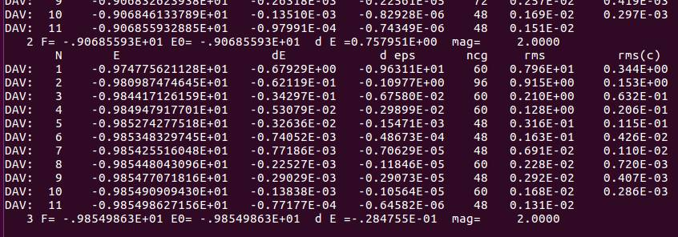

 

可以看到，结构优化进行了3步便停止了（如果你设置了NSW=1000，那么也是3步后就结束）。其中，每一步内又包含了若干电子步。此时的你应该知道是什么参数控制优化的结束，如果不知道请查看前面Ex09中关于收敛的文章。思考一下： 同样优化200步，设置EDIFF=1E-7和EDIFF=1E-4会有什么区别呢？ 

 

查看下OUTCAR： 


 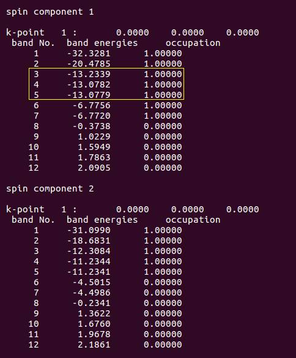


你会发现，优化过后，OUTCAR中α电子的占据状态调整过来了，β电子的保持不变。这说明计算成功了，优化起作用了。

那么优化过后的结构怎么查看呢？键长又是多少呢？

下面我们要开始真正掌握VASP的输出文件了：CONTCAR。 CONTCAR是VASP的一个输出文件，它包含了VASP计算中最后一步几何优化的结构信息，也就是优化完的结果。它也是文本格式，可以直接打开查看，如图：


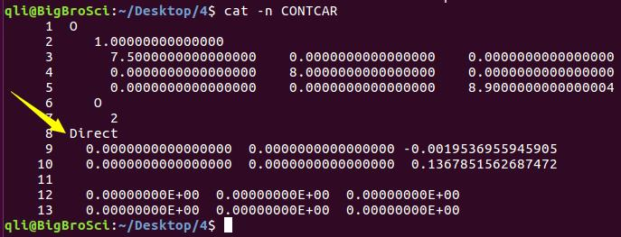


 怎么才能知道优化完的`O-O`键长是多少呢？


1）通过坐标直接算：


此时，要注意CONTCAR输出的是Direct坐标，也就是分数坐标，需要转换成笛卡尔坐标。

xy两个方向不用考虑（都是0），z方向的坐标相减即可：键长保留四位就足够了。

(0.136785-( -0.001953))*8.9 = 1.2348 （$\AA$）


2)  使用可视化软件测量：

这样手动算，简单来说还可以，等复杂了就麻烦了，幸运的是，常用的建模软件中：p4vasp，VESTA，VMD，MS，ASE-gui等，都有测量键长的办法。这里简单讲解一下p4vasp 的用法。


#### p4vasp的安装 

这个详见本书的附录2：https://www.bigbrosci.com/2017/11/18/A02/

1） Ubuntu 系统： `sudo apt-get install  p4vasp`

2） Windows系统： 下载p4vasp的安装包，解压后直接打开即可。


下面是Windows下通过p4vasp读取CONTCAR的方法。Linux的也可以这样做，但终端里面：`p4v CONTCAR` 更高效直接。打开VASP后的界面如下： 注意图中： `System：`后面的三个问号部分，后面会进行对比：


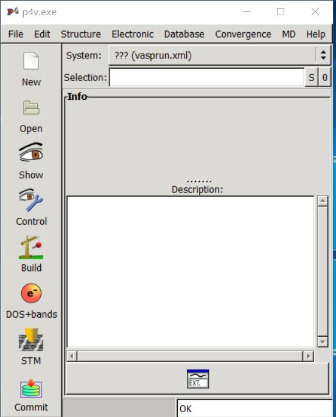


点击左侧栏中的 `Open` 选项。下图中，左侧点击进入CONTCAR所在的目录，进入后，在右侧会显示CONTCAR


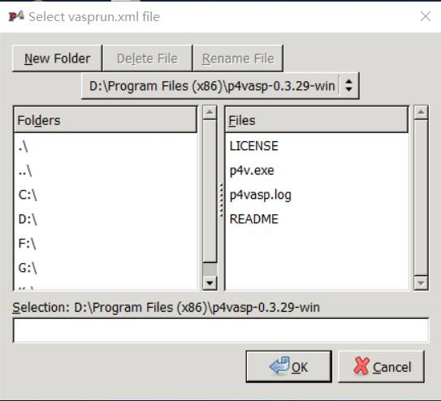


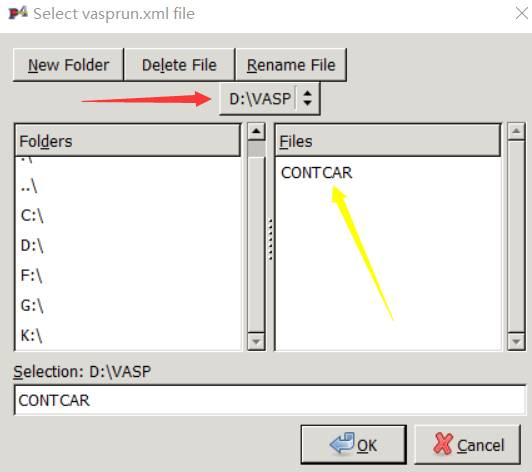


双击右侧的CONTCAR, 你会发现之前的三个问号？？？部分发生了变化：

显示的 O 表明VASP读取CONTCAR成功。


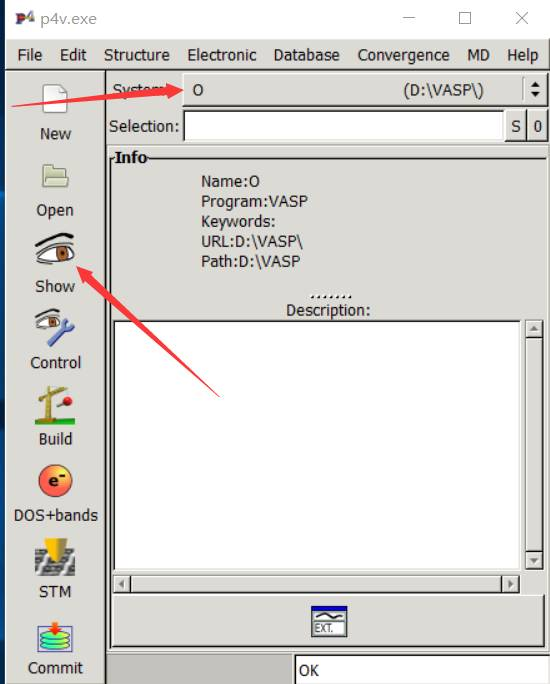


点击左侧的Show按钮，就可以查看结构了。


##### 可视化界面的基本操作


鼠标左键按住不放，可以3维空间旋转结构；

鼠标中间摁住不放，可以上下，左右移动结构：

鼠标右键摁住不敢，动动鼠标可以缩放结构；

选择合适的观察位置：

1 把鼠标移动到你要选中的原子上，

2 通过空格（键盘上最长的键）用来选择或者取消选择原子：

3 选中两个氧原子后，如下图：

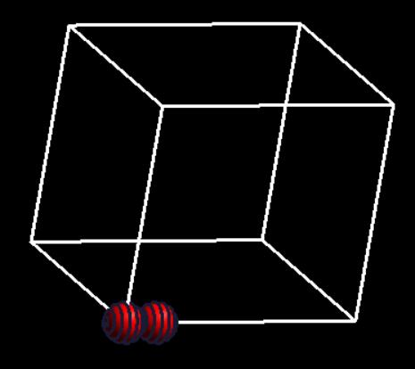


 选中之后，点`Structure` –>`Measure` 显示键长为1.234774 Å，和我们手动计算的结果一样。

 当然，也可以先点击：`Structure` –>`Measure`，然后再选择感兴趣的原子。


##### 小结一下：


实验值为1.2075 Å，VASP计算结果为1.2348 Å。两者之间的差值为： 0.0289 Å，偏差为：(1.2348-1.2075)/1.2075 = 2.26%。对于理论和实验之间的偏差，如果小于5%，我们一般可以认为吻合的很好。有时候很多同学揪着VASP的计算结果与实验值的偏差不放，误差已经千分之几了，感觉心里还是不放心，有着一种不完全匹配不罢休的冲动。这大可不必放在心上，如果你的结果偏离实验值千分之几，直接用就可以了。


 "To err is human; to describe the error properly is sublime."
-- Cliff Swartz, Physics Today 37 (1999),388.

 

对于其他的软件程序（MS，VESTA，VMD等），大家下载安装后，百度里面搜一搜教程，基本操作应该很快就能掌握。

 

### 扩展练习：

 

1 IBRION：https://cms.mpi.univie.ac.at/vasp/vasp/IBRION_tag_NFREE_tag.html

2 NSW：http://cms.mpi.univie.ac.at/vasp/guide/node108.html

3 CONTCAR：https://cms.mpi.univie.ac.at/wiki/index.php/CONTCAR

4 从头开始重现本节的所有操作；

5 尝试不同的初始键长，运行vasp，查看输出结果。

 

###  总结：


1）学会结合自己所学的化学知识，分析双原子的电子构型；

2）知道IBRION + NSW进行结构优化；

3）知道什么参数控制结构优化的停止，以及单个离子步内电子步数；

4）学会使用可视化软件查看输出的几何结构；

5）知道理论结果和实验值之间没有100%吻合。---
title: Ex12 VASP中MAGMOM的简单设定
date: 2017-12-04 02:06:48
tags: 
- MAGMOM
- 磁性
category:
- LVASPTHW
mathjax: true
---


 很多师弟师妹问到："师兄， 我见上一节计算的时候打开自旋极化的时候，设置MAGMOM怎么没有讲啊？"

为了解答师弟师妹们的疑惑（主要是给师妹讲的），本节介绍一下INCAR中MAGMOM的设置以及易出错的地方。

 

### MAGMOM 的设定

 

谈到自旋极化计算，避免不了的就是MAGMOM这个参数。通过MAGMOM我们可以指定体系中原子的初始磁矩。通俗点说，就是给VASP指条计算的明路。对于复杂体系来说，合理的初始值可以加快计算速度，并保持计算结果的正确性。但是对于一些简单的磁性体系，我们可以直接使用`ISPIN=2`, MAGMOM不必进行设置。


我们通过上图可以知道：O$_2$ 分子的基态是三重态，也就是每个原子都有一点单电子，所以每个氧原子的初始的磁矩可以设置为1。但VASP对MAGMOM的要求不一定非得是1，也就是初始值是一个可以模糊也可以精确的数值。因为很多时候，我们不知道确切的磁矩是多少。如果我们已经知道磁矩是多少（比如O$_2$），可以直接写上去，也可以差不多写一个； 但如果不知道的话，就需要根据自己的假设，猜一个初始值了。

 

下面通过一个问题，先简单看下MAGMOM 应该怎么设置。 对于O$_2$分子的计算，以下几行中，MAGMOM设置错误的是第几行？

```
MAGMOM = 2 * 1 
MAGMOM = 1 * 2 
MAGMOM = 1  1 
MAGMOM = 2  2
MAGMOM = 3  3 
MAGMOM = 2*1
MAGMOM = 1*2
MAGMOM = 1.5*2
MAGMOM = 2*1.5
```

 

有兴趣的可以尝试一下前面中的各个选项。**答案**是：1，2，7，8 行。当你用了1，2，7，8行中任何一个时，会得到这样的错误信息： 

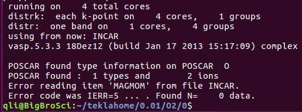

（此时的你，应该知道从哪里找到的这个错误信息，不知道的请查看前面几节的内容）

 

显示的错误告诉我们MAGMOM设置的不合理。为什么会出错呢？ 我们看下官网MAGMOM的说明：

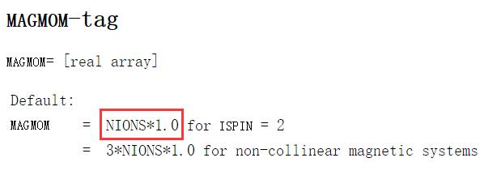

**敲黑板：**

* 首先：MAGMOM是一个实数的排列（real array）

* 其次：注意红色框框中的部分。默认值是，原子的个数乘以1.0，也就是原子个数在前面，MAGMOM的值在后面。

* 最后： *  前后没有空格，没有空格，没有空格！！！

 

因此前面的问题中：

第1行存在1个错误：* 前后有空格

第2行存在2个错误：* 前后有空格，原子数目和MAGMOM值颠倒了

第7和8行存在1个错误：原子数目和MAGMOM值颠倒了

 

有的人会问，那其他行中，比如第5行设置的 3 3 难道也正确吗？ 正确的磁矩不应该是1 1 吗？

是的，这是正确的，看官网的话：

 

If one is searching for a spin polarised (ferro- or antiferromagnetic) solution, it is usually safest to start from larger local magnetic moments, because in some cases, the default values might not be sufficiently big. A safe default is usually the experimental magnetic moment multiplied by 1.2 or 1.5.

 

* MAGMOM并不要求严格按照我们已知的数据去输入

* 如果你知道体系的磁矩是多少，初始的时候可以设置的更大些，1.2或者1.5倍。

* 如果你设置的很大，通常情况下（MAGMOM = 5 5 或者MAGMOM = 2\*5，或者更疯狂：MAGMOM = 2\*10） ，VASP会自动矫正回来。但是大师兄建议1.5倍足够了。
* 如果你不知道体系的磁矩是多少，可以根据原子所处的化学环境， 根据成键情况，大体推测有多少个未成对电子，然后将未成对电子数目*1.5即可。

*  VASP的wiki版中：* 前面有空格，这是不对的。

 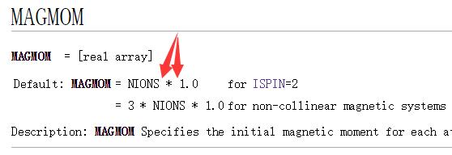

当我们正确解决了POSCAR的结构搭建，懂得了POTCAR和POSCAR的关系，以及如何设置MAGMOM时，就可以计算O$_2$的单点能量了。当然，本例中MAGMOM不用设置，因为默认值就是1，如果你的体系很简单，那么直接ISPIN = 2 就可以了，MAGMOM可以不管。

 

##### 示例：

大师兄计算了一个复杂大分子在Ni(111)表面上的吸附情况。有56个Ni，17个C，20个H，以及6个O原子。前面已经学到，当体系中含有Ni的时候，要考虑自旋的情况。 Ni(111)表面是一个简单的自旋体系，完全可以使用默认值。因为体相的Ni磁矩为0.56 μB左右。默认值为1.0，已经足够大。为了让大家有一个更加清晰的印象。大师兄专门设置了一个MAGMOM。 如下图：

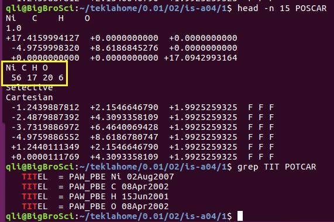

  

INCAR 中MAGMOM的设置：


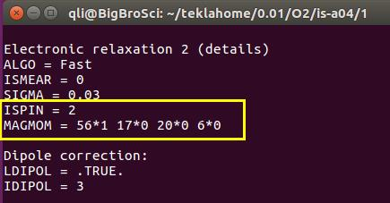

 

通过该例子，相比大家对MAGMOM的设置以及该注意的地方已经熟练掌握了，当然还有非线性的MAGMOM设置，这个在后面详细描述。


### 总结

1） 对于简单体系来说，MAGMOM可以采用默认值；

2） MAGMOM设置的时候，初始值不要求与实验值完全一致，一般取大些（1.5倍）比较好。

3） MAGMOM磁矩中*前后没有空格。---
title: Ex13 论合理结构的重要性（一）
date: 2017-12-05 02:06:48
tags: 
- 合理结构
- grep
- bashrc
- alias
category:
- LVASPTHW
mathjax: true
---

 

前面我们学会了O$_2$分子的优化，分析了其电子构型，并且知道了理论结果和实验结果间存在的偏差。这一节我们依然研究O$_2$分子的结构优化，虽然模型简单，但熟练掌握其中的技巧，对今后的计算工作，意义重大。


### 测试Bad 结构

首先，我们将O$_2$的初始键长设置为：1.5 Å。其他文件与Ex11中的保持不变。 

```
O
1.0
7.5 0.0 0.0
0.0 8.0 0.0
0.0 0.0 8.9
O
2
Cartesian
0.0 0.0 0.0
0.0 0.0 1.5
```


然后提交命令进行计算，等待结束后。查看结果，并对比前面Ex11练习的结果。

```
iciq-lq@ln3:/THFS/home/iciq-lq/LVASPTHW/ex13$ tail OSZICAR
DAV:   1    -0.985412177027E+01   -0.57432E-02   -0.12528E+00   144   0.457E+00    0.433E-01
DAV:   2    -0.985315825637E+01    0.96351E-03   -0.76431E-03   144   0.367E-01    0.166E-01
DAV:   3    -0.985344344928E+01   -0.28519E-03   -0.78039E-04   120   0.129E-01    0.707E-02
DAV:   4    -0.985368960614E+01   -0.24616E-03   -0.14892E-04   144   0.510E-02    0.268E-02
DAV:   5    -0.985378634076E+01   -0.96735E-04   -0.12727E-05    96   0.167E-02
   8 F= -.98537863E+01 E0= -.98537863E+01  d E =-.142913E+01  mag=     2.0000
       N       E                     dE             d eps       ncg     rms          rms(c)
DAV:   1    -0.985528191871E+01   -0.15923E-02   -0.11782E-01   168   0.140E+00    0.130E-01
DAV:   2    -0.985521232023E+01    0.69598E-04   -0.82384E-04   120   0.126E-01
   9 F= -.98552123E+01 E0= -.98552123E+01  d E =-.143055E+01  mag=     2.0000
iciq-lq@ln3:/THFS/home/iciq-lq/LVASPTHW/ex13$ tail ../ex11/opt/OSZICAR
DAV:   8    -0.985382407600E+01   -0.31391E-03   -0.20867E-05   120   0.151E-02    0.891E-03
DAV:   9    -0.985418412704E+01   -0.36005E-03   -0.33607E-05   120   0.162E-02    0.520E-03
DAV:  10    -0.985440719048E+01   -0.22306E-03   -0.20675E-05   120   0.115E-02    0.367E-03
DAV:  11    -0.985450935523E+01   -0.10216E-03   -0.85511E-06   120   0.750E-03    0.174E-03
DAV:  12    -0.985454505708E+01   -0.35702E-04   -0.14739E-06   120   0.339E-03
   3 F= -.98545451E+01 E0= -.98545451E+01  d E =-.451963E-01  mag=     2.0000
       N       E                     dE             d eps       ncg     rms          rms(c)
DAV:   1    -0.985517058251E+01   -0.66123E-03   -0.43217E-02    96   0.851E-01    0.792E-02
DAV:   2    -0.985515527518E+01    0.15307E-04   -0.49070E-04   168   0.969E-02
   4 F= -.98551553E+01 E0= -.98551553E+01  d E =-.458065E-01  mag=     2.0000

```

 

在本练习中，我们设置了键长为：1.5 $\AA$，距离稳定结构较大，用了9个离子步才收敛。在Ex11练习中，我们使用的是数据库中O$_2$的键长，只优化了4步就收敛了。由此可见，一个好的初始结构可以加快我们的计算。那么有多快呢？ 我们看一下OUTCAR中的时间信息，对比看下一目了然。

```fortran
iciq-lq@ln3:/THFS/home/iciq-lq/LVASPTHW/ex13$ tail OUTCAR
                            User time (sec):       20.196
                          System time (sec):        7.877
                         Elapsed time (sec):      144.523

                   Maximum memory used (kb):      116704.
                   Average memory used (kb):           0.

                          Minor page faults:        72067
                          Major page faults:            0
                 Voluntary context switches:         3191
iciq-lq@ln3:/THFS/home/iciq-lq/LVASPTHW/ex13$ tail ../ex11/opt/OUTCAR
                            User time (sec):        8.387
                          System time (sec):        7.789
                         Elapsed time (sec):       17.433

                   Maximum memory used (kb):      114276.
                   Average memory used (kb):           0.

                          Minor page faults:        26287
                          Major page faults:            3
                 Voluntary context switches:         3202
iciq-lq@ln3:/THFS/home/iciq-lq/LVASPTHW/ex13$

```

 

判断计算是否结束以及结构是否收敛：上面大师兄用了2个命令：

1） tail OSZICAR

左下角显示了结构优化进行了多少步，这里是9步！注意，我们的INCAR 里面设置的NSW = 10。如果优化的步数小于我们设置的，说明结构已经收敛到了我们所期望的标准。

2） tail OUTCAR

会显示：VASP结束后计算的内存，时间等信息，如果你看到与上图中类似的信息，说明计算结束了。


### 优化的小思考

##### 思考1：

上面的计算中，我们在INCAR中设置的`NSW =10`，实际计算用了9步，说明计算刚刚收敛了。但是：如果结构优化的步数等于NSW设置的步数，说明了什么，是什么原因？又该怎么办？

 

出现这种情况，说明可能还没有达到我们的收敛标准，可能是以下几个原因造成的： 

1) NSW设置的偏小； 如果我们在本节例子中设置了`NSW=8`;

2) 初始结构不合理，计算需要更多的离子驰豫过程； 

3) 设置的收敛标准太严格， 比如：-0.01 或者 -0.001； 

4) 结构很复杂，每一离子步中的电子步骤收敛很困难。


除此之外，还有一种可能，即刚刚进行到NSW设置的步数时，计算恰好收敛了。比如本例中，我们设置了`NSW = 9`。但这种可能几率很低，但如果你计算的足够多，还是有机会碰到的。（碰到这种情况时，一定不要慌张，要立马出门去买彩票，中了奖后要记得和大师兄平分！）

 

##### 思考2：

怎么判断上述这种特殊情况呢？

首先，我们要知道计算收敛结束后VASP所输出的内容，也要知道未收敛时VASP结束后输出的内容。目前，现在我们知道进行了9步的时候，该计算正常结束。那我们就可以设置NSW为一个较小的值（比如 NSW=5），然后查看下未收敛时候的结果，并进行对比分析！

 

结构收敛OUTCAR （NSW=10）：

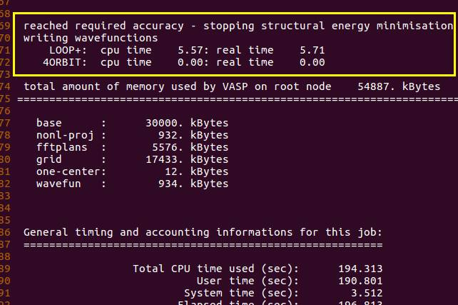


结构未收敛OUTCAR （NSW=2）：

 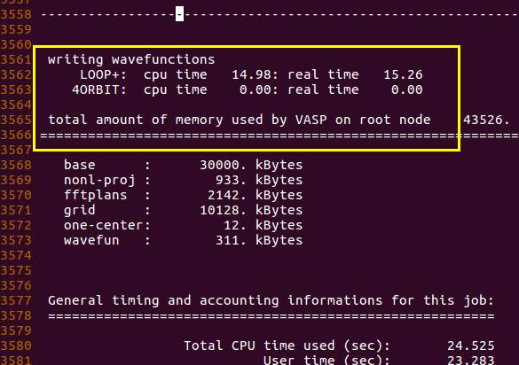


通过对比，我们可以发现，结构收敛的结果里面多了这一行：　 

```fortran
reached required accuracy - stopping structural energy minimisation
```

 

因此我们在今后的计算中，可以通过这一行来判断计算是否收敛结束。怎么判断呢？前面我们讲到了通过分析OUTCAR并结合grep命令来提取信息的方法，这里我们稍微复习一遍。下图中大师兄尝试了几个grep命令： 

看下输出结果:

 

```bash
iciq-lq@ln3:/THFS/home/iciq-lq/LVASPTHW/ex13/nsw10$ grep accuracy   OUTCAR
 reached required accuracy - stopping structural energy minimisation
 iciq-lq@ln3:/THFS/home/iciq-lq/LVASPTHW/ex13/nsw10$
iciq-lq@ln3:/THFS/home/iciq-lq/LVASPTHW/ex13/nsw10$ grep stopping OUTCAR
   EDIFF  = 0.1E-03   stopping-criterion for ELM
   EDIFFG = 0.1E-02   stopping-criterion for IOM
 reached required accuracy - stopping structural energy minimisation
iciq-lq@ln3:/THFS/home/iciq-lq/LVASPTHW/ex13/nsw10$
iciq-lq@ln3:/THFS/home/iciq-lq/LVASPTHW/ex13/nsw10$ grep structural OUTCAR
Analysis of structural, dynamic, and magnetic symmetry:
 reached required accuracy - stopping structural energy minimisation
iciq-lq@ln3:/THFS/home/iciq-lq/LVASPTHW/ex13/nsw10$
iciq-lq@ln3:/THFS/home/iciq-lq/LVASPTHW/ex13/nsw10$ grep 'reached required accuracy' OUTCAR
 reached required accuracy - stopping structural energy minimisation
iciq-lq@ln3:/THFS/home/iciq-lq/LVASPTHW/ex13/nsw10$
iciq-lq@ln3:/THFS/home/iciq-lq/LVASPTHW/ex13/nsw10$ grep 'reached required accuracy - stopping structural energy minimisation' OUTCAR
 reached required accuracy - stopping structural energy minimisation
iciq-lq@ln3:/THFS/home/iciq-lq/LVASPTHW/ex13/nsw10$
iciq-lq@ln3:/THFS/home/iciq-lq/LVASPTHW/ex13/nsw10$ grep reached OUTCAR
------------------------ aborting loop because EDIFF is reached ----------------------------------------
------------------------ aborting loop because EDIFF is reached ----------------------------------------
------------------------ aborting loop because EDIFF is reached ----------------------------------------
------------------------ aborting loop because EDIFF is reached ----------------------------------------
------------------------ aborting loop because EDIFF is reached ----------------------------------------
------------------------ aborting loop because EDIFF is reached ----------------------------------------
------------------------ aborting loop because EDIFF is reached ----------------------------------------
------------------------ aborting loop because EDIFF is reached ----------------------------------------
------------------------ aborting loop because EDIFF is reached ----------------------------------------
 reached required accuracy - stopping structural energy minimisation

```

 

从图中可以看出来，选择不同的grep 参数，会得到不同的输出结果。一般来说，grep后面的内容越详细，得到的输出结果也就会越匹配。我们提取信息的首要原则是：**精确匹配并提取最有价值的信息**！


其中：grep 'reached required accuracy' OUTCAR 是大师兄常用的一个命令。

（要提取的内容通过单引号扩起来了。）


### ~/.bashrc 

那么你会问道：“大师兄，你是不是傻X啊，这么长的命令，光输入就费老大劲了，不嫌麻烦么？”

 

哈哈，大师兄不仅傻，更喜欢偷懒。每次检查的时候这样子输入肯定麻烦。但在linux下面，有个小窍门，可以极大极大极大地提高你的工作效率，那就是`~/.bashrc` 文件中的 `alias`：（注意前面的点 . ）


.bashrc 文件怎么用呢？它在哪里？ 怎么打开？


答：在home目录下，

1） 终端（terminal）里面直接输入 cd 这个命令，会自动返回到home 目录下面：

然后运行命令：` vi .bashrc`

2） 当然，如果你不想跳转回去，也可以这样：vi  ~/.bashrc  波浪号代表home

 

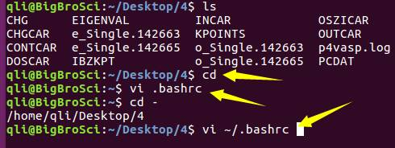


它怎么用?


http://www.linuxidc.com/Linux/2015-02/113310.htm   （参考网址）

 

1）打开 .bashrc 文件：（大师兄的bashrc文件为例：）

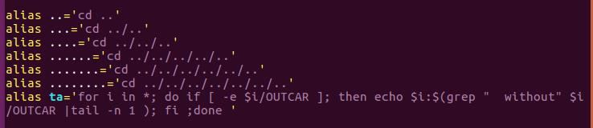


2） 将前面我们用到的命令写进 .bashrc 文件：

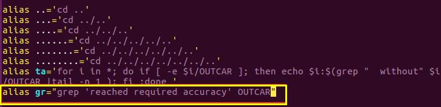


注意的部分： 

 

A) alias 和 gr 之间有空格；

B) gr 是大师兄随便想的，你也可以用自己想的其他字母；

C) gr之间没有空格；

D) gr后面紧跟着等号 = ， 中间没有空格；

E) 等号 = 后面紧跟着双引号，且等号= 和双引号之间没有空格；

F) 双引号之间，把我们的命令放进去，一定要确保命令在引号里面；

G)等号 = 后面可以用单引号，也可以用双引号，因为我们的命令中已经有单引号了，这里我们用的双引号，下面两者效果是一样的；

```
alias gr="grep 'reached required accuracy' OUTCAR"
alias gr='grep "reached required accuracy" OUTCAR'
```


注意：上图中两者任选一个即可，不要都放进去，否则会乱套。保存后退出。


3)  source 一下 .bashrc 文件。下图中的几个命令效果是一样的！ 


在这里点 `.` 和 `source` 命令的效果一样。


4 运行命令：（敲一下gr，回车即可）

```
iciq-lq@ln3:/THFS/home/iciq-lq/LVASPTHW/ex13/nsw10$ ls
CHG  CHGCAR  CONTCAR  DOSCAR  EIGENVAL  IBZKPT  INCAR  job_sub  KPOINTS  OSZICAR  OUTCAR  PCDAT  POSCAR  POTCAR  REPORT  slurm-1023075.out  vasprun.xml  WAVECAR  XDATCAR
iciq-lq@ln3:/THFS/home/iciq-lq/LVASPTHW/ex13/nsw10$
iciq-lq@ln3:/THFS/home/iciq-lq/LVASPTHW/ex13/nsw10$ gr
 reached required accuracy - stopping structural energy minimisation
```

当你看到这个信息的时候，说明优化任务就已经算完了。  在这里gr 命令就是前面 .bashrc 文件中alias 后面的那个命令。如果还不明白，看下面的例子。大师兄把.bashrc 文件中的 gr 替换成了bigbro , source 了一下后，运行 bigbro命令，得到了和前面一样的结果。

```
alias bigbro='grep "reached required accuracy" OUTCAR'
```

```
iciq-lq@ln3:/THFS/home/iciq-lq/LVASPTHW/ex13/nsw10$ bigbro
 reached required accuracy - stopping structural energy minimisation
```


5 ）注意：

避免你自己定义的命令名字和linux下面自带的命令重复。

```
alias  cd="grep 'reached required accuracy' OUTCAR"
```

但是可以这样设置：

```
alias  cd="cd && ls "
```

比如：在linux系统下，使用cp命令复制文件夹的时候，需要用到 cp -r A B 。有时候会忘记加 -r而出错，我们可以这样设置，`alias cp='cp -r '`来避免出错。

```
iciq-lq@ln3:/THFS/home/iciq-lq/LVASPTHW$ cp ex13 ex14
cp: omitting directory `ex13'
iciq-lq@ln3:/THFS/home/iciq-lq/LVASPTHW$ cp ex13 ex14 -r
iciq-lq@ln3:/THFS/home/iciq-lq/LVASPTHW$ vi ~/.bashrc
iciq-lq@ln3:/THFS/home/iciq-lq/LVASPTHW$ .  ~/.bashrc
iciq-lq@ln3:/THFS/home/iciq-lq/LVASPTHW$ cp ex13 ex15
iciq-lq@ln3:/THFS/home/iciq-lq/LVASPTHW$

```

如果你极其地讨厌一个人，可以在他的服务器下面这样设置！！！ 建议大家报复的时候可以采用这样温柔点的设置，这样，他每敲一次命令就会被你骂一次。（史上最狠报复，只适用于对付那些深深伤害了你的人！）大家只可以感受下这把刀的威力，切不可自作孽!

```
alias cd='cd  ~'
alias cp='echo "You are a XXX" '
alias ls='echo "You are a XXX" '
```

 

### 扩展练习：


1 分别设置O$_2$的初始键长为1.5和 0.9 Å，运行任务；

2 查看收敛情况；

3 查看结构信息和能量信息；

4 如果有不合理的地方，自己尝试解决。

 

### 总结：

 

本节讲解了

1) 查看任务计算完成的日常做法，

2) 一个在日常计算中极为重要的处理问题的方法，以及简化日常命令的方式。

通过设置.bashrc文件中的alias 命令,我们便可以自己随心所欲地将计算中的长命令、复杂的命令转化为简单的命令,从而极大地提高了我们的工作效率,尤其是适用于那些:使用频繁的但又很复杂的命令。

3) 一个思想：如果我们已知一个结果，那么便可以通过调控不同的参数，然后再与已知结果进行对比，从而分析不同参数在计算中的作用。

这一个思想贯穿了本书的写作过程，对于大家加深对VASP的理解以及练习意义非凡。熟练运用这一种方法，你的洞察力和判断力会得到极大地提升。希望大家能认真思考下本节中提出的处理问题的思想，以及熟练运行alias简化自己的命令。

 4） 为了锻炼大家的判断力，请做下题：以最快的速度找到图中的小猫：

---
title: Ex14 论合理结构的重要性（二）
date: 2017-12-06 02:06:48
tags: 
- 合理结构
- p4vasp
- 周期性
category:
- LVASPTHW
mathjax: true
---
<<<<<<< HEAD

$\require{mediawiji-texvc}$
=======
$\require{mediawiki-texvc}$

>>>>>>> 730ac078881f7d9a64a1a595d9a05d291f79a331

在ex13中，当初始值为1.5 $\AA$ 的时候，计算共进行了9步。对比下之前我们采用实验值（Ex11）作为初始结构计算时用了4步。从这里我们可以看出来，如果你一个合理的初始结构，可以加快优化的速度，减少机时，节约你的时间。当然，计算的具体时间可以通过OUTCAR尾部的信息查看。


### 不同初始结构对结果的影响。

那么不同的初始结构，除了在时间上，对计算的结构还有影响吗？ 首先我们对比下Ex11和Ex13的结果。 

```
iciq-lq@ln3:/THFS/home/iciq-lq/LVASPTHW$ tail ex13/nsw10/CONTCAR
     0.0000000000000000    8.0000000000000000    0.0000000000000000
     0.0000000000000000    0.0000000000000000    8.9000000000000004
   O
     2
Direct
  0.0000000000000000  0.0000000000000000  0.0149145061380336
  0.0000000000000000  0.0000000000000000  0.1536248197046605

  0.00000000E+00  0.00000000E+00  0.00000000E+00
  0.00000000E+00  0.00000000E+00  0.00000000E+00
iciq-lq@ln3:/THFS/home/iciq-lq/LVASPTHW$ tail ex11/opt/CONTCAR
     0.0000000000000000    8.0000000000000000    0.0000000000000000
     0.0000000000000000    0.0000000000000000    8.9000000000000004
   O
     2
Direct
  0.0000000000000000  0.0000000000000000 -0.0019537557431563
  0.0000000000000000  0.0000000000000000  0.1367852164173130

  0.00000000E+00  0.00000000E+00  0.00000000E+00
  0.00000000E+00  0.00000000E+00  0.00000000E+00
iciq-lq@ln3:/THFS/home/iciq-lq/LVASPTHW$

```

在Ex11和Ex13中，两个计算的能量和CONTCAR中的键长值也几乎相等，看下面的结果。

```
iciq-lq@ln3:/THFS/home/iciq-lq/LVASPTHW$ python
Python 2.6.6 (r266:84292, Sep  4 2013, 07:46:00)
[GCC 4.4.7 20120313 (Red Hat 4.4.7-3)] on linux2
Type "help", "copyright", "credits" or "license" for more information.
>>> 0.1536248197046605-0.0149145061380336
0.13871031356662689
>>> 0.1367852164173130--0.0019537557431563
0.13873897216046929
>>>

```


### 另一个bad结构的计算

上次我们用了一个大于实验值的初始结构1.5$\AA$。下面我们看下小于实验值的初始情况：0.9 $\AA$ 。

```fortran
iciq-lq@ln3:/THFS/home/iciq-lq/LVASPTHW/ex14$ cat POSCAR
O
1.0
7.5 0.0 0.0
0.0 8.0 0.0
0.0 0.0 8.9
O
2
Cartesian
0.0 0.0 0.0
0.0 0.0 0.9
```

INCAR，KPOINTS，POTCAR等不变，提交任务，等待计算结束，查看结果。

```
iciq-lq@ln3:/THFS/home/iciq-lq/LVASPTHW/ex14$ tail OSZICAR
DAV:  18     0.141396114006E+03    0.20879E-02   -0.88760E-04   144   0.130E-01    0.579E-01
DAV:  19     0.141397297948E+03    0.11839E-02   -0.52751E-04    96   0.893E-02    0.455E-01
DAV:  20     0.141388687914E+03   -0.86100E-02   -0.28657E-03   144   0.231E-01    0.206E+00
DAV:  21     0.141395321236E+03    0.66333E-02   -0.62073E-03    96   0.361E-01    0.112E+00
DAV:  22     0.141389669824E+03   -0.56514E-02   -0.95109E-03    96   0.429E-01    0.161E-01
DAV:  23     0.141382943017E+03   -0.67268E-02   -0.22808E-03    96   0.216E-01    0.118E+00
DAV:  24     0.141390086243E+03    0.71432E-02   -0.39635E-03    96   0.307E-01    0.825E-01
DAV:  25     0.141385767811E+03   -0.43184E-02   -0.44984E-03    96   0.305E-01    0.480E-01
DAV:  26     0.141385726226E+03   -0.41585E-04   -0.10329E-04    96   0.429E-02
   5 F= 0.14138573E+03 E0= 0.14138680E+03  d E =0.141123E+03  mag=    -2.0000

```

计算共进行了5步，且最后的磁矩看起来是正确的。**思考**： 从这里得出的信息，能确定我们的计算结果是正确的吗？ 

答： 不知道。因为我们还要要去查看一下结构。判断结构是否合理。如果结构不合理，则收敛的计算也是失败了。

 

用p4vasp打开CONTCAR后，如下图：


师兄，这是神马情况，两个原子怎么跑这么远？

 

不用担心，这是因为周期性的原因。p4vasp中可以进行如下的操作：


首先，点击左侧的Build按钮，然后再点击右侧的 To unit cell。这样你会发现结构调整到下图的样子：


两个原子之间的距离还是很长（7.821 $\AA$），但实际键长不是这么长的。

而是8.9-7.821 = 1.079 $\AA$。

师兄你为什么这么算?

 

因为我们的体系是周期性的，也就是图中的格子在三维方向上可以无限重复，如果我们向左重复一个单元，那么在新的单元中右侧的氧原子与原来左侧的氧原子距离很短。已知格子在z方向的长度为8.9 $\AA$，减去7.821就是剩下的两个氧原子之间的键长了。

 

如果，你还不明白，进行下图的操作：


点击左侧的Control 选项，然后在下面红色框中，将格子在三维方向上重复，效果如下：


注意，该操作只是展示三维方向的结构，如果此时你保存结构，不管你在三维方向上重复了多少次，保存的结构则还是原来的尺寸大小。


 

键长为1.0785 $\AA$。


##### 周期性的显示问题

暂且抛开对错不说，由于周期性导致的原子不在一个格子里面的情况，在今后的计算中你会经常碰到。如果你遇到这种情况，不要立即在群里问：师兄，为什么优化之后，体系中的原子不见了？为什么之前左面原子不见了，右侧本来没有原子，优化完多了？

 归根结底都是周期性导致的显示问题。你需要做的就是把结构在三维方向上重复一下，查看结构是对还是错。

 ##### 结果对还是错？

现在我们分析下对错，已知O$_2$分子的键长为1.2075 $\AA$，因此该计算与实验值偏差为：（1.0785-1.2075）/1.2075 =10.68 %，这么大的偏差，是不可以忍受的。

检查一下能量： 为 -8.54642426 eV。 之前正确的能量为： -9.85498627eV。


在第二版的改进中，大师兄又计算了这个任务一次，得到了另外一个结果：2个O原子距离很短。


查看能量：

```
iciq-lq@ln3:/THFS/home/iciq-lq/LVASPTHW/ex14$ grep '  without' OUTCAR
  energy  without entropy=        0.26254047  energy(sigma->0) =        0.26254047
  energy  without entropy=       11.76187113  energy(sigma->0) =       11.76187113
  energy  without entropy=      142.97353506  energy(sigma->0) =      142.97353506
  energy  without entropy=  1359169.21650280  energy(sigma->0) =  1359169.21650280
  energy  without entropy=      141.38788142  energy(sigma->0) =      141.38680382
iciq-lq@ln3:/THFS/home/iciq-lq/LVASPTHW/ex14$

```


思考： 能量为什么会差这么多呢（1.11 eV 或者最新结果140多eV）？ 


答： 我们需要知道体系的能量随键长的变化关系：如下图：


 


图中X 处是O$_2$的稳定结构，两个原子间距离小于X处的键长时，它们之间的排斥力导致了体系的能量快速升高。


由于我们已经知道了正确的计算结果，通过分析后，这次的计算失败！但对于不知道结果的时候，怎么判断计算是否成功失败呢？首先根据VASP计算的收敛情况，也就是计算至少应该正常结束，其次，这是远远不够的，我们还要查看输出结构的几何构型，判断是否具有物理或者化学的意义，还要看每一步收敛的能量信息。这些就需要我们化学基础知识了。

 

### 扩展练习及思考

 

1 计算为什么会失败?

2 分析该计算中每一步收敛的情况，以及能量的变化。

 

### 总结：

 

1 不合理的结构会增加计算时间；

2 不合理的结构会导致计算结果没意义；

3 知道怎么处理周期性结构中，原子不在一个晶格里面的情况；

4 学会判断计算结果的物理或者化学意义。
---
title: Ex15 论合理结构的重要性（三）
date: 2017-12-07 02:06:48
tags: 
- 合理结构
- p4vasp
- 周期性
category:
- LVASPTHW
mathjax: true
---


继续前面一节，我们分析一下结构优化过程的细节问题，以及合理结构的重要性。


### 哪里出错了？

查看每一离子步后的能量结果，注意命令中的单引号里面有两个空格！如果你看到这样的结果时，意味着大事不妙，结构优化失败了，SCF 也失败了！！！也就是结构没有优化好，离子步中电子步收敛也同样失败。


查看一下OSZICAR:

```bash
DAV:  52     0.142641482694E+03   -0.87447E-01   -0.50432E-03   120   0.175E-01    0.188E+00
DAV:  53     0.142675598279E+03    0.34116E-01   -0.20261E-03   120   0.869E-02    0.185E+00
DAV:  54     0.142703773182E+03    0.28175E-01   -0.26393E-03   144   0.121E-01    0.190E+00
DAV:  55     0.142724228087E+03    0.20455E-01   -0.11280E-03   120   0.795E-02    0.193E+00
DAV:  56     0.142809666479E+03    0.85438E-01   -0.29739E-02   120   0.433E-01    0.211E+00
DAV:  57     0.142939449864E+03    0.12978E+00   -0.29353E-02   192   0.367E-01    0.196E+00
DAV:  58     0.142943989012E+03    0.45391E-02   -0.90264E-04    96   0.810E-02    0.193E+00
DAV:  59     0.142966025527E+03    0.22037E-01   -0.43114E-04   120   0.704E-02    0.196E+00
DAV:  60     0.142973535062E+03    0.75095E-02   -0.53590E-05   144   0.234E-02
   3 F= 0.14297354E+03 E0= 0.14297354E+03  d E =0.142711E+03  mag=     0.0441
```


这里说明，第三步中电子收敛的步数达到了默认值，被强制停止了。每一个离子步中电子步数的最大值是由NELM这个参数控制的，VASP中默认值为60，也就是最大的电子收敛为60步，过了60步还不收敛就必须停止。自己VASP官网查看下相关的NELM参数。

下面两行如果你能看懂，说明优化的基本情况已经摸清了。

 

电子步（SCF）: `EDIFF` <====> `NELM `

离子步（结构优化）：`EDIFFG` <====> `NSW`

 

### 电子步不收敛怎么办？

遇到图中这种情况，大师兄分享一下自己的经验：

1） 首先检查自己的初始结构是不是合理的。这是关键点之一。如果合理，那么再进行下面的步骤：

2）如果第一个离子步中：`SCF`（也就是电子步）的计算不收敛，尝试下增加NELM的值；

* 对于一般普通的体系可以设置`NELM = 100`
* 对于一些电子结构比较难收敛的体系，可以设置更大一些：`NELM = 200`
* 增加NELM后依然不收敛，尝试下改变`AMIX`，`BMIX`，官网推荐的参数如下：不过个人的感觉，调这些参数好像没什么用，效果甚微。

```fortran
AMIX = 0.2
BMIX = 0.00001
AMIX_MAG = 0.8
BMIX_MAG = 0.00001
```

3) 第一个离子步中的电子步收敛了，后面的不收敛，能量变的极大（本例），首先应该想到的是去检查结构，一般在结构不合理的时候会出现类似的情况；调整结构再提交任务。

4）如果前面几个离子步中电子步都不收敛，且能量变化正常，可以尝试着让任务再多算几步，后面跑着跑着可能就收敛了。

5）如果跑了很长时间，每一个离子步中的电子步都不收敛，可以尝试着换一个更加稳定的电子步迭代算法（ALGO参数）。这种情况：`ALGO = ALL`  结合 `NELM = 200` 可以解决大部分的问题。

6）但需要注意的是：`ALGO= ALL` 这个算法虽然稳定，但比较耗时。自己要权衡一下。可以尝试着两步走的战略：step1）先用`ALGO =ALL`的办法算一个单点，保存WAVECAR。step2）然后将ALGO改回原来的，读WAVECAR继续优化。


大师兄尝试了很多种办法，意图把初始结构从0.9 $\AA$一步直接计算正确，但是大部分时候都失败了！而且出现了各种各样的问题和错误的结果，因此，出现这种情况，第一直觉是去看结构而不是想着调节参数去怎么解决这个错误！！！从这里可以看到，如果你的初始结构不合理，会出现各种各样的问题，这也是大师兄们解决不了的。

 

### 为什么会这样子

这是因为：两个氧原子之间距离在初始结构中很小，导致第一步估算之间的作用力过大，以至于后面没有办法再矫正过来。这里我们看一下`IBRION=2`时的计算步骤。

 


第一步，从初始结构出发，计算体系中离子间的作用力，

第二步，VASP尝试着把离子沿着前面估算的方向移动，尝试移动的大小由[`POTIM`](https://cms.mpi.univie.ac.at/wiki/index.php/POTIM)这一项决定，

第三步，计算尝试移动后能量和力的大小，据此加入一个矫正项来控制真实移动的大小；

第四部， 移动后，重新计算能量和力，重复前三步直至能量或者力收敛到我们设置的EDIFFG值。

 

`IBRION = 2` 时，对`POTIM`的依赖性很强，因此我们计算的时候要设置一个合理值。在我们的计算中，由于初始的原子间距离很小，第一步计算时，得到的原子间的初始排斥力很强，第二步中，VASP默认的`POTIM`值是0.50，前面两步导致了尝试步中离子的移动过大，以至于后面没有办法矫正回来，最后导致O$_2$分子计算出错。


### POTIM 显神威

大师兄，用0.9 $\AA$的时候可以调节POTIM来获得正确的结果吗？答案是肯定的。

如果想要正确计算的话，可以设置POTIM一个更小的值。`POTIM=0.1`，虽然从初始值算出来的力很大，我们通过POTIM强制VASP一点一点调节，来保证计算的准确。

```
SYSTEM = O atom
ISMEAR = 0
SIGMA = 0.01
ISPIN = 2
MAGMOM = 2*2
IBRION = 2
POTIM = 0.1
NSW = 10
```

提交任务，查看结果：

```bash
iciq-lq@ln3:/THFS/home/iciq-lq/LVASPTHW/ex15$ tail OSZICAR
DAV:   3    -0.984191032147E+01   -0.12318E-01   -0.38005E-02    96   0.891E-01    0.516E-01
DAV:   4    -0.984475378528E+01   -0.28435E-02   -0.74281E-03   144   0.367E-01    0.198E-01
DAV:   5    -0.984632399820E+01   -0.15702E-02   -0.51626E-04    96   0.101E-01    0.914E-02
DAV:   6    -0.984676440618E+01   -0.44041E-03   -0.15294E-04   144   0.511E-02    0.169E-02
DAV:   7    -0.984690803808E+01   -0.14363E-03   -0.99478E-06   144   0.122E-02    0.829E-03
DAV:   8    -0.984706391665E+01   -0.15588E-03   -0.95528E-06   120   0.898E-03    0.489E-03
DAV:   9    -0.984722304729E+01   -0.15913E-03   -0.99988E-06   120   0.862E-03    0.292E-03
DAV:  10    -0.984733039102E+01   -0.10734E-03   -0.63466E-06    96   0.690E-03    0.215E-03
DAV:  11    -0.984738716468E+01   -0.56774E-04   -0.27665E-06    96   0.463E-03
   7 F= -.98473872E+01 E0= -.98473872E+01  d E =-.101099E+02  mag=    -2.0000
iciq-lq@ln3:/THFS/home/iciq-lq/LVASPTHW/ex15$ cat CONTCAR
O
   1.00000000000000
     7.5000000000000000    0.0000000000000000    0.0000000000000000
     0.0000000000000000    8.0000000000000000    0.0000000000000000
     0.0000000000000000    0.0000000000000000    8.9000000000000004
   O
     2
Direct
  0.0000000000000000  0.0000000000000000 -0.0196261760084087
  0.0000000000000000  0.0000000000000000  0.1207497715140281

  0.00000000E+00  0.00000000E+00  0.00000000E+00
  0.00000000E+00  0.00000000E+00  0.00000000E+00
iciq-lq@ln3:/THFS/home/iciq-lq/LVASPTHW/ex15$ python
Python 2.6.6 (r266:84292， Sep  4 2013， 07:46:00)
[GCC 4.4.7 20120313 (Red Hat 4.4.7-3)] on linux2
Type "help"， "copyright"， "credits" or "license" for more information.
>>>(0.1207497715140281--0.0196261760084087)*8.9
1.2493459329496877
>>>

```


算出来的能量和磁矩等信息与之前正确计算的结果一致，键长也对上了。 说明我们修改`POTIM`生效了。这里`POTIM`的作用相信大家有了一个大体的了解。在`IBRION=2` 时（这是前提！！），如果初始结构很差，设置较小的`POTIM`可以有效的避免过度矫正。初始结构越好，`POTIM`的选择也就越随意。


### Python计算器

在上面的演示中，大师兄还教给你了一个终端里面的计算器，python！加减乘除非常好用，注意，使用python计算时，>>> 和数字之间不能有空格，否则python会提示出错！

```python
Python 2.6.6 (r266:84292， Sep  4 2013， 07:46:00)
[GCC 4.4.7 20120313 (Red Hat 4.4.7-3)] on linux2
Type "help"， "copyright"， "credits" or "license" for more information.
>>>  5 + 2
  File "<stdin>"， line 1
    5 + 2
    ^
IndentationError: unexpected indent
>>>  (0.1207497715140281--0.0196261760084087)*8.9
  File "<stdin>"， line 1
    (0.1207497715140281--0.0196261760084087)*8.9
    ^
IndentationError: unexpected indent
```


### 扩展练习

 

1 阅读`IBRION` 参数说明：https://cms.mpi.univie.ac.at/vasp/vasp/IBRION_2.html 知道优化过程的具体细节；

2 尝试不同的初始结构配合`POTIM`值，完成O$_2$的正确计算；

3 使用0.9 $\AA$作为初始结构，改变`POTIM`的参数值，直至计算正确；

4 尝试用0.9 $\AA$作为初始结构，`POTIM`采用默认值，调节其他自己认为会影响计算的参数，查看相关输出，如有错误，复制到`google`里面查找相关的原因。 

 

### 总结：

 

体系的初始结构越合理，不仅仅是节约我们的时间，还会我们的计算过程越省心。从前面出现的问题可以看出来，结构不合理，对应出错的地方越多，我们也要绞尽脑汁去纠正。O$_2$分子的例子比较简单，我们简单通过`POTIM`实现了正确的计算。但是大家计算的体系比O$_2$ 分子复杂的多，处理起来也会更加棘手。所以需要在初始结构上下功夫。更严肃的说：初始结构就是我们的计算模型，如果模型不合理，后续的计算都会出错，甚至失败。

如果初始结构不合理，用`IBRION=2`的时候，`POTIM`可以很好的控制收敛，还是建议初始结构搭建的合理些，省时省力。认真学习化学基础知识，搭建好合理的初始模型才是王道，正应了那句古话：磨刀不误砍柴工！
---
title: Ex16 谁偷走的我的机时？（一）
categories: 
- LVASPTHW
tags: 
- 机时
- 回顾
date: 2017-12-08 15:30:16
---


前面O$_2$初始结构为0.9 $\AA$时，如果使用`BRION=2`，相对于初始结构为1.07$\AA$的时候，为避免过度矫正，我们需要设置一个更小的POTIM，大师兄尝试过了，`POTIM = 0.01` 的时候得到了正确的计算结果。到此，O$_2$分子的计算我们暂且告一段落。做计算，机时很重要，尤其是缺钱，捉襟见肘的时候，我们就更加需要珍惜，保证并提高自己的计算成功率，避免重复计算。这一节我们总结下前面讲到的影响计算时间的一些细节。大家在计算的时候知道如何把握时间，在有限的机时内获取更多的有效的计算结果。

---

### 1 体系的磁性 (EX8)

考虑自旋后（`ISPIN=2`），VASP计算时会将电子分为两部分处理，一部分是$\alpha$电子，另一部分是$\beta$电子，我们在氧原子的自旋极化计算中提到过了，忘了的可以查看Ex8，Ex11中的内容。

补充一下：如果原子的`MAGMOM`为负值：应该这么写：

```
MAGMOM = 10*-2 # 有10个原子，每个原子的初始磁矩为 -2
```

注意： -2 不用括号（）括起来

---

### 2 对称性 (EX8)

体系的对称性降低，会增加相应的计算量。查看O原子计算时，改变晶胞大小，取消对称性前后的计算时间。

---

### 3  SIGMA的取值 (EX1)

我们看一下VASP练习手册：handonsession-I 里面的一句话说明：


因此，设置一个较小的SIGMA值会使收敛变慢。大家对于ISMEAR的选择，一定要多看官网的说明！

---

#### 3.1 半导体和绝缘体：

1） K点小于4 的时候，用`ISMEAR=0`, `SIGMA`取值小一些；比如SIGMA=0.05; 此时用ISMEAR = -5 会出错；

2）K点数目大于4的时候，可以使用`ISMEAR= -5`；

3） 注意： 我们算的气体分子，是绝缘体，且只用了gamma点，所以我们参数的设置如下： 

------

```fortran
ISMEAR=0 
SIGMA=0.01 
```


---

#### 3.2 金属体系：

ISMEAR一般用`ISMEAR=0` 或者整数1，2即可。

`SIGMA =0.1` 足够。

---

### 4 合理的初始结构 （Ex13-15）

前面我们刚讲到，一个合理的初始结构，可以避免很多意外的错误以及快速得到正确的结果。

如果你的初始结构不合理导致的计算出错，首先应该去调整结构，最后才是去调节参数，比如上一节中`IBRION=2 `时的POTIM值。

---

### 5 EDIFF （Ex9）

EDIFF 控制了电子迭代的收敛标准，如果你设置的标准比较严格，则每一个离子步需要更多的电子步数，需要的时间也会随着离子步的增加成线性关系增长。

---

### 6 EDIFFG （Ex9）

EDIFFG控制了结构收敛的标准，同样严格的标准需要更多的结构优化步骤来实现。

---

### 扩展练习：


1 本文所提到的内容，必须去官网查看，并认真阅读，如有不懂的，请在群里自由提问；

2 思考一下，还有其他因素影响我们的机时吗？---
title: Ex17 谁偷走的我的机时？（二）
categories: 
- LVASPTHW
tags: 
- 机时
- 回顾
date: 2017-12-09 15:30:16
---


这一节和后面几节，我们会复习一下前面学到的Linux批量操作知识，然后对一些影响计算时间的参数进行测试。 本节主要考虑`ENCUT`的影响。前面我们一直在说`EDIFF`和`EDIFFG`对计算时间的影响。为了给大家一个感性的认识，现在我们用O$_2$分子的计算作为测试例子，将结果展示出来。这两个参数主要是在计算精度上影响计算时间，很容易想到，精度越高，收敛的越慢，需要的时间对应的也会更长。

---

### 1 调节EDIFF和EDIFFG


左侧为之前计算的INCAR，右侧为提高精度后的INCAR。O$_2$的初始距离设置的为1.207$\AA$。提交计算，等待任务结束。前面我们知道VASP计算完成后，OUTCAR最后输出的是计算时间，内存等信息。我们现在查看一下：文件夹 0 对应的是之前的O$_2$计算，文件夹1 中是提高精度后的计算。


**注意：**grep User OUTCAR 后得出的结果被空格分成了4部分，时间信息在第4部分里面。User（1） time（2） （sec：）（3） 44.20 （4）

---

讲解：

1.1）通过`tail OUTCAR` 这个命令，可以找到用grep命令查看时间的关键词：User 或者 Elapsed，这里我们采用User 后面的时间作为参考；

1.2）右下方黄色图框中的时间表面：提高了精度后，计算时间从44秒增加到78秒。

1.3）我们看一下，改变精度后体系的能量变化：


从-9.8609降低到-9.8611，变化大小为： -0.0002 eV。 这么小的能量变化，我们可以认为忽略不计。

在这里，我们要认真思考收敛标准对于我们计算体系能量的影响，选取一个合适的标准而又不会浪费太多的机时。一般来说，结构优化的时候，`EDIFF=1E-5`, `EDIFFG =-0.01 `至 `-0.03` 都是被认可的。

---

### 2 ENCUT 测试：

#### 2.1 制备ENCUT测试模板


解释：  

2.1.1）新建测试目录 2 ，进入后，将前面的文件夹0复制过来，文件夹名为 400

2.1.2）使用sed命令，在INCAR中最后一行加入ENCUT参数，值设置为400

---

#### 2.2 快速制作测试任务


图中的命令行为：

```
for i in {1..8}; do cp 400 $((400+$i*50)); sed -i "s/400/$((400+$i*50))/g"  $((400+$i*50))/INCAR ; done
```

复习前面学到的linux操作：

2.2.1）明白`{1..8}` 是怎么回事；

2.2.2） `$i` 变量的调用；

2.2.3）新学：`$((加减乘除))`，注意数学运算用2个括号 括起来；

2.2.4）sed 命令进行文本中某一项的替换；

2.2.5）运行完毕后，会获得一系列`ENCUT`值的文件夹，且每个里面INCAR已经对应地设置完毕。

---

#### 2.3 批量提交任务


命令： 
`for i in *; do cd $i ; qsub sub4; cd $OLDPWD; done`

讲解：

2.3.1）do后面执行的是，进入for循环中的文件夹，然后提交任务，（大师兄提交任务的命令是 qsub sub4， qsub 是命令，sub4是脚本名），任务提交后，返回原来的目录下（`cd $OLDPWD`），然后再进入下一个for循环中的文件夹，重复之前的操作，直至遍历所有for循环的变量文件夹；

2.3.2）图中的Single是任务的说明，这个在提交任务的脚本里面自己随意设置：


---

#### 2.4 批量查看结果的命令：


此处需要注意 * 的用法

我们只需要图中方框标出来的信息，其他的结果可以直接扔掉。为简化输出结果，这里大师兄用了另外一个强大的命令： awk

`for i in *0; do echo -e  $i "\t" $(grep User $i/OUTCAR | awk '{print $4}'); done`


2.4.1）  学会echo 命令：

2.4.2）  echo –e 后面加上"\t"后（双引号），可以直接输出 tab，方便导入excel；

2.4.3）  本例中，awk 后面用`{}`将打印的内容括起来；

2.4.4）  `print $4` 意思是输出前面结果的第4项；

2.4.5）  awk命令极其强大，强烈建议大家尝试着去网上查找资料，主动去学习；

2.4.6）将结果复制到excel里面作图。

#### 2.5 计算时间随着ENCUT增加的变化曲线


从图中可以看出，**计算时间随着ENCUT的增加也相应地增加了**。因此，在保证计算准确度和ENCUT的值的选取，你要学会合理取值，加快自己的计算速度。此外，图表的比较形象直观，大家在今后的学习中，多多思考将自己的数据转化为图表的形式！可以很好的表达自己的计算结果。

设想一下，同学A和B把同样的数据结果给老师看，A单纯把数据列到表格里面，B做成了上图的形式，老师会喜欢谁？此外，我们也可以通过写一个简单的python脚本来实现作图的功能。

---

#### 2.6 作图的 Python 脚本：

##### 2.6.1 获取数据，并保存成文件


注意echo $i 后面的逗号，输出的文件 data.dat 中，逗号用于将两列数据分开。

2.6.1.1）图中圈出来的部分中， > 代表将前面命令的输出保存到 data.dat 文件中；

2.6.1.2） data.dat 后缀可以随便写，`data.txt`， `data.out`, `data.export`, 也可以不写：`data` 。 因为输出后的都是文本格式，直接可以编辑打开。

2.6.1.3） 查看一下保存的数据结果


##### 2.6.2 作图 脚本， 名为 plt.py  

vim打开后，内容如下图：


python程序学习参考书：** learn python the hard way**（免费），网上还有很多学习资料，这里就不介绍了。python读取data.dat 文件，根据 delimiter 后面的参数（此处为逗号）将数据分成若干列。

---

##### 2.6.3 运行脚本：（python plt.py）


#### 2.7 体系的能量随ENCUT的变化：


获取图上结果的命令行：

`for i in *0; do echo -e  $i "\t" $(grep User $i/OUTCAR | awk'{print $4}') "\t" $(grep ' without' $i/OUTCAR | tail -n 1 | awk '{print $4}'); done`

作图过程如下：

##### 2.7.1 生成数据：


前面的命令中， "\t" 改为 逗号，  done 后面 加上 > data.dat， 重新运行一遍。 

##### 2.7.2 修改脚本如下：


增加了 一列（z）

---

2.7.3 选择合适的画图区间：


图中蓝色的O$_2$分子的能量随ENCUT值增加的变化，为一直线！

---

大师兄问：结果对不对？

答：结果是对的，但不具有任何的合理性。

因为它不能体现出能量变化的趋势：因为 y 轴的取值范围太大了，而我们能量的变化又太小。这也是很多人在做模拟的时候容易犯的错误，看到一个直线，或者平滑的曲线，就如同哥伦布发现了新大陆一番。其实则不然，很多时候，真相往往被我们的粗糙的观测范围给掩盖了。

这个称之为作图骗人的一个Trick！很多人在发文章的时候将这一技巧运用的如火纯情。所以，当你看文献的时候，如果发现别人的结果也是一条直线或者平滑曲线，第一直觉是去看坐标轴的范围，而不是感觉别人的工作是多么地牛逼。

重新作图，这次只用ENCUT和O$_2$分子的能量，如下图：


能量一直在降低， 结果对不对呢？对的，但变化却被过度放大了！

---

很多新手看到这个图以为能量降低的很快，感觉自己的计算不收敛，因此还要继续往下做或者测试。其实则不然，在这里，我们还是需要主要 y 轴的取值范围。图中整个y轴的变化为0.016 eV。每两个点之间的变化仅仅为0.002 eV。这个变化我们也是可以接受的，虽然图中感觉下降的很厉害的样子。

上面两个图中，走了两个极端，一个极大，一个极小。所以，在我们处理数据时，一定要仔细观察坐标轴的取值范围。

---

####  2.8 小结一下： 

但从数据上可以看出来，O$_2$分子的能量随着ENCUT值的增加还是会有些少许的波动。比如，从400到800 eV，能量降低了0.01 eV。大师兄，那我们该取哪个ENCUT值呢？

首先，我们要明确几个要点：

2.8.1）ENCUT值越大，计算的越精确，花费的时间也就越多；

2.8.2）ENCUT的取值仅仅通过一个例子的测试来确定，这是不对的；

- A)   在VASP的计算中，单个结构的能量所具有的意义不大，也就是说相对能量最重要！
- B)   为什么A）中说相对能量最重要：这是因为：没有对比，就没有伤害！设想一下，你把一个O$_2$的能量算的再精确或者能量再低，而不去使用它，它也就是个数字而已，不具有任何的物理化学意义。
- C)  B)中要表达的意思是，算出来的数值必须要应用到我们的物理化学概念中，也就是物理化学的概念体现在这些能量的使用过程中，也就是相对能量里面：比如，O$_2$的结合能， O$_2$的吸附能；某一化学反应的能量，反应能垒，表面能，功函数等等，无一不是多个能量的数学运算所的出来的。
- D)   O$_2$的结合能示例：

公式： EB = E(O$_2$) –2E(O)

O$_2$的结合能随着ENCUT值增加的变化情况：


第一、二、三、四列分别为ENCUT，O原子能量，O$_2$分子能量和O$_2$分子中O的结合能。从图中，我们可以分析出来，ENCUT在450 eV时，O$_2$的结合能和ENCUT为800 eV的时候差别很小，因此我们可以选取450 eV进行计算。

注： O原子不同ENCUT的单点能，自己根据前面的过程，补充计算。

---

2.8.3）ENCUT的取值与体系中所有的元素有关；

- A）体系中含有不同元素的时候，查看这些元素POTCAR中的ENMAX值，找出最大的那个；
- B）ENCUT的最小值为所有元素中ENMAX的最大值！
- C）也就是说，找到最大的ENMAX（max）， ENCUT值大于等于ENMAX（max）。


示例图中，
potcar.sh 为生成POTCAR的脚本，可在本书的附录中获取。ENCUT 的取值至少为 400 eV。

---

2.8.4） ENCUT的值，也要查阅相关的参考文献进行确定。你的计算体系大家都用400 eV，你也可以设置该值或者稍微高一些。ENCUT很多人在刚开始做计算的时候，都会测试一个数值。如果不想测试，查找参考文献其实是一个很好的办法。

---

### 3 扩展练习：

3.1 复习前面学到的批量操作方式；

3.2 熟练运用前面的操作，并理解命令的工作原理；

3.3 改变KPOINTS的大小，查看计算时间，能量的变化；

### 4 总结：

1 EDIFF和EDIFFG对计算的影响通过实例强调了一次；

2 ENCUT 测试的操作流程；

3 ENCUT对计算时间和能量的影响结果分析；

4 通过excel 和python作图的两个方法；

5 能量和计算时间随ENCUT的变化；

6 看图时坐标轴的区间范围要注意；

7 总结ENCUT取值的一些注意事项。
---
title: Ex18 谁偷走的我的机时？（三）
categories: 
- LVASPTHW
tags: 
- 机时
- KPOINTS
date: 2017-12-10 15:30:16
---

### KPOINTS对计算时间的影响

---
继续前面的学习，本节讨论`KPOINTS`文件中K点的设置对计算时间的影响。本节图中的Linux命令不再详细介绍，大师兄默认大家已经基本掌握了其中的原理和窍门。VASP官网上还有其他的批量测试的脚本，大家现在也可以差不多能看懂了。比如Si计算的例子：https://cms.mpi.univie.ac.at/wiki/index.php/Fcc_Si 

---

### 1 KPOINTS测试
#### 1.1 准备测试模板

新建文件夹: 3，将之前的文件夹0复制过来后重命名为 1。

#### 1.2 批量制备测试文件：


命令： `for i in {2..6}; do cp 1 $i ; sed -i"s/1 1 1/$i $i $i/g" $i/KPOINTS ; done`

文件夹1 代表KPOINTS为`1 1 1` ,6 代表KPOINTS为 `6 6 6`  其他的类推。

---

#### 1.3 批量提交任务：


备注：这里的qsuball 命令是把前面的批量命令放到 .bashrc 文件中了。不懂的请看Ex17的批量操作命令和Ex13中.bashrc文件中alias的使用方法。

---

### 2 测试结果分析

#### 2.1 查看OUTCAR 中的K点信息


图中，我们找出可以通过grep 查询的字符：irreducible  

---

#### 2.2 批量查看所有测试的K点信息：


**命令 `grep irreducible 3/OUTCAR`**

从图中可以看出：

1）K点`2 2 2` 和`3 3 3` 的计算中，生成的K点数目是一样的；类似地，`4 4 4` 和`5 5 5` 具有同样地K点数目；

2）不难理解，相同的K点数目，其计算时间也是一样的；

3）计算时间随K点数目的增加也增加了。

---

师兄，为什么K点数目会存在奇数和偶数相同的关系？

原因在于K点生成的方法。当KPOINTS为偶数的时候，K点都在布里渊区的内部，而为奇数的时候，部分K点处在布里渊区的边界上。引用参考书中的一个表格和一段话：第三章第56-57页：


---

#### 2.3 不同K点对能量的影响：

先不画图了，直接看能量吧：

当K点为 `1 1 1` 和 `6 6 6` 的时候，O$_2$分子的能量差别为： 0.0015 eV。可以忽略不计。在这里，你可以清晰地知道：为什么算气相分子的时候 gamma点（1x1x1）足够了。

对于其他slab或者体相材料的计算，K点怎么选择呢？我们看下面这一段话：


出处： https://wiki.fysik.dtu.dk/gpaw/exercises/surface/surface.html

---

再参考一下Quantumwise 网站的说明：

出处：http://quantumwise.com/forum/index.php?topic=2628.0

再次强调一下：浏览网站说明的时候，要养成这样的一种习惯，凡是看到Note这个单次，就要跟打了鸡血一般！前面的东西看不懂不要紧，Note后面跟的都是重点易出错的地方。

---

以上只是经验参数的说明，给我们提供一个大体的指导。这个参数在使用中，要注意我们前面提到的奇数和偶数的情况。而具体到我们的计算中，需要用什么数值，我们需要认真地测试检查一下，而不能直接就用图中的经验参数。

1）通过测试不同K点对体系能量的变化；（参考书中的例子）


---

2）查找参考文献的取值；

---

3）此外，不同K点之间的数据不能混用。比如计算CO在一个 (3x3) Cu(111)表面上的吸附能：
$$
E_{ads} = E_{CO + slab} – E_{slab} – E_{CO^{gas}}
$$
等号后面的前两项，必须要用同一个K点下计算出来的能量，如果$E{CO+slab}$ 用`5x5x1` 的K点， E(slab) 采用 `3x3x1`的K点能量，得出的结果必然是错的。

---
### 2.4 来自VASP官方的提醒：


出处： https://www.vasp.at/vasp-workshop/slides/accuracy.pdf

1）常见错误（一）： 体系中ENCUT的取值不统一；

2）常见错误（二）：采用不同KPOINTS计算出来的结果。

3）在关于Accuracy的这个pdf文件中，最后一行大家要谨记：TEST，TEST，TEST ....

---

### 3 扩展练习：

1 下载大师兄分享的压缩文件： 本节中所有的pdf文件和链接；大师兄QQ群文件下载，或者百度网盘：http://pan.baidu.com/s/1eSCGWeA

2 阅读参考书中第三章的内容，掌握K点的基本概念和一些选取的注意事项；

3 浏览本节中所有的网址。

---

### 4 总结：

1 K点数目越多，计算越准确，需要的时间也会相应地越多，大家要把握好准确度和时间的关系；

2 K点的确定，需要经验和测试相结合，经验为辅，测试为主。

---

## 5 补充： 

 VASP的新版本中，可以直接在INCAR中设置K点。也就是说，没有KPOINTS文件也可以正常计算，但这可能只适用于简单的K点情况，能带结算等需要制定K点路径的计算，我们还是需要KPOINTS文件的。

---
title: Ex19 谁偷走的我的机时？（四）
categories: 
- LVASPTHW
tags: 
- 机时
- 模型
date: 2017-12-11 15:30:16
---


### 模型对计算时间的影响

---

上一节介绍的KPOINTS对计算的影响，相信大家已经认真阅读参考书的第三章部分了。本季我们讨论一下模型的大小对计算的影响。主要体现在晶胞的尺寸，对称性以及对K点的影响上。

---

### 1 测试工作：

 为了方便处理，我们把O$_2$计算的格子设置为长宽高均为8.0 $\AA$。


重复之前KPOINTS的批处理操作，我们可以获得一系列不同大小格子的文件夹。如下图：


命令：  `for i in $(seq 10 2 20); do cp 8 $i; sed –i "3,5s/8.0/$i/g" $i/POSCAR ;done`

---

### 2 测试结果分析
### 2.1 模型大小对计算时间的影响


注意：在后面加入 `sort –n` 后输出的变化。

---


从图中可以看出来，计算时间随着格子的大小，需要的计算时间增加的很快。

注意：在测试中，KPOINTS一直保持不变（因为只有一个Gamma点）。而在我们实际的计算操作中，使用1x1x1 KPOINTS的机会并不多。如果格子在某个方向增加了2倍，那么对应的改方向的K点就需要除以2。重复一下上节的经验指导。也就是在计算过程中，保持k*a保持不变。当然，k*a是我们提前测试好的。


举例：

一个`10x10x10` $\AA^3$的体相材料，我们计算的时候K点设置为：`6x6x6`。

当我们将材料在x方向增加1倍，变为`20x10x10`  $\AA^3$。为保持一致的精确度，那么我们的K点需要设置为：`3x6x6`。

---

这是因为倒易晶格矢量和实际的晶格矢量之间存在着倒数的关系：


注： 类似的图，不加说明，均出自我们的参考书。也就是说，我们选取的晶格越大，倒易晶格矢量越小。用同等数目的K点分布到倒易晶格中，网格的密度也会越大，从而造成计算量的增加。

---

#### 2.2 体系的对称性对计算速度的影响：

##### 2.2.1 K点保持不变：

这一点前面关于氧原子的计算就已经介绍到了，降低体系的对称性会增加额外的计算时间。如图：将`12x12x12` $\AA^3$ （计算需要186.86 s）的格子修改如下：


计算结束后，查看时间，为194.9 s, 计算时间增加了8秒。


#### 2.2.2 对称性对K点的影响：

体系的对称性不仅仅提现在前面的计算中，更可以在计算中极大地减少K点的数目，从而加快计算，节省时间。这一点我们引用参考书中的一段话：


##### 2.3.3 模型对称性与K点对称性的关系

在这里，体系的对称性与K点对称性的匹配问题，尤其是对于hexagonal的结构来说，必须要使用 gamma centered points. 也就是第三行的第一个字母必须为G或者g。我们看一下官网的原话：

>We strongly recommend to use only Gamma centered grids forhexagonal lattices. Many tests we have performed indicate that the energy convergessignificantly faster with centered grids than with standard Monkhorst Pack grids. Grids generated with the "M" setting in the third line, in fact do not have full hexagonal symmerty.

如果你不确定自己的体系，直接用G就可以了。

 >For reasons of safety it might be a good choice to use only meshes with theirorigin at (switch "G" or "g" on third line or odd divisions) if the tetrahedron method is used.


### 3 扩展练习：

 1 认真阅读： Density Functional Theory: A Practical Introduction: 第三章的前两节；

2 VASP官网查找K点相关的说明。

### 4 总结：

 学习完本节，大家应该掌握的内容有： 

4.1 晶格大小对计算时间的影响；

4.2 体系的对称性对计算时间的影响；

4.3 掌握K点和晶格大小的经验规则；

4.4 晶格对称性和K点对称性的一致性。
---
title: Ex20 谁偷走的我的机时？（五）
categories: 
- LVASPTHW
tags: 
- 机时
- 并行
date: 2017-12-11 15:30:16
---

### 并行

---
前面几节讨论的都是一些涉及到模型以及计算细节对时间的影响。本节我们讨论一下服务器节点设置（并行）的影响。从字面上不难理解，并行就是多个节点同时计算同一个任务。好比之前用一匹马拉车，现在改用两匹，三匹或者更多的马拉同一辆车。一匹马拉车的时候，对马的要求是足够强壮，能拉得动还要跑得快。但你想跑的更快，就需要驾驭两匹或者多匹马，但这个时候对于驾驶马车的你就需要提出技术要求了：如何控制马儿之间的节奏。控制好了，并驾齐驱，得儿驾得儿驾，爽歪歪。控制不好结构，你跑你的，我跑我的，整体下来，马儿也累，马车行驶的反而更慢了，搞不好还会栽跟头。

---

同样的道理，如果想加快计算速度，或者在最短的时间内获取最多的计算数据，我们就需要知道并行在计算中的作用。首先我们先测试一下，不同节点同时运行O$_2$分子计算所需要的时间。注意：本练习讨论的是多个节点下的并行！

---

### 1 测试活动： 

为了观测更加明显，我们使用` 8x8x8` $\AA^3$的格子，K点使用`3x3x3`， `ENCUT = 400` 。


测试的服务器每个节点有4个核，每个核有两个进程。

文件夹用核数命名，4,8,12,16 分别代表使用了1,2,3,4个节点进行计算。

在这里，每个节点可以看成1匹马，4个核可以看作马的四条腿。每个核的两个进程可以看做每条腿的上下两部分。

---

#### 1.1 设置计算的节点数目

使用多少个节点进行计算，在提交任务的脚本里面设置。每个课题组可能不太一样，也有通过命令设置的，不过都大同小异。大师兄晒一晒自己组里提交命令的脚本，如果和你们的不一样，不要纠结：


这个任务的脚本里面，我们使用32个核（32条腿），也就是8个节点（8匹马）同时计算。提交所有的测试任务后，等待结束。


### 2  测试结果分析：
#### 2.1 提取结果


`for i in *; do echo -e $i "\t" $(grep Elapsed $i/OUTCAR  | awk '{print $4}'); done`

这里复习上一节： `sort –n` 命令的用法，将数列从小到大排列。

注意：这里我们没有用之前的`User time`提取时间, 而是用的`Elapsed time`。这一项是计算真正花费的时间。所有的时间里面：`Total CPU time = User Time + System time`，一般来说， Elapsed time 总会比 Total CPU time 多上那么几秒。

`User time` 和 `System time` 是干嘛的？怎么的出来的？大师兄也不知道具体的含义。希望知道的童鞋们给大师兄上上课。之前几节中，用`User time`的分析结果可靠吗？ 没问题的，大师兄检查了一下，前面的`System time`均为 2s左右，`Elapsed Time` 中绝大部分由`User time`来贡献。

---

#### 2.2 作图分析


核数的单位为 个 ， 对应图中的拼音 ge（个数）

1  从4核到8核，计算时间并没有减少，反而增加了15s

2  从4核到12核，计算时间也仅仅减少了20s

3  从12核以后，增加核数，计算时间反而增加了。

从12核开始，增加的核数白白占了你的任务，缺丝毫没有提高计算速度。因此，增加核数反而成了计算的负担。这是因为并行计算的时候，不同核之间的数据传输浪费了大量的计算时间。这好比是你多安排了几匹马来拉车，但马儿们却彼此交流，各跑各的，不愿意拉车了。

---

#### 2.3 既然是这样，VASP并行还有个卵用？

答：并行是有用的，只不过我们需要调教这些不听话的马儿们，让他们服从我们的命令。这里我们就会需要一些其他的参数，NCORE和NPAR。 

NCORE：控制多少个核同时计算；
NPAR：如何把计算任务分配到计算资源上面计算。

它们之间的关系是：NCORE= 计算使用的核数 / NPAR

注意：这两个参数只能选取一个来使用:

---

测试数据结果（给喜欢看表格的人准备的）


图中红色部分为前面计算的结果，

- 蓝色为NCORE=4的结果（测试的服务器每个节点有4个核，所有的计算军用NCORE=4）；
- 绿色为NPAR=4的结果（所有的计算中均用的NPAR=4）；
- 黄色为NPAR=Core/4的结果，

根据NPAR和NCORE的关系，该设置与NCORE=4等同，但是实际测试中蓝色和黄色为什么没有完全一样，我也说不清楚。

---

1）使用NCORE以后，单节点运行也加快了；（单匹马儿被你调教的更听话了）

2）加入NCORE和NPAR参数后，计算时间明显提高了。在20核以后的计算中尤为明显；

3）如果你想用多个节点计算，NCORE或者NPAR，不要忘了加（二者选其一）。

４）可以肯定的是：NPAR和NCORE的乘积就是我们计算所用的核数，这一点大家要记在心里。

5) 在本测试中（这是前提！！），增加节点个数并未实现 1+1 = 2 的效果，1+N = 2 的效果也没有实现。但在多个节点的计算中，加入NCORE或者NPAR，节点数越多，效果越明显。

手册上解释说NPAR，或者NCORE的取值可以为总核数的开方值。很多人对此会有疑虑，大师兄的建议是：

*  **测试，测试，测试!....**测试一下自己的体系这是主要的，不要完全相信本测试的结果，体系不同，结果可能会差很多！！；

* NPAR的取值可以设置为节点的数目，（默认值为计算的核数！）

* NPAR实在不懂的话，直接设置NCORE=单节点的核数，单节点的核数/2，单节点的核数/4…….

*  个人使用经验是：NCORE = 单个节点核数 / 2 的时候，运行最省时间，设置也最方便。

### 3 扩展练习：

1 阅读VASP官网关于NCORE，NPAR的内容；

2 对于自己的计算体系，测试这两个参数；

3 总结前面关于计算时间的影响因素

---

### 4 总结： 

关于VASP计算时间的影响，我们暂且告一段落了，希望大家能在前面几节的学习中熟练掌握影响计算时间的这些因素，在实际的计算过程中合理把握，提高计算效率，节约机时。浪费的机时不仅仅属于你自己，也属于组里其他人的。---
title: Ex22 乙醇气相分子的优化
date: 2017-12-14 02:06:48
tags: 
- 乙醇
- 优化
- 数据库
category:
- LVASPTHW
mathjax: true
---


前面我们终于讲完了 $\rm{O_2}$ 分子优化的例子。相信大家对 **VASP** 计算已经有了一个初步的理解。这一节我们继续学习气相分子的优化。为了让大家进一步了解计算的过程，我们选取一个稍微复杂的分子作为例子：乙醇（$\rm{CH_3CH_2OH}$）。

------

问：把大象装进冰箱需要几步？


大师兄，这个问题我早就知道答案了。为啥还问这样低智商的问题？

大师兄要求的不是让你回答开冰箱门，装进去，关门的这三步。而是让你尝试回想一下：当你第一次接触这个问题的时候，你的反应是什么？

大师兄比较笨，我的第一反应是，这怎么可能？  冰箱那么点，大象那么大。


当朋友告诉我答案的时候，才恍然大悟，这跟大小没关系。


--------

同样的，怎么用 **VASP** 计算乙醇分子？很多童鞋就如同第一次被问到大象这个问题一样不知所措。答，也是三步！

1） 打开冰箱：准备 **VASP** 文件

2） 把大象塞进去：准备乙醇分子模型

3）关上冰箱：运行 **VASP**

## 1. 打开冰箱：

我们可以直接用O$_2$分子计算的输入文件，

### 1.1 复习一下前面学到的`INCAR`和`KPOINTS`的内容：

1）乙醇分子是闭壳层的分子，没有磁性，不需要`ISPIN=2`

2）气相分子计算，我们要用`ISMEAR=0`，`SIGMA`取值要小，`SIGMA=0.02`；


 **\#** 表示注释，这个符号后面的内容，VASP在运行的时候不考虑。

-------------

**示例 1 ：**
```bash
ENCUT = 400
# ENCUT = 500
```
和
```bash
ENCUT = 400
```
效果是一样的。

-----------

**示例 2：\# 的用法：**


**VASP** 计算中一些常见的错误，以及注意事项，你可以通过 \# 写在`INCAR`里面，方便计算的时候进行设置。可以 \# 开头，单起一行，也可以在参数的最后面加上注释。新手们刚刚开始，可以结合 **VASP** 官网参考书，把用到的INCAR参数注释下来，时间长了慢慢就掌握了。

3）气相分子计算，`K`点使用`Gamma`点就够了；

```fortran
K-POINTS
0
Gamma
1 1 1 
0 0 0 
```


-------------

## 2 把大象塞到冰箱里面 :POSCAR的准备（本节重点）

前面我们学习到，一个好的初始结构会加快计算，获取准确的计算结果。因此我们需要去找一个合理的模型。对于气相分子的结构，一是手动搭建，大师兄推荐用 `GaussView`，另一个办法就是找数据库，大师兄推荐英国皇家学会的 **ChemScpider**。网址：http://www.chemspider.com 


下面我们把手动搭建乙醇分子的模型具体解释一下：

### 2.1 打开网站


搜索框中输入： 分子名称`Ethanol` 或者 分子式`C2H6O`…. 点击搜索，等待结果：


上面箭头指的两个地方随便点，效果是一样的，如下：


分子默认显示 `2D` 的结构，点击箭头指的 `3D`，切换。第二个箭头所指的有对应结构的维基百科链接，翻墙的筒子们可以查阅下相关结构的知识。选择`3D`后，如下：


点击箭头指的地方保存，浏览器会下载对应的 .mol 文件，文件名为该结构在数据库中的编号。

------------

`.mol`文件也是纯文本，使用`Notepad++` 打开如下：看到这么多内容，不要害怕！


**注： 不仅仅是 `.mol` 文件，很多结构文件都是文本格式，直接打开就是。**

从里面找到乙醇结构的 $x, y, z$ 坐标信息


删除上图中除红色框之外的所有行，1-4行，以及 14 至最后一行，只保留 $x, y, z$ 坐标信息的那几行。


手动写`POSCAR`，首先你要熟记的格式，知道`POSCAR`从头开始，往下每一行代表的内容。

我们的模型是把乙醇分子放到一个 $ 20 \times 20 \times 20~A^3 $ 的格子里面。输入完之后，坐标后面的元素符号以及那些 $0$ $0$ $0$ 可以删掉，也可以不管。


**关键点1： .mol文件中，坐标那几行中的第 4 列写到`POSCAR`中的第 6, 7行！**

**关键点2： 注意坐标为 `Cartesian` 或者是 `Direct`. `Direct` 是分数坐标，其 $x, y, z$ 值都小于 1.**

------------------

如果你想删掉图中坐标第3列后面的内容：大师兄推荐notepad++里面的列块模式：如下：


点击之后，可能会弹出对话框，告诉你如何使用，列块模式


-------------------

**方法1：**

 摁住 `Alt` 键，然后用鼠标选择文本，不同电脑可能不一样，大师兄这边同时摁住 `Ctrl` 和 `Alt` 两个键，然后用鼠标选择的。

------------------

**方法2：**

同时摁住 `Alt`和`Shift`键，通过键盘上前后左右的箭头选择文本

大家可以尝试下，选中效果如图：


然后点键盘上的`Delete`键删除.


然后另存为`POSCAR`即可。

------------------

我们可以使用 **p4vasp** 来查看一下模型的结构：如下图


我靠，师兄，结构怎么跑到格子外面啦？前面 $\rm{O_2}$ 分子的学习中，你已经知道了这是因为周期性导致的显示问题。对计算不会产生影响。这个结构可以拿来直接用。

如果感觉不爽，想把结构放到中间，可以这么做：

数学上，把 $x, y, z$ 坐标**统统加上 $10$ 即可**；

软件使用上，我们讲一下 **p4vasp** 的操作方法：


选择 `edit` –> `Move atoms`


`Move group` 是你要移动的原子，这里大师兄直接输入了 C H O 三个元素符号（中间有空格）表示选择所有元素的原子。然后在 `Vector` 中选择 $x, y, z$ 三个方向上移动的大小。你也可以写 $1$ $1$ $1$，然后点击 `Move` 按钮 $10$ 次。

如果你想通过选择原子来实现移动的话(不直接在 `Move group` 里面输入 C H O)，需要按照大师兄说的步骤走：


1) 空格键结合鼠标选中所有的原子；鼠标指到原子上就点一下空格键

2) 选中原子后，主界面会显示一些数字，这些数字和 `POSCAR` 中元素的顺序是一致的；

3) 所有原子选中后，左下角的框中点击 `Get group`，会显示选择的那些原子；

4) 在 `Vector` 中选择 $x, y, z$ 三个方向上移动的大小，然后点击 `Move` 按钮。

上面一堆废话就此打住，结果就是这样子的：


然后点击 file -> Save system as -> 选择目录 -> 保存成`POSCAR`

-------------------

#### POTCAR

**POSCAR** 讲完了，我们就要按照里面的元素顺序制备`POTCAR`了。

首先: 我们要准备 O C H 三个元素的`POTCAR`，去`POTCAR`的数据库中去找：

然后复制到当前目录下，三个元素的`POTCAR`分别命名为：`POTCAR-O`, `POTCAR-C`和 `POTCAR-H`， 把三个元素的`POTCAR`合并在一起，命令就是

```bash
cat POTCAR-O POTCAR-C POTCAR-H >> POTCAR
```

## 3 提交任务

提交任务之前，需要再次检查自己的输入文件一遍，没有问题，提交直至结束。


## 4 扩展练习：

4.1 从头到尾，认真重复本节中大师兄的操作；

4.2 记住本节讲解的内容，自己重复一遍操作，直至自己通过文本编辑器会搭建结构模型；

4.3 运行乙醇计算的例子；

4.4 尝试使用 **GaussView**，**Materials Studio (MS)**，以及其他可视化界面搭建模型；

4.5 学会使用 **VESTA** 导出`POTCAR`格式的结构数据。


## 5 总结：

本节，我们主要讨论了一下分子模型的数据库搜索和搭建工作。希望大家能够完全掌握本节的所有内容和细节。在计算中，你会遇到各种各样的结构文件，其实都是$xyz$坐标的衍生物而已。不要害怕，直接打开它们，学会提取里面有价值的信息。
---
title: Ex23 乙醇分子的振动频率计算(一)
date: 2017-12-15 02:06:48
tags: 
- 乙醇
- 频率
- 数据库
category:
- LVASPTHW
mathjax: true
---


大师兄在本节开头放上这张图片的意思是，请大家再仔细体会`Rubbish in， Rubbish out`这句话，只有对我们要研究的体系有一定的理解，明白我们具体要计算什么内容，设置好输入文件的参数，才能得到我们需要的合理结果。接下来的几节会涉及到分子的振动频率计算，振动频率的可视化等内容，请大家跟着大师兄一起练习，掌握振动频率的基本计算和分析方法。

--------

## 1 分子的振动

我们首先看回顾一下振动相关的基本知识，这里大师兄不具体解释，引用 $9$ 版 $Atkins$ 的《物理化学》书中的内容，书已上传至**QQ群文件**中，也可百度网盘下载: <http://pan.baidu.com/s/1o8HlyOi>  全是英文，大家耐心阅读下。

-------------

简谐振子、胡克定律、体系势能随着振动距离 $x$ 的关系


简谐振动的薛定谔方程描述:


薛定谔方程的解：振动的量子化，振动频率


零点能的数学和物理两个方面的解释:


------------

## 2 频率计算的作用

**频率计算有什么用？为什么要算频率?** 大师兄稍微总结了一下频率计算的意义，大体有以下几个方面，没有提到的用处，烦请大家指出来，以便补充。

2.1 确定结构是否稳定;

2.2 看振动方式和大小，用来和实验对比，棋博士最新的文章就是一个非常好的例子;

2.3 反应热，反应能垒，吸附能等的零点能矫正;

2.4  确认过渡态(有一个振动的虚频)

2.5 热力学中计算`entropy`，用于计算化学势，微观动力学中的指前因子和反应能垒。

---------

## 3  怎么用VASP计算频率?

3.1首先进行结构优化，获取稳定的构型，这个我们前面已经讲过了;

3.2 将原来的`CONTCAR`复制成`POSCAR` :
```bash
cp CONTCAR  POSCAR
```

3.3 修改`INCAR`


修改后如下:  


频率计算的`INCAR`


- `IBRION`的值改成`5`

- `POTIM`用一个更小的值，我们这里用的 `0.02`，默认值是 `0.015`

- `NSW` 设置成1，这个可以直接不管，继续采用优化时的`NSW`值，因为你设置成 `1， 2， 3， 4， 5， …， 1000` 都不会影响计算；但不能不设置（因为默认值是`0`，这时算个单点后任务便停止了。）

- `NFREE=2` 添加这一个参数，表明原子在某一方向上正反两个方向移动；

- `NCORE=4`这一项要注释掉！大师兄这边的服务器，并行计算频率时 VASP 会罢工，只进行一步静态计算，注释掉就正常进行了；

- 此外，`EDIFF`也要设置一个严格的值（频率计算时，默认值为`1E-6`，足够了！下一节会讲到）


小结一下频率分析关键的参数:

```bash
IBRION=5
NFREE=2
POTIM=0.02
```
---------

## 4 扩展练习

4.1 按照本节的流程新建一个文件夹 `freq` : 该文件夹中包含乙醇分子优化后的结构 (将`CONTCAR`复制成`POSCAR`)，以及优化时的`POTCAR`，`INCAR`， `KPOINTS`以及提交命令的脚本文件;

4.2 修改乙醇分子优化的`INCAR`为频率计算的`INCAR`；需要修改哪些参数心里要清楚；

4.3 运行乙醇分子频率计算，并查看频率分析的`OUTCAR`，`OSZICAR`等输出文件；

4.4 查看 **VASP** 官网对于`IBRION=5` 的解释，搜索网上相关频率计算的文章，帖子，初步了解`NFREE`，`POTIM`所代表的含义；

<https://cms.mpi.univie.ac.at/wiki/index.php/IBRION>

4.5 查找官网中频率计算的例子:

A) <https://cms.mpi.univie.ac.at/wiki/index.php/CO_vibration>

B) <https://cms.mpi.univie.ac.at/wiki/index.php/H2O_vibration>


## 5 总结:

5.1 熟悉频率计算初始文件的准备过程；

5.2 频率计算`INCAR`中的三个重要参数；

```bash
IBRION = 5
NFREE = 2
POTIM = 0.02
```

5.3 初步了解频率计算中各个参数的含义。
---
title: Ex24 乙醇分子的振动频率计算(二)
date: 2017-12-15 02:06:48
tags: 
- 乙醇
- 原子固定
- Vim
- p4vasp
category:
- LVASPTHW
mathjax: true
---


按照前面一节介绍的方法，结构优化过程完毕后，准备频率计算的输入文件，提交任务等待结束。然后我们介绍一下频率计算的输出与POSCAR原子的固定。


## 1 查看结果

### 1.1 查看OSZICAR，你会发现一共计算了55步。


下面我们分析一下这$55$步是怎么回事：

A）乙醇分子$\rm{CH_{3}CH_{2}OH}$ 含有 $9$ 个原子，每个原子在 $x, y, z$三个方向上均有一个自由度，共 $9 \times 3 = 27$ 个

B）我们设置的`NFREE=2` ，也就是在每个方向上 `+POTIM` 和 `–POTIM`都移动并算一下，这样就有了 $27 \times 2 = 54$ 步：官网原文如下：大家自己去查阅`IBRION`和`NFREE`的相关内容。

> The parameter NFREEdetermines how many displacements are used for each direction and ion, andPOTIM determines the step size. The step size is defaulted to 0.015 ? (startingfrom VASP.5.1), if too large values are supplied in the input file. Expertiseshows that this is a very reasonable compromise.`

> NFREE=2 usescentral differences, i.e., each ion is displaced by a small positive andnegative displacement, ±POTIM, along each of the cartesian directions.`

C）还有一步：$55  -54 = 1$, 这一步指的是第一个离子步，为频率计算前的单点计算。

所以当你设置了`NFREE=2`的时候，频率计算需要 $1+N \times 6$ 步。$N$ 为体系中的振动的原子数。


## 2 固定原子

默认的是所有的原子在$x, y, z$三个方向上均可移动。但很多时候，我们只需要振动感兴趣的原子或者某一特定的方向就可以了，也就是说选择性计算频率。比如我们只想算乙醇的羟基振动峰，那么其他的原子就可以固定。VASP可以通过设置POSCAR来实现这个功能？首先我们看一下当前的`POSCAR`：


左下角的`:set nu`  显示文本的行数，取消行数可以通过 `:set nonu`

----------------

如果想要选择性地固定某些原子，我们需要以下几个步骤：

1） 在第七行和第8行之间插入一行，内容为 `Selective Dynamics` ，前面讲过 **VASP** 只认第一个字母，也就是`S`是必须的，`Selective Dynamics` 和 `See`, `Sea`….等其他`S`开头的都是一个效果的。

2）  加入`Selective`之后，我们需要在每一行的坐标后面加上 `T` 或者`F`表示允许和禁止移动。这里我们需要加三个`T`或者`F`，表示在 $x, y, z$ 三个方向上选择性固定原子的移动，

三个方向都允许：`T T T`

三个方向上都不允许: `F F F`  

$x$ 移动，$y$ 和 $z$ 方向上固定为： `T F F`

$x$ 和 $y$ 方向上固定，$z$ 方向振动： `F F T`

以此类推，其他的大家根据自己的情况固定。

---------------

师兄，那么我们要做的就是在`POSCAR`中逐行写上`T T T`或者`F F F`就行了吧? 

是的，下面大师兄教给你的是通过 **Vim** 的命令或者 **p4vasp** 实现这个功能。

----------------

### 2.1 通过 **Vim** 实现原子的固定和选择

**第一步**：加入 `Select` 的关键字母`S`，并在坐标后面全部加上 `T T T`


图中`箭头1`：插入一行，告诉 **VASP** 我们要选择性的固定某些原子或者在某些方向上；

图中`方块2` `:10,18s`  中 `s` 代表替换（`substitute`）的意思，这里表示我们选中了第 $10$ 到 $18$ 行，$10$ 和 $18$ 之间有个逗号表示连续；`10,18s`后面用一个 `/` 分开，紧跟着你我们要替换的内容；

`$` 在这里是末尾的意思，`$/T T T`我们要把每一行的最后替换成 `T T T`

后面再用一个`/`分开，加上`g` 表示 global 全部替换的意思。

输入完毕后，回车，效果如下：


每一行的末尾都加入了 `T T T`  箭头指的地方告诉我们：$9$ 行中的 $9$ 个地方发生了替换。

（自己复习下`sed`的用法，比较两者的区别）

-------------------

**第二步**，下面我们要把OH之外的原子全部固定住：

通过 **p4vasp** 我们可以知道，OH 的两个原子为第一个（O）和最后一个（H），因此我们把第 $11$ 行到 $17$ 行中的所有`T`替换成`F`就可以了。我们可以使用 `:11,17s/T/F/g`来实现。最后效果如下：


C）扩展：

如果所有的原子后面为： `T T T`，这与我们之前的计算效果是一样的（第 $8$ 行没有`S`，坐标后面没有`T T T`）。此外，固定之前要先找到哪些原子我们希望固定的，以及它们在坐标中的顺序。

-----------------

### 2.2 使用p4vasp实现上述功能:

基于 **p4vasp** 的可视化特性，直接用鼠标操作是很多`linux` 小白最喜欢看到的，下面我们主要讲解一下 **p4vasp** 的操作，请务必将 **Vim** 和 **p4vasp** 的操作关联起来，这样你会就会发现可视化和命令之间的微妙关系了。

#### 1） 打开p4vasp，导入`POSCAR`；


`System` 显示 ethanol 说明数据已导入。


#### 2）   鼠标系列操作

A）点一下 `Show` 按钮，显示乙醇分子结构；

B）  点击`Build`按钮：显示分子的坐标信息：这里的坐标顺序和`POSCAR`完全一致：


C）  选择乙醇的羟基（使用空格键选择原子），下图中可以知道 O 和 H 在坐标顺序中为第一个和最后一个；


D）选中右上角的`Selective Dynamics`，效果如图中箭头2指出来的部分，这个动作和我们之前在第八行插入`Selective Dynamics` 以及在坐标每一行加入`T T T`是等效的


E）选中第二行坐标，摁住shift键，然后再点一下倒数第二行，选中整个区域后，点击右上方的 `Unselect` ， 这个动作等效于我们将 $11$ 到 $17$ 行中的`T`全部替换为`F`。


F）操作完成后，左上角： `File --> Save System As` 保存新的`POSCAR`即可。

-----------------------------

## 4 扩展练习：

4.1 掌握本节的两个`POSCAR`处理方法；

4.2 学会计算频率分析所需的步数；

4.3 浏览`OUTCAR`，查找频率输出结果


## 5 总结：

通过对比手动敲命令修改`POSCAR`和使用 **p4vasp** 进行鼠标操作，这里大师兄希望大家能掌握以下三点：

1） 学会 **Vim** 的使用技巧，当然了，**Vim** 及其强大，完全掌握基本不可能，但最基本的操作要了解；

2） **p4vasp** 的操作要熟悉，不知道怎么操作的，导入一个计算文件，随便点点，找找感觉；

3） 在使用 **p4vasp** 的操作中，你要学会思考：怎么将鼠标操作转化为命令语言来实现，为将来写脚本做好准备，毕竟很多时候，我们用不了可视化界面，就只能手动修改格式了，结合命令，比可视化操作更快，还可以批量进行。
---
title: Ex25 乙醇分子的振动频率计算(三)
date: 2017-12-16 02:06:48
tags: 
- 乙醇
- 振动频率
- Jmol
category:
- LVASPTHW
mathjax: true
---


本节推荐一款可视化程序：**Jmol**，可以用来看分子结构以及振动频率。**Jmol** 是一款`Java`语言编写的，开源，`Linux`，`Windows`均可的使用的可视化软件。还记的我们从`ChemSpider`获取乙醇分子的情景吗？


对了！RSC的网页版中，乙醇分子的3D结构就是通过 **Jmol** 展示给大家的（3D图上方），并且我们下载的结构也是jmol格式的文件！可以通过 **Jmol** 直接打开。现在我们通过在电脑上运行Jmol，并查看分子的结构和振动频率。

-------

## 1. Jmol在windows和linux下的安装：
### 1.1 安装前准备（Java运行环境的安装）

`Windows`下：直接百度`Java Runtime Environment（JRE）`，安装软件。


也可以官网下载：<http://www.oracle.com/technetwork/java/javase/downloads/jre8-downloads-2133155.html>


注意两点：

1： 接受许可，

2：64位系统下载箭头所指的文件，然后安装即可。

`Linux`下`Java`运行环境安装移步下方链接：

[怎样在Ubuntu 14.04中安装Java](https://linux.cn/article-3792-1.html)： https://linux.cn/article-3792-1.html 

或者直接使用命令：
```bssh
sudo apt-get install default-jre
```

------------

### 1.2 Jmol软件的下载和安装

+ Windows：

<https://sourceforge.net/projects/jmol/files/Jmol/>

打开链接后，图中箭头指的地方下载最新版的（`Linux`其实和`Windows`下载的文件一模一样，见后面说明），也可以任选版本进行下载。


等待几秒后会弹出下载的窗口，其他浏览器也应该一样。


解压缩后就算安装好了，可以直接运行。

------------

运行 **Jmol** 程序：


上图中 `箭头1`所指为 `jmol.bat` 文件，`箭头2`所指为 `Java`的可执行文件：`jmol.jar`。在`Windows`下任选一个双击即可打开 **Jmol** 程序。建议将解压缩之后文件夹中的`jmol.bat`或者`jmol.jar` 文件右键发送到桌面快捷方式。打开后如下图：


-----------

+ `Linux`下安装 **Jmol** 的方法:

在 <https://sourceforge.net/projects/jmol/files/Jmol/>下载 **Jmol**（和前面介绍的`Windows`下载的文件一模一样），解压后的文件复制到`usr/bin`中，打开文件时在命令行输入`jmol.sh 文件名`即可（**注意**，`jmol.sh`和`文件名`之间 **有空格！**）。将解压目录加入`.bashrc`路径中也可以实现，同时需要给`jmol.sh`加上可执行权限，即`chmod u+x jmol.sh`，打开文件的方法仍用`jmol.sh 文件名`。(QQ群友：连赞提供！)


大师兄在`Linux`系统下的操作如下：

a）下载和`Windows`版的过程一样，下载完毕后，解压，

b）终端里面进入解压后的文件夹：


注意一下几点：

b.1) `jmol.sh`就是我们在`Linux`系统下面的命令（`Windows`里面我们用`jmol.bat` 和 `jmol.jar`）；

b.2) 首先赋予它可执行的权限：
```bash
chmod u+x  jmol.sh
```
相反地，取消权限：
```bash
chmod u-x jmol.sh
```

b.3) 这里大师兄电脑下，`jmol.sh`变成绿色的了（不同电脑显示会不同，不要纠结）

b.4) 尝试运行一下： `./jmol.sh  OK`

b.5) 下面设置环境变量：打开 `~/.bashrc` 文件，并加入这一行：

```bash
export PATH=$PATH:~/Downloads/jmol-14.20.2:$PATH
```

**注意：**

* 等号=前后没有空格, 后面紧跟着`$PATH`；
* 再往后是一个冒号，冒号前后也不能有空格，填上Jmol的解压目录！！！

b.6) 保存`.bashrc` 文件并`source`一下:   `.  ~/.bashrc`  （注意前面的 `.` ）或者使用命令：
```bash
source  ~/.bashrc
```

c） 进入其他目录，运行 **Jmol** 命令：下图中`~/Destkop/freq` 目录下有我们关于乙醇频率的计算结果。


大功告成！！！

此外，`sudo apt-get install jmol `这样安装的是**旧版本**，强烈不建议，原因如下：

**可能图片有些模糊，但不重要！旧版本的不支持 OUTCAR...安了也是白搞！！！**


-----------

## 2 使用Jmol可视化分子振动

### 2.1 载入振动文件到 Jmol

`Windows`：直接将频率计算得到的`OUTCAR`拖到`jmol.bat`就可以了

`Linux`：直接 `jmol 文件名`

两个系统下面均可使用左上角的 文件à打开à选择`OUTCAR`导入。

得到如下界面。但是分子并没有开始振动，只是显示了其结构。


（该结构和`ChemSpider`上的一样！）

要查看振动模型，需要以下两步，**选中振动模型**和**开启振动**。这两步有多种方法可以实现，总结如下。

---------------

### 2.2 选择振动模型

A）可以在工具-->原子库选择器中选中要查看的振动模型


**注意，先把右边的按钮拉倒底，然后双击Frequencies展开频率信息，** 如下:


B) 也可以直接右键-->模型中选中


-----------

### 2.3 开启振动

A) 原子库选择器中**最下方**: **振动-->振动开** 可实现， 点击后，原子就开始振动了。


B) 在**菜单栏-->工具-->震动** 中开启（原子库选择器选中时采用这种方式，需要先开启再选中）


C) 也可以**右键 --> 振动 --> 开启**


--------------

### 2.4 查看不同振动

A) 原子集选择器中的频率列表，双击其中的一个就显示其振动方式了。


B) 要查看下一个振动还可以通过点击向右的这个箭头就可以了。


以上就是本节关于 **Jmol** 可视化的介绍了，更多信息，请查看 **Jmol** 的`wiki`：
<http://wiki.jmol.org/index.php/Main_Page>


## 3 扩展练习：

3.1 熟练掌握 **Jmol** 的软件安装，查看频率的基本操作。

3.2 通过在`Linux`系统下面安装 **Jmol**，尝试着安装其他软件；

3.3 分析各项频率值对应的分子或者原子的移动。

## 4 总结

本节主要介绍给大家一款除了 **p4vasp** 之外的另一款 **VASP** 可视化的软件，不仅仅局限在频率振动分析方面，查看`POSCAR`，`CONTCAR`也可以直接使用 **Jmol** 打开。该软件由连赞小朋友推荐，并编辑文中大部分内容，在此表示衷心的感谢。希望大家都可以熟练掌握这款软件。`Linux`下面可以直接用命令： `jmol 文件名`，打开查看结构，非常方便。
---
title: Ex26 乙醇分子的振动频率计算(四)
date: 2017-12-17 02:06:48
tags: 
- 乙醇
- 振动频率
- 零点能
category:
- LVASPTHW
mathjax: true
---


前面我们学会了通过使用 **Jmol** 查看分子振动。但分子振动频率在`OUTCAR`是什么样子的呢？今天我们就分析一下`OUTCAR`文件中的频率信息，以及如何写脚本计算零点能矫正。

-------------

## 1 OUTCAR分析

### 1.1 回顾一下Jmol中的频率振动


**Jmol** 提取了`OUTCAR`中的振动信息，将每个振动模式的频率列了出来。

### 1.2 OUTCAR中的信息：


对比一下这两个振动频率和·中的前两个。

--------------

1）`1 f =` 代表第一个振动模式，细心的你仔细观察，会发现每一行有四个单位的数值：`THz`, `2PiTHz`, `cm-1`,和 `meV`，这四个是完全等同的；

2）下面一行为坐标 X Y Z和每个原子在 $x, y, z$ 方向上的振动大小；

3）X Y Z下面的数字为结构的坐标信息（Cartesian坐标系），dx dy dz 为振动的具体数值；

4)后面的振动模式的频率和第一个的格式一样。

---------------


## 2 频率单位的换算

我们先讲一下这四个单位的换算公式：

|Relevant    Formulas:  |
|:----------------------|
|$ E =   hc / \lambda $ |
|$ \nu = c / \lambda $ |
|$\tilde{\nu} = 1 / \lambda $ |
|$ T =   1 / \nu $ |
||
|**Definitions:**            |
|$E$ =   energy ($eV$)  |
|$\lambda$ =   wavelength  ($m$) |
|$\tilde{\nu}$ =   wavenumber  ($m^{-1}$) |
|$T$ =   period ($s$) |
|$\nu$  =   frequency  ($s^{-1}$ or $\textrm{Hz}$) |
|$h$ = Planck's constant = $4.135667516 \times 10^{-15}~eV \cdot s$ |
|$c$ =   speed of  light = $ 299792458~m/s$ |

以第一个振动为例：

| 1f   =  |        |
|:------  |-------:|
|111.907  | $\textrm{THz}$ |
|703.134  | 2PiTHz |
|3732.82  | $cm^{-1} $ |
|462.811  | $meV$    |


1） THz 和 2PiTHz 的换算： $2\pi$ 的关系：

$$ 111.907230~(\rm{THz})  \times 2 \pi  = 703.133866~(\rm{2PiTHz}) $$

2） THz 和 cm-1 的关系：$\nu = c / \lambda = c \tilde{\nu} $， $c$ 是光速，$\lambda$ 是波长，$\tilde{\nu}$ 是波数，单位是 $m^{-1}$。计算前先换算成标准单位： 1 THz = 1012 Hz, 1 $cm^{-1}$ = 100 $m^{-1}$，因此：

$$ 111.907230 \times 1012~(\textrm{Hz}) = 299792458~(m/s) \times 3732.823294 \times 100 (m^{-1}) $$

3）THz 和能量 eV 的关系：

$ E = h\nu $， $h$ 为普朗克常数：$4.135667516 \times 10^{-15}~eV \cdot s$ **(注意此时：Plank constant 的单位！！！)**

$$ 462.811270 (meV) = 0.4628 eV = 4.135667516 \times 10^{-15} (eV*s) *  111.907230 \times 1012 (Hz) $$

4） 波数（$cm^{-1}$）和能量（$meV$）的关系：
$E = hc / \lambda = h \tilde \nu $
$ 462.811270~meV = 0.4628~eV
 = 4.135667516 \times 10^{-15}~(eV*s) \times 299792458~(m/s) \times 3732.823294 \times 100~(m^{-1}) $

大家根据上面的公式自己手动算一遍就明白了，还可以使用下面这个网址进行计算：<http://halas.rice.edu/conversions> 这里就不再多说了。

----------

## 3  OUTCAR频率信息的提取：

我们可以使用`grep`命令提取，有以下两个方式。在进行之前，首先强调一点：下面的解释**只适用于**NWRITE= 0、1或者2 的时候。因为NWRITE = 3 的时候，会额外再输出一次频率的信息。

### 3.1 使用以下几个命令：

```bash
grep THz OUTCAR
grep 2PiTHz OUTCAR
grep cm-1 OUTCAR
grep meV OUTCAR；
```

这几个命令中，我们分别以振动的不同单位作为提取对象，便可以得到所有的振动信息（这里的所有指的是包含虚频）：以大师兄常用的 `grep cm-1 OUTCAR` 为例：


黄色标出来的第一列：$9 \times 3 = 27$ 个振动模式，第二列是以`cm-1`为单位的振动频率大小，最后三行 `f/i=` 指的是虚频。

-----

前面我们提到过，虚频可以判断结构是否稳定。那这里，我们计算出的乙醇分子结构肯定不稳定喽？不一定。

因为频率计算和软件的数值积分有关（我也不清楚数值积分怎么进行的）；

计算过程中我们的设置对频率计算影响很大，`KPOINTS`, `ENCUT`, `EDIFF`, `POTIM`等都会影响计算的精度（下一节讨论）；综合这些因素，对于分子的振动频率来说（注意：声子谱不适用）一般低于 $100~cm^{-1}$ 的频率可以忽略。严格点可以降到 $50~cm^{-1}$，也就是说：如果你在计算中发现有个 $50~cm^{-1}$ 左右的虚频，完全可以不考虑。

-----

### 3.2 `grep 'f  =' OUTCAR`


**注意：图中虚频部分没有显示出来！严格按照我用的这个命令**

使用这个命令的时候，不提取虚频部分。查看虚频的时候，可以用之前的方式，也可以用这个命令：


在零点能的计算时，虚频是不能考虑在内的，因为它不是分子的真实的振动模式。在我们这个例子中，虚频的出现是软件的误差所导致。在过渡态中，虚频代表的是反应方向。从另一个角度去分析：乙醇分子的零点能（下面讲到）为：$2.117~eV$，图中三个虚频对应的能量为：$0.76 + 2.31 + 8.14 = 11.11~meV = 0.01111~ eV$，所占比例为：$0.0111/2.117 = 0.5\% $ 这个可以忽略不计。

--------------

## 4 零点能校正

### 4.1 明白什么是零点能：回顾频率计算第一节的内容：


### 4.2 获取振动能量数据：


分析下结构：


上图输出共有11列（列之间用空格分开）：我们要的零点能在第10列，使用下面的命令：
```bash
grep 'f  =' OUTCAR | awk '{print $10}'
```

如果想同时输出第 1 和 10 两列：
```bash
grep 'f  =' OUTCAR | awk'{print $1 " "$10}'
```
`$1` 和 `$10` 之间有 2个 双引号：**" "**，两个双引号里面有一个空格用来分开），否则两列会连在一起。

**注意！注意！注意！**

**这里我们提取的能量为：$h\nu$ ！！！**

**而零点能为 $1/2 h \nu$！！！**


### 4.3 将所有振动的能量求和：
```bash
qli@BigBroSci:~/Desktop/freq$ grep 'f  =' OUTCAR | awk '{print $10}' | paste -sd+ | bc
qli@BigBroSci:~/Desktop/freq$ 4233.962325
```

输出的4233.96就是所有的 hv 之和。

1）不要忘记除以 $2$

2）此时单位是 $meV$，换算成 $eV$ 还需要除以 $1000$。

3）所以，我们的零点能是 $4233.962325/2/1000~ eV= 2.117~eV$


### 4.4 写脚本

将前面的命令写到一个文件里面就成为了脚本：怎么写呢？本人平时喜欢使用类似 $4233.962325$ 这个数字，除以 $2000$ 这一步在后面的工作中进行。因此只用到了
```bash
grep 'f =' OUTCAR | awk '{print $10}' | paste -sd+ | bc
```
这个命令。写脚本的具体操作：


1）把这行命令写到一个文件中，文件名为 `fsum` （本人不喜欢 `.sh` 尾缀，加不加都一样）；

2）赋予可执行权限
```bash
chmod u+x ~/bin/fsum
```

3）移到 `~/bin` 文件夹
```bash
mv fsum ~/bin
```

4）在任何一个频率计算的目录下运行：敲命令 `fsum` 即可；

5）不喜欢 `fsum` 这个命令，将文件名改成你自己喜欢的名字：

如果想在脚本里面直接完成除以 $2000$ 的任务，可以这么写：

```bash
hv_sum=$(grep"f  =" OUTCAR | awk '{print  $10}'| paste -sd+ | bc)
echo "scale =6; $hv_sum/2000" | bc
```


此时结果的单位为：$eV$。

-------

## 5 扩展练习：

5.1 `OUTCAR`中的频率输出要看明白是怎么回事；

5.2 频率的各个单位的换算要搞明白；

5.3 怎么提取信息，计算零点能要掌握；

5.4 怎么写脚本，从现在开始要练习了！

## 6 总结：

本节我们主要讨论了一下`OUTCAR`中的频率结果，能量换算，如何提取振动能量，以及如何计算零点能，最后简单介绍了一下脚本的写法，打消大家对脚本的崇拜心理，自己稍加琢磨也会写出实用的脚本！
---
title: Ex27 乙醇分子的振动频率计算(五)
date: 2017-12-18 02:06:48
tags: 
- 乙醇
- 振动频率
- 时间
category:
- LVASPTHW
mathjax: true
---


通过前面读者的反馈，本节前面主要讲述一下零点能相关的注意事项以及频率计算的时间成本相关的知识。

## 1 参考书籍：

以下所提到的书籍都可以在**QQ群文件**和**百度网盘**里面下载：<http://pan.baidu.com/s/1bKHMjG>

### 1.1 Density Functional Theory：A Practical Introduction 

大师兄极力推荐的菜鸟入门书！！！

1）不要网上随便下载（很多都是野鸡版，公式符号不全）

2）不要看中文版的；去看原汁原味的，困了就歇会，慢慢坚持看；

3）大师兄QQ群下载或者点击百度网盘链接；

4）第5章专门讨论的频率相关的问题！！！


### 1.2  Atkins的物理化学第9版

前面几节我们都是用的这一部分作为参考，忘了的童鞋们返回继续重修；这本书网上已经可以下载第十版的pdf文件了。


### 1.3 Jens. K. Norskov 的 Fundamental Concepts in Heterogeneous Catalysis


## 2 频率计算的细节问题

当你阅读完前面推荐书中的频率部分后，应该会明白很多。本节的第二部分我们主要讨论下频率计算的一些大家有顾虑的细节问题：

### 2.1 怎么进行零点能校正？

以乙醇的计算为例：

A）首先结构优化完毕后我们会得到分子的能量：$E_{0}$  （OSZICAR中的E0）

B）频率计算后我们会得到分子的零点能：$ZPE$

C）零点能校正之后的乙醇分子能量为： $E_{ZPE} =  E_0 + ZPE$

D）A 和 B 得出的结果直接相加即可，不要想太多。

### 2.2 怎么计算过渡态和反应热的零点能校正？（菜鸟暂且跳过）

对一个反应：IS --> TS --> FS

IS: Initial State 反应物

TS: Transition State 过渡态

FS: Final State 产物

记住这几个定义，本书后面 IS, TS, FS 用的时候多着呢！

1）优化反应物 IS 和产物 FS 的结构，获得能量：$E(\textrm{IS})$, $E(\textrm{FS})$;

2）对反应物和产物进行频率计算，获得各自的零点能：$\textrm{ZPE(IS)}, \textrm{ZPE(FS)}$。

3）搜索过渡态，获得结构和能量 $E(\textrm{TS})$;

4）过渡态频率分析，获得零点能 $\textrm{ZPE(TS)}$

**不考虑零点能的反应能垒 ($E_a$) 和反应热 ($\Delta E$)：**

$$ E_a = E(\textrm{TS}) – E(\textrm{IS}) \\
 \Delta E = E(\textrm{FS}) –  E(\textrm{IS}) $$

考虑零点能校正：

$$
\begin{align}
E{a(\textrm{ZPE})} &= E_{\textrm{ZPE}}(\textrm{TS}) – E_{\textrm{ZPE}}(\textrm{IS}) \\     
     &= E(\textrm{TS}) + \textrm{ZPE(TS}) – E(\textrm{IS}) – \textrm{ZPE(IS}) \\
     &= E_a + \textrm{ZPE(TS)} – \textrm{ZPE(IS)}
\end{align}
$$

同理:

$ \Delta E(\textrm{ZPE}) = \Delta E + \textrm{ZPE(FS)} – \textrm{ZPE(IS)} $

两个处理方式：

a. 先获取未校正的结果，然后把零点能各自相减；

b. 先将各个物种进行零点能校正，然后在计算反应能垒或者反应热

效果是一样的


2.2 频率计算的时候，是不是体系中所有的原子都放开？


不一定；这取决于你的体系，以及你想要关注的部分:

------------

**例子A:**

乙醇在Cu(111)表面上的吸附，计算吸附热的零点能校正

$$
\ce{CH_3CH_2OH + Cu(111) -> Cu(111)-CH_3CH_2OH}
$$
此时，Cu(111)表面我们在计算频率的时候是要固定住的！只振动乙醇分子即可。

---------------

**例子B:**

计算CO在Cu(111)表面上的吸附：

同A，固定Cu(111) 表面，如果你只关心 CO 在垂直表面上的振动，那么CO的 $x, y$ 方向便可以固定住，在坐标后面为：`F F T`

----------------

**例子C:**

苯酚在Cu(111)表面上 O—H 键断裂活化能的零点能校正：

在这里我们拿苯酚作为例子，很多时候，计算的对象比较大，全部频率优化非常耗时，那我们就得选择性地固定住一部分，只关心关键的局域部分。这个例子中我们主要讨论零点能对 O—H 键断裂活化能的影响，因此我们可以把苯环的部分固定住，只放开 O 和 H 原子进行振动。

当然啦，这是一个简化的计算，肯定不如全部振动的结果好，但迫于计算时间的压力，这是一个折中的好办法。此外，由于在反应中苯环部分变化不大，所以即使我们全部放开，它对反应热和反应能垒的影响也很小，零点能部分相减的时候抵消了。在这里你要深刻体会到，意识到，**把握到相对这两个字在理论计算中的巨大作用！！！**

-------------------

还有一点要注意的是：`IS`，`TS`和`FS`中，所固定和放开的原子必须一致！！！

**不要在`IS`中固定苯环，而在`TS`或者`FS`中放开，** 这样计算出来的结果只能用脑残来形容了。(*ps. 本人犯的这种错误太多啦，已经不能用脑残来形容了！*)

-------------------

## 3 影响频率计算的因素测试:

前面提到过：`ENCUT`, `KPOINTS`, `POTIM`, `EDIFF`都会对频率计算产生影响。频率计算很多时候会有小的虚频出现，通俗点说就是数值噪音。我们可能会想到，凡是可以提高精度的办法是不是就可以降低噪音了呢？写到这里，大师兄突然想起初中的一个老师说过一句话：好记性不如烂笔头，意思是让我们多写，这样记得会比较快。还有一句名言：**纸上学来终觉浅，绝知此事要躬行！学习 **VASP**，亲自上手实践及其重要，看遍官网，翻烂本书不去行动也是白搭，好听点说只能是纸上谈兵。**

下面的测试主要从零点能和虚频，和时间三个方面来判断：测试的命令为：

获取虚频命令：
```bash
grep 'f/i'  */OUTCAR | awk '{print $1 "\t " $2 "\t" $8 "\t " $9 "\t" $10 "\t" $11}'
```

获取时间命令：
```bashn
grep Elapsed */OUTCAR | sort -n
```

获取零点能：  
```bash
for i in * ; do echo $i $(cd $i ; fsum ; cd $OLDPWD);done  | sort –n
```

### 3.1  EDIFFG测试

#### 3.1.1测试

$4, 5, 6, 7, 8$ 分别代表 `EDIFF=1E-4` 到 `-8` 的测试任务；


```bash
for i in * ; do echo $i $(cd $i ; fsum ; cd $OLDPWD); done
```

零点能的计算结果：

|EDIFF   |  ZPE   |  Unit   |
|:-------|:-------|:--------|
| 4      |2.14344 |    eV   |
| 5      |2.12494 |    eV   |
|6       |2.11698 |    eV   |
|7       |2.11696 |    eV   |
|8       |2.11696 |    eV   |

a. 可以看出来在`1E=-6`以后，零点能变化基本为 `0`了；我们可以用这个设置；

b. 虽然你测出来一个很好的参数值，很不幸，这是默认的。

c. 从时间上考虑，本人会选择 `EDIFF= 1E-5`，这比 `1E=-6` 快了将近一倍；

d. $5$ 和 $6$ 之间的误差为：$ 0.008/2.117 = 0.38\% $；

e. 此外，单个的零点能貌似没有什么用处，一般都是两个结构的零点能相减。这个操作也会抵消一部分的计算误差。

---------------------------

#### 3.1.2 虚频


**（这个命令只展示一次，后面测试结果全部用下面的表格）**

<table><tr><th>EDIFF</th><th>Nth</th><th>WN</th><th>Unit</th><th>Energy</th><th>Unit</th></tr><tr><td rowspan="3">4</td><td>25</td><td>10.183435</td><td> cm<sup>-1</sup></td><td>1.262585</td><td>meV</td></tr><tr><td>26</td><td>43.891375</td><td> cm<sup>-1</sup></td><td>5.441839</td><td>meV</td></tr><tr><td>27</td><td>61.646745</td><td> cm<sup>-1</sup></td><td>7.643225</td><td>meV</td></tr><tr><td rowspan="3">5</td><td>25</td><td>6.773094</td><td> cm<sup>-1</sup></td><td>0.839757</td><td>meV</td></tr><tr><td>26</td><td>28.045092</td><td> cm<sup>-1</sup></td><td>3.477149</td><td>meV</td></tr><tr><td>27</td><td>52.28955</td><td> cm<sup>-1</sup></td><td>6.48308</td><td>meV</td></tr><tr><td rowspan="3">6</td><td>25</td><td>6.132037</td><td> cm<sup>-1</sup></td><td>0.760276</td><td>meV</td></tr><tr><td>26</td><td>18.62878</td><td> cm<sup>-1</sup></td><td>2.309675</td><td>meV</td></tr><tr><td>27</td><td>65.657693</td><td> cm<sup>-1</sup></td><td>8.140519</td><td>meV</td></tr><tr><td rowspan="3">7</td><td>25</td><td>6.03848</td><td> cm<sup>-1</sup></td><td>0.748676</td><td>meV</td></tr><tr><td>26</td><td>19.115009</td><td> cm<sup>-1</sup></td><td>2.36996</td><td>meV</td></tr><tr><td>27</td><td>65.726299</td><td> cm<sup>-1</sup></td><td>8.149025</td><td>meV</td></tr><tr><td rowspan="3">8</td><td>25</td><td>6.036457</td><td> cm<sup>-1</sup></td><td>0.748425</td><td>meV</td></tr><tr><td>26</td><td>19.156334</td><td> cm<sup>-1</sup></td><td>2.375084</td><td>meV</td></tr><tr><td>27</td><td>65.711053</td><td> cm<sup>-1</sup></td><td>8.147135</td><td>meV</td></tr></table>

a. 改变收敛标准，并没有消除虚频，测试 $5$ 中，稍微降低了些，其他情况下，最大的仍然都再 `1500 px-1` 左右

b. $6$, $7$, $8$ 中的虚频基本一致，说明增加收敛标准，并没起到什么好的效果。


#### 3.1.3 时间

|EDIFF | Time  | Unit |
|:-----|:------|:-----|
|4     | 1702.463 | s |
|5     | 2295.233 | s |
|6     | 4298.571 | s |
|7     |5481.423  | s |
|8     | 5998.518 | s |

复习下谁偷走了我的机时中`EDIFF`的因素；增加`EDIFF`，计算时间变长了。（离子步数一致，每个离子步的收敛步数增多了） 一般来说`EDIFF`采用默认值或者`1E-5`都可以满足情况，任务比较繁重的时候议用`1E-5`。本节在后面的测试中，都采用 **VASP** 的默认`EDIFF`值进行（`1E-6`）

-------

### 3.2 ENCUT测试

#### 3.2.1 零点能

|ENCU |   ZPE  | Unit |
|:----|:-------|:-----|
|400  |2.11698 | eV   |
|500  |2.11448 | eV   |
|600  |2.11880 | eV   |
|700  |2.11971 | eV   |
|800  |2.11928 | eV   |

从表中可以得出结论：增加`ENCUT`,对零点能的影响很小；

在计算的过程中，`ENCUT`要保持一致，一但选定后就不要再轻易改动，这个表的数据告诉我们，即使改动了`ENCUT`，对零点能的影响也很小，所以`ENCUT`的影响可以忽略。

#### 3.2.2 虚频：

<table><tr><th>ENCUT</th><th>Nth</th><th>WN</th><th>Unit</th><th>energy</th><th>unit</th></tr><tr><td rowspan="3">400</td><td>25</td><td>6.132038</td><td> cm<sup>-1</sup></td><td>0.760276</td><td>meV</td></tr><tr><td>26</td><td>18.62878</td><td> cm<sup>-1</sup></td><td>2.309675</td><td>meV</td></tr><tr><td>27</td><td>65.65769</td><td> cm<sup>-1</sup></td><td>8.140519</td><td>meV</td></tr><tr><td rowspan="4">500</td><td>24</td><td>0.489004</td><td> cm<sup>-1</sup></td><td>0.060629</td><td>meV</td></tr><tr><td>25</td><td>16.7313</td><td> cm<sup>-1</sup></td><td>2.074418</td><td>meV</td></tr><tr><td>26</td><td>23.491849</td><td> cm<sup>-1</sup></td><td>2.912619</td><td>meV</td></tr><tr><td>27</td><td>66.062971</td><td> cm<sup>-1</sup></td><td>8.190767</td><td>meV</td></tr><tr><td rowspan="4">600</td><td>24</td><td>0.288462</td><td> cm<sup>-1</sup></td><td>0.035765</td><td>meV</td></tr><tr><td>25</td><td>4.853849</td><td> cm<sup>-1</sup></td><td>0.601801</td><td>meV</td></tr><tr><td>26</td><td>6.324527</td><td> cm<sup>-1</sup></td><td>0.784142</td><td>meV</td></tr><tr><td>27</td><td>52.075614</td><td> cm<sup>-1</sup></td><td>6.456556</td><td>meV</td></tr><tr><td rowspan="3">700</td><td>25</td><td>0.747158</td><td> cm<sup>-1</sup></td><td>0.092636</td><td>meV</td></tr><tr><td>26</td><td>6.175845</td><td> cm<sup>-1</sup></td><td>0.765708</td><td>meV</td></tr><tr><td>27</td><td>32.540704</td><td> cm<sup>-1</sup></td><td>4.034535</td><td>meV</td></tr><tr><td rowspan="3">800</td><td>25</td><td>0.289332</td><td> cm<sup>-1</sup></td><td>0.035873</td><td>meV</td></tr><tr><td>26</td><td>7.356367</td><td> cm<sup>-1</sup></td><td>0.912074</td><td>meV</td></tr><tr><td>27</td><td>26.44812</td><td> cm<sup>-1</sup></td><td>3.27915</td><td>meV</td></tr></table>

增加`ENCUT`可以减小虚频；从 $400$ 增加到 $800$ 后，最大的虚频波数从 $65~cm^{-1}$ 减小到 $26~cm^{-1}$， 但 A 中的结果是不是要求我们算频率的时候，必须要把 `ENCUT`增大呢？ 答：**没必要！！**

因为前面零点能变化甚微，且虚频从 $65~cm^{-1}$ 减小到 $26~cm^{-1}$, 只能说是在误差范围内变化，我们是可以承受的，此时`ENCUT`在减小虚频中的作用，大家记住这一点就可以了。此外，增加`ENCUT`也会使得计算时间变长（见下图）。但是如果虚频大于$100~cm^{-1}$，且不是反应路径的时候，你就得小心了。


#### 3.2.3 时间

命令：
```bash
grep Elapsed */OUTCAR | sort –n
```

| ENCUT  | Time  | Unit |
|:-----|:-----|:------|
|400  | 1832.405 | s |
|500  | 2389.045 | s |
|600  | 3019.433 | s |
|700  | 4285.491 | s |
|800  | 11943.02 | s |

-------------------------

### 3.3 PREC  

这里我们设置了三个参数：`Normal`, `Accurate`和`High`

#### 3.3.1 零点能变化甚微

|PREC  | ZPE  | Unit |
|:-----|:--------|:-----|
|N     | 2.11698 | eV   |
|A     | 2.1147  | eV   |
|H     | 2.11363 | eV   |

#### 3.3.2 虚频

<table><tr><th>PREC</th><th>Nth</th><th>Wavenumber</th><th>Unit</th><th>Energy</th><th>Unit</th></tr><tr><td rowspan="3">N</td><td>25</td><td>6.132037</td><td> cm<sup>-1</sup></td><td>0.760276</td><td>meV</td></tr><tr><td>26</td><td>18.62878</td><td> cm<sup>-1</sup></td><td>2.309675</td><td>meV</td></tr><tr><td>27</td><td>65.657693</td><td> cm<sup>-1</sup></td><td>8.140519</td><td>meV</td></tr><tr><td rowspan="3">A</td><td>25</td><td>5.493108</td><td> cm<sup>-1</sup></td><td>0.681059</td><td>meV</td></tr><tr><td>26</td><td>10.478293</td><td> cm<sup>-1</sup></td><td>1.299143</td><td>meV</td></tr><tr><td>27</td><td>65.861524</td><td> cm<sup>-1</sup></td><td>8.165791</td><td>meV</td></tr><tr><td rowspan="4">H</td><td>24</td><td>0.552665</td><td> cm<sup>-1</sup></td><td>0.068522</td><td>meV</td></tr><tr><td>25</td><td>16.954329</td><td> cm<sup>-1</sup></td><td>2.10207</td><td>meV</td></tr><tr><td>26</td><td>29.95621</td><td> cm<sup>-1</sup></td><td>3.714098</td><td>meV</td></tr><tr><td>27</td><td>68.287802</td><td> cm<sup>-1</sup></td><td>8.466611</td><td>meV</td></tr></table>

`PREC`同样对消除虚频不管用！！！！

#### 3.3.3 时间

|Prec | Time  | Unit |
|:----|:---------|:-----|
|N    | 4298.571 | s    |
|A    | 7596.994 | s    |
|H    | 7962.539 | s    |

通过前面的虚频和零点能，结合此时的时间，我们可以得出结论：

`PREC = Normal` 完全够用了。

------------------------

### 3.4  POTIM 参数


#### 3.4.1 零点能：

|POTIM   | ZPE  | eV  |
|:-------|:--------|:-----|
|0.001   | 2.17125 | eV   |
|0.005   | 2.12616 | eV   |
|0.015   | 2.11769 | eV   |
|0.020   | 2.11698 | eV   |
|0.050   | 2.11671 | eV   |
|0.100   | 2.12481 | eV   |

`POTIM`太小的时候，对零点能影响很大。（$0.001$ 和 $0.005$，$0.015$ 对比）


#### 3.4.2虚频

<table><tr><th>POTIM</th><th>Nth</th><th>Wavenumber</th><th>Unit</th><th>Energy</th><th>Unit</th></tr><tr><td rowspan="3">0.001</td><td>25</td><td>21.746998</td><td> cm<sup>-1</sup></td><td>2.696285</td><td>meV</td></tr><tr><td>26</td><td>39.656607</td><td> cm<sup>-1</sup></td><td>4.916794</td><td>meV</td></tr><tr><td>27</td><td>56.54809</td><td> cm<sup>-1</sup></td><td>7.011072</td><td>meV</td></tr><tr><td rowspan="4">0.005</td><td>24</td><td>0.675194</td><td> cm<sup>-1</sup></td><td>0.083713</td><td>meV</td></tr><tr><td>25</td><td>12.785399</td><td> cm<sup>-1</sup></td><td>1.585188</td><td>meV</td></tr><tr><td>26</td><td>36.264179</td><td> cm<sup>-1</sup></td><td>4.496187</td><td>meV</td></tr><tr><td>27</td><td>61.287932</td><td> cm<sup>-1</sup></td><td>7.598738</td><td>meV</td></tr><tr><td rowspan="3">0.015</td><td>25</td><td>5.626635</td><td> cm<sup>-1</sup></td><td>0.697614</td><td>meV</td></tr><tr><td>26</td><td>23.117605</td><td> cm<sup>-1</sup></td><td>2.866219</td><td>meV</td></tr><tr><td>27</td><td>59.01173</td><td> cm<sup>-1</sup></td><td>7.316525</td><td>meV</td></tr><tr><td rowspan="3">0.020</td><td>25</td><td>6.132037</td><td> cm<sup>-1</sup></td><td>0.760276</td><td>meV</td></tr><tr><td>26</td><td>18.62878</td><td> cm<sup>-1</sup></td><td>2.309675</td><td>meV</td></tr><tr><td>27</td><td>65.657693</td><td> cm<sup>-1</sup></td><td>8.140519</td><td>meV</td></tr><tr><td rowspan="4">0.050</td><td>24</td><td>0.327964</td><td> cm<sup>-1</sup></td><td>0.040662</td><td>meV</td></tr><tr><td>25</td><td>23.575077</td><td> cm<sup>-1</sup></td><td>2.922938</td><td>meV</td></tr><tr><td>26</td><td>24.337978</td><td> cm<sup>-1</sup></td><td>3.017526</td><td>meV</td></tr><tr><td>27</td><td>95.239085</td><td> cm<sup>-1</sup></td><td>11.80815</td><td>meV</td></tr><tr><td rowspan="5">0.100</td><td>23</td><td>1.574379</td><td> cm<sup>-1</sup></td><td>0.195198</td><td>meV</td></tr><tr><td>24</td><td>5.865037</td><td> cm<sup>-1</sup></td><td>0.727172</td><td>meV</td></tr><tr><td>25</td><td>20.89784</td><td> cm<sup>-1</sup></td><td>2.591003</td><td>meV</td></tr><tr><td>26</td><td>45.241296</td><td> cm<sup>-1</sup></td><td>5.609208</td><td>meV</td></tr><tr><td>27</td><td>168.238904</td><td> cm<sup>-1</sup></td><td>20.85897</td><td>meV</td></tr></table>

`POTIM`太大的时候，会搞出来超大号的虚频（$0.050$ 和 $0.100$）！

#### 3.4.3 时间

|POTIM  | Time   | Unit |
|:------|:---------|:-----|
|1      | 1530.591 | s    |
|5      | 2065.911 | s    |
|15     | 3845.977 | s    |
|20     | 4298.571 | s    |
|50     | 4829.897 | s    |
|100    | 5191.23  | s    |

`POTIM` 越小，单个离子步收敛的越快，也就是需要更少的电子步！

综合前面的三个因素：`POTIM`太小或者太大都不好， `POTIM = 0.015`或者`0.020` 是很好的选择。 `0.015`是默认值。

-------------

### 3.5 POINTS

这里用 $1$, $2$, $3$ 来分别代表 $1 \times 1 \times 1$， $2 \times 2 \times 2$ 和 $3 \times 3  \times 3$ 的 K 点。

#### 3.5.1 零点能：

|KPOINTS  | ZPE     |  Unit |
|:--------|:--------|:------|
| 1       | 2.11698 |  eV   |
| 2       | 2.11678 |  eV   |
| 3       | 2.11689 |  eV   |

#### 3.5.2 虚频：

<table><tr><th>KPOINTS</th><th>Nth</th><th>Wavenumber</th><th>Unit</th><th>Energy</th><th>Unit</th></tr><tr><td rowspan="3">1</td><td>25</td><td>6.132037</td><td> cm<sup>-1</sup></td><td>0.76028</td><td>meV</td></tr><tr><td>26</td><td>18.62878</td><td> cm<sup>-1</sup></td><td>2.30968</td><td>meV</td></tr><tr><td>27</td><td>65.657693</td><td> cm<sup>-1</sup></td><td>8.14052</td><td>meV</td></tr><tr><td rowspan="3">2</td><td>25</td><td>5.726298</td><td> cm<sup>-1</sup></td><td>0.70997</td><td>meV</td></tr><tr><td>26</td><td>19.193163</td><td> cm<sup>-1</sup></td><td>2.37965</td><td>meV</td></tr><tr><td>27</td><td>64.645347</td><td> cm<sup>-1</sup></td><td>8.015</td><td>meV</td></tr><tr><td rowspan="3">3</td><td>25</td><td>4.826986</td><td> cm<sup>-1</sup></td><td>0.59847</td><td>meV</td></tr><tr><td>26</td><td>19.138554</td><td> cm<sup>-1</sup></td><td>2.37288</td><td>meV</td></tr><tr><td>27</td><td>64.83042</td><td> cm<sup>-1</sup></td><td>8.03795</td><td>meV</td></tr></table>

#### 3.5.3 时间

|KPOINTS  | Time   | Unit |
|:--------|:----------|:--|
| 1       | 4298.571  | s |
| 2       | 8997.709  | s |
| 3       | 13480.847 | s |

综合前面三点： `Gamma`点足矣！

------------------


## 4      扩展阅读：

4.1 下载本节的练习，按照本节的顺序操作分析；

4.2 阅读 **VASP** 官网中关于原子和分子的例子，去尝试回答里面的问题；

https://cms.mpi.univie.ac.at/wiki/index.php/Atoms_and_Molecules


## 5. 总结：

分析完前面的测试，我们总结一下高效频率计算的关键点：

5.1 `IBRION = 5`  （告诉 **VASP** 我们要算频率）

5.2 `POTIM = 0.015`

5.3 `NFREE = 2`

5.4 `ENCUT`和原来一样

5.5 `PREC = Normal`

5.6 `EDIFF = 1E-5` 或者 `1E-6`

5.7 `KPOINTS`  `Gamma`点即可。

本节内容太多了，原因在于，这是菜鸟篇的最后一节！！！

大师兄本人亲自做了很多测试，原因只有一个，告诉大家如何把握计算结果与时间的关系。在最短的时间获取最多的有价值的结果，这是计算化学的一个精髓所在。体现了你对时间和生命的尊重，也体现了你对高效率生活的追求。在菜鸟的时候，可以尽情地去测试。

大师兄之所以用乙醇这个大分子去给大家展示，很多人直接用 $\rm{O_2}$，$\rm{CO}$ 或者水分子的计算作为例子。那样的简单例子不具有很强的代表性，当你把一个相对复杂的东西搞明白了，这些小分子的计算，就如同小儿科一般了。
---
title: Ex32 Bulk的单点计算（Fe 单胞）
date: 2018-02-01 02:06:48
tags: 
- Bulk
- 单胞
- 原胞
- 单点
category:
- LVASPTHW
mathjax: true
---


我们学习完了气相分子的相关计算后，下一步就是块体计算了，这也是VASP的强项所在，但块体的计算与气体分子的非常类似，如果前面掌握好了，后面的计算对你来说也就是轻而易举的事情了。

本着从简入繁的原则，我们先学习Bulk的单点计算（以Fe的单胞为例），姑且称之为本书中级篇的开始。大家需要学习并初步了解Material Studio和VESTA这两款软件。

* Material Studio下载链接：http://pan.baidu.com/s/1i5or3ZR   对于这款软件怎么安装，大师兄就不指导了，网上全是相关的资料。本节默认大家已经安装好MS软件，并且可以打开界面。

* VESTA下载官网：http://jp-minerals.org/vesta/en/download.html 只在官网下载，网上乱七八糟的版本不要去管！VESTA 下载后解压，直接打开就可以用了。注意：很多人问VESTA的使用说明，官网有，网上也有很多相关资料！大家耐着性子多练一天就能摸索个差不多了。


## 1 模型

 1.1 课题的第一个难点

模型的选择，计算的准确性，以及结果分析的合理性，是一个课题是否成功的三个最主要的因素。Bulk的计算很简单，难点在于Bulk模型的获取。这也是一个课题最难的部分之一。很多人在计算的时候，模型不对，基本上这个课题就被一棍子打死了。这里大师兄提醒大家的是：模型，模型，模型！！！在进入计算的时候，一定要确保模型的合理性与正确性。这是计算中的第一个坎！


1.2 MS搭建Fe单胞的模型

A) 左上角`file`—> `newproject`，输入Fe，点OK;

B) `file`—> `import`—> `Structures`—>`metals`—>`pure-metals`—>找到Fe，选择打开即可;

C) `file`—>`export`—>选择cif格式 （此时导出的是Fe的单胞，conventional cell）

 

1.3 MS导出Fe原胞的模型：

A)和B)步骤与前面一样，

C) `Build` —> `Symmetry`—> `选择primitive cell`

D) `file`—>`export`—>选择cif格式 （此时导出的是Fe的原胞，primitive cell）

 

1.4 VESTA 转换成VASP的格式

a) 打开VESTA软件，`file`—>`open`—>选择之前保存的cif文件

b) `file`—> `export data` —>保存类型选择VASP

c) 将保存的文件重新命名成`POSCAR`即可

 

1.5 需要掌握的知识：

a) 晶体学相关的基本知识，什么是primitive cell，什么是conventional cell?

b) MS和VESTA的基本操作

 

1.6 需要注意的部分（其他转换方法）：

a）可以使用`openbabel`转换：http://openbabel.org/wiki/Main_Page

b）可以使用MS生成的.cell文件转化，可以根据POSCAR的格式手动复制，也可以通过脚本。

c）或者通过其他脚本进行转化,例如：[VTST](http://theory.cm.utexas.edu/vasp/scripts.html)中的cif2pos.pl。http://theory.cm.utexas.edu/vasp/scripts.html

d) 使用[ASE](https://wiki.fysik.dtu.dk/ase/): Atomic Simulation Environment的缩写。


## 2 VASP计算文件的准备

 **2.1 准备好INCAR文件：**

A）Fe带有磁性，ISPIN和MAGMOM需要设置

B）Fe是金属， ISMEAR=1， SIGMA=0.1

C）ENCUT=450， 统一起来，后面可能还需要计算其他元素，450是一个很安全的选择。

D）EDIFF控制电子步收敛的精度


**2.2 准备KPOINTS文件：**

以单胞为例： a=b=c=2.8664 $\AA$，根据前面的经验，我们可以设置$11\times11\times11$的KPOINTS（Gamma）

```
K-POINTS
 0
Gamma
  11 11 11
  0 0 0
```

 


2.3 准备好与POSCAR对应的POTCAR文件，提交任务的脚本


## 3 提交任务

 

3.1 提交任务之前，再次检查一遍我们的所有输入文件，确保无误；

3.2 提交任务进行计算；

3.3 大师兄的计算已经压缩放到百度网盘了，大家计算完毕后，与大师兄的进行对比。

链接：http://pan.baidu.com/s/1eRQHaX8


## 4 扩展练习

 

4.1 分析Fe体相的磁矩，并查找实验值；

4.2 复习之前O$_2$分子的相关计算，分析实验结果；

4.3 怎么在OUTCAR中查看磁矩等相关信息； （VASP 哪一个参数？）

4.4 复习晶体学的相关知识；

4.5 学会MS，VESTA的基本练习；

4.6 掌握2种以上通过MS获取POSCAR的方法。

 


## 5 总结

 

本节的计算我们需要掌握一定的晶体学基础知识，基本的MS和VESTA操作，计算过程和O$_2$分子的例子极为相似，大家在学习的时候，可以将这两部分相互结合。本节我们采用的Fe单胞的例子，计算本身不难。难点在于自己课题中模型的选取。---
title: Ex33 晶格参数的确定（Birch-Murnaghan状态方程-1）
date: 2018-02-02 02:06:48
tags: 
- Bulk
- 单胞
- BM方程
- 批量
category:
- LVASPTHW
mathjax: true
---


O$_2$分子的计算中，我们知道了，单纯从数据库中获取的结构，只能作为一个合理的初始值，与计算所得到的理论结构还有一定的差距，因此我们需要对该结构进行优化才可以获取稳定的晶格参数信息。有两个方法可以实现：

* 1 Birch-Murnaghan状态方程拟合, 
* 2 VASP计算中通过调节ISIF参数直接优化Bulk。

下面两节我们先讨论一下第一个方法：BM方程拟合。

 


## 1 什么是Birch-Murnaghan方程？

 

BM方程为块体材料的体积随着外压变化的状态方程。大师兄参考了维基百科的说明，大家下载维基百科导出的PDF文件参考。在学习下面的内容前，请务必阅读这个文件，了解什么是Birch-Murnaghan方程。下载：http://pan.baidu.com/s/1bUSYbs 


## 2 如何通过BM方程获取晶格参数？

 

首先，我们将BM方程中的体积转化为晶格参数（a）的函数：


 

其中E(a)和E$_0$是晶格参数为a和a$_0$时bulk的能量，B$_0$，B$_0$’和V$_0$这些见BM方程的维基百科介绍。令$(1/a)^2 = x$，上图中的BM方程可以写成：

 $y(x) = c_0 + c_1x + c_2x^2+c_3x^3 $ 的形式，

E$_0$, B$_0$,B$_0$’和V$_0$等写进c$_0$,c$_1$,c$_2$,和c$_3$这些常数里面，它们的具体形式此时并不重要，我们需要做的就是拟合这样的曲线去寻找使y(x)为最小值时的x取值。对y(x)这个方程求导数，dy(x)/dx = 0 的时候，便可以获取能量最低时的x值了，再由$(1/a)^2 = x$ 获得晶格参数。

 dy(x)/dx = c$_1$+ 2c$_2$x + 3c$_3$x$^2$

 

令：dy(x)/dx = 0，即 c$_1$+ 2c$_2$x + 3c$_3$x$^2$ = 0

 

这是一个典型的二项式方程，求解很容易。

$$
x = \frac{-2c_2\pm\sqrt{(2c_2)^2 - 4\times3C_3\times C_1}}{2\times3C_3}
$$
x有两个值，其中负值被舍弃掉，最终：

$$
x = \frac{-2c_2 + \sqrt{(2c_2)^2 - 4\times3C_3\times C_1}}{2\times3C_3}
$$


## 3 获取拟合的数据：

 

经过前面的分析，我们需要的就是获得的c$_1$，c$_2$ 和c$_3$值。可以设置一系列不同的晶格常数进行计算，得到对应的能量，然后将这些数据带入下面的方程中：$y(x) = c_0 + c_1x + c_2x^2+c_3x^3 $进行拟合。本节我们主要讨论一下如何进行该计算。看到这里，你第一反应是我们之前测试K点或者SIGMA值时的那些Linux批量操作。是的，我们也需要进行一个批量操作的计算。

 

3.1 分数坐标

如果我们改变了晶格常数，那么Fe原子的坐标也要发生相应的变化。此时，用分数坐标更加方便，VESTA中在cif转VASP格式的时候，会提醒你选择哪个形式的坐标，我们选择分数坐标：


POSCAR如下图：


注意：

 如果前面练习中，导出的为笛卡尔坐标形式的，你有两个选择：

A）重新按照前面的步骤，用VESTA导出为分数坐标形式；

B）将单点计算的结果直接复制过来（`cp  CONTCAR  POSCAR`），因为VASP的输出坐标为分数坐标形式，单点计算中，晶胞原子都没有动，CONTCAR可以直接使用。复制过来的POSCAR如下：


3.2 获得分数坐标的POSCAR后，我们可以批量对晶格常数a,b,c进行批量操作，也可以对缩放系数进行批量操作，而原子的坐标不用去管。

 

3.3 本练习对缩放系数进行批量操作

我们取10个点，将1.0 替换成0.95, 0.96, 0.97, 0.98, 0.99, 1.01, 1.02, 1.03, 1.04, 1.05。此时，晶格常数为：`缩放系数`*`2.8664`.（记住，下一节用得到）

a) 准备缩放系数为1.0 的计算文件夹，命名为1.00，里面包含我们前面一节已经讲过的Bulk单点计算相关文件；

b) 

```bash
for i in 0.95 0.96 0.97 0.98 0.99 1.01 1.02 1.03 1.04 1.05; do cp 1.00 $i ; sed -i "2s/1.0/$i/g" $i/POSCAR ; done
```

注意：这里大师兄在自己电脑的`~/.bashrc`文件里面设置了：` alias cp='cp -r'`

思考： sed 命令后面用的是双引号（为什么？）如果这里看不懂的话，建议从Ex00开始学习。


d.) 批量提交命令： 

```bash
for i in *; do cd $i; qsub sub4; cd $OLDPWD; done
```

其中，qsub sub4 是大师兄提交单个任务的命令。


3.4 数据提取：

```bash
for i in *; do echo -e $i "\t" $(grep '  without' $i/OUTCAR | tail -n 1| awk '{print $7}');  done > data
```


3.5 以上计算文件以及相关的命令已经上传到QQ群文件和百度网盘了，大家对比下计算结果。 http://pan.baidu.com/s/1dEJr9rb 


## 4 扩展练习

 

4.1 完成本练习中的相关操作，并学习VASP官网批量操作的例子：

https://cms.mpi.univie.ac.at/wiki/index.php/Fcc_Si

注意：FCC Si的例子用的原胞，并且该网址最后图中曲线不是二次方程！！！虽然用二次方程拟合出来的结果差不多。

4.2 探索学习曲线拟合的方法；

4.3 学习并了解BM方程以及如何拟合，如何通过BM方程获取稳定的晶格参数；

4.4 对晶格参数进行批量操作，并计算。

 


## 5 总结

 

本节从BM方程开始，简单介绍了什么是BM方程，如何通过BM方程获取稳定晶胞对应的晶格参数，最后，又复习了一下本书前面几节的批量操作，下一节我们讲解一下如何通过python脚本对BM方程拟合。---
title: Ex34 晶格参数的确定（Birch-Murnaghan状态方程-2）
date: 2018-02-03 02:06:48
tags: 
- Python
- Bulk
- BM方程
- 拟合
category:
- LVASPTHW
mathjax: true
---


前面一节，我们通过批量操作，获得了拟合BM方程的数据。这一节，我们通过这些数据，使用脚本进行拟合并获取Fe单胞的晶格参数。 本节的脚本和读取的数据文件，可在QQ群文件和百度网盘中下载，见底部。 


## 1 脚本使用方法：

 

在介绍脚本之前，先介绍一下脚本的使用方法：

首先：将前面一节得到的 data 文件和脚本放在一个目录下

其次：进入该目录，运行脚本的命令为（见下图）： 

python   bm0.py 

注意： bm0.py 为脚本名，你也可以随意写成 birch,  birch.py等。


通过脚本，我们可以得到Fe单胞的晶格参数为： 2.8332 Å


## 2 脚本的内容-1：

 

我们看一下bm0.py 这个脚本的内容：只有几行而已。大家先自己根据前面介绍的通过BM方程获得晶格参数的原理，阅读以下该脚本，看不懂不要紧，多看几遍。大体上了解是怎么回事。


## 3 脚本的内容-2：

 

前面的脚本没有任何的说明，阅读起来很是费力，大师兄把注释加上去了，并命名为: bm.py。大家再阅读一遍，看看有没有新的收获。


图中的链接为：(左下角查看原文)

https://docs.scipy.org/doc/numpy/reference/generated/numpy.polyfit.html

 

该脚本运行效果如下图：


脚本的工作原理下一节介绍，本节中大家只看脚本，分析里面的内容，自己结合前面一节琢磨是怎么回事。脚本和读取的data文件可以在QQ群中下载，也可以通过百度网盘，链接： http://pan.baidu.com/s/1o8cCdBG 


## 4 扩展练习

 

4.1 查找文献，获取Fe的晶格常数的实验数据，与脚本获取的结果进行对比；

4.2 Windows用户使用notepad++或者其他文本编辑软件，自己将bm0.py脚本重新写一遍，然后运行，如果出错了，请与图中对比并修改，直至完美匹配为止！！！

4.3 Linux用户，使用vim或者其他文本编辑软件，进行4.2中的操作；

4.4 结合Ex33的介绍，初步了解本脚本的运行原理。---
title: Ex35 晶格参数的确定（Birch-Murnaghan状态方程-3）
date: 2018-02-04 02:06:48
tags: 
- Python
- Bulk
- BM方程
- 拟合
category:
- LVASPTHW
mathjax: true
---


通过上一节（Ex34）的脚本，我们可以拟合出稳定晶体结构的晶格参数，但是，这个脚本是怎么运行的呢？大家在浏览之后，有没有什么疑问？本节我们重点介绍一下：这个脚本的运行原理。

 

## 1  数据

 

首先我们看下读取的data文件：


A) 共两列，两列之间用`tab`分开；

B) 第一列为缩放系数，第二列为对应结构的能量。

C) 在本文例子中，晶格参数等于= `缩放系数` * `2.8664` $\AA$ （记住这个公式）


2  脚本内容： 浏览一遍即可，详解在下面： 


详解：

**2.1  1-15行：准备部分**


A) 1-4 行为脚本的一些基本说明，为养成一个良好的写脚本习惯，以及避免后期不必要的麻烦，第一行必须要放进去。如果你用bash写的话，把python替换为bash即可，其他部分不用动，例如： #!/usr/bin/env bash。

B）2-3行注释，解释了一下脚本干什么用的，谁写的，怎么用。

C)  6-7 行调用python库中的math 和 numpy 模块，见下面两个链接：

https://docs.python.org/2/library/math.html

http://www.numpy.org/


D）9-15行：通过使用 print 命令输出一个警告，因为本文用的是缩放系数，很多人测试的时候保持缩放系数不变，直接采用不同的晶格参数。

 

**2.2  读取data信息，准备拟合**


A)  16-18行为脚本的注释说明，

B)  第20行中，我们使用 `np.loadtxt`读取data文件的内容，

注意：

1)  `data` 用单引号括起来，表明我们要读以`data`命名的文件。 

2)   `usecols=(0,1)` 代表我们要读取第一列和第二列的内容。Python中的第一个用0表示，所以这里我们用的（0,1）来表示读取第1和第2列的内容；

3)   `delimiter='\t'`，意思是第一列和第二列之间用tab（'\t'）分开；

4)  `unpack=True` 意思是把读取的数据生成一个数列，并分配给a 和 E，具体见链接：

https://docs.scipy.org/doc/numpy/reference/generated/numpy.loadtxt.html

  

通过第20行，我们可以获得两个数列，第一个是 a 包含了data文件中的缩放系数， 第二个是E，包含了data文件中的能量信息

C) 第22-28行，把缩放系数转换为晶格常数(a*2.8664)，然后平方取倒数（**(-2)），用来得到我们前面讲解的x。这是因为：当我们把BM方程写成： $y(x) = c_0 + c_1x + c_2x^2+c_3x^3 $ 的形式时，前提是令 (1/a)$^2$ = x。不懂的具体见Ex33中的内容。截止到现在，我们有了三个数列： a, E 和 x

**2.3 第29-40行：拟合多项式方程**： 


A) 最小二乘法拟合 $y(x) = c_0 + c_1x + c_2x^2+c_3x^3 $这个方程，得到常数系列c，这里我们调用了`numpy` 的`polyfit`这个模块来进行拟合。具体见：

https://docs.scipy.org/doc/numpy/reference/generated/numpy.polyfit.html

 

B) 第31行：本脚本的核心：` p = np.polyfit(x, E, 3)`

1) np.polyfit 读取x和 E的数值，拟合一个$y(x) = c_0 + c_1x + c_2x^2+c_3x^3 $，

注意：这里拟合的时候，用的数值是x和E，(1/a)$^2$ = x， 所以，在进行拟合之前，务必确保你已经得到了正确的x数列。具体根据data文件的内容进行修改设置第24行的公式。


2) 括号中的3代表的是多项式方程中最大的那个次数。

扩展：如果你想拟合一个$ y = c_4x^4 +c_3x^4  …$的方程，把3改成4 即可。

3)拟合的结果输出到数列 p 中，数列p中共有4个常数（p[0],  p[1]，p[2]，p[3]），按照次数从高到底的顺序排列，对应着我们Ex33中的（c3，c2, c1, 和 c0 ）

4) 33-36行, 我们将p 中的数值分别分配给c3，c2, c1, 和 c0。

 

**2.4   38-40行，获取晶格参数**：

 

到目前位置，多项式方程的常数我们已经获得了，下面就是求解问题了。


A)  第42行为下图中公式的代码描述，获取方程的解x，因为前面我们已经有了一个x变量了，这里方程的解用x1表示，
$$
x x = \frac{-2c_2 + \sqrt{(2c_2)^2 - 4\times3C_3\times C_1}}{2\times3C_3}
$$


B) 第43行获取晶格常数，公式为： (1/a)$^2$= x

C) 第45行，输出晶格常数的数值。


## 3 扩展练习：

 

3.1 根据解释，重新浏览脚本，知道每一行代表的含义。

3.2 本脚本使用的时候，需要自己根据data数列中的内容，设置更改一下获取 x 数列的公式（第24行）；

3.3 阅读Ex32-本节的所有内容，整个流程不要再存在什么疑问。

 

##  4 总结

 

本节我们详细讲解了BM方程拟合脚本，相信大家应该了解的差不多了，拟合的办法有很多，但BM方程只有一个。请务必掌握至少一个拟合的方法。后面的这句话本来想删掉，因为本人已经早就毕业了。暂且留下来吧，权当本书的一个时间证据。

---

此外，本人马上就要毕业答辩了，后面更新会有所放缓，努力争取保证每周一篇的速度。如果你有什么科研心得，欢迎分享。---
title: Ex36 晶格参数的确定（直接优化晶格常数）
date: 2018-02-05 02:06:48
tags: 
- Python
- Bulk
- BM方程
- 拟合
category:
- LVASPTHW
mathjax: true
---


前面一节我们学习了如何通过提交一系列不同晶格常数的单点计算以及拟合BM方程获取稳定结构的方法，此外，我们还学习了BM方程拟合的一个python脚本以及分析了脚本的工作流程。

 

师兄，算个晶格常数这也太麻烦了吧？有没有简单点的，一步到位的方法？

有！！！前面我们提到说可以通过两个方法： BM方程拟合是一个，现在大家已经掌握了。今天我们学习第二个方法。

```fortran
ISIF = 3
ENCUT = XXX
```


## 1  ISIF 参数

在学习ISIF = 3 前，我们先总结一下，之前不论是单点计算，结构优化，还是频率分析，我们都没有讲过这个参数。因此使用的是默认值。


查找VASP官网说明书，默认值是ISIF= 2 。是的，前面我们都是用的 ISIF = 2 。（废话，等于白说！）你还会发现有一堆其他的ISIF参数，从1 - 7，看的眼花缭乱。


坚持一下，你会发现它们有各自的特点，原子坐标是否变化，晶胞形状是否改变，以及晶胞体系是够变化。不同的参数大家根据自己研究体系的性质进行选取。

本文主要介绍ISIF = 3 时对晶胞的优化。其他的取值比如加压计算等，为避免对大家造成误解，在这里不做进一步地说明。因为本人计算的时候，只用到过2 和 3 的情况。

ISIF = 3 的时候，晶胞中原子的坐标，晶胞形状，以及体系都随着优化的过程发生变化。 回到Fe单胞的计算，我们先看一下INCAR的输入，然后再详细解释其中的内容。


对比下，前面单点计算的INCAR，你会发现有几个不同：

1） ENCUT = 600 设置的比之前的450大。

2） EDIFFG = -0.015 结构优化的收敛标准

3） NSW = 100 结构优化，肯定不是一步！

4） ISIF = 3 （讲的就是ISF =3 ，肯定要加上）

5） 此外， ISMEAR，SIGMA, ISPIN以及 MAGMOM大家自己主动回顾一下

 

PS： 很多人在单点计算的时候，除了NSW = 0， 还画蛇添足地设置了ISIF = 0。虽然对计算结果没有影响，但我还是想问一句：大哥，脑子去哪里了？单点计算就是原子不动弹，设置NSW = 0 或者 1， 或者 IBRION = -1，其他的按照之前的即可。


POSCAR，KPOINTS，POTCAR直接将前面单点计算目录（1.00）下的复制过来。


## 2 ENCUT 取值

 

师兄，Fe的ENCUT 默认值是：ENMAX  =  267.882 eV， 前面单点计算设置的 450 eV。这里为什么设置成600 eV ？ 

如果你仔细看VASP官网的说明书，在底部有这么一段话：


红色的链接如下：

http://cms.mpi.univie.ac.at/vasp/vasp/Volume_vs_energy_volume_relaxations_Pulay_Stress.html   

最后一句，如果计算时体积发生了变化，我们需要增加ENCUT的值，比如说：ENCUT = 1.3 * max(ENMAX) ， max(ENMAX) 的意思是，如果有N个元素，取最大元素的ENMAX值。

这么做的原因是为了尽可能地消除 Pulay stress 对计算的影响。那么什么是Pulay Stress 呢？

 

### 3 Pulay Stress


通过查看红色的链接内容，字面上的理解就是，当晶胞体积发生变化时，由于计算时的平面波基组不全（设置的ENCUT不够大）使得计算时的收敛不是绝对的，进而导致应力张量不对，最终导致体系的形状，体积以及能量不正确。（这个我不是很懂，字面上直译过来的。）维基百科的描述如下，链接：https://en.wikipedia.org/wiki/Pulay_Stress


A plane wave basis set is created for thehexagonal lattice (left), using the reciprocal lattice vectors inside the redcircle. Then the lattice relaxes into a cubic symmetry (right). Keeping the redcircle basis constant results in lattice vectors taken from an ellipsoidinstead of a spherical area (compare to the blue circle).

 

深层次的俺也不懂，但是PulayStess 有2个办法可以减小： 

A)  体积不变，采用一系列的晶格常数计算，然后拟合得到准确的晶格常数；（你已经知道怎么去做了，这么做是为了避免计算时晶格体积发生变化！）；

注意： 

1） 在LVASPTHW的拟合流程中，拟合出来的是BM方程， BM方程的最高次数是3，也就是x的三次方。此时：x = (1/a$^2$)  ，具体见Ex32-35的详细说明。

2) 如果直接用晶格常数去拟合，则是6次方的关系。


3) 如果你用体积去拟合BM方程的话，最高次数是2：


B)  既然是因为ENCUT不够导致的，那么我就使劲增加ENCUT来消除（上图中unless后面的那句）。借用维基百科的一句话：Pulay stress can be reduced by increasing the energy cutoff. 所以，当有人用ISIF= 3计算，而不去设置ENCUT的时候，尽情地去嘲笑他傻X吧！！！感觉不过瘾，还可以继续吓唬他说后面的计算也有问题。


## 4 ENCUT 取值

 

官网说设置到130% * max(ENMAX)，一般来说就可以了。但很多人还是不放心，那我们就继续疯狂一些，设置到600 或者700。本人一般习惯用600。

师兄，前面你不是讲到增加ENCUT会增加计算量么？而且要保持计算中使用同一个计算的参数？

是的，这些你说的都是正确的。但是，我们使用ISIF = 3 的目的是获取稳定的晶格常数，但为了避免Pulay stress导致的误差，就必须要增加ENCUT（No Choice！！！）。一旦我们计算完成晶格常数的计算后，可以在此结果基础上，统一使用其他的ENCUT值进行计算。也就是只有确定晶格常数的这一步是个例外，其他情况还是用原来的值。


举个不恰当的例子，这就好比当初你追女朋友的时候，为讨人家欢心，疯狂地买买买，什么要求都答应。等追到手了，结婚了，新鲜劲过去了，就原形毕露，不再这么大手大脚地去疯狂了。 


讲到这里，使用ISIF = 3 时，你脑子第一反应就是疯狂地增加ENCUT，600不够，上700， 700感觉不够，上800，在计算承受的范围之内，越大越好！ 因此ISIF = 3 和 ENCUT两个参数必须同时出现。

 

## 5  计算结果

 

设置完后，提交任务：计算出来的Fe晶格参数为： 2.8318 Å，对比下前面拟合出来的结果： 2.8332 Å，两者相差：0.0014 / 2.8332 = 0.019 %， 这么点误差，完全可以忽略掉了。如果不放心，将ISIF =3 的结果，使用前面的设置，算个单点，然后跟BM拟合结果对比下，两者能量相差甚微，完全可以忽略。 

| Methods                       | Lattice Constant | Energy          |
| ----------------------------- | ---------------- | :-------------- |
| BM拟合                        | 2.8332 $\AA$     | -16.47179683 eV |
| 直接优化（ISIF=3，ENCUT=600） | 2.8318 $\AA $    | -16.47181669 eV |


## 6 总结：


学习完本节，怎么计算晶格常数的两个方法你应该都掌握了，希望大家能学到的东西有以下几个：

1 什么是BM方程？

2 BM方程拟合的方法（最小二乘法，脚本以及运行）；

3 BM方程获取晶格常数的原理；

4 ISIF = 3 和 ENCUT 必须同时设置；

5 Pulay Stress 是什么，如何避免； 

6 （ISPIN，MAGMOM）：什么时候加，怎么设置；

7 （ISMEAR，SIMGA）：什么体系用什么值，怎么设置；

8 （IBRION，POTIM，NSW）：根据初始结构好坏进行设置；

9 （EDIFF，EDIFFG）：怎么决定收敛的；

10  KPOINTS的取值：经验方法（k * a）， 以及脚本；

11  POTCAR的生成： 手动方法以及脚本。

12  以及怎么追女朋友，如何防止被追？---
title: Ex-37 DOS 计算(一)
categories: 
- LVASPTHW
tags: 
- DOS
- ISMEAR
- SIGMA
date: 2018-02-06 15:30:16
---


使用VASP计算，很多时候都逃不掉DOS，能带计算的相关问题，尤其是对于计算材料的童鞋们，更是家常便饭一般。群里很多人，很多新手们都时常在讨论DOS的计算。这里我们通过VASP官网的说明，解释一下算DOS的具体步骤。前面我们学会了如何拟合或者优化稳定的晶胞结构。在此基础上，我们可以计算一下相关的DOS信息。

 

##   1 KPOINTS

 **1.1 K点数目**

 

与结构优化相比，算DOS的时候，需要用到更多的K点数目，这是因为K点越多，画出来的DOS图质量越高。

引用官网的话：

```python
A high quality DOS requires usually very fine k-meshes.
```


------

**1.2 K点数目的选取**

 K点数目越多越好，我们该如何设置K点数目呢？

还记的前面我们讲到的K点选择的经验规则吗？那一个规则可以认为是我们平时计算时K点选择的标配。对于DOS计算，我们就需要把配置提高一个档次了。

 

一般来说，`K * a = 45 `左右之间完全可以满足你的要求，大伙可以根据这个经验来选择K点。 

 

## 2 NEDOS 

NEDOS这个参数在DOS图的质量上面也有着很重要的作用。比如我们的DOS能量区间范围（DOS图的横坐标）为：[-10 eV，10eV]，VASP默认的将这个能量范围分成301点，然后作图。301也就是默认的NEDOS的取值。如果我们设置的NEDOS值够大，那么DOS区间就会被区分地越精确。NEDOS的取值一般来说：

* `NEDOS = 3000`左右就足够好了。太大也没什么意义；

* NEDOS越大，VASP输出的DOSCAR，vasprun.xml文件也就越大，占用存储空间。
* 经常有人抱怨说自己的DOS图有很多尖锐的峰，可以尝试着通过增加NEDOS这个办法来解决。

* 更多的信息，自己参考一下：https://cms.mpi.univie.ac.at/wiki/index.php/NEDOS


## 3  ISMEAR（一）  

首先我们看官网的话： https://cms.mpi.univie.ac.at/wiki/index.php/ISMEAR

```
For the calculation of the total energy in bulk materials we recommend thetetrahedron method with Blöchl corrections (ISMEAR=-5). This method also givesa smooth nice electronic density of states (DOS).
```

也就是说 ISMEAR = -5 的时候（Blöchl修正的四面体方法），我们可以得到一个非常平滑的DOS图。

**注意：**

3.1 K点数目

设置`ISMEAR = -5` 的时候，如果K点数目K点的数目小于等于4 ， 计算会出错，得到如下的错误结果：

 **VERY BAD NEWS! internal error in subroutineIBZKPT:**

 **Tetrahedron method fails for NKPT<4. NKPT=       1**

这也是很多人常见的错误。官网说的是K点数目小于三：the tetrahedron method is not applicable， if less than three k-points are used. （QQ群的`恒驰一强`发现官网的这个错误。）

K点不够，用`ISMEAR = -5`出错的解决办法：

* 既然Ｋ点不够，那么我就增加Ｋ点，然后再使用`ISMEAR= -5`　（**简单粗暴，强烈推荐使用**）

* 如果增加了K点，可能还是会出错。有时也会出现下面的错误（微信群的群友（**Cu--Ni**）提供）。我们先把解决方法列出来，错误部分大家慢慢看：

  * 直接换一下ISMEAR的取值。
  * 群友还发现：在保证K点数目大于4的时候，有时候减少K点数目或者增加K点数目都可以解决这个问题。如果你的服务器还算可以，建议增加K点数目，毕竟和K点数目越多，DOS的质量越高。这个办法大家可以参考一下。

  ```
  WARNING: DENTET:can't reach specified precision
  Number of Electronsis NELECT =
  ```

  


  **官方的解释：**

  http://cms.mpi.univie.ac.at/vasp-forum/viewtopic.php?t=416

  http://www.error.wiki/The_old_and_the_new_charge_density_differ

  

出现此警告(DENTET)的原因是因为无法通过tetrahedron方法得到足够精确的费米能级。也就是将态密度积分到费米面的电子数和体系的价电子数目不一致。


3.2 适用体系：

* `ISMEAR = -5` 适用于所有体系的**DOS计算**。非DOS计算的时候：

* 对于金属体系来说，结构优化的时候不能使用`ISMEAR= -5`（注意：是**优化结构的时候不能用**！），这是因为四面体方法不能很好地处理费米能级处的电子占据情况，导致算出来的力会有一定百分比的误差。所以，对金属体系结构优化的时候，`ISMEAR > = 0` 参考：https://cms.mpi.univie.ac.at/vasp/vasp/Partial_occupancies_different_methods.html

* 对于半导体和绝缘体的体系，`ISMEAR>0` 是不可以的。只能ISMEAR<=0。

* 四面体方法（`ISMEAR = -5`）不适合计算能带（对所有的体系来说的）。多谢wuli8老师帮忙完善！
* 使用ISMEAR= -5 的时候，SIGMA的取值没有影响，如果不放心，取`SIGMA = 0.01`。

3.3 小结：

* 算DOS，只要K点不少于3； 用ISMEAR=-5是个不错的选择。


## 4 ISMEAR（二）

如果体系很大，只能适用gamma点来算，`ISMEAR = -5`的时候，肯定会出错，但服务器不给力，不能增加Ｋ点的时候，怎么办？

* 对于所有的体系（K点数目小于4也可以）：可以使用`ISMEAR = 0`；`SIGMA = 0.01`。对于大部分的体系都能得到理想的结果。原则上来说，使用GS方法的时候(ISMEAR=0)，SIGMA的数值要测试下，保证`entropy T*S`这一项平均到每个原子上小于0.001 eV也就是1meV。不想测试的话，直接用个很小的值，比如这里我们说的：`SIGMA = 0.01`。

  

* 对于金属体系来说，也可以使用`ISMEAR = 1`；`SIGMA = 0.01`。SIGMA取值太大，计算出来的能量可能不正确；SIGMA取值越小，计算越精确，需要的时间也就越多。值得注意的是：这里我们使用的0.01已经很小，没有必要设置的再小。因为对于金属体系，使用MP方法(ISMEAR=1..N)时，SIGMA= 0.10 差不多就足够了。官网给的参考值是0.20。

<http://cms.mpi.univie.ac.at/vasp/guide/node124.html>


 

* 在KPOINTS确定之后，使用多大的SIGMA值，大家最好测试一下。**原则如下**：SIGMA取值在**保证**OUTCAR中`entropy T*S`这项的能量平均到每个原子上小于 1 meV的**前提下**：**尽可能地大**。这样可以在保证准确度的同时，也加快收敛速度。 


* **记住：** VASP学习最快的途径就是不停地看官网，然后亲自上手去测试，测试，测试！并观察分析结果。

------


------

##  **4** **扩展练习:**


4.1 阅读VASP官网关于ISMEAR和SIGMA的所有说明：

4.2 下载VASP的pdf说明书，搜索书中所有的ISMEAR和SIGMA关键词，阅读所有相关的内容；

4.3 思考SMEAR方法的意义？SIGMA的意义？

4.4 查看VASP说明书，查阅相关文献，了解MP和GS方法

4.5 测试MP和 GS方法中，SIGMA取值对计算时间，能量，收敛步数的影响。

4.6 分析下为什么算DOS的时候，要算两步： selfconsistent  和 none-selfconsistent calculations? 

 

------

## **5** **总结:**

 

看完本节：你应该知道计算DOS的时候：

* KPOINTS和NEDOS设置的一些内容。
* ISMEAR要用-5。
*  KPOINTS因计算硬件限制不能设置的很大，数目小于4的时候：
  * 对于所有体系均可以使用ISMEAR=0。
  * 金属体系还可以用ISMEAR=1..N，官网建议SIGMA为0.20，太小的SIGMA值对收敛会产生影响。使用0.01-0.10的数值都是很安全的选择。
  * SIGMA的数值需要测试一下，一般来说在0.01-0.05之间足够了。

* 非DOS计算的时候，对于金属来说ISMEAR不能等于 -5，优先使用ISMEAR= 1。非金属来说（半导体和绝缘体），不能 > 0 。对于所有的体系， ISMEAR= 0 则是一个很安全的选择，但SIGMA的数值要测试一下。说了这么多废话，还是官网简单明了：

 


 

For further considerations on the choice for the smearing method see sections 9.4， 10.6. To summarize， use the following guidelines:

- ​        For **semiconductors or insulators** use **always** tetrahedron method (ISMEAR=-5)， if the cell is too large (or if you use only 1 or two k-points) use ISMEAR=0.


- ​        For **relaxations in metals always** use ISMEAR=1 and an appropriated SIGMA value (the entropy term should **less than 1 meV per atom**). **Mind:** **Avoid** to use ISMEAR>0 for semiconductors and insulators， it might result in problems.


For metals a sensible value is usually SIGMA= 0.2 (that's the value we use for most transition metal surfaces).

- ​        For the **DOS** and very accurate *total energy* calculations (**no relaxation in metals**) use the tetrahedron method (ISMEAR=-5).
---
title: Ex-38 DOS 计算(二)
categories: 
- LVASPTHW
tags: 
- DOS
- ISMEAR
- SIGMA
date: 2018-02-07 15:30:16
---


前面一节，我们留了一个问题：DOS为什么要算两步？

答：可以一步直接算！也就是前面一节的问题是瞎问的。那为什么大家总是有2步计算的疑问呢？本节，我们就解释这个。

## 为什么算两步？

官网说了，算DOS有2个方法，一个是直接进行self-consistent计算（大家常说的自洽或者静态计算。）然后处理DOSCAR和vasprun.xml文件即可，如图：


我们看一下这么做的前提：


- 1） 由于高质量的DOS需要精细的K点，如果我们设置的K点很多，就会造成计算上的负担，前面我们讲过K点与计算时间的关系；而很久很久以前，计算能力并不如现在这样快，因此可以通过分步计算来解决这一问题。

- 2） 另外一个原因就设计到能带的计算了，这里我们摘抄一下网上的解释：**由于在能带计算时k点是一些在倒空间高对称线上的点**，不能进行自洽计算。参考网址：<https://http://blog.sciencenet.cn/blog-567091-675253.html/> 也就是计算能带的时候，自洽计算是必须的一步；

- 3） 即使增加K点的数目，电荷密度和有效势能的收敛依然很快，也就是K点的变化对电荷密度的收敛影响不大。

### 分析：

- 能带计算我们暂不考虑，综合下1 和 3 ，**在结构优化完成之后**，我们可以这么算DOS：

* 第一步，用小的K点算个单点，生成CHGCAR文件；

* 第二步，读取上一步的CHGCAR文件（ICHARG=11）。

这样做就避免了直接用高K点网格所导致的计算负担。对于DOS计算的两个步骤，归根结底是节约时间的问题。因此，算2步并不是必须的！！！如果够土够豪，直接用高密度的K点，一步计算，没毛病！ **但是对于能带计算**， **则必须算**2**步**。

此外，VASP的说明书已经很古老了，以现在的计算能力，直接使用大K点一步计算，一般来说都可以承受的。所以，当你知道了为什么要算2步的时候，再去浏览网上的相关经验帖子，就很容易知道是怎么回事了。


## LDOS 和 PDOS  

LORBIT = 10 把态密度分解到每个原子以及原子的spd轨道上面，称为为局域态密度，Local DOS (LDOS)

LORBIT =11 在10的基础上，还进一步分解到px，py，pz等轨道上，称为投影态密度（Projected DOS）或者分波态密度(Partial DOS)，即PDOS。 

所以LORBIT = 11可以提供我们更多的信息。


## WAVECAR

 那么，WAVECAR读不读呢？大师兄的观点是：有则读，无则不读。对于WAVECAR的读取，我们需要了解ISTART这个参数：


* 如果前面计算中保存了**WAVECAR**，且ISTART没有设置，VASP默认是读取的。

* 如果没有**WAVECAR**，即使你设置了ISTART=1或者2，VASP找不到可以读取的WAVECAR，也不会报错，而是继续算。

那么怎么控制WAVECAR的输出呢？	

- 1)通过设置LWAVE这个参数


- 2)读取WAVECAR可以极大地减少自洽的时间，但是VASP的WAVECAR非常大，上百M或者几G都是很常见的。一不留神存储空间就被占满了。所以，在读取WAVECAR的时候，一定要确定自己的存储空间。
- 3)如果前面计算步骤中（优化的过程）保存了WAVCAR，那么后面DOS计算的时候（1步计算或者2步计算均可），都可以读取，这会加快计算速度。


## 扩展阅读


4.1 阅读DOS和能带计算的VASP官方手册；

4.2 了解DOSCAR的内容以及各行各列所代表的含义；


## 总结

 结构优化完毕后：

一步计算DOS必须的参数：

- 1 ISMEAR = -5
- 2 LORBIT = 11
- 3 高密度的K点

两步计算DOS必须的参数:

第一步：

- ISMEAR = -5

- LCHARG = .TRUE.
- 稍微低密度的K点

第二步：

- ISMEAR = -5

- ICHARGE = 11
- LORBIT = 11
- 高密度的K点

如果结构优化的时候，存了WAVECAR，计算DOS的时候可以读取WAVECAR，直接一步计算搞定。---
title: Ex-39 DOS 计算(三)
categories: 
- LVASPTHW
tags: 
- DOS
- p4vasp
date: 2018-02-08 15:30:16
---


本节主要介绍如何使用p4vasp获取DOS数据。

 

------

## **1** **计算实例：**

计算的体系是一个Ru的单胞，含有2个Ru原子。结构优化完毕后进行以下操作。

1.1 `cp  CONTCAR  POSCAR `

1.2 INCAR的设置（一步计算）：

```
IBRION = -1
NSW = 0
ISMEAR = -5
LORBIT = 11 
```

1.3 KPOINTS 采用: `21 21 21` （gamma centered：Ru为六方堆积结构！！！）

1.4 提交任务等待结束。

1.5 该计算的所有文件可以通过百度网盘下载： http://pan.baidu.com/s/1kVebDWz 

------

##                                                    **2 DOS**可视化：

2.1 打开p4vasp

2.2 点击左侧`open`，导入vasprun.xml文件；

**注意：**前面的2步，Linux系统下面直接输入命令 ：

`p4v &`或者 `p4v vasprun.xm`即可。

2.3 查看DOS：**Electronic –> DOS+bands**

 


效果如下如：

 

 

------

2.4 获取d轨道的DOS: 

这里我们取d band作为例子，大家根据自己的需要选择：

`Electronic` –> `Local DOS+bands control `

 

 

 

 点击后如下图： 

  

注意：

1） 这里我们填的是Ru，表示选择所有的Ru原子，具体到大家自己的计算中，

换成自己感兴趣的原子即可，怎么选择，我们前面已经讲到过了。（通过左侧的show按钮，以及鼠标和空格选择）

2） 这里我们没有考虑自旋，如果你的体系有自旋，可以选择`up`，`down`或者`both`。`up`和`down`的数据导出来的时候通过一个空行分割（后面会讲到）。

3）选择感兴趣的轨道：

如果计算中你设置的`LORBIT=10`，点击 `dxy`的时候，则其他的d轨道也会同时被选中，

如果你设置的`LORBIT=11`，点击`dxy`时，则仅仅选择`dxy`，其他的d轨道不会选中。如下图： 

  

如果看不明白：

a）VASP官网查看 `LORBIT = 10` 和11 的含义；

b）亲自动手操作一下就明白了。

 

选择完毕后，点击 `Add New line`，效果如下：

  

图中增加了一条红色的曲线，为Ru的d轨道的DOS图， 如果你选择了s，点击Add New line，就会增加另外一条曲线。不想要某个曲线了，可以点击remove line，大家自己随意操作，直至熟练为止！！

 

------

##                                                  **3** **后处理：**

3.1  导出数据：

p4vasp导出数据通过中间的一个按钮： （注意，这里不通过左上角的File按钮！），如下图：点击 `Graph` –> `Export` 

 

弹出的窗口中，选择保存的目录和数据的文件名称 

 

注意：

1）choose 选择保存的目录；

2）我们选择的D盘下的VASP目录；

3）填上保存数据的文件名：

a）文件名处 **.dat** 记得写上，要不然后面可能会导不出数据！

b）为了保证导出数据，Export 多点几遍！！！

c）去导出的目录里面查看一下，如有了数据的文件名，说明保存成功，没有的话，继续点Export.

 

图中说明：导出数据成功。

 d）为了避免浪费时间，一定要保存成功后再关闭窗口，否则你还要重复一遍前面的步骤。 

4） 保存成功后，点击OK，关闭窗口。

 

3.2 查看数据：（Notepad++直接打开，无视**.dat**尾缀！）

 

------

**问题1： 为什么在301行后面有一个空行？ （重点是301）**

****

1) 这是因为DOS计算的点VASP默认是301个，该数目由NEDOS这个参数来确定。NEDOS决定了DOS曲线中间隔的点数，如果你想要自己的DOS曲线更加平滑，可以设置一个较大的NEDOS数值，比如：`NEDOS = 3000`

2) 如果你设置了`NEDOS = 500`， 那么会在500行以后出现一个空行。

 

问题2：为什么会有一个空行？？？(**一定要搞明白**！！！)

 

我们看一下前面DOS的图：

  

图中有2个DOS曲线，黑色的为空行前面的部分，红色为后面的部分。

 

同样，如果DOS图中有N个曲线，则导出的数据中会有N-1个空行将它们分开。

N个曲线的横坐标坐标（也就是能量）是完全一样的。知道了这一点，你就知道了自己想要的数据在哪里了！！！

 

此外，如果有**磁性**的话，你要注意了，up和down也是通过空行分开的。

------

3.3 作图：

有了数据之后，就可以随心所欲地作图了。将数据导入excel或者origin作图，也可以使用其他小脚本，程序。这里我们使用Excel简单说下：

  


左侧为空行前面的数据，Ru总的DOS， DOS曲线1 （黑色的那个）

右侧为空行后面的数据，Ru d轨道的DOS， DOS曲线2（红色的那个）

 

作出来的图跟p4vasp的结果一样。图像就不美化了。关键是有了数据，并且知道数据里面空行前后代表的内容。

 

 

------

##                                               **4** **扩展练习：**

 

4.1 下载本节的练习，可以在自己的服务器上提交，也可以直接使用结果；

4.2 通过p4vasp读取vasprun.xml文件，熟练进行本节的所有操作；

4.3 不要偷懒！！！

 

**5** **总结：**

 

本节主要手把手交给大家如何用`p4vasp`这个软件查看`DOS`计算的结果。希望大家掌握这几点：

* 1 会熟练使用改软件进行本节的操作；
* 2 了解导出数据的格式（空行是怎么分割不同曲线的）；
* 3 知道LORBIT = 10 和 11 的区别，以及在可视化操作中的不同；
* **4** **最关键的：要会分析DOS！！！**

 

------

---
title: Ex04 做计算常用的批量处理方法（五）
categories: 
- LVASPTHW
tags: 
- for 循环
- 批量处理
date: 2017-10-24 15:30:16
---


前面2节，我们学习了使用sed命令结合for循环，来对INCAR进行批量操作。同样，我们也可以对KPOINTS文件进行类似的批处理操作。本节，我们借对KPOINTS文件的操作，一方面，学习几个小窍门，另一方面回顾上一节的学习内容以及KPOINTS文件。


#### KPOINTS文件

前面我们学习到，KPOINTS文件只有简单的几行，如下：

```
K-POINTS  
0  
Gamma
1 1 1
0 0 0 
```


目前，对于大家来说，需要掌握的有以下点：

* 会自己闭着眼把这几行写出来；

* 第三行的gamma代表的是gamma centered的意思；
* 第四行中的1 1 1 俗称gamma点。很多时候，在QQ群里面提问题，别人说用gamma点算一下，指的就是1 1 1；
* 除了使用gamma点，我们还可以使用其他的数值，比如2 2 2，3 3 3， 1 2 3 等，数值越大，计算量也就越大。具体的要根据你自己的体系以及组里的计算能力来确定，这个我们后面会介绍；

* 对于气体分子或者原子的计算来说，也就是把它们放到一个格子的体系，使用gamma点就足够了。


本节，我们主要对KPOINTS的文件的第四行进行批量操作，将1 1 1改成 2 2 2， 3 3 3 等。首先浏览下面的命令：

```
iciq-lq@ln3:/THFS/home/iciq-lq/LVASPTHW$ ls
ex01  ex02  ex03
iciq-lq@ln3:/THFS/home/iciq-lq/LVASPTHW$ mkdir ex04 && cd ex04
iciq-lq@ln3:/THFS/home/iciq-lq/LVASPTHW/ex04$ for i in {1..6}; do cp ../ex03/0.01/ ${i}${i}${i} -r ; done 
iciq-lq@ln3:/THFS/home/iciq-lq/LVASPTHW/ex04$ ls 
111  222  333  444  555  666
iciq-lq@ln3:/THFS/home/iciq-lq/LVASPTHW/ex04$ cat 333/KPOINTS  -n 
     1	K-POINTS  
     2	 0  
     3	Gamma
     4	1 1 1
     5	0 0 0 
iciq-lq@ln3:/THFS/home/iciq-lq/LVASPTHW/ex04$ for i in {1..6}; do sed -i '4s/1 1 1/$i $i $i/g' $i/KPOINTS ; done 
sed: can't read 1/KPOINTS: No such file or directory
sed: can't read 2/KPOINTS: No such file or directory
sed: can't read 3/KPOINTS: No such file or directory
sed: can't read 4/KPOINTS: No such file or directory
sed: can't read 5/KPOINTS: No such file or directory
sed: can't read 6/KPOINTS: No such file or directory
iciq-lq@ln3:/THFS/home/iciq-lq/LVASPTHW/ex04$ cat 333/KPOINTS  -n 
     1	K-POINTS  
     2	 0  
     3	Gamma
     4	1 1 1
     5	0 0 0 
iciq-lq@ln3:/THFS/home/iciq-lq/LVASPTHW/ex04$ for i in {1..6}; do sed -i '4s/1 1 1/$i $i $i/g' ${i}${i}${i}/KPOINTS ; done 
iciq-lq@ln3:/THFS/home/iciq-lq/LVASPTHW/ex04$ cat 333/KPOINTS  -n 
     1	K-POINTS  
     2	 0  
     3	Gamma
     4	$i $i $i
     5	0 0 0 
iciq-lq@ln3:/THFS/home/iciq-lq/LVASPTHW/ex04$ 
```


**详解：**

* 第三行：我们使用了 mkdir  ex04 && cd ex04 这个命令。 && 的作用是将两个命令连起来运行，如果&&前面的命令运行成功，则继续后面的命令。这里我们先运行了mkdir ex04的命令，然后通过cd进入新建的ex04这个文件夹目录下。但如果前面的命令运行不成功，我们还想运行第二个命令，那么可以用 ||这个将两个命令联系起来。百度自己搜索：&&  和 ||的使用，多多练习，可以提高你敲命令的工作效率。

* 我们使用for循环，将ex03中的0.01文件夹复制成111， 222， 333等。这里我们在调用for 循环中的变量i的时候，使用的是${i}。为什么要加花括号呢？ 这是为了避免\$i和后面的连在一起，从而导致调用失败。比如下面的命令：

  ```
  iciq-lq@ln3:/THFS/home/iciq-lq/LVASPTHW/ex04$ for i in {1..6}; do echo $iA; done 
  
  
  
  
  
  
  iciq-lq@ln3:/THFS/home/iciq-lq/LVASPTHW/ex04$ for i in {1..6}; do echo ${i}A; done 
  1A
  2A
  3A
  4A
  5A
  6A
  iciq-lq@ln3:/THFS/home/iciq-lq/LVASPTHW/ex04$ 
  ```

* 后面的命令中，我们得到了这样的错误：sed: can't read 1/KPOINTS: No such file or directory。原因是我们的问价夹中有3个数字，我们需要调用$i三次，但写\$i/KPOINTS就会引用一次，导致sed的命令对象不正确。
* 改正之后，我们发现INCAR中的1 1 1 全部被替换成\$i \$i \$i了。这里是大师兄故意犯了的错误：将双引号变成了单引号。到现在，单引号和双引号的区别，相信大家在练习完之后能大体知道个所以然了。


上面的练习中，我们没有成功将 1 1 1改成文件夹对应的数字，那么改怎么做呢？ 有下面2个方法：

**方法1：** 将ex04的文件夹全部删掉，然后从新来过，如下：

```

iciq-lq@ln3:/THFS/home/iciq-lq/LVASPTHW/ex04$ ls 
111  222  333  444  555  666
iciq-lq@ln3:/THFS/home/iciq-lq/LVASPTHW/ex04$ rm * -fr
iciq-lq@ln3:/THFS/home/iciq-lq/LVASPTHW/ex04$ ls
iciq-lq@ln3:/THFS/home/iciq-lq/LVASPTHW/ex04$ for i in {1..6}; do cp ../ex03/0.01/ ${i}${i}${i} -r ; done 
iciq-lq@ln3:/THFS/home/iciq-lq/LVASPTHW/ex04$ ls 
111  222  333  444  555  666
iciq-lq@ln3:/THFS/home/iciq-lq/LVASPTHW/ex04$ for i in {1..6}; do sed -i "4s/1 1 1/$i $i $i/g" ${i}${i}${i}/KPOINTS ; done 
iciq-lq@ln3:/THFS/home/iciq-lq/LVASPTHW/ex04$ cat 333/KPOINTS  -n 
     1	K-POINTS  
     2	 0  
     3	Gamma
     4	3 3 3
     5	0 0 0 
iciq-lq@ln3:/THFS/home/iciq-lq/LVASPTHW/ex04$ 
```

**方法2：**将错就错，在错误的基础上，把\$i \$i \$i 批量替换成文件夹对应的数字：

```
iciq-lq@ln3:/THFS/home/iciq-lq/LVASPTHW/ex04$ ls
111  222  333  444  555  666
iciq-lq@ln3:/THFS/home/iciq-lq/LVASPTHW/ex04$ cat 222/KPOINTS  
K-POINTS  
 0  
Gamma
$i $i $i
0 0 0 
iciq-lq@ln3:/THFS/home/iciq-lq/LVASPTHW/ex04$ for i in {1..6} ; do sed -i "s/\$i \$i \$i/$i $i $i/g" $i$i$i/KPOINTS ; done 
iciq-lq@ln3:/THFS/home/iciq-lq/LVASPTHW/ex04$ cat 222/KPOINTS  
K-POINTS  
 0  
Gamma
2 2 2
0 0 0 
iciq-lq@ln3:/THFS/home/iciq-lq/LVASPTHW/ex04$ 
```

* 这里我们没有用\${i}，而是直接\$i\$i\$i连在一起用了。说明这个时候，花括号有或者没有，对命令行影响不大。

* sed 操作的难点在于区别\$i是调用的参数还是要被替换的字符上。例子中我们用一个反斜杠 \\ 将\$i转义成字符，进而避免将其按照变量来处理。说白了，就是让\$ 这个符号变成一个纯文字符号，而不再发挥调用变量的作用。这一部分的知识，大家自行百度搜索：Linux 转义符 进行学习。

再举个例子：如果被替换的内容中含有 /  , 直接输入则会被认为是分隔符,因此我们需要将其作为分隔符的作用去掉。怎么做呢? 输入\/ (一个反斜杠加单斜杠,中间没有空格),这样的话 / 就会被当成字符来处理啦! 大家好好琢磨下面的这个命令，我们要把big/bro中的/替换为\。如果你能理解了，转义符就基本入门了。

```
iciq-lq@ln3:/THFS/home/iciq-lq/LVASPTHW/ex04$ echo big/bro 
big/bro
iciq-lq@ln3:/THFS/home/iciq-lq/LVASPTHW/ex04$ echo big/bro | sed 's/\//\\/g'
big\bro
iciq-lq@ln3:/THFS/home/iciq-lq/LVASPTHW/ex04$ 
```

* 这里我们用了一个|，中文名字叫管道符，它的作用是将前面命令的输出结果传递给后面的命令，用作操作对象。百度自行搜索：Linux 管道符


### 总结

在本节的操作中，我们可以学到很多知识，私以为对于一个新手来说，这一节的内容难度有些大，需要认真操作，思考，查阅相关的资料。简单总结一下，本节需要掌握的内容有：

* &&，||  和 | 的用法 

*  ${i} 中什么时候用花括号，什么时候不用

*  sed 中的单引号，双引号的区别;

* 转义符在字符处理中的作用。

* 如何避免命令出错，以及出错后改怎么改正。

前面的四点都是死死的基本Linux操作，而最后一点则是考验大家智商的时候。做计算，肯定避免不了会敲错命令，犯各种各样的错误。在避免出错方面，我们要认真掌握命令操作的关键点以及总结前面错误的经验；在错误的改正方面，我们要多多动脑子，及时想办法补救。众多补救的办法中，提前将操作的对象进行备份是最为有效的。比如，在前面例子中，由于在ex03中有备份的文件，即使在ex04目录犯错后，我们大不了全部删除，重新再来一遍。所以，在大家没有进行计算前，先提个醒：**一定要时刻牢记备份自己的文件**。---
title: Ex04 做计算常用的批量处理方法（六）
categories: 
- LVASPTHW
tags: 
- for 循环
- 批量处理
date: 2017-10-25 15:30:16
mathjax: true
---

$\require{mediawiki-texvc}$


前面我们对INCAR，KPOINTS进行了批量操作，这一节，我们介绍对输入文件进行批量操作的最后一部分：POSCAR。 在这里，大师兄需要指出的是，批量操作的方式有很多种，大家千万不要仅仅局限在本书的例子里面，自己主动去思考这些命令的运行方式，将其运行的范围扩展，最后才能做到随心所欲，达到无招胜有招的境界。如果只跟着大师兄的教程去练习而不主动思考的话，时间长了思维就会被限制了。

 

此外，大师兄给的例子是都可以正确执行的，虽然易错的地方已经指出来了，但更希望大家主动去尝试自己理解不清楚的参数，主动去犯错，得到错误的结果时，印象会更加深刻些。有句古话说的好:纸上学来终觉浅，绝知此事要躬行。所以，行动是很有必要的。大家在此基础上多加尝试，尽可能多的犯错误，知道什么样的输入对应什么样的错误。

 

### POSCAR 批处理练习:

前面我们将O原子放到了一个8$\times$ 8$\times$8 $\AA{^3}$ 的格子里。现在我们要创建不同大小的正方形格子，每个格子边长分别为8,10,12,14,16$\AA$。重复下面的操作，完成POSCAR的批量练习，并思考这些命令是怎么工作的。

```
iciq-lq@ln3:/THFS/home/iciq-lq/LVASPTHW/ex04$ mkdir poscar
iciq-lq@ln3:/THFS/home/iciq-lq/LVASPTHW/ex04$ cd poscar/
iciq-lq@ln3:/THFS/home/iciq-lq/LVASPTHW/ex04/poscar$ for i in $(seq 8 2 16); do cp -r ../../ex03/0.01 ${i}${i}${i} ; done 
iciq-lq@ln3:/THFS/home/iciq-lq/LVASPTHW/ex04/poscar$ ls 
101010  121212  141414  161616  888
iciq-lq@ln3:/THFS/home/iciq-lq/LVASPTHW/ex04/poscar$ cat -n 888/POSCAR 
     1	O atom in a box 
     2	1.0            
     3	8.0 0.0 0.0   
     4	0.0 8.0 0.0  
     5	0.0 0.0 8.0 
     6	O          
     7	1         
     8	Cartesian
     9	0 0 0           #
iciq-lq@ln3:/THFS/home/iciq-lq/LVASPTHW/ex04/poscar$ for i in $(seq 8 2 16); do sed -i "3,5s/8/$i/g" ${i}${i}${i}/POSCAR ; done 
iciq-lq@ln3:/THFS/home/iciq-lq/LVASPTHW/ex04/poscar$ cat -n 888/POSCAR      
1	O atom in a box 
     2	1.0            
     3	8.0 0.0 0.0   
     4	0.0 8.0 0.0  
     5	0.0 0.0 8.0 
     6	O          
     7	1         
     8	Cartesian
     9	0 0 0           #
iciq-lq@ln3:/THFS/home/iciq-lq/LVASPTHW/ex04/poscar$ cat -n 101010/POSCAR 
     1	O atom in a box 
     2	1.0            
     3	10.0 0.0 0.0   
     4	0.0 10.0 0.0  
     5	0.0 0.0 10.0 
     6	O          
     7	1         
     8	Cartesian
     9	0 0 0           #
```

**命令详解:**

* seq 命令用来打印一系列的数字， 在这个例子中 seq 8 2 16 获取8到16之间的数字，间隔为2; 其中， 8  2 16 三个数字间需要用空格分开；看到这里你会想到之前我们使用的花括号 {}，对的，如果间隔是1的话， {1..9} 和 seq 1 1 9 以及 seq 1 9 是一样的; seq 1 9 中省略的是 seq 1 1 9 中间的 1，  因为它是默认值。但是这里我们数字的间隔是2，使用花括号则不能实现我们的目的。

* for 循环的精髓:  for i in  $(seq 8 2 16);  

  提醒1)：for循环这部分结束后，要跟一个是分号，不是冒号!!!

  提醒2): $ 和 后面的括号之间没有空格!!! 

  大家可以主动把分号改成冒号或者在$后面加个空格，看看会出什么错。

  在这里，调用seq 8 2 16这个命令的输出，我们用 到了\$()  这个组合。它的作用是: 调用一个命令或者函数的输出，进而转化为for循环的对象集合。for i in \$(seq 8 2 6) 等于for i in 8 10 12 14 16 。 

* 此外，你还会见到一些人使用 \` \` 这个符号(反单引号);  \`seq 8 2 16\`  的效果等于 \$(seq 8 2 16)。所以，当你见到 \` \` 时，不要害怕，因为你知道里面是在调用一个命令或者函数，和 $() 效果是一样的。Linux下面有很多奇奇怪怪的字符，当你知道他们的意思时就见怪不怪了。

* sed 命令，这里我们使用了 sed –i “3,5s/8/$i/g”  

  3,5s 的意思是：选择第三行到第五行中所有的8；然后将它们替换成$i； 

有很多筒子不知道怎么一次性选择三行中的内容，便运行了这和循环命令三次:

```
sed –i “3s/8.0/$i/g”
sed –i “4s/8.0/$i/g”
sed –i “5s/8.0/$i/g”
```

效果是一样的，但3,5s这样更简洁，优美。希望大家可以认真学习sed的使用，达到炉火纯青的地步。后面我们也会在计算过程中继续介绍sed是如何发挥作用的。


**为什么说这是 for 循环的精髓呢?**


从for循环的语法上看，有两个主要部分：

1）第一个是选取对象，也就是for i in XXX 语句中的 XXX 部分;

2）另一个是去执行的动作， do YYY ; 

对于do YYY 我们根据自己的要求或者要现实的目的，把命令填到YYY这一块就可以了。但是，对于前面的集合选取，这就需要大家脑洞大开了。最简单的是根据自己的任务要求选取合适的范围直接输入，比如 for i in 1 2 3 4 5 ;

再复杂些，我们使用一个函数，命令或者更高级的命令操作来得到所需范围，如本例中 for i in $(seq 8 2 16)。这个随着计算的进行，你的体会也就越来越深刻。


当我们准备计算输入文件，查看计算亦或者整理计算结果时，首先要对这些文件或者文件夹进行选择，即把需要处理的对象放在一起。为了保证for循环变量范围的高效选择，养成一个良好的计算习惯非常重要：那就是保持计算在不同目录下的一致性；也就是目录要规范，文件系统有序而整齐，根据不同的计算等级或者类型进行创建。如果文件夹一个套一个，随意创建，毫无规则可言，那么在用for循环的时候，工作效率就会大大地打折扣。


 在这里教给大家另外一个linux 命令：tree 来查看当前目录下的文件夹级别信息，用以给for循环提供合适的变量; (tree 和 tree -d， 尝试下有什么不同)

```
iciq-lq@ln3:/THFS/home/iciq-lq/LVASPTHW/ex04$ ls
kpoints  poscar
iciq-lq@ln3:/THFS/home/iciq-lq/LVASPTHW/ex04$ tree -d 
.
├── kpoints
│   ├── 111
│   ├── 222
│   ├── 333
│   ├── 444
│   ├── 555
│   └── 666
└── poscar
    ├── 101010
    ├── 121212
    ├── 141414
    ├── 161616
    └── 888

13 directories
iciq-lq@ln3:/THFS/home/iciq-lq/LVASPTHW/ex04$ 
iciq-lq@ln3:/THFS/home/iciq-lq/LVASPTHW/ex04$ cd kpoints/
iciq-lq@ln3:/THFS/home/iciq-lq/LVASPTHW/ex04/kpoints$ ls
111  222  333  444  555  666
iciq-lq@ln3:/THFS/home/iciq-lq/LVASPTHW/ex04/kpoints$ tree  
.
├── 111
│   ├── INCAR
│   ├── KPOINTS
│   ├── POSCAR
│   └── POTCAR
├── 222
│   ├── INCAR
│   ├── KPOINTS
│   ├── POSCAR
│   └── POTCAR
├── 333
│   ├── INCAR
│   ├── KPOINTS
│   ├── POSCAR
│   └── POTCAR
├── 444
│   ├── INCAR
│   ├── KPOINTS
│   ├── POSCAR
│   └── POTCAR
├── 555
│   ├── INCAR
│   ├── KPOINTS
│   ├── POSCAR
│   └── POTCAR
└── 666
    ├── INCAR
    ├── KPOINTS
    ├── POSCAR
    └── POTCAR

6 directories, 24 files
iciq-lq@ln3:/THFS/home/iciq-lq/LVASPTHW/ex04/kpoints$ 
```

上面例子给出了一个非常清晰的文件目录结构。如果你在服务器上运行，发现下面的错误。且自己没有root权限安装tree这个命令，那么自动跳过这个练习或者在自己电脑的Linux系统上进行操作。

```
 tree
-bash: tree: command not found
```


### 总结

本节我们学习了:

1) seq 命令获取数字序列的方法;

2) 使用 $() 将括号里面命令的输出转为for循环变量的方法;

3) sed 一次性选择多行的方法。

4) 保持文件系统有序而整齐，提高for 循环处理任务的效率。


前面这几节没有直接进入计算部分，是因为我们的一句古话：工欲善其事必先利其器。进行理论计算，学会最基本的相关操作知识非常重要。从前面这几节的学习，你会发现：懂得使用一个命令，可以节省很多时间; 但如果你懂得如何进一步发挥这个命令的作用，那么它会更加节省你的时间。省下来的时间你可以去看书，运动，谈恋爱…等等。想想都是很美好的事情。记得本人刚读博士的时候，组里的一个博后给我说：如果你想偷懒，那么就必须多动脑! 大家可以在运行完命令后，仔细体会下这句话的思想。而大家主动学习怎么去偷懒是最重要的。当然基本的命令操作只是科研中的一个小利器而已，真正的利器在于你扎实的理论化学基本功。
---
title: Ex-40 DOS 计算(四)
categories: 
- LVASPTHW
tags: 
- DOS
- 积分
- d band center
date: 2018-02-09 15:30:16
mathjax: true
---

DOS积分的原理，积分公式相信大学的时候，大家已经掌握了，现在还有可能忘记了。不过没关系，虽然本节将积分，高等数学里面的暂时还用不到。对于DOS图来说，通过求积分可以得到相应的电子数。积分也就是求DOS曲线下的面积。但DOS图并不能通过一个函数的积分来获得，因为所对应的区域毫无规则可言。那么我们该怎么样积分呢？

 

**1** **积分的原理**

 

积分的原理就是把区域分成N个小块，计算每一块的面积，然后求和。如下图：

 


大师兄.....

 


 

好吧，言归正传，大师兄亲自画了一幅图，讲解积分的原理，如下：


 

1)将每一个小区间近似看成一个小的梯形，

2) 梯形的上底和下底为：$y_2$ 和$y_1$，高为：$x_2-x_1$。

3, 4)  也可以看成一个高为：$（y_1+y_2）/2$， 底为$x_2-x_1$ 的长方形。

5）面积为两者的乘积：$ΔA =（x_2-x_1）* （y_1+y_2）/2$。

6）将所有的小区间面积求和便得到了曲线所覆盖的面积，也就得到了我们所想要的电子数：$A =\sum\Delta A$

------

注意：

1）电子数的积分区间是从负无穷到费米能级；

2）p4vasp的图中的0点就是费米能级，已经扣除过了。

3）科学网的一个参考链接：<<<http://blog.sciencenet.cn/blog-567091-736149.html>/>>


注意： 图中的DOS，如果你计算了，发现和大师兄的不一样，不用担心，大师兄本人把这个例子再运行了一遍，跟上面的图也不一样。（原因正在调查中）

------

##                                                                                2 d-band center 的公式


 

在这里：

ε为前面的我们提到的x， $n_d$(ε)为y。在DOS图中，ε为能量， $n_d$(ε)为电子的密度。

注意： 积分区间是从 **负无穷** 到 **正无穷**

参考书籍： Fundamental Concepts in Heterogeneous Catalysis，Jens K. Nørskov, Felix Studt, Frank Abild-Pedersen, Thomas Bligaard， John Wiley & Sons, Inc.

!

 

QQ群文件的Books文件夹中下载 


 

百度网盘下载链接：<http://pan.baidu.com/s/1bWS2Gu>


****

d 带穿过了费米能级，说明Ru是金属。（废话，等于白说！）

d带的积分从最左面到最右面。

 

关于d band 的介绍：知乎有个专栏，有兴趣的可以浏览一下：

<https://zhuanlan.zhihu.com/p/26230183> 

------

**3 Excel手动求积分：**

对应的公式都写在第二行里面了，excel中计算完第一个数值，直接选中然后往下拽就可以得到后面的数据了。计算文件以及Excel表格已经上传到QQ群和百度网盘，大家可以下载仔细观看练习，掌握该技能。

计算下载链接：<http://pan.baidu.com/s/1kVqWFQn> 


 

Step1: p4vasp 的 d band 数据！

Step2：A,B两列的乘积，也就是能量和密度的乘积：对应d band center公式中的**分子**：


 

Step3：

1）A4-A3:  小区间的能量间隔，也就是 dε，或者 xdx，$\Delta$x， $x_2-x_1$;

2）B4+B3: 小区间的两个起点和终点的高度：也就是对应的小区间两端的能量密度：$y_2+y_1$

3）C4+C3：小区间两端能量和密度乘积的加和： $x_1*y_1 + x_2*y_2 $ 

4）Step4：求小区间的面积：

​      $D4*E4*0.5$：$(x_2-x_1) * (y_2+y_1)/2$

​      $D4*F4*0.5$: $ (x_2-x_1) * (x_1*y_1 + x_2*y_2)/2$

5）Step5: 将所有小区间的面积求和：

电子数：$\sum( (x_2-x_1) * (y_2+y_1)/2 ) $，从G4到G137(G137对应的是费米能级的那个点！！！)求和。

**再次强调：电子数目是从负无穷积分到费米能级！**

d带中心公式中的分子：从H4到H303求和

d带中心公式中的分母：和电子数的积分一样，但积分区间不同，这里从G4到G303求加和。

**再次强调：d带中心积分区间，按照公式，从负无穷积分到正无穷！**

*d*带中心公式中的分子：从H4到H303求和

*d*带中心公式中的分母：和电子数的积分一样，但积分区间不同，这里从G4到G303求加和。

以上将公式分开写，是为了方便大家理解，实际操作中，直接使用导出来的数据，将所有的公式合并在一起就可以了。

------

**4 扩展练习：**

 

4.1 亲自上手操作，重现本节的结果；

4.2 尝试使用其他软件，方法求积分；

4.3 有好程序的，好脚本的分享给大家。

------

**5** **总结：**


学习完本节，大家对DOS积分的数学知识应该可以掌握了，后面不管用什么软件或者脚本，都是将这个积分的原理写成机器语言来执行。知道了原理和通过excel自己操作一遍之后，基本上DOS积分的东西就懂了。下一节，QQ群里的小书童给大家演示一下Origin的积分操作。
---
title: Ex-41 DOS 计算(五)
categories: 
- LVASPTHW
tags: 
- DOS
- 积分
- d band center
date: 2018-02-10 15:30:16
---


前面我们讲解了手动求积分的原理，本节由QQ群中的小书童给大家演示一遍Origin求积分的操作，加深一下对积分原理的印象，也借此机会掌握另一项Origin的技能。Origin的 .opj文件和Excel数据已经打包上传到QQ群中，也可以百度网盘下载：http://pan.baidu.com/s/1bpvmXY3

## **1 求d带中心**

1.1 复制粘贴能量、态密度、能量*态密度这三列数据到Origin中，数据见前一节练习：

下面我们取了`d band` 的一小部分区间作为示例进行讲解，大家学习完之后自己主动练习，获取最终的`d band center`.

 


 

1.2 选中数据并作图：

 


 

**plot --> Line --> Line**

 


 


 

1.3 求积分，先选中一条曲线，右键，`Ungroup`（将曲线从组中分离，便于选择）。


 

1.4 打开积分对话框：

 


 

1.5 再选择一条曲线进行积分，下图选择的是黑线。

 


 


点击OK，截图中的area就是我们要的积分，这一面积对应下图公式中的分母部分。


 


`d band center` 的积分区间为整个d带：即从负无穷到正无穷。本例我们用区间 [-6, 2]作为例子！有时候大家会对积分的区间产生疑问。一般来说积分区间是从负无穷到正无穷，但是：

- 1）如上图，[-9,-8]这个区间Density为0，积分从[-9,4.0] 和[-8,4.0]结果没什么区别。

- 2）如果我们关心的是[-6,4.0]这一部分的性质，倘若4.0以后的部分会产生很大的噪音，那么我们也可以只从-6积分到4.0。

- 所以，积分区间也不是很绝对，大家要根据自己的体系合理选择。

   

1.6 同理，选中另一条红线（能量和密度乘积），进行积分计算（上图中的分子部分） 


 

 结果如下:

 

最终，我们计算的d带区间[-6,2]的中心果为：-34.035/ 17.428 = -1.953

 

------

## **2** **求电子数目**


电子数目的积分是从负无穷到费米能级。本例中是从-10到0（费米能级）进行积分， 选择黑线，重复前面的操作：

  

 

计算结果如下，电子数为13.00

  

------

**3** **扩展练习：**

3.1 熟练Get本节Origin求积分的技巧；

3.2 阅读前面几节DOS计算的练习章节；熟练掌握DOS的提取，导出，作图和积分；

3.3 `d band center` 是对整个区间求积分，电子数目的积分区间是从负无穷到费米能级。

 

------

**4** **总结：**

截止到本节，DOS的计算就暂时告一段落了，实际计算中，DOS的分析远远不止我们讲述的这么简单，而且网上DOS分析的脚本很多。大师兄了解到的有VTST的DOS处理脚本和vaspkit等，大家可以尝试练习使用下。如果你在科研工作中对DOS分析有自己的心得，DOS分析脚本的使用经验等，欢迎补充，分享给大家。
---
title: Ex42 slab模型
date: 2018-08-25 02:06:48
tags: 
- slab
- MS
- 模型搭建
- bulk
category:
- LVASPTHW
mathjax: true
---


前面我们学习了Bulk计算的一些基本的计算，拟合以及优化晶格常数，DOS计算。在材料计算方面，还有能带，声子谱的计算等等，但由于本人方向不在这一块（主要是做表面反应机理研究的），就不能详细给大家解释了。如果有同学在这方面很擅长，可以把自己的计算心得写进本书，将不胜感激。说到表面反应的机理研究，我们首先要做的就是搭建模型。先理一下思路：

1）计算Bulk的结构，获取稳定的晶格常数
2）在此基础上，搭建Slab模型。

## 1 什么是Slab 模型？
这个问题，我们看一下参考书的第四章：Density Functional Theory: A Practical Introduction （注意：本书有中文版的，本人强烈不建议！请静下心来看原版的，也恳请不要在群里求中文的pdf版本！）

多相催化中，反应发生在催化剂表面上，也就是气（液）固两相的交界处。为了模拟固体的表面，我们需要一个在二维方向上具有周期性的结构来模拟固体的表面，第三维方向则不具有周期性，用来模拟气相或者液相。但是，更常用的则是在第三维方向上加上周期性，周期性的结构之间用一个什么都没有的空间（free space）来分割，也就是真空层。在这里我们需要注意的是要避免第三维方向上两个周期性结构的相互影响，也就是一个周期的电子密度沿着真空层方向要趋于零，这样才不会对相邻的结构产生影响。此时，我们需要做的就是：

1）增大真空层的厚度，厚度要适中，太小肯定不行，太大也不合适。想一想我们前面讲到的影响计算速度的一个因素，真空层太厚，也就意味着我们的模型尺寸变大，从而导致计算变慢。一般来说，对于表面反应的计算，15$\AA$的真空层厚度足够了。但是，对于功函数这一类对真空层敏感的计算来说，我们需要注意。

2）VASP中还需要加入：`LDIPOL = .TRUE.`和`IDIPOL = 3 `(3指的是在z方向上)这两个参数来消除上下不对称的slab表面导致的偶极矩影响。https://cms.mpi.univie.ac.at/wiki/index.php/LDIPOL

对于表面结构，有以下几个需要注意的:
1）xy 方向上表面的大小;
A）这个影响表面吸附物种的覆盖度;
B）影响体系的尺寸大小和计算时间;
C）不同的大小需要选取对应的K点；回想一下我们前面提到的经验规则。

2）不同的晶面，(111)， (100)，(110);
A) 这取决于你研究的方向;
B) 不同晶面的表面能;
C) 不同晶面的表面结构，反应活性等。

3）表面结构的层数
A）层数多了，原子变多，体系在 z 方向的尺寸增加，也会影响计算速度；
B）计算中需要弛豫的层数；
C）不同层数对你要计算的性质会产生影响，比如表面能；
D）不同晶面需要的层数也不尽相同，一般开放的表面需要更多的层数；
E）根据自己感兴趣的性质，选择合适的层数，也就是需要你去测试一番。

4）Slab模型有两种，一种是上下表面对称的，一种是非对称的。对称性结构往往需要很多层，体系较大。 非对称的结构体系较小，但存在偶极矩的影响，要注意加LDIPOL 和IDIPOL这两个参数来消除，后面我们会介绍到。

注意，为了更加顺利的进行下面的学习，参考书第4章的内容务必认真阅读。这会为你今后的表面研究打下坚实的基础

## 2 表面模型的搭建：

主要使用Material Studio进行切面操作，这一部分，本人不想做过多的解释，因为各大培训班，网上各种博客都有操作说明。本节大师兄通过Cu(111)面的例子给大家简单演示一下。

**2.1 块体计算**
1) 搭建Cu单胞模型，用VESTA导出VASP计算使用的POSCAR文件，这部分不清楚的筒子们可以复习前面bulk计算的相关内容。

2)  INCAR文件的准备
A) Cu是金属，ISMEAR=1， SIGMA=0.1
B) ENCUT=700， Cu单胞含有的原子数很少，可以把ENCUT设置大一点
C) EDIFF和EDIFFG控制电子步收敛和离子弛豫的精度
D) PREC=High  

```fortran
SYSTEM = Cu-Bulk calculation RELAX
ISTART = 0
ICHARG = 2
ENCUT = 700
EDIFF = 1e-6
IBRION = 1
NSW = 200
EDIFFG = -0.01
ISIF = 3
POTIM = 0.1
ISMEAR = 1
SIGMA = 0.1
PREC = H
LREAL = Auto
ALGO = Fast
NCORE = 4
```


E）这里LREAL设置为Auto，是为了和后面表面能计算统一。计算时要根据原子数的多少，以及后续的计算选择LREAL的值。不能拿LREAL=.FALSE.和LREAL=ON/.TRUE.计算的结果进行能量比较。看下面

F) 注意：块体材料计算时，为了后续计算其他性质，常常要求整个计算中使用相同的ENCUT，ENAUG， PREC， LREAL， ROPT，这部分大家可以看看手册 8.3 What kind of “technical” errors do exist， overview


3) KPOINTS
a=b=c=3.6147 $\AA$， 根据前面的经验，这里设置为$13\times13\times13$的KPOINTS(Gamma  Centered).

4) 准备POTCAR文件进行计算：见前面讲的相关脚本—Ex30 进阶前的准备（三）

5) 最后计算完的Cu的晶格常数为 3.6370 $\AA$，实验值为3.615 $\AA$。大家可以去计算下。（计算例子可以QQ群中下载，也可通过该链接：http://pan.baidu.com/s/1dE84fhn 密码：nvwa）

**2.2 结构优化的注意事项：**

关于结构优化，大家在计算时要注意下面的部分，7.6.2 Accurate bulk relaxations with internal parameters (one)一定要详细的读。


**2.3 小结**
主要以金属Cu为例讲了块体材料的计算，以及块体材料计算时的一些注意事项：

* 体材料计算时首先要对要了解材料的性质，根据材料是金属、非金属，还是半导体，选择不同的ISMEAR和SIGMA；
* 计算时要根据原子数的多少，以及后续的计算选择LREAL的值，这方面不熟悉的朋友可以看看手册；
* 精确进行块体计算的过程以及注意事项；
* 回顾Ex36 Bulk的优化。

## 3   MS建立slab模型

**3.1 具体步骤**

* `VESTA`将`CONTCAR`转成`cif`格式，

* MS导入cif文件，

* `build`→`surface`→`cleave surface`， 如下图所示，在`cleave plane(hkl) `可以输入要切的晶面，如（111）面，

* 在`Surface Mesh`→`surface vectors`可以改变slab模型的vectors，之后选择Cleave进行切面，本例为（111）。这个时候也可以通过调节`Surface Box`→`top`和`thickness`，选择slab模型的表面终端和厚度。     

*  确定好表面终端和slab厚度之后，加真空层。
  `Build`→`Crystals`→`Build vacuum slab`，`Vacuum orientation`选择C指定真空层加在z方向上。可以通过改变`Vacuum thickness`设置真空层的厚度10 $\AA$，15 $\AA$或者更大。这可以参照之前的计算。最后选择Build完成slab模型的建立。
  

* 可以通过`Lattice parameters`→`Advanced`→`Re-orient to standard`把真空层设置沿Z轴。   


  ## 4  总结：
  从本节开始，大家开始步入表面相关的计算学习。请务必认真阅读参考书，重复计算示例。本节主要简单介绍了一下Slab模型以及基本的注意事项。通过Cu的计算复习了一下`Bulk`的计算以及展示了一下通过`Material Studio`进行Cu(111)表面的搭建过程。---
title: Ex43 p(1x1) Cu(111)的单点计算
date: 2018-08-26 02:06:48
tags: 
- Cu(111)
- Slab
- 单点
- 模型搭建
category:
- LVASPTHW
mathjax: true
---


上一节的内容主要简单介绍了一下Slab模型，具体的大家去看推荐的参考书！计算部分我们做了以下几个方面的操作：

* Cu的Bulk计算，获取了稳定体相结构，晶胞参数；
* 将结果导入Material Studio， 并切(111)面
* 将切出来的Cu(111) 面转换成POSCAR格式。

因此，VASP的四个输入文件，我们已经有了POSCAR和POTCAR，下面我们复习下POSCAR，INCAR和KPOINTS的准备工作， 然后进行单点计算。

## 1  搭建slab模型

Cu(111) slab 模型（POSCAR）的制作流程（复习一下）。**注意：**前面我们用的是Conventional cell，下面用的是Primitive Cell。 一般来说用`Conventional cell`， FCC的金属可以用`Primitive Cell` 但对于其他体系，通过`Primitive Cell`切出来表面模型有问题。

A）Bulk计算结束后，将CONTCAR用VESTA转换为cif文件，然后MS导入。
B）Build→Symmetry→primitive cell
C）Build→surfaces→cleave surface

D）Build→Crystals→Build Vaccum Slab 真空层选择15Å

E）导出为cif，通过VESTA转化为POSCAR格式，如下：


```
Cu\(1\1\1)
1.0
        2.5717000961         0.0000000000         0.0000000000
       -1.2858500481         2.2271576142         0.0000000000
        0.0000000000         0.0000000000        21.2994003296
   Cu
    4
Direct
     0.000000000         0.000000000         0.000000000
     0.333330005         0.666670024         0.098590001
     0.000000000         0.000000000         0.295760006
     0.666670024         0.333330005         0.197170004
```

前面的操作，我们生成 `p(1x1)` 的Cu(111)面，p是`Primitive`的简称，如果你不了解p(1x1)， 去学习一下`Wood  Notation`。当然，在此基础上，你也可以将p(1x1) 在晶胞a 和b方向上扩展，生成`p(2x2)`，` p(3x3)`， `p(2x1)`等不同大小的Cu(111)表面。本节，我们就用p(1x1)做为例子。

## 2  KPOINTS

`POSCAR`中，slab在平面方向上a 和 b 的大小为2.5717 Å，根据前面的经验规则，我们可以在两个方向上K点取值为：$13\times13$，z 方向上取值为1，最终KPOINTS如下图，脚本使用命令为：` kpoints.sh 13 13 1` （不知道脚本的请往前翻）

```fortran
qli@bigbro:~/test/cu$  kpoints.sh 13 13 1 
qli@bigbro:~/test/cu$  cat KPOINTS
K-POINTS
 0
Gamma
  13 13 1
  0 0 0
```

为什么在z方向上只用1个K点？查找参考书（DFT：A Practical Introduction， Page 88）的说明：
If the vacuum region is large enough， the electron density tails off to zero a short distance from the edge of the slab. It turns out that this means that accurate results are possible using just one k point in the b3 direction.

## 3  INCAR

在贴出来INCAR之前，大家首先回顾一下单点计算需要注意的几个方面：
1）`System = Cu(111)` 可有可无
2）Cu 是金属，可以使用`ISMEAR = 1;SIGMA = 0.1`
3）`ALGO = FAST` 或者使用默认值
4）纯净的Cu(111)体系中，Cu没有磁性，ISPIN 不用设置
注意：CuO中Cu具有磁性，如果你算的是Cu的氧化物，就需要考虑ISPIN了
5）单点计算：`NSW = 0` 也可以不设置，因为默认值就是0
6）截断能： `ENCUT = 450` 很多人喜欢测试这个参数，450直接用是一个很好的选择
7）`EDIFF = 1E-5` 电子步的收敛标准
8）偶极矫正：` LDIPOL = .TRUE. ; IDIPOL = 3 ` Slab模型一般都需要加上这个参数
9）控制OUTCAR和其他文件的输出：` NWRITE = 0 ; LWAVE  = .FALSE.;LCHARG = .FALSE.`
10）也可以加上`NCORE `这个参数来加快计算步骤。一般来说，不同的机子大家需要自己测试下NCORE参数对计算的影响，个人经验：如果你的机器一个节点有12个核，设置`NCORE = 6`； 一个节点有24核，设置`NCORE = 12`。也就是节点中核数的一半。由于这个计算很快，本操作就不考虑了。最终INCAR 如下:

```fortran
System = Cu111

ISMEAR = 1
SIGMA = 0.1
ALGO = FAST
ENCUT = 450
EDIFF = 1E-5

LDIPOL = .TRUE.
IDIPOL = 3

NWRITE = 0
LWAVE = .FALSE.
LCHARG = .FALSE.
```


## 4 准备任务脚本，提交任务

计算完成后， `grep '  without' OUTCAR`  （without前面有2个空格）或者` grep E0 OSZICAR | tail-n 1 `，得到单点能为：` -13.96918440 eV`

## 5   扩展练习

5.1 计算的例子下载链接：链接: https://pan.baidu.com/s/1cHY-9g2Iswl5zV9bijBG7Q 提取码: ctxc
5.2 重复本节所有的练习
5.3 VASP官网查找本节中不了解的参数，然后学习
5.4 思考一下：我们得到的单点能量可以干吗用？

## 6 总结：

刚刚步入slab的计算，我们速度稍微慢一些，本节只讲单点计算，希望大家能够跟上步骤，亲自进行操作练习，如果出错了，请认真改正，直至得到和上传的结果一样为止。再次强调，大家平时一定要多浏览VASP官网，请把VASP手册下载放到桌面上，没事的时候就翻一翻。不要去网上找一些乱七八糟的教程，拿过来就直接照着练，官网才是最正宗的。---
title: Ex44 p(1x1)Cu(111) 的优化计算
date: 2018-08-27 02:06:48
tags: 
- Cu(111)
- Slab
- 优化
category:
- LVASPTHW
mathjax: true
---


前面我们学习了Slab模型的单点计算，在此基础上，本节我们主要学习下怎么优化Slab模型。

## 1 修改Slab模型

前面单点计算的`POSCAR`不可以直接拿过来用吗？为什么要修改`POSCAR`文件？

这是因为在Slab模型中，要固定一部分原子来模拟体相，然后放开一部分原子来模拟表面。一般来说，表面的两层原子允许弛豫，而下面的那些原子则直接固定住。

这样做的物理意义在于：在真实的环境下，催化剂体相看做是不变的，只有表面的原子参与催化反应。


VASP中固定原子需要在POSCAR中进行操作。有两个关键点：

1）在POSCAR的第7行后添加一行，改行内容为`Selective Dynamics`，VASP只认第一个字母，你可以直接在这一行只加 S或者s。也可以换成其他的S开头的单词，比如`SB`，`Sexy BigBro` ， `Super BigBro`等等；
2）在原子坐标后面加上 F 或者 T 表示固定或者放开，因为坐标有xyz三个数值，因此我们需要三个F或者T。我们可以通过设置允许原子在某一方向上移动，而其他方向上固定。

*  `F F F `表示xyz全部固定； 
* `T T T` 表示xyz全部放开，
* `F F T` 表示 xy方向固定，只允许原子在z方向上移动。

这一点我们前面也已经讲过了，详见Ex24 频率计算的输出与POSCAR原子的固定。

**注意：**

* 如果前面的`POSCAR`直接拿过来直接用，那么在优化过程中所有的原子都会被放开。回想一下我们计算Fe, Cu单胞的例子，计算中我们没有设置F或者T，晶胞尺寸和原子的坐标在优化过程前后都发生了变化。因此你不设置`Selective` 以及 F或者T，VASP默认是所有的原子都放开的。
* `Selective` 和 F 或者 T同时出现，不要只设置`Selective`忘了FT，也不要只设置FT忘了Selective.

## 2 如何修改？

根据前面说，我们需要做的无非有两步，
1）  在第7行后加入`Selective Dynamics`
2）  在坐标后面加入`T T T `或者 `F F F`
我们在本节中，将底部的两层原子固定，上面两层放开。

实现本目的，有以下几种方式： 

2.1）这个用文本编辑器就可以做到，很多编辑器都有列块模式，允许你同时添加N列到每行的最后。你可以使用下`Notepad++`，`Atom`这些免费开源的软件来操作

2.2）使用`p4vasp`，详见前面的练习Ex24

2.3） 本节我们重温一下`sed`的用法，直接使用命令进行操作。

A) 在第 7行 后添加一行：

```
sed  -i  '7aSelective Dynamics'  POSCAR
```

7a 代表在第7行后面添加一行，a 是append的缩写。注意，a 和 Selective之间可以没有空格，也可以有空格，这里我们没有加空格。

B） 添加了Selective这一行之后，原子坐标的行数也发生了变化，为10-13行。

C） 第10，11行为底部的两层原子坐标，我们在最后面加上`F F F`

```
sed  -i  '10,11s/$/ F F F/g' POSCAR
```

**注意：** 第一个F前面有个空格。

d） 在12-13行最后面加上 `T T T`

```
sed  -i  '12,13s/$/ T T T/g' POSCAR
```

这样，我们就顺利完成POSCAR的改造了，可以用来进行slab的优化计算了。

## 3 KPOINTS 和 POTCAR

保持原来的样子不变

## 4 INCAR

优化的时候，我门回想一下要设置的东西：
4.1` IBRION` 和 `POTIM`
IBRION可以使用 1 和2，我们这里用2。（1的话适合初始结构比较好的情况，这里我们也可以用。）
`POTIM =0.1`  官网默认值是0.5，个人感觉比较大， 0.1是一个很不错的选择。
4.2 `EDIFFG = -0.01`优化时以力作为收敛标准。注意 -0.01 已经很严格了，除非特殊需要，不要设置-0.001，这样你就会在QQ群里求助大家，为什么我优化的时候一直不收敛啊。如果设置-0.01，很多步过后仍然不收敛，可以尝试一下-0.02，也是一个很安全的选择。
4.3 `NSW = 500`  设置最大的优化步数。
4.4 `ISIF = 2`   slab 模型优化的时候，我们用`ISIF =2` ，也就是VASP的默认值，不用设置， 最终`INCAR`如下：

```
System = Cu111

ISMEAR = 1
SIGMA = 0.1
ALGO = FAST
ENCUT = 450
EDIFF = 1E-5

LDIPOL = .TRUE.
IDIPOL = 3

NWRITE = 0
LWAVE = .FALSE.
LCHARG = .FALSE.

IBRION = 2
POTIM = 0.1
EDIFFG = -0.01
NSW = 500
```

注意：
上一节我们提到Cu没有磁性，表述是不准确的，应该是纯净的Cu(111) slab模型中，Cu不需要考虑自旋。如果你算的是CuO(111)表面，则需要考虑自旋了。

## 5 提交任务

计算结束后，查看OUTCAR，OSZICAR的最后几行检查下是不是正常结束。

## 6 扩展练习

6.1 掌握本节提到的固定原子的三种做法：文本编辑器，p4vasp,  sed， 当然啦，更可以直接使用Vim 这个强大的工具来执行
6.2 查看结构优化相关的这几个参数，复习下它们的VASP官网说明。
6.3 运行本文的例子，然后将EDIFFG设置成 -0.02或者-0.001进行测试，查看与-0.01的区别。
6.4 VASP官网查找表面能计算的案例，结合本节以及前面的学习，尝试算一下Cu(111)面的表面能。

## 7 总结

截止到本节为止，Slab模型的优化，你已经可以初步掌握了。请务必跟着节奏认真练习。后面我们会继续学习Slab模型的优化，现在感觉陌生没上手的也不用担心。认真总结一下，我们如何从Bulk模型，然后一步一步操作到Slab模型优化的。每一步中都有哪些该注意的细节。这些都掌握了，就可以大大提高你计算的成功率，进而节省时间和精力。---
title: Ex45 表面弛豫
date: 2018-08-28 02:06:48
tags: 
- 参考书
- Slab
- 表面弛豫
category:
- LVASPTHW
mathjax: true
---


## 答辩心得

顺利完成博士答辩，现在我们开始继续前面的章节。
首先，想跟大家分享下自己答辩的体会：基础知识太不扎实，前瞻性又太不够。导致回答问题的环节，被大牛们问的就想找个缝钻进去了。这对于我的启示就是，以后写这本书的时候，每个练习尽量分成4个部分:
1)  第一部分讲基础知识，
2)  第二部分讲计算过程的细节部分，
3) 第三部分讨论计算结果和基础知识;
4) 相关发表的文章中的计算。
这对大家的要求就是:
1)  有什么任何有疑问的地方，自己要记下来，主动查阅资料，然后反馈给我;
2)  有什么欠妥的地方，恳请批评指正;
3)  如果你有相关发表的文章，可以放在前面提到的第四部分供大家研究，欢迎分享;
4)  这本书的作者不是我自己一个人，更是我们大家的心血，希望我们一起努力;
5)  本人只接受邮件咨询或者批评: lqcata@gmail.com 因为群里讨论的很多宝贵的经验总是没法及时完整的保留下来，以至于造成了很多损失。

## 表面弛豫

我们先想想一下，有一块金属，我们从中间切开后，新生成的两个表面上的原子和体相中的有什么区别?
首先，表面上的原子配位数比体相中的少了，即表层原子具有悬键。因为切开的过程就等同于把两个表面的原子键切开了。其次，配位数的减少使得表面层与内部的相互作用会更强，与体相中有所不同。这就体现在层间距(键长)上面。

**1 维基百科的解释**

理想情况下的晶体向各方向无限延伸，其中任一原子的平衡位置由晶体中其他所有原子对其作用力的总和决定。因此，每个原子所在的位置在理想晶体中是等价的，生成的晶体结构是周期性的。现实情况下的晶体大小有限，这就导致了靠近晶体表层的原子受到的作用力不同于晶体内部的原子，从而造成晶体表面原子排列方式不同于晶体内部的结果。晶体表层原子的这种行为可被分为弛豫(relaxation)和重构(reconstruction)两种情况。
弛豫指表面的原子层整体相对于内部的本体(bulk)的位置变化。较为常见的情况是垂直方向上的上下位移，即法向弛豫(normalrelaxation)。大部分金属表面上的弛豫都是这种类型。某些材料的表面也可能在发生法向弛豫的同时有切向的弛豫。

**2 Surface Science: An Introduction 这本书的解释**


**3  参考书的解释:**
Density Functional Theory: A Practical Introduction， 第94页，第四章，第4.5节 SURFACE RELAXATION 这一部分(请务必认真看完这一部分)


## 4 扩展练习:

1)  了解表面弛豫的相关内容;
2)  查找相关书籍;
3)  认真阅读参考书4.5节的内容，并重复4.5 节的练习
4)下载本节的两本参考书：QQ群共享或者百度网盘链接：http://pan.baidu.com/s/1eSB2Nx4

## 5 总结

表面弛豫相信大家都很了解了，借此机会供大家复习一下。关于表面化学的经典书籍，如果你有特别喜欢的，也请推荐给大家。 
---
title: Ex46 表面弛豫的计算结果分析以及Direct坐标转换脚本
date: 2018-08-30 02:06:48
tags: 
- 表面能
category:
- LVASPTHW
mathjax: true
---


前面一节我们回顾了一下表面弛豫的基本概念，对于大多数的金属体系来说， 表面弛豫一般发生在垂直方向上。将金属沿表面方向切成两份后，由于表面原子的配位数发生了变化， 我们可以想象:该表层原子与下面一层的结合能力会更强，从而降低体系的能量。具体体现在层间距和能量两个方面。我们先回顾一下Ex44中Cu(111)表面的练习。

## 1 结构优化前后变化

首先观察一下结构的变化， POSCAR的结构如下：(刚刚切好的，热乎的表面)

```
Cu\(1\1\1)
   1.00000000000000
     2.5717000960999998    0.0000000000000000    0.0000000000000000
    -1.2858500480999999    2.2271576141999998    0.0000000000000000
     0.0000000000000000    0.0000000000000000   21.2994003296000010
   Cu
   4
Selective
Cartesian
+0.0000000000   +0.0000000000   +0.0000000000   F F F
-0.0000128765   +1.4847792201   +2.0999078998   F F F
+1.2858629618   +0.7423784587   +4.1996028482   T T T
+0.0000000000   +0.0000000000   +6.2995107693   T T T
```

优化后的结构：冷却后的，转化为Cartesian坐标的CONTCAR) 

```
Cu\(1\1\1)
   1.00000000000000
     2.5717000960999998    0.0000000000000000    0.0000000000000000
    -1.2858500480999999    2.2271576141999998    0.0000000000000000
     0.0000000000000000    0.0000000000000000   21.2994003296000010
   Cu
     4
Selective dynamics
Cartesian
+0.0000000000   +0.0000000000   +0.0000000000   F F F
-0.0000128765   +1.4847792201   +2.0999078998   F F F
+1.2858542192   +0.7423835062   +4.1890255872   T T T
+0.0000182442   -0.0000105333   +6.2592676588   T T T


```

表层原子的坐标从6.2995 $\AA$减小到6.2593 $\AA$。说明该层原子向体相收缩了。
第一、二层的原子间距（单位： $\AA$）为:
6.2995-4.1996 = 2.0999 (POSCAR)
6.2593-4.1890 = 2.0703 (CONTCAR)，
前后变化了(2.0999-2.0703) / 2.0999  * 100% = 1.4 % 
注意：这里没有区分正负号，一般来说，用负值表示向体相收缩！！！(详见参考书)

## 2 弛豫能量

那么怎么知道弛豫前后的能量变化呢? 这个问题很容易回答: 

* 第一步：我们对刚刚切好的表面算个单点计算；获得一个能量。
* 第二步：用优化完的能量减去前面单点能结果即可。

实际计算过程中，第一步可以免去，因为在优化的时候，VASP会对初始结构计算一下，对应的为第一个离子步的能量。

```
qli@bigbro:~/test/cu/cu111/opt1$ grep '  without' OUTCAR  | awk '{print $7}'
-13.96892338
-13.96932426
-13.96974724
-13.97030280
-13.97016827
-13.97041579
-13.97047584
-13.97063103
-13.97082922
-13.97086603
```

所以，弛豫前后的能量（eV）变化为:
-13.97086603 - (-13.96892338)  = -0.00194265  

能量为负值，说明弛豫这个过程是放热的，也就是说刚刚切开的表面不稳定，表层原子向体相收缩后，体系能量降低，变得更稳定。
**注意：**这么做的时候，一定要先检查第一个离子步中的电子步是否收敛。比如：VASP默认的单个离子步中的电子步数为60步（`NELM  =  60 `），https://cms.mpi.univie.ac.at/wiki/index.php/NELM 
如果你设置的的NELM为默认值，且第一个离子步中，到了60步还没有收敛，则该这一步的能量是不可以用的。
此时，你需要做的就是：

* 尝试增大 `NELM = 100` 或者其他更大的数值， 对未优化的结构重新做个单点计算。
* 收敛很困难的话，可以调节下`ALGO `这个参数。

##   3 dire2cart.py

本节讲的太少，留个转化Direct为Cartesian的脚本(`dire2cart.py`）作为补充。下载链接： 

https://pan.baidu.com/s/1ScsLWhLAPpSul0SzYNPvpg。

上面CONTCAR的转化就是用的这个脚本。使用如下图: 

```
qli@bigbro:~/test/cu/cu111/opt1$ ls
CONTCAR  INCAR  KPOINTS  OSZICAR  OUTCAR  POSCAR  POTCAR  sub4  vasprun.xml
qli@bigbro:~/test/cu/cu111/opt1$ dire2cart.py POSCAR
###################################

# #

#for VASP 5.2 or higher versions  #

# #

###################################

## This POSCAR has Direct Coordinations， Conversion is starting....

## POSCAR with Cartesian Coordiations is named as POSCAR_C
```

**注意：**

* 如果你的`POSCAR`或者`CONTCAR`已经是`Cartesian`坐标了，这个脚本可以自动识别并终止转换。
* 转化后的文件为：`AAA_C`, `AAA`是你要转化的文件（POSCAR或者CONTCAR）。

## 4 扩展练习

* 下载VASP官网的关于表面相关计算的pdf文档：[`VASP Tutorial: A bit of surface science`](http://www.nersc.gov/assets/Uploads/VASP-tutorial-SurfaceScience.pdf)

* 根据自己所学，尝试着练习里面的相关内容。

* 其他相关的材料：http://www.nersc.gov/users/training/events/3-day-vasp-workshop/---
title: Ex47 表面能的计算（一）
date: 2018-09-01 02:06:48
tags: 
- 表面能
category:
- LVASPTHW
mathjax: true
---


继续前面的计算，这一节我们主要讲一下表面能的计算过程。


### 1 表面能定义

首先，我们先介绍一下表面能的定义。为了偷懒，本人直接摘抄的[维基百科](https://en.wikipedia.org/wiki/Surface_energy)的解释，如下：

表面能是创造物质表面时，破坏分子间化学键所需消耗的能量。在固体物理理论中，表面原子比物质内部的原子具有更多的能量，因此，根据能量最低原理，原子会自发的趋于物质内部而不是表面。表面能的另一种定义是，材料表面相对于材料内部所多出的能量。把一个固体材料分解成小块需要破坏它内部的化学键，所以需要消耗能量。如果这个分解的过程是可逆的，那么把材料分解成小块所需要的能量就和小块材料表面所增加的能量相等。但事实上，只有在真空中刚刚形成的表面才符合上述能量守恒。因为新形成的表面是非常不稳定的，它们通过表面原子重组和相互间的反应，或者对周围其他分子或原子的吸附，从而使表面能量降低。


### 2 VASP计算

具体到VASP的计算中，表面能是怎么算出来的呢？ 下面我们看一下VASP官网的表面能的计算过程。


公式先大体浏览一遍，我们分析下里面的各项所表示的内容：

* E<sup>rel</sup>： Relaxation energy， 即弛豫能量。这个前面一节我们已经讲过了，从刚刚切好的表面优化到稳定的表面所释放的热量。图中的第一个点就是刚刚切好表面的能量（E<sup>surf</sup>），最后一个点就是优化完成之后的能量。这个相信大家现在都能理解了。
* σ： 在handonsession-III里面，这个用来表示表面能。
* E<sup>surf</sup>：刚刚切好的 slab 能量；可以直接算个单点，也可以取优化过程中第一个离子步的能量。
* N<sub>atoms</sub>： Slab 中的原子数目
* E<sub>bulk</sub>： Bulk结构中单个原子的能量。

**注意1：**

前面说的最后一点。E<sub>bulk</sub>， 这个不是指的体相的能量，而是体相中单个原子能量。即体相的能量除以原子数目。我们顺便回顾一下前面单胞的优化：

  1. 获取稳定的晶格常数，两个方法：

    * ISIF + Large ENCUT
    * 通过计算不同的晶格常数的晶胞能量，用BM方程拟合
  2. 得到稳定的晶格常数之后，如果用的 ISIF= 3 这个方法，则将 CONTCAR 复制成 POSCAR ，然后在 INCAR 中设置： ISIF = 2 + 正常的 ENCUT ，做个单算，算下计算晶胞的能量。
  3. 用晶胞的能量除以晶胞中的原子数目，就得到了这里的 E<sub>bulk</sub>。比如前面 Cu 的单胞中有4个原子，我们则用计算后体系的能量除以4。

**注意2：**

Handonsession-III 里面的表面能，严格来说，这个定义其实是不对的。因为表面能，从字面上理解，它的单位应该是： 能量/面积。而图中只有能量，没有面积。所以，图中的表面能指的是纯能量。

  1. σ<sup>unrel</sup>： 将块体直接切开所用的功，因为是切成了2份，公式中除以2。  

    注意，在这个计算里面，暂且不考虑表面的弛豫，单纯从体相切成2个表面的过程。
    能量是刚刚切出来的slab的能量： -25.560

  2. 从体相到切开表面直至达到稳定状态，总的能量变化为：
     $$
     \sigma = \sigma^{unrel + E^{rel}}
     $$


**注意3：**

E<sup>rel</sup> 这里没有除以2。为什么呢？ 这是因为我们只放开了上面的两层原子。也就是只优化了一个表面。
至此，从体相切成表面，然后直至表面稳定，这一个过程的能量就算完了。
既然前面说了，表面能里面有面积，那么面积指的是什么面积？怎么求面积呢？

  1. 面积就是你计算的slab的那一层表面积，很多人问我这个问题，我也是无语了！
  2. 怎么求呢? 我们先看一下Slab模型(Notepad++这个软件打开的！没有的话赶紧去安装一个)


前面几行放大一下，看看晶格尺寸。


如果面积用A来表示， 则： 

A = 2.57170 * 2.22716 – 0.000 * (-1.28585) 

**注意4：**

这里的单位是 Å<sup>2</sup>
原理如下图：(自画自拍，不喜勿喷!)


菱形的面积等于： x1 * y2
如果坐标系不是那么正儿八经对在一起的时候，如下图：


则面积等于：x1 * y2 – y1 * x2 
Handonsession-III 中 Ni(100) 表面的面积为：


A = (0.5*0.5– 0.5 * (-0.5)) = 0.5 Å<sup>2</sup>
这里我们还忘了乘以前面的缩放系数：所以，
A = 0.5 * 3.53 * 3.53 = 6.23045 Å<sup>2</sup>
最终表面能为： 0.71 eV / 6.23045 Å<sup>2</sup> = 0.114 eV/Å<sup>2</sup>
一般来说表面能的单位为： J/m<sup>2</sup>
换算系数为： 1 eV/Å<sup>2</sup> = 16.02 J/m<sup>2</sup>
换算完毕后，表面能为： σ = 0.114 * 16.02 J/m<sup>2</sup> = 1.826 J/m<sup>2</sup> 。


**注意5**： 我们的参考书中(第97页中)给弄反了。


这是因为：
1 eV = 1.602176487*10<sup>-19</sup> J
1 Å<sup>2</sup> = (1*10<sup>-10</sup>)* (1*10<sup>-10</sup>) m<sup>2</sup>
大家自己算算就知道了。讲到这里，相信金属表面能，大家都可以照着去算一遍了。

**注意6：**

获取E<sup>surf</sup> 的时候，一定要检查：1） 单点计算是不是收敛了？或者2） 第一个离子步是不是收敛了？

如果没有收敛的话，表面能的计算就是错的。σ<sup>unrel</sup>和E<sup>rel</sup>都跟这个量密切相关。

### 3 下面我们看一下这篇参考文献中的计算介绍：

Shapecontrol in concave metal nanoparticles by etching 
Nanoscale, 2017,9, 13089-13094 


这是本人博士期间的一个工作，主要讨论了不同盐酸浓度下Pt纳米颗粒的成长，腐蚀过程以及形貌的预测。有兴趣的可以看看，当然啦，本人也希望大家多多引用。对于表面能的计算，大家可以参考支持信息中的公式1，如下图： 


相信到这里，大家可以完全明白这段话的意思，以及计算的整个流程了。


### 4 扩展练习：

1. 重复一下 Hand on Session -III 中 Ni(100)  表面能的计算;
2. 计算下我们前面的 Cu(111) 表面能的计算;
3. 计算下 Cu(100), Cu(110) 的表面能。
4. 对比 Cu(111), Cu(110) 和 Cu(100) 的表面能，分析下规律。
5. 思考1：表面能的计算有什么需要注意的， 请公众号留言回答！
6. 思考2：表面能能用来干什么？请公众号留言回答！


### 5 总结：

本节，我们主要讲了表面能的计算，参考的资料有：

  1. VASP 官网的 Hand on session (如果你自己下载不到，请认真反思自己！)
  2. 我们的参考书： Density Functional Theory: A Practical Inroduction
  3. 以及本人发表的文章一篇。 
  4. 希望大家可以认真学习，不要急躁！！！

本书中只要是用到的，提到的资料，本人都已经明确说明出处，获取方式以及下载链接了，请认真浏览，不要再浪费时间找我索要！
---
title: Ex48 表面能的计算（二）
date: 2018-09-02 02:06:48
tags: 
- 表面能
category:
- LVASPTHW
mathjax: true
---


前面一节，我们讲解了一下 VASP 官网 Hand-On-Session-III 中表面能的计算。 

### 1 首先我们要指出一点 VASP 官网的错误


最后的表面能应该是： 0.86 - 0.015 = 0.845 eV 而不是 0.71 eV。


### 2  为什么要除以 2？

很多人困惑为什么我们在计算的时候，上图中要除以 2。这是因为我们的单点计算中包含有 2 个面。前一节解释说是因为把 Bulk 切成了两半，以至于把大家给弄糊涂了。为什么我们的计算中会有两个面呢？首先我们看下 Slab 模型：


问题： 上图的结构中有几个表面呢？

答案是 2 个，因为我们的 slab 模型在 z 方向上也具有周期性，虽然我们把底部的两层原子固定来模拟体相，但实际上它们还是表面。如下图：


那么，为什么 E<sup>rel</sup> 没有除以 2 呢？

这是因为我们只优化了一个表面啊。

如果我们两个表面都要优化的时候，是不是 E<sup>rel</sup> 也除以 2 了呢？

答：是的。

如果你喜欢上下两个面都优化的话，那么这将引申出 slab 模型的两种情况，对称性和非对称性模型。前面我们讲的都是非对称的 slab 模型。那么什么是对称的 slab 模型呢？ 如下图：


在这个模型中，中间的三层原子被固定用来模拟体相，上下三层的原子放开用来模拟表面。此时，如果你计算表面能的时候，E<sup>rel</sup> 的数值就要除以 2 了。计算公式可以简化为：

$$ \begin{align*}
\sigma &=\frac{1}{2A}(E_{surf}-N_{atoms}\times E_{bulk}+E^{rel})\\
&=\frac{1}{2A}(E_{surf}^{rel} -N_{atoms}\times E_{bulk})\\
\end{align*} $$

其中： $E_{surf}^{rel}$ 直接就是我们优化完毕之后的对称slab模型的能量。

单个表面的面积 A， slab 模型中的原子数 $N_{atoms}$ 和 $E_{bulk}$ 这些能量的获取和前面一节讲的内容一致。

注意： 将这个公式和参考书 96 页底部的公式对比一下。然后仔细阅读参考书 97 页的公式各项的说明。


### 3 对称和非对称slab模型的区别：

1. 对称 slab 明显具有更多的原子数，在 z 方向更长，需要更多的真空层(上下两层)，这就不可避免地出现了计算量大的缺点，尤其是对于机时捉襟见肘的筒子们来说，这个模型就不用考虑啦；
2. 非对称模型由于其非对称性，在计算过程中会产生偶极矩，注意这个偶极矩是由于模型引入的，并非我们常说的分子中的偶极矩。尤其是当我们要计算一些表面吸附或者反应的时候，两个 slab 之间偶极矩的相互作用会对我们的结果产生影响。但这不是什么大问题，很多计算软件都可以通过控制计算参数来消除或者将这一影响减至最小。
3. VASP 中可以通过设置：
   1. `LDIPOL=.TRUE. `(打开偶极校正)
   2. `IDIPOL = 1-4 `来解决。 1，2，3分表代表在x，y和z 方向上进行校正。4代表在所有方向上。

注意：1 和 2 必须同时加在 INCAR 里面。详见VASP官网的解释： [LDIPOL](https://cms.mpi.univie.ac.at/wiki/index.php/LDIPOL) 和 [IDIPOL](https://cms.mpi.univie.ac.at/wiki/index.php/IDIPOL)


### 4 表面能计算的参数影响：

从公式中可以看出 Slab 的能量和 Bulk 的能量是主要因素： 

1. Slab 能量：

   * Slab的层数：如参考书中的结果。

   

   * slab 表面的大小，一般来说 p(1x1) 的即可。当然啦，你可也比较下 p(1x1) 和 p(2x2) 的区别： 这里要注意的是： 改变表面的大小，KPOINTS 也要发生相应的变化，只有这样，两个计算的结果才具有可比性。 
   * 真空层的厚度 这些大家都可以测试一下。

2. Bulk 的能量前面一节我们已经讲过 Bulk 的能量计算了。前面有同学问到： Bulk 计算的时候，模型中应该包含多少个原子？
     个人认为：单胞或者原胞的计算均可，当然你也可以扩一下晶胞。但需要注意的是如果你要比较这些不同大小模型中单个原子的能量时，一定要注意 K 点的选择。如果 K 点密度不一致，导致单个原子的能量之间存在细小的差别，这会令你不知所措。有兴趣的可以测试一下。 

3. 此外，大师兄还要推荐一本进阶版的参考书：Theoretical Surface Science: A Microscopic Perspective，作者是 Axel Groβ。课题组主页：https://www.uni-ulm.de/en/nawi/institute-of-theoretical-chemistry/


​	


本书关于表面能的介绍在第68页，具体内容大家认真阅读，必定受益匪浅。


### 5 扩展练习：

1. 请务必认真阅读参考书中表面能， slab 模型的相关介绍；
2. 认真测试，重复 Cu(111), Cu(110) 和 Cu(100) 面的计算；
3. 仔细阅读 Theoretical Surface Science: A Microscopic Perspective 这本书中关于表面能的内容；
4. 结合计算结果和参考书中的解释，自己参悟一下。


### 6 总结：

本节主要回复了一下大家提问的比较多的问题，简单介绍了一下对称和非对称 slab 模型以及一些影响表面能计算的因素。学习 VASP 没有捷径，大家多练习，多出错，多总结分析，时间长了就会慢慢理解了。
---
title: Ex49 功函数（work function）的计算（一）
date: 2018-09-03 02:06:48
tags: 
- 功函数
- p4vasp
category:
- LVASPTHW
mathjax: true
---


前面我们讲完了表面的计算，后面两节我们主要讨论一下功函数的计算。


###  1 功函数的定义

首先，我们先看一下**[维基百科](https://en.wikipedia.org/wiki/Work_function)**的解释：

**功函数**(又称功函、逸出功)是指要使一粒电子立即从固体表面中逸出，所必须提供的最小能量(通常以电子伏特为单位)。这里“立即”一词表示最终电子位置从原子尺度上远离表面但从宏观尺度上依然靠近固体。功函数不是材料体相的本征性质，更准确的说法应为材料表面的性质(比如表面暴露晶面情况和受污染程度)功函数是金属的重要属性。功函数的大小通常大概是金属自由原子电离能的二分之一。

The work function W for a given surface is defined by the difference

W = - eϕ - E<sub>F</sub>

where −e is the charge of an electron, ϕ is the electrostatic potential in the vacuum nearby the surface, and E<sub>F</sub> is the Fermi level (electrochemical potential of electrons) inside the material. The term −eϕ is the energy of an electron at rest in the vacuum nearby the surface. In words, the work function is thus defined as the thermodynamic work required to remove an electron from the material to a state at rest in the vacuum nearby the surface.


我们再看下 [IUPAC](https://goldbook.iupac.org/html/E/E02015.html) 官网的解释：

The minimum work needed to extract electrons from the Fermi level of a metal M across a surface carrying no net charge. It is equal to the sum of the potential energy and the kinetic Fermi energy taken with the reverse sign:

$$\phi^{M} = -(V_{e}+\varepsilon_e^ F)$$

where $V_{e}$ is the potential energy for electrons in metals and  $\varepsilon_e^ F$ is the kinetic energy of electrons at the Fermi level.


### 2 VASP 计算功函数的过程

从前面的定义中可以看出，计算功函数我们只需要得到体系的费米能级和电子所处的静电势能，然后求差即可。

#### 2.1 费米能级的计算：

VASP 计算结束之后，通过命令：

grep E-fermi OUTCAR 即可提取出来。

#### 2.2 静电势能的计算：

通过在 INCAR 中添加： `LVHAR =.TRUE.` 这个参数。

加入这个参数，计算结束后，VASP 会输出一个文件： LOCPOT 文件。我们可以通过脚本，或者程序对这个文件后处理来获取静电势能，怎么处理后面会讲的很清楚，大家先不要着急心慌。

#### 2.3 VASP的计算流程：

1. 优化获取稳定的结构

2. 将 CONTCAR 复制成 POSCAR

3. 在 INCAR 中设置单点计算：

   方法1：设置 `NSW=1 或者 0`

   方法2：设置 `IBRION = -1`

   方法3：直接删除 INCAR 中 NSW 这一行，采用默认值

4. 提交任务

   注意：

   1. 如果第一步计算中有保存 WAVECAR，则静态计算的时候可以设置：ISTART = 2 读取一下，以便节省计算时间;
   2. 如果没有保存，直接算即可。不要在读不读 WAVECAR 这个问题上瞎操心；
   3. 电子步数的默认值是 40，如果你的体系不容易收敛，计算的时候请设置一个较大的 NELM 值，比如 NELM = 500。


### 3 Cu(111) 表面的功函数计算

#### 3.1 准备计算文件：

新建一个 workfunction 的文件夹，将前面优化计算的： INCAR KPOINTS POTCAR CONTCAR 和提交任务的脚本复制到这个文件夹中。

#### 3.2 修改 INCAR 改为静态（单点）计算

#### 3.3 修改 INCAR，添加 LVHAR = .TRUE. 这一行

```
System = Cull
ISMEAR = 1 
SIMGA = 0.1
ALGO = FAST
ENCUT = 450
EDIFF = 1E-5

IDIPOL =.TRUE.
IDIPOL = 3

NWRITE = 0
LWAVE = .FALSE.
LCHARG = .FALSE.
IBRION = 2
POTIM = 0
EDIFFG = -0.01
NSW = 1 

LVHAR = .TRUE.
```

#### 3.4 将 CONTCAR 重命名为 POSCAR

#### 3.5 提交任务，等待结束。


### 4 后处理方法-1：p4vasp

p4vasp 一直是本人强烈推荐的VASP计算相关的建模，可视化，查看结构，结果的软件。本节我们讲解一下如何通过 p4vasp 对功函数的计算结果可视化。

#### 4.1 导入数据

1. Linux 系统下面，进入计算的目录直接敲命令： p4v & 即可 (我们稍微等下 Windows 用户的操作，后面可视化过程是一样的)

2. Windows 下面，首先要将计算生成的 LOCPOT 文件保存到本地电脑上。

   注意：有时候这个文件可能会很大，下载的时候比较蛋疼，不想下载的话等待下节的讲解。

3. 打开 p4vasp 并导入 LOCPOT 文件：file --> loadsystem，然后找到 LOCPOT 所在的目录，点解导入，效果如下

   

#### 4.2 开始可视化 (Linux, Windows 都一样了)

Electronic –> Local potential


效果如下：


WOC，这是什么东东？ 是不是算错啦？

别急，看下面：

点击下图中的 `Show`，会出现三个方向让你选择，一般都是沿着 z 方向的，按照红色箭头点下即可。


效果如下：


Wow, Wonderful!!! 是不是很有成就感？

But， 怎么才能获取静电势能的数值呢？ 图中的纵坐标范围太大了，目测取值的话，误差应该在 0.5 eV 左右，太大了，不行。 那么我们只能导出数据，慢慢分析了。

#### 4.3 导出数据

还记得前面我们讲的 DOS 的计算吗？我们求 `d band center`，电子数目积分的时候将数据导出来了。同样，图中组成曲线的点的坐标我们也可以导出来。
点击： `Graph`-->`Export`


选择保存的目录，并给保存的文件一个名字。然后点击，`Export`， 图中的 cu.dat 就会保存你指定的目录下了。


**注意：**

1. 名字后面一定要有尾缀` .dat `或者 `.data`， 否则会导出失败；
2. 如果按照我说的步骤做的话，还不会弄，请自行查看前面关于 DOS 的计算，已经讲的很清楚了，不要再问我这个问题了。

#### 4.4 分析数据

有了数据，我们就底气十足，什么都不怕了。用 Notepad ++  打开 cu.dat 文件。

**注意**： 这里大师兄说的是用 Notepad++，别问我从哪里下载这个神奇的软件。百度会告诉你的。

打开之后，我们会发现，和 DOS 计算导出来的结果有几分神似。数据共有三部分，每两部分之间由空行分开。


这三部分的顺序，如下图，


我们从图中可以看出，基本上在 10-18 的这个区间范围，三条线的数据差不多是一样的。静电势能的话，可以通过红线( Average 那条线)，也就是第二部分来获取。可以查看下 14-15 $\AA$ 时红色曲线的数值，如下图：


#### 4.5 获取费米能级


套公式，功函数为： 4.84-0.03 = 4.81 eV

对比下维基百科中的数值：


注意：虽然维基百科给了功函数的一些数值，在发表文章的时候，你不能直接放 wiki 的链接到论文里面，这显得有些不专业。建议大家去参考 CRC handbook 里面的数值，然后引用。别问我 CRC handbook 是啥玩意，前面我也讲过了。 


### 5 扩展练习：

1. 重复本节的计算；
2. 重复 VASP 官网 [Ni(111) 表面](https://cms.mpi.univie.ac.at/wiki/index.php/Ni_111_surface_high_precision) 的计算。


### 6 总结：

本节我们主要

1. 介绍了下功函数的定义(从别的地方拷过来的)；

2. 介绍了下 VASP 怎么计算功函数；

3. 怎么用 p4vasp 可视化，导出数据，并获取静电势能；

4. 怎么获取 fermi level；

5. 举例介绍了p(1x1)Cu(111) slab 的功函数计算流程，计算结果下载：

   链接：<https://pan.baidu.com/s/1c2m52UG>   密码：kfse
---
title: Ex50 功函数（work function）的计算（二）
date: 2018-09-04 02:06:48
tags: 
- 功函数
- p4vasp
- vtotav
category:
- LVASPTHW
mathjax: true
---


前面一节我们介绍了计算功函数的具体流程，以及用p4vasp获取真空能级的方法。

本节我们介绍另外两个方法，从本质上来说，这些方法是一样的，都是基于对 LOCPOT 中数据的处理。

### 1 使用 vtotav-v5.2f 脚本

操作流程如下：


**注意：**

1. `gfortran -o vtotav.x vtotav-5.2f`

   这个命令将 `vtotav-5.2f` 这 个脚本编译成可执行文件 `vtotav.x`。

   gfortran 不管用的话可以试试` ifort -o vtotav.xvtotav-5.2f `这个命令。

2. ./vtotav.x 在当前目录下运行这个可执行文件;会让你选择计算的方向，这里我们 slab 的真空层是在 z 方向，所以我们输入 3  (回想一下，上一节，我们在 p4vasp 中选择z方向的鼠标操作，它们是一样的)，都是讲 LOCPOT 文件处理，然后生成z方向的相关数据。

3. 运行完毕后，当前目录下会多出来一个 VLINE 文件。这个文件就是 p4vasp 中选择 z 方向之后所显示的红线数据，(不过横坐标有些不同)。

4. 我们看一下 VLINE 文件的数据内容，第一行中 224 代表有 224 个点，3 代表 z 方向。

5. VLINE 文件中横坐标为当前点的序号，从 1-224，而 p4vasp 中导出来的文件，横坐标为 z 方向的坐标，不过这个不影响我们对真空能级的计算。


上图中最后的两行命令，

1. 从上一级目录下拷贝了一个 python 脚本，名为：`wplot-f.py`；
2. 运行这个 python 脚本，效果如下：


我们又得到了前面一节的功函数的图像。真空能级，大家从 150 前后取个值即可，也可以在一段直线的区间范围内求个平均数。


对比下前面一节和本节中的数据：


左图为本节的，右图为上节的。


Python 脚本这么神奇，是怎么写出来的呢？脚本内容如下：

```python
#!/usr/bin/env python
# Written By Qiang for workfunction Visualization from VLINE file

import matplotlib.pyplot as plt

x = []
y = []
with open("VLINE", mode='r') as f:
    next(f)
    for line in f:
        xy=line.rstrip().split()
        x.append(float(xy[0]))
        y.append(float(xy[1]))

plt.plot(x,y) 
plt.savefig('workfunction' + '.pdf', dpi=400)
plt.show()
```

思路如下：

1. 读取 VLINE 文件；
2. 第一行画图的时候用不着，需要跳过，next(f)；
3. 将剩下的那些行中，第一个数存到 x 列表里面，第二个数存到 y 列表里面；
4. 使用 matplotlib 中的 pyplot 读取 x， y 列表中的数据，进行画图： plt.plot(x,y)；
5. 将生成的图保存成 workfunction.pdf 文件，分辨率 dpi 为 400。

**注意：**

1. 如果你想保存成 eps, png, jpg,只需将 .pdf 改成 .eps, .png, .jpg 即可；
2.  如果想要分辨率更高，可以修改400这个数值；
3. 如果只想保存成 pdf 文件，不想弹出图片的查看窗口，把 plt.show() 这一行注释掉就可以了， # plt.show()；
4. 如果只想看一下图，不想保存 pdf 文件，将第 16 行注释掉就可以了。


### 2 使用 vtotav.py 脚本

第一个脚本就讲到这里了，这个脚本不错，唯一的缺点就是横坐标不是 z 方向的数值，那么我们看一下第二个脚本的操作。


**注意：**

1. 这里用到的脚本名字为：`vtotav.py`；

2. vtotav.py LOCPOT z  这个命令意思是，用 vtotav.py 读取 LOCPOT 文件，并处理生成 z 方向的数据；

3. 脚本运行完毕后，目录中多了一个 LOCPOT_Z 文件，这个文件内容如下：

   

4. 图中最后两行，

   1. 大师兄又从前面的目录下拷贝了一个脚本： wplot.py；
   2. 然后运行这个 python 脚本， 效果如下：


这个脚本中，横坐标为 z 方向的大小，比前面的脚本有所改进，和 p4vasp 的数据是一样的。首先我们先看一下可视化的脚本，然后再讲解 vtotav.py 这个脚本的获取和使用。

```python
#!/usr/bin/env python
# Written By Qiang for workfunction Visualization from LOCPOT_Z file

import matplotlib.pyplot as plt

x = []
y = []
with open("LOCPOT_Z", mode='r') as f:
    first_line = f.readline()
    name_x = first_line.split()[1]
    name_y = first_line.split()[2]
    for line in f:
        xy=line.rstrip().split()
        x.append(float(xy[0]))
        y.append(float(xy[1]))

plt.plot(x,y) 
plt.xlabel(name_x) 
plt.ylabel(name_y) 
plt.savefig('workfunction' + '.pdf', dpi=400)
plt.show()
```

这个跟前面的那个脚本很像，不同的地方在于这个脚本中读取了第一行的内容，并将它们作为横坐标和纵坐标的名字。(Distance 和 Potential)


### 3 vtotav.py 脚本的获取和使用

这个脚本可以在github网站免费下载，网址为：

<https://github.com/compphys/ase_tools/blob/master/scripts/vtotav.py> 


本人的做法是：

1. 把图中的代码复制下来，然后保存到一个文本里面，将文本命名为：vtotav.py；
2. 赋予脚本可执行权限： chmod u+x vtotav.py；
3. 将脚本移至 ~/bin 目录下： mv vtotav.py ~/bin；
4. 然后直接用就可以了，跟前面图中的操作一样。


不过本人刚刚发现这个脚本可以按照下面的方法下载，下载完成后，重复前面的 2-4 步即可：

1.  点击 scripts

   

2. 鼠标右击这个脚本

   

3. 另存为，然后选择保存的目录

   

4. 这里本人保存到电脑桌面上了

   

**注意：**

如果你运行脚本的时候，没有得到下面图中的这个结果：


原因可能在与：


这个脚本需要调用 ase 这个程序中的模块，那么什么是 ase 呢？ase 怎么安装呢？

对于 ase，本书的 ex0 中就已经提到了，可能大家也忘记了。ASE 是 Atomic Simulation Environment 的缩写，这是一个非常强大的工具。官方网址：

<https://wiki.fysik.dtu.dk/ase/>

是大大师兄(本人的师兄)做博后的课题组开发出来。Linux 系统下面，安装 ASE 很简单：


一个命令就可以搞定了，Soooo eeeeeasy! 至于 Windows 下面嘛，本人不会。不想用 Linux，还想用 ASE 的就只能自己捣鼓捣鼓了。捣鼓好了也不要给我发教程，因为本人不推荐用 Windows 做计算。


### 4 扩展练习：

1. 下载本节的例子，以及所有的脚本，按照讲解的操作一遍流程，链接：https://pan.baidu.com/s/1dEHvHr7 密码：ponm；
2. Linux 用户自行安装 ASE，使用 vtotav.py 这个脚本走一遍过程；
3. 熟悉下用 python 画图的基本方式。


### 5 总结：

讲解到这里，功函数的可视化也就差不多了。当然了，只要你有了数据，用什么画图都可以， excel, origin, matlab, gplot… 不过貌似作图也没什么用，我们大体上看下，然后找个区间取静电势的数值才是正事。
---
title: Ex51 影响功函数计算的因素（一）
date: 2018-09-05 02:06:48
tags: 
- 功函数
- p4vasp
- vtotav
category:
- LVASPTHW
mathjax: true
---


前面我们通过 Cu(111) 表面作为例子，学会了功函数计算的基本步骤和可视化过程。那么功函数计算的时候，需要注意的事项有哪些呢？


### 1  INCAR中的参数

计算功函数的参数：`LVHAR =.TRUE.`

加入这一参数时，VASP 只将静电势能写入 LOCPOT 文件中。

在早期的 VASP 版本中，静电势的写入是通过设置 LVTOT 这个参数的。

在 5.2.12 版本之后，如果你设置 `LVTOT= .TRUE. `，那么静电势，交换相关势都会写入到 LVTOT 中。由于我们计算功函数的时候，只需要静电势这一部分。所以，如果你用的是 5.2.12 版本之后的 VASP，设置 `LVHAR= .TRUE.` 即可。

如果有疑惑的话，不妨做个测试，分别设置 LVTOT 和 LVHAR = .TRUE. 然后做个单点计算对比下结果。

设置 `LVTOT = .TRUE.` 的结果如下：


设置 `LVHAR = .TRUE.` 的结果如下：


我们对比下 13-15 $\AA$范围内纵坐标的大小和平均值


很显然，两个参数对功函数的影响是不可忽略的。使用 LVTOT 这个参数，由于加入了交换相关势，曲线变得不再那么光滑，并且与 LVHAR 的结果有一定的偏差。所以，在计算功函数的时候，LVHAR 这个参数一定要注意。

 这一点也体现在VASP官网最新的ppt中，如下如：(自己主动根据下图中的关键词找这个 ppt，别问我要，也不要在大师兄群里求助浪费别人的时间。)


**注意：**

在 Hand-on-session (**老版本**的官方教程)中，使用的是 LVTOT 这个参数。老版本就是过时的意思。希望大家的以新版本的计算为准。


老版本中功函数的计算例子。


### 2 真空层的厚度及修改

真空层的厚度：指的是 slab 在 z (或者 c )方向上的长度减去表面原子在 z 方向的坐标。


Slab 方向的长度，指的是 POSCAR 或者 CONTCAR 中第 5 行中的数值，上图箭头所指的地方。

那么我们怎么修改真空层的厚度呢？

由于 slab 模型中的原子部分就在那边乖乖地待着，我们只需改变 slab 中晶格常数在 z 或者 c 方向的长度即可。

例子1：上图中真空层的厚度为 15 $\AA$，我们需要一个 20 $\AA$  的 slab 模型，也就是在 21.2994 的基础上再加 5 个 $\AA$，等于 26.2994。但这样做，对不对呢？修改之后的 POSCAR：


结构如下图：


我们发现 slab 的 Cu 原子部分之间好像也被拉长了。测量了一下两个 Cu 原子之间的距离为： 2.956 Å。


修改之前为： 2.547 Å。


所以：我们在前面的操作中，直接修改的 z 方向的数值，**方法是错误的。**

原因在于：前面的结构中坐标为分数坐标： Direct

我们修改完成之后，Cu 原子在 c 方向的距离也会发生相应的改变。

所以，如果直接修改 POSCAR 或者 CONTCAR 改变真空层厚度的话，我们一定一定要先将它们转化为 Cartesian 坐标。怎么转化呢？

方法1：用软件操作，比如 p4vasp。


我们可以切换坐标通过鼠标点一下即可，然后保存成 Cartesian 的 POSCAR。

当然啦，也可以使用其他软件，比如 VESTA 等等，更好的选择，也欢迎留言补充。

方法2：使用脚本转换：

1. VASP 官网在 POSCAR 的解释部分，提到了怎么进行坐标切换的公式。

   链接如下：<https://cms.mpi.univie.ac.at/vasp/vasp/POSCAR_file.html> 

   

2. 在此基础上，本人写了一个 python 的小脚本，可以实现 Direct 到 Cartesian 的转换。 

   运行如下：

   

   图中流程的解释：

   1. 将一个计算中的 CONTCAR 复制过来；
   2. 使用 head -n 10 看一下这个 CONTCAR 的文件结构。(10 指的是前面 10 行，如果你想看前面 5 行，使用 head -n 5 )；
   3. dire2cart.py CONTCAR  使用脚本进行转换，转换的对象为 CONTCAR；
   4. 转换完成后，Cartesian 的保存为 CONTCAR_C 文件；
   5. cat CONTCAR_C 这个命令查看转化后的内容。(当然也可以继续使用前面的 head 命令) 

   本脚本下载链接： <https://pan.baidu.com/s/1eRMJ7m6>   密码：btsl

   ```python
   #!/usr/bin/env python
   # -*- coding: utf-8 -*-
   #Convert direc coordiation to cartesian Writen By Qiang 
   import sys
    
   script, file_to_be_converted = sys.argv 
    
   print """
   ###################################
   #                                 #
   #for VASP 5.2 or higher versions  #
   #                                 #
   ###################################
   """
    
   file_read = open(file_to_be_converted, 'r')
    
   line = file_read.readlines()
   a1 = float(line[2].split()[0])
   a2 = float(line[3].split()[0])
   a3 = float(line[4].split()[0])
   b1 = float(line[2].split()[1])
   b2 = float(line[3].split()[1])
   b3 = float(line[4].split()[1])
   z1 = float(line[2].split()[2])
   z2 = float(line[3].split()[2])
   z3 = float(line[4].split()[2])
    
   num_atoms = sum([int(x) for x in line[6].split()])
    
   x_cartesian = []
   y_cartesian = []
   z_cartesian = []
   tf = []
    
   start_num = 9 # Default: With Selected T T T, coordination starts from line 9
    
   def convert():
        
       for i in range(start_num, num_atoms + start_num):
           x_cartesian.append(float(line[i].split()[0]) * a1 + float(line[i].split()[1]) * a2 + float(line[i].split()[2]) * a3)
           y_cartesian.append(float(line[i].split()[0]) * b1 + float(line[i].split()[1]) * b2 + float(line[i].split()[2]) * b3)
           z_cartesian.append(float(line[i].split()[0]) * z1 + float(line[i].split()[1]) * z2 + float(line[i].split()[2]) * z3)
           if len(line[i].split()) > 3:   # if  T T T exist, there are more than 3 elements in the list line[i].split()
               tf.append((line[i].split()[3]))
           else:
               tf.append(' ')   # if there is no T T T, use space instead. 
        
       file_out = open(file_to_be_converted+'_C', 'w')
        
       for i in range(0,7):
           file_out.write(line[i].rstrip() + '\n')  # first 7 lines are kept the same 
        
       if 'S' in line[7]:
           file_out.write(line[7].rstrip()+ '\n')  # if  T T T exists, write the Selective line 
       file_out.write('Cartesian' + '\n')          # Coordination system is Cartesian now. 
        
       for i in range(0,len(x_cartesian)):
           file_out.write("%+-3.10f   %+-3.10f   %+-3.10f   %s %s %s\n" 
           %(x_cartesian[i], y_cartesian[i], z_cartesian[i], tf[i], tf[i], tf[i]))
        
       file_out.close()
       print '-----------------------------------------------------\n'
       print 'POSCAR with Cartesian Coordiations is named as %s_C\n' %(file_to_be_converted)
       print '-----------------------------------------------------\n'
    
   if line[7][0]  == 'S' or line[7][0]  == 's':  # # With Selected T T T, coordination starts from line 9
       start_num = 9
    
       if  line[8][0]  == 'D' or line[8][0]  == 'd':
           print """
   This POSCAR has Direct Coordinations, Conversion is starting....
    
                 """
           convert()
        
       elif  line[8][0]  == 'C' or line[8][0]  == 'c':
           print """
   This POSCAR has Cartesian Coordinations! Process is aborted!
                  
                 """
    
    
   else : 
       print """
   ----------------------------------------------------
   Pay Attetion! There is no TTT in coordinations part!
   ----------------------------------------------------
   """
        
       start_num = 8 # without Selected, No  T T T , coordination starts from line 8 
        
       if  line[7][0]  == 'D' or line[7][0]  == 'd':
           print """
   This POSCAR has Direct Coordinations, Contersion starts....
    
   """
           convert()
        
       elif  line[7][0]  == 'C' or line[7][0]  == 'c':
           print """
   %%%%%%%%%%%%%%%%%%%%%%%%%%%%%%%%%%%%%%%%%%%%%%%
   This POSCAR has Cartesian Coordinations already! 
    
   Process is aborted!
   %%%%%%%%%%%%%%%%%%%%%%%%%%%%%%%%%%%%%%%%%%%%%%
   """
    
   file_read.close()
   ```


那么怎么把 Cartesian 转化为 Direct 呢？

1. 使用 VASP，因为 VASP 的默认输出就是 Direct 坐标，算个单点就可以啦（笑话，别当真！）；
2. 使用 p4vasp 等其他软件；
3.  写个脚本倒着再做一遍，不过本人经常使用的是 Cartesian 坐标，懒得再写了，有兴趣的可以自己试试。


### 3 批量处理POSCAR

当我们完成转化后，就可以批量处理 Cartesian 坐标的 POSCAR 了。

1. 先准备一个文件夹，名字为 10，这个文件夹中有一个真空层为：10 Å 的 POSCAR 以及 INCAR, KPOINTS, POTCAR， 任务脚本；

2. 运行命令：

   ```
   for i in $(seq 12 2 36); do cp 10 $i ; sed -i "5s/16/$((6+$i))/g" $i/POSCAR; done
   ```

3. 示例演示：

   

   运行完这个命令后,会生成从 12 到 36 的 N 个文件夹，每个文件夹之间间隔为 2。我们通过下面这个命令查看所有文件夹中 POSCAR 中 z 方向的大小：

   ```
   for i in *; do head -n 5 $i/POSCAR | tail -n 1 ; done
   ```

**解释：**

* head -n 5 $i/POSCAR 获取POSCAAR前5行中的内容，

* 后面跟着一个 |tail -n 1， 这个命令的意思是，显示前面5行中的最后一行。

* head 和 tail 这两个命令之间用  |  (pipe) 连在一起，表示将前面 head 命令的结果传递给后面的 tail 命令。

* 任务准备好之后，批量提交就可以了。(不会的话，请前面自己翻批量操作的介绍。)


### 4 扩展练习：

1. 使用 LVTOT 和 LVHAR 测试一下，加深下印象；
2. 使用不同的测试不同真空层对功函数的影响以遍下一节的学习。


### 5 总结：

下一节我们讨论一下真空层对计算功函数的影响，以及如何批量获取真空能级。---
title: Ex52 影响功函数计算的因素（二）
date: 2018-09-06 02:06:48
tags: 
- 功函数
- 真空层
category:
- LVASPTHW
mathjax: true
---


前面功函数的计算流程( VASP 计算细节以及结果分析)，我们已经掌握了。这一节介绍一下影响功函数的主要因素：真空层的厚度。首先个人经验：计算功函数的时候，真空层厚度一定要足够。


这里有两点：

1. 多厚才算足够?具体要根据自己的体系测试下，一般来说 20 Å 左右足以。
2. 是不是越厚越好? 越厚的话，计算出来的结果差别不大，但会增加计算量。前面我们讲过影响计算量的因素。

我们以 Cu(111) 表面的例子，简单介绍下真空层厚度对功函数的影响。


### 1 不同真空层厚度的测试(上一节内容)


1. 先准备一个真空层为 10 Å 的计算文件夹： POSCAR 如上图；

2. 将前面两节的 INCAR,KPOINTS, POTCAR, 以及提交任务的脚本复制过来；

3. 批量生成测试文件，每个文件夹以真空层的厚度命名。命令如下：

   ```
   for i in $(seq 12 2 36); do cp 10 $i; sed -i "5s/16/$((6+$i))/g"$i/POSCAR ; done
   ```

4. 批量提交任务。

**注意：**

1. 这样的批量操作本书刚刚开始的时候就已经讲到了，这里不要再问我。
2. 如果不会用这个办法批量制作输入文件，想其他的办法批量操作，条条大路通罗马，不要死磕在我的这个命令上。


### 2 结果处理

前面的测试计算中，共有 14 个任务。在 Ex50 这一节中` vtotav-v5.2f`, `vtotav.py` 或者 p4vasp 这三种可视化的方法，我们查找真空能级的数值，都必须读取数据文件，比如 VLINE, LOCPOT_Z 或者 p4vasp 导出来的 *dat 文件。所以，我们要分别在这 14 个任务的文件夹中重复 Ex50 的操作14次。手动挨个弄可以完全实现，但本人不想这么做，因为这样弄除了让你的操作更熟练些外，并不会有其他的收获。那就写个脚本批量处理吧。


首先我们分析下上图： 我们获取的真空能级在图中直线部分中间的一个点或者一个小区间的平均值。大约是真空层一半的高度。比如，我们的表层原子 z 方向坐标为 6，真空层厚度为 16，那么我们可以取 6 + (16/2)= 14 时对于的点来得到真空能级。也可以通过 [14-1, 14+1] 这个区间中所有的真空能级求平均数来获得。下面我们看一下脚本的主要内容：

1. 注意部分：

   使用这个脚本的时候，需要注意的内容。本人写了一堆废话在脚本里面，主要是提醒大家使用脚本的时候，需要注意的一些事项。

   ```python
   #!/usr/bin/env python
   
   # Welcome to visit our website: www.bigbrosci.com to get more useful information.
    
   '''
   Written By Qiang 
   This script has two functions:
    1) workfunction Visualization from LOCPOT_Z file
    2) Roughly estimate the Vaccum Energy
   
   Please Contact lqcata@gmail.com if you have questions.
   
   Note1: Read POSCAR with Cartesian coordinations! 
     This means 
     1) you have to convet the direct to cartesian firstly 
     2) otherwise you will get an error.
   
   Note2: Read LOCPOT_Z to plot the figure and calculate the vaccum energy
     This means 
     1)1you have to run command:  work.py LOCPOT z firstly to get the LOCPOT_Z file before use this script
   
   Note3: the idea to calculate the vaccum energy is following:
     1) get the middle z value in the plateau: 
        middle z value = ( coordination of the highest atom + length of the slab in z direction) / 2 
     2) selecte the area to calculate the vaccum energy: 
        from  (middle z  value - 1) to (middle z value + 1)  unit is in angstrom 
     3) do the average of all points y direction.
   
   Note 4: this is only a rough estimation but useful.
   
   Note 5: Check the figure firstly and then use the numbers calculated from this script. 
     1) If the midlle z value is far from the plateau in the figure, you have to calculate the energy by hand.
   
   '''
   ```

   1. 脚本是谁写的，主要功能是什么；
   2. 脚本读取 POSCAR, POSCAR 要为 Cartesian 坐标；
   3. 脚本默认读取 LOCPOT_Z 文件，如果没有该文件，你需要做的一些事情(生成以及如何将 VLINE 文件转换为 LOCPOT_Z 文件)
   4. 该脚本是如何获取真空能级的；
   5. 一定要查看功函数可视化的结果，用来判断我们的这个方法是否试用。

   写这么多废话，原因主要有 2 个：

   1. 提醒大家在使用别人脚本的时候，一些需要注意的事项你要清楚。如果不清楚，可以咨询下脚本的作者；
   2. 如果你写了一个脚本放到网上供大家使用，请花些时间写清楚脚本的运行原理，以及尽可能详细的注意事项。

2. 脚本正文：

   ```python
   import matplotlib.pyplot as plt
   import numpy as np 
   x = []
   y = []
   dic = {}
   with open("LOCPOT_Z", mode='r') as f:
       first_line = f.readline()
       name_x = first_line.split()[1]
       name_y = first_line.split()[2]
       for line in f:
           xy=line.rstrip().split()
           x.append(float(xy[0]))
           y.append(float(xy[1]))
           dic.update({xy[0]:xy[1]})
   plt.plot(x,y) 
   plt.xlabel(name_x) 
   plt.ylabel(name_y) 
   plt.savefig('workfunction' + '.pdf', dpi=400)
   plt.show()
   
   #%%%%%%%%%%%%%%%%%%%%%%#
   # Get the Vaccum Energy
   #%%%%%%%%%%%%%%%%%%%%%%#
   
   # Get the total line numbers of POSCAR 
   num_lines = sum(1 for line in open('POSCAR'))
   
   # Read POSCAR 
   pos = open('POSCAR', mode = 'r')
   line = pos.readlines()
   
   # Get  the  slab length in z direction 
   vaccum = float(line[4].split()[2])
   
   # Get all atoms' coordination in z direction and store them in the list
   z_list = []
   for i in range(9, num_lines): 
       z_list.append(float(line[i].split()[2]))
   
   #  max(z_list) is highest atoms' coordination in z direction
   # Get the vaccum lenth: 
   l_vaccum = vaccum - max(z_list)
   print 'The Vaccum in this calculation is:\t\t %s'  %(l_vaccum)
   
   # Choose the middle z value in the workfuntion.pdf 
   num_middle = (max(z_list) + vaccum) / 2 
   #print num_middle
   
   middle_y = []
   
   for i in dic.keys():
       i = float(i)
   # Select the date area within 1 angstrom from the middle point:
       if i > num_middle -1 and i <  num_middle + 1:
           middle_y.append(float(dic.get(str(i))))
   # Get the average value in the selected area
   print 'The Vaccum Energy in this calculation is:\t %s'  %(np.mean(middle_y))
   
   pos.close()
   ```

   1. `plt.show()` 之前为我们 Ex50 这一节可视化的脚本： 44 和 53 行中，额外将 LOCPOT_Z 中两列的数据保存到一个字典里面，便于后面根据 z 方向的坐标查找真空能级。

   2. 获取 POSCAR 文件总的行数

     ```
     num_lines = sum(1 for line in open('POSCAR'))
     ```

   3. 读取 POSCAR 文件

     ```
     pos = open('POSCAR', mode = 'r')
     line = pos.readlines()
     ```

   4. 获取 slab 在 z 方向的数值

     ```
     vaccum = float(line[4].split()[2])
     ```

   5. 将所有原子的 z 坐标保存到 z_list 数列中

     ```
     z_list = []
     for i in range(9, num_lines): 
       z_list.append(float(line[i].split()[2]))
     ```

   6. 获得真空层的厚度

      ```
      l_vaccum = vaccum - max(z_list)
      ```

   7. 计算距离表层原子一半真空层厚度的z方向的数值： num_middle

      ```
      num_middle = (max(z_list) + vaccum) / 2 
      ```

   8. 将 [num_middle-1, num_middle+1] 区间范围内所有的真空能级提取出来，并保存到middle_y 这个数列中

      ```
      middle_y = []
      
      for i in dic.keys():
          i = float(i)
      # Select the date area within 1 angstrom from the middle point:
          if i > num_middle -1 and i <  num_middle + 1:
              middle_y.append(float(dic.get(str(i)))
      ```

   9. 求平均值，并打印出来

      ```
      print 'The Vaccum Energy in this calculation is:\t %s'  %(np.mean(middle_y))
      ```

3. 运行脚本：

   

   图中第一个命令中，输出比较复杂，并且会和前面示例一样，展示功函数可视化的结果。

   但这不便于批量提取数据，可注销脚本中一下三行，直接获取真空能级

   ```
   #plt.show() 
   #print 'The Vaccum in this calculation is:\t\t %s'  %(l_vaccum)
   #print 'The Vaccum Energy in this calculation is:\t %s'  %(np.mean(middle_y))
   ```

4. 使用脚本批量获取真空能级

   先将脚本复制到bin文件夹中，赋予可执行权限。

   

   1. 批量生成 LOCPOT_Z 文件：

      

   2. 使用脚本批量读取

      

5. 批量获得费米能级：

   

   我们需要的为第 4 列的数据。(图中的冒号也算作一列)


### 3 数据分析：


真空能级，费米能级以及功函数随真空层厚度的变化


图中的测试曲线看起来很漂亮，但纵坐标范围太大，我们将功函数随真空层的变化作图如下：


从图中，可以看出： 20-30 Å 范围内，功函数的波动变化较小，为 4.81 eV。其他的波动值在 4.85-4.87 eV 之间。Cu(111) 表面的功函数为：4.94 eV。参考的是 CRC handbook 中的数值。

|  Gu  | 100  | 5.10 |  FE  |
| :--: | :--: | :--: | :--: |
|      | 110  | 4.48 |  PE  |
|      | 111  | 4.94 |  PE  |
|      | 112  | 4.53 |  PE  |

实验与理论偏差为： -0.13 / 4.94  = 2.63 %

师兄，实验值结果是 4.94 eV， 如果我们采用 30 Å 时的结果 (4.87 eV)，跟实验的差别更小，是不是更好?

可以这么说。但是

1. 从我们测试的结果可以看出来，功函数随着真空层的变化，存在一个计算的误差；
2. 实验测量值也会有一定的误差范围。

所以，如果你硬要把理论和实验结果完美地吻合，这是很难做到的，这当然也是大家所梦寐以求的终极目标。一般来说，只要在合理的误差范围之内 (5% 的样子)，跟实验值结果一致就可以了，此外，如果你发表文章的时候，为了保证计算的可重复性。计算参数设置，模型尺寸等都要尽可能地详细。

师兄，不是说真空层对功函数的影响很大吗，为什么在 10 Å 的时候，得到的功函数 (4.80 eV) 和 20 Å (4.81 eV) 的时候一样?

这是因为，在当前的体系下，4 层的 p(1x1)-Cu(111) 表面，10 Å 已经可以了。但 10-20 Å 时，误差波动较大。12 Å 的数据也可以用，如同前面所提到的，他们都在一个合理的误差范围之内，但必须注明你的模型尺寸。对于其他的体系，还需要大家自己动手去测试一下。

此外，给大家推荐一篇文章：[Fermi level, work function and vacuum level](https://pubs.rsc.org/is/content/articlehtml/2016/mh/c5mh00160a)


本文刚刚开始的图片就是从这篇文章中偷过来的。


### 4 扩展练习：

1. 复习功函数的相关内容；
2. 计算，测试自己研究体系的功函数；
3. 弄清获取真空能级的脚本原理(切记，搞不明白之前，不可乱用！！！)


### 5 总结：

到本节为止，功函数的计算就先简单介绍到这里了，计算步骤，可视化以及测试都大体讲解了一下。但我们用的模型例子比较简单，如果你的体系复杂，计算仍有疑问，请在 QQ 群中交流或者发邮件给我 (lqcata@gmail.com) 。
---
title: Ex53 表面吸附以及模型的搭建思想
date: 2018-09-30 02:06:48
tags: 
- 吸附
- 模型搭建
- slab模型
category:
- LVASPTHW
mathjax: true
---


吸附这个词，对于做表面化学的人来说，是一个普通的不能再普通的名词了。从今天这一节开始，我们将逐步进入表面化学相关计算领域。

 


## 1) 我们先看一下维基百科的解释:

a）吸附是指某种气体，液体或者被溶解的固体的原子，离子或者分子附着在某表面上。这一过程使得表面上产生由吸附物构成的膜。吸附不同于吸收，吸收是指作为吸附物的液体浸入或者溶解于另一液体或固体中的过程。吸附仅限于固体表面，而吸收同时作用于表面和内部。

b) 吸附也属于一种传质过程，物质内部的分子和周围分子有互相吸引的引力，但物质表面的分子，其中相对物质外部的作用力没有充分发挥，所以液体或固体物质的表面可以吸附其他的液体或气体，尤其是表面面积很大的情况下，这种吸附力能产生很大的作用，所以工业上经常利用大面积的物质进行吸附，如活性炭、水膜等。吸附过程有两种情况:

一种是物理吸附，在吸附过程中物质不改变原来的性质，因此吸附能小，被吸附的物质很容易再脱离，如用活性炭吸附气体，只要升高温度，就可以使被吸附的气体逐出活性炭表面。

另一种是化学吸附，在吸附过程中不仅有引力，还运用化学键的力，因此吸附能较大，要逐出被吸附的物质需要较高的温度，而且被吸附的物质即使被逐出，也已经产生了化学变化，不再是原来的物质了，一般催化剂都是以这种吸附方式起作用。


## 2) IPUAC GoldBook中的定义:

Adsorption: An increase in the concentration of a dissolved substance at the interface of a condensed and a liquid phase due to the operation of surface forces. Adsorption can also occur at the interface of a condensed and a gaseous phase.

https://goldbook.iupac.org/html/A/A00155.html

## 3) 参考书

吸附在物理化学中也是一个非常重要的概念，只要学过物理化学，肯定不会错过这一部分的内容。主要列举有关吸附的几本参考书，具体内容本节则不再详细介绍，这也超出了本书所包含的范围。

a) Atkins’ Physical Chemistry 

(链接: https://pan.baidu.com/s/1hsJ95sg 密码:nfxw)

b) Concepts of Modern Catalysis and Kinetic  (By I. Chorkendorff）

链接: https://pan.baidu.com/s/1hrA5LHi 密码:aqvq)

c) 南大物理化学(傅献彩主编)


# 吸附在催化研究中的地位

催化剂发挥催化作用的前提是:反应物需要和催化剂有接触（也就是反应物吸附到催化剂表面上并且得到活化）。写这句话的意思就是:研究一个催化反应，第一步我们需要搞懂的就是反应物在表面的吸附情况。个人计算的心得就是：反应的初始态，过渡态以及末态，它们都是表面的吸附物种。这句话的意思是：在我们的计算中，吸附贯穿着我们对催化现象的整个研究过程中。吸附不仅仅是把反应物放到表面上就完事了，更与后面的反应息息相关。切记不要在思考的时候把后面我们要学习的过渡态和吸附隔离开。


# 吸附模型的搭建

前面我们已经讲过slab模型了，搭建吸附模型的本质就是在slab模型基础上，再添加吸附分子的xyz坐标。搭建的模型无非就是一个xyz的坐标文件。需要注意的有3个方面:

1) 熟悉VASP的POSCAR格式: 每一行的内容所代表的意思以及它们之间的相互联系:

* 元素行，原子数目以及原子的坐标之间的关系；
* Selective Dynamic 行与 T T T， F F F 等原子固定的关系；
*  Cartesian 坐标和 Direct 坐标的区别等等；
*  POSCAR与KPOINTS的关系。

熟悉POSCAR或者CONTCAR的格式可以使你在搭建模型过程中游刃有余。

2) Slab模型在Z方向上: 

* slab的厚度

* 真空层的厚度，

这两点一方面决定了我们计算量的大小。另一方面，对于不同的体系，我们需要不同厚度的slab模型来保证计算的准确性。例如：对于金属体系来说，越开放的表面往往需要更多的层数。所以，在准确性和计算量上，我们要合理地权衡和取舍。可以通过一些基本的测试工作，以及参考他人发表的计算参数来确定。


3) Slab模型在XY方向上:

* 表面的大小：这个主要影响覆盖度，计算的工作量；

* 表面的吸附位点：比如面心立方金属的111表面，有top(t)，bridge(b)，fcc(f) 和hcp(h)这几个位置，在搭建模型的时候要考虑吸附物种分别在这几个位置上的情况；

* 吸附物种与表面的结合情况：不同的分子构型?用什么原子?哪一部位和表面接触?初始猜测的键长多少? 等等

这些对于你搭建合理的模型至关重要。一个合理的模型可以极大地降低计算工作量，提高你的计算成功率。当然，这需要一个扎实和良好的化学基本功来作为保障。


# 小结

本节简单介绍了一下吸附的概念，吸附模型搭建的一些基本的思路，大家可以自己主动思考一下:本节提到的相关内容之间的相互关系以及具体的注意事项。在后面具体的实例操作计算中，我们会逐步慢慢展开详细介绍。
---
title: Ex54 简单粗暴地获取初始构型（一）
categories: 
- LVASPTHW
tags: 
- 初始构型
- 简单粗暴
- POSCAR
date: 2018-10-01 15:30:16
mathjax: true
---

$\require{mediawiki-texvc}$


Ex54-Ex56主要介绍一下如何计算：单个氧原子在p(1x1)-Cu(111)表面top位上的吸附。在实际的计算过程中，一个好的初始结构会极大地加快并节约你的计算时间，这不仅仅体现在服务器运行的时间上，也会避免很多错误的结果，因为这些错误结果的纠正耗时费力，通常折磨得新手们心力交瘁。可以回顾下前面我们O$_2$ 分子的优化过程：不合理的初始结构导致的错误结果以及计算时间的增加。本节主要介绍一个快速获取优化初始构型的方法。该方法简单粗暴，可以让你在极短的时间内快速获得一个化学的feeling。

------

## 1 Top site 的构型

在Cu(111)表面上，top位指的是直接吸附在Cu原子上方。其他的位点是什么，先不要着急，后面会慢慢学。如果一个O原子吸附在Cu原子上方，在空间坐标上，大家很容易想到，O和Cu在xy方向的坐标应该是差不多的，z方向O的坐标为：Cu的z坐标 + Cu-O键的键长。如下图：


------

## 2  确定O原子在z方向上的坐标

知道了前面的基本原理，O原子的坐标我们就可以通过Cu-O的键长来初步获得了。那么Cu-O的键长怎么获得呢？这里列举了一下几个常用的方法。

1）查数据库：

2）查文献：自己去查，不要在QQ群里让别人给你发文献。


这两条主要考验的是大家查询资料的能力，这里暂且不详细介绍了。有兴趣的可以加入大师兄文献互助超级群，跟众多文献检索大牛学习。(群号:**157099073**)

------

3）自己估算

估算的话，可以根据Cu和O原子的半径：Cu和O成键，键长肯定要小于两者的半径之和。搜一下维基百科，Cu的半径为1.35 Å，O的为0.60 Å。([维基百科](https://www.wikipedia.org/)，搜索`Atomic Radius`就可以得到下面这个表)


从上面的数据我们可以得出：Cu-O键要小于1.95 Å。在吸附构型搭建的时候设置比1.95 Å小点的值作为初始，进行优化。一般来说，原子半径之和减去0.1-0.3 Å都是可以的。但是不能太小，否则第一步优化的时候排斥力太大，会导致计算出错。

------

4）自己初算：

初算就是初步采用一个小的模型，简单优化一下，得到一个合理的键长数值。小的模型主要指2个方面： 

* 结构简单；

* 计算参数简单。

下面我们主要在估算的基础上，介绍一个初算的方法：直接优化一下气相中Cu-O双原子分子的结构。

这个结构不难搭建，将前面练习中O$_2$分子中的一个O原子换成Cu进行优化即可。

为了加深大家对搭建模型的印象，我们从`p(1x1)-Cu(111)`表面的结构出发，然后一步一步搭建CuO的气相结构模型，并计算。

------

## 3  搭建初算的模型(Cu-O双原子结构)

1）p(1x1)-Cu(111)表面的结构


将前面几节计算的一个真空层为15 $\AA$的例子直接拿过来。表层原子在z方向的坐标为6.259 (第十二行)。

------

2）修改格子大小(3-5行)

这里修改的很随意，第三行中直接把2.571改成了12.571；

第四行中把2.227改成了12.227。

第五行中将21.299改成了12.299


效果如下:


注意：

A）当然也可以用其他大小的格子；(例如：8x8x8 $\AA^3$)

B）格子大小直接影响计算量和时间。(回顾下前面所学)

------

3）保留表层的Cu原子，删除其他的Cu原子。


注意：

A）我们这里将表层以下的三个原子删掉了，只保留z坐标为6.259的这个原子；

B） 第7行中原子数目也要相应的改变。从4 改成1。

C） 效果如下图：


------

4）加入O原子


注意：

A）第6行中，在Cu的后面加上了一个O，不是数字0；

B）Cu 和 O 之间用1个或者几个空格隔开，不要用`Tab`；

C）第7行中，记得加上O原子的数目

D）最后一行添加O原子的坐标，这里我们直接把Cu原子的复制过来了。


由于两个原子坐标一样，Cu和O堆在一起了。

------

5）修改O原子坐标


注意:

A）这里我们把Cu固定住了;为了方便下一步的计算。

B）Cu-O之间的键长，设置的为1.8 Å；

C）O的z坐标为：6.259 + 1.8 = 8.059。


------

6）到这里，Cu-O双原子分子的气相结构就搭建完毕了，保存成POSCAR即可。

上面的效果图是本人每一步打开展示给大家的。实际操作中，完全没有必要。我们需要学习的是：

A）怎么将脑子中的模型转化为VASP的POSCAR文件；

B）格子大小怎么修改；

C）怎么添加原子，添加或者删除原子后，原子数目怎么弄；

D）怎么添加原子坐标。

E）怎么通过改坐标修改原子位置。

------

## 4 INCAR检查


注意:

1）算的是气相中的：ISMEAR = 0；SIGMA = 0.05 (本书前面就讲过了)

2）IBRION = 2；POTIM = 0.1；NSW =100 是优化的参数

3）EDIFF和EDIFFG是电子步和离子步的收敛标准。

------

师兄，磁性呢？对称性呢？

因为本例子是一个初算，几步算完，看下键长。这个任务的使命就完成了。

很多细节的东西可以暂时不用考虑。这里EDIFFG用的也有点小，本人忘了修改了。大家可以设置为 -0.05或者直接使用能量作为标准，这些都可以的。

虽然本节我们很多地方都没有考虑，这是由于任务的性质所决定的。我们对其定位就是瞎算下，得到一个初始的构型。这也是一个课题中为数不多的，可以为所欲为的计算了。但你正儿八经开始算的时候，各种细节问题都要考虑进去。而这一步的计算，也可以作为一个缓冲期，让你有充足的时间去思考一下正式计算时其他需要的注意事项。

------

## 5  POTCAR、KPOINTS检查 

A) 根据POSCAR获取对应的POTCAR：见附录自动生成POTCAR的脚本。

B) 使用gamma点计算。`cat POTCAR`

**注意：**

在提交一个任务前，一定要将INCAR、KPOINTS、POSCAR、POTCAR以及脚本在心里默念一遍。然后对应的检查一下，是否有些遗漏的地方。否则等算完了，发现错了，又得浪费很多时间重新计算了。

------

## 6 检查结果


1）上个厕所的功夫，任务就结束了，共算了6步。(其实是切换电脑系统的功夫)

2）Cu—O 的键长：7.95-6.26 = 1.69 Å

**注意：** 

此时的键长只作为下一步的初始猜测，如果和文献去比有点差异，也不要太较真。


## 7 总结:

本节，你会学到：

1）如何通过原子半径，估算一个初始的键长值。

2）如果搭建一个简单的模型，初算一个键长值。

3）复习气相中的优化。

4）复习下计算前准备工作：INCAR、POSCAR、POTCAR、KPONTS的检查。

如果本节的内容，你有不理解的地方；想获取脚本等信息；请查阅前面讲的以及附录中的内容。搭建几何模型，无非就是按照软件的格式，修改原子坐标罢了。这里我们强调的是几何模型。但，几何模型所具有或者要表达的物理、化学意义，这才是最关键的。
---
title: Ex55 简单粗暴地获取初始构型（二）
categories: 
- LVASPTHW
tags: 
- 初始构型
- 简单粗暴
date: 2018-10-02 15:30:16
mathjax: true
---


前面一节，我们通过一个简单的方法获取了一个Cu-O键的键长。因为我们固定了Cu的坐标，当计算完成之后，O原子初始构型的坐标可以直接将计算后的结果复制过来。此时需要注意`Direct`和`Cartesian`的坐标问题。

## 1 搭建合理的O吸附模型

1）取Cu(111)表面模型的POSCAR (Cartesian坐标)


------

2) 复制快速获取初始构型计算(Cu-O dimer)的结果


<center>上图中的最后一行。</center>

------

3) 构建O的吸附模型：


当然了,我们也可以根据键长或者O在z方向的坐标直接在Cu(111)表面基础上搭建。


------

这个简单粗暴的方法到此就讲解完了。有以下几个需要注意的地方：

A）这里我们用的是Cu(111)的 p(1x1) slab模型,表面只有一个原子。一般来说，大家计算吸附的时候，模型都比这个大，我们可以取一层原子。记住，要固定住这层原子。

B）这个方法基于的是气相中的计算，因此偶极矫正不要加！因为加上去之后，收敛会变得很困难。这个大家可以用自己测试测试。

下面我们讲一个基于slab模型的方法，虽然比这个计算量大，但也异常的快，相对于后面的计算，花费的时间也可以忽略不计。

------

## 2 快速获取初始构型方法（二）

1）在这个方法中，第一步我们先取slab模型的结构，这里就不讲了。

2） 搭建一个初始的吸附模型。此时我们要根据原子半径，大体确认一下键长的合理范围，前面也讲过了，就不再细说了。 由于前面一节我们已经有了一个O原子的坐标数据，可以直接拿过来。如下：


注意：实际操作的时候，这个方法可以使用前面一节的方法的出来的结果；也可以直接设置初始值，这两个方法之间联系不太大。

------

3） 固定slab模型中的所有原子！所有原子！所有原子！

重要的事情说三遍，是把slab模型中的原子全部固定!只放开吸附的分子。这里大师兄在vim里面操作，使用了下面的命令：`:12,13s/T/F/g`  意思是把12和13行中的T全部替换成F。当然也可以使用sed进行操作，相信大家经过这么长时间的练习，已经掌握基本的Vim和sed操作，就不浪费时间了。效果如下：


------

4）  设置INCAR，这里是slab模型，把之前Cu(111)表面优化计算的INCAR直接拿过来了。

EDIFF、EDIFFG 可以适当放宽，下图大师兄懒得改了。


------

5）  生成对应的POTCAR，K点只用gamma点！K点只用gamma点！K点只用gamma点！


这里需要注意的有两点：

A）  计算前一定要检查POTCAR和POSCAR是否对应，养成这个好习惯

B）  一定要用gamma点。因为我们知道，K点越多，计算量越大。

------

6）  提交任务等待结束。

O原子的坐标，从最初的7.950优化到了8.009。

到此，另外一种快速获取稳定构型的方法，也介绍完了。希望大家可以举一反三，运用到自己实际的课题计算中。

------

## 3 正式优化O的吸附

前面我们已经获取的初始的一个合理的构型，下面就开始正常计算了。想一想，在上一步的基础上，正式计算的时候，我们有哪几个需要修改的部分。

1） 结构 

这个是必须要想到的。怎么做呢？ 直接将CONTCAR 复制成 POSCAR即可。

PS： 怎么完成复制这一步还不会的话，请从头开始学。

2） 复制完了并不代表完事，前面一步我们还固定了表层的原子，此时我们需要放开。使用sed命令：

```
 sed -i '12,13s/F/T/g' POSCAR
```

3）KPOINTS：使用前面Cu slab优化时用的 13x13x1

4） INCAR中，如果前面一步的计算精度较低，这时，我们就要提高一下了。

5）POTCAR 不变

6）提交任务的脚本：由于前面的计算量很小，一般可以使用小队列进行计算，如果计算量增大了，这时我们也需要稍微修改下脚本。


7)   提交任务，等待结束，查看结果。


O原子的坐标从8.009 优化到了8.093。键长从1.75 Å 优化到 1.80 Å，变化很小，这说明我们的初始构型已经很接近优化结果了。

## 4 扩展练习：

1)   本节的实例中，使用了 `&&` 这个连接前后的命令，大家学习下是怎么回事

2)   重复本节练习，掌握其中的关键点。


## 5 小结

一个合理的初始构型可以极大地降低我们的工作量，这一点是大家务必要记在心里的。而获取合理的初始构型，一方面需要我们用化学的知识去搭建结构，另一方面，也需要配合一些简单的低精度的计算去完成。希望大家可以掌握这两节的精髓，运用到自己的课题中，提高自己的计算效率。
---
title: Ex56 吸附能的计算（一）
categories: 
- LVASPTHW
tags: 
- 吸附能
- Cu(111)
- 结合能
date: 2018-10-03 15:30:16
mathjax: true
---


我们已经优化完成了O原子在Cu(111)表面上的吸附。总结并数一下，到目前为止我们从前面的计算中可以获取哪些能量。

* Cu(111) slab 的能量
* slab上有O吸附时，体系优化完的能量

再往前想一下，我们也计算了

* O$_2$分子的能量

*  以及O原子在气相中的能量。

 有了这几个能量，我们就可以计算O在p(1x1)的Cu(111)表面上的吸附能了。这也是本节的主要内容。


## 1 什么是吸附能？


从字面上不难理解，就是分子或者原子从气相中吸附到表面上所释放的能量。计算吸附能的时候，需要注意的有两点：起始和终态。

1）  **终态：**这里说的终态就是O原子在表面吸附，并且优化完的构型。我们标记为 slab+O，它的能量为  E(slab+O)。

2）  **初态：**我们计算O的吸附能，起始状态是O$_2$ 和 纯净的slab表面。因为在实际反应中，O$_2$在气相中解离成2个O原子，然后再吸附，这种可能性微乎其微。前面我们讲了O$_2$分子的优化，这里我们直接把O$_2$分子的能量拿来用。起始的两个结构能量分别标记为：E(O$_2$) 和 E(slab)。

由于在终态的吸附结构上面，我们只有1个氧原子， 所以初始态我们要用O$_2$能量的一半:  E(O$_2$)/2。

3）  注意：文献报道里面，也有很多人用O原子在气相中的能量来计算O的吸附能。这样做的话，其物理意义为：O$_2$需要先解离成O原子，然后O原子再吸附。此时，初始状态为分解的O原子，因此O$_2$分子解离的能量没有考虑在内。由于O$_2$解离是吸热反应，忽略掉解离能，会导致O的吸附能很强。单个O原子的能量标记为：E(O)。

4）  所以，大家在计算的时候，一定要把自己的计算公式标出来，此外，大家看到直接用O原子能量计算出来的吸附能，不要用O$_2$作为参考能量的结果进行对比。

5） 这两个计算方法，哪个对，哪个错呢？ 答：都是对的。因为O$_2$的解离能是一个常数，加上去（用O$_2$能量作为起始）或者忽略掉（用O原子能量作为起始）得到的结果之间的区别无非也是这个常数。看下面的计算。

------

## 2 计算吸附能（单个O原子）


公式1: 
$$
E_{ads1}(O) = E_{slab+O} – E_{slab} – E_{O_2}/2
$$
公式2: 
$$
E_{ads2}(O) = E_{slab+O} – E_{slab} – E_{O}
$$


$E_{slab+O}$ ：O 在Slab上，优化完结构的能量；

$E_{slab}$: 优化的slab的能量；

$E_{O_2}$: O$_2$ 分子在气相中的能量；

$E_{O}$: O原子在气相中的能量；

 

带入数据后：

$$
E_{ads1}(O) =  -17.68238420~eV – (-13.97082922~eV) – (-9.85498627~eV) = 1.216~eV
$$

$$
E_{ads2}(O) =  -17.68238420~eV – (-13.97082922~eV) – (-1.89237882~eV) = -1.819~eV
$$


------

前面我们说了，如果直接用O原子在气相中的能量，则忽略了O$_2$分子解离的能量（或者是O原子结合能）。

我们知道O$_2$ 分子解离是一个吸热反应，那么，解离能可以通过以下两个方式来获取：


1)     两个吸附能量相减来得到：
$$
E_{ads1}(O) - E_{ads2}(O) = 1.216~eV – (-1.819~eV) = 3.035~eV
$$

2)    直接通过O$_2$分子和O原子的能量得到。单个O原子的结合能为：

$$
E_{binding} = [ E_{O_2} – E_O * 2] /2，
$$

代入数据后得到：

$$
E_{binding} =[ -9.85498627~eV – (-1.89237882~eV *2) ] / 2 = -3.035~eV
$$

------

## 3 思考问题：

1）  前面我们计算的$E_{ads1}(O)$ = 1.216 eV 是一个正值，为什么会这样？ 算错了吗？还是有其他物理意义？

2）  如何计算H，CO，CH$_4$, CH$_3$OH 等的吸附能，把计算的公式列出来。每个能量计算的细节，注意部分有哪些？

3） 如何计算脱附能？

------

## 4 扩展练习：

1）  推荐阅读下面这两篇文章（本人的，当然喜欢大家多多引用了。）讲的是关于甲醇，乙醇，乙二醇，以及甘油在Cu, Ru, Pd以及Pt的(111)上面的解离。Ex系列的后续文章，表面反应的优化，过渡态的计算等，基本都以这两篇文章的内容为主。希望大家能够好好学习，并多多引用。此外，计算的很多细节都在支持信息里面，大家不要错过。一时半会看不完没有关系，下载后结合本书慢慢看。


链接：https://pubs.acs.org/doi/abs/10.1021/cs501698w


**链接：**[**https://www.nature.com/articles/s41467-018-02884-y**](https://www.nature.com/articles/s41467-018-02884-y) 

------

2）  回顾并重复本节所涉及到的计算，以及注意细节部分。

A.      单个O原子的能量；

B.      O$_2$分子优化；

C.      Cu bulk的优化；

D.      p(1x1)-Cu(111)表面的搭建及优化；

E.       O原子在p(1x1)-Cu(111)的top位吸附的模型搭建及优化；

G.      不满半年的新手，建议从Ex0 从头学习。

------

## 5 总结：

本节我们主要介绍了O原子在p(1x1)-Cu(111)表面top位上的吸附能的计算公式。顺便带大家回顾一下整个计算流程。如果你从头跟着学过来的话，每个流程中的细节，需要注意的部分肯定都已经掌握了，后面举一反三，就慢慢渐入佳境了。也就是所谓的开始入門了。
---
title: Ex57 吸附能的计算（二）
categories: 
- LVASPTHW
tags: 
- 吸附能
- Cu(111)
- 覆盖度
date: 2018-10-04 15:30:16
mathjax: true
---

$\require{mediawiki-texvc}$


本节我们简单讨论一下覆盖度对吸附能的影响。首先回顾一下，前面我们讲到的内容。

* 吸附能为初态和末态的能量差：
  * 初态为纯净的slab 和 O$_2$分子或者O原子
  * 末态为O吸附的slab

*  O$_2$分子优化计算的时候，要注意: 
  * 从数据库获取O$_2$分子的键长，作为初始值；
  * ISPIN = 2  
  * ISMEAR = 0; SIMGA = 0.05 
  *  IBRION= 2; POTIM = 0.1
  * 用gamma点。
* O 原子优化计算的时候，注意的计算细节与前面相同。额外注意的是：
  * O 原子再怎么优化还是一个O原子，所以上一行表述是不恰当的，应该是O原子的单点计算；
  * Box的尺寸为：$13\times14\times15~\AA^3$  或者$13.1\times13.2\times13.3 \AA^3$ 但绝对不能为$13\times13\times13$这种正方体的
* 怎么优化Bulk的结构，扫晶格拟合和ISIF = 3直接优化（ENCUT要大，不妨取个700~eV）
* slab怎么优化，Selective 和 坐标后面 T F 的关系
* O吸附模型怎么搭建，如何得到合理的初始模型（有实验值优先使用，没有的话用粗精度的初算一下）。
* 此外，还要学会怎么判断计算结束，不同类型任务结束的特征是什么？

------

## 打个比方

回到上一节我们留的问题，为什么O在p-(1x1)-Cu(111)表面上的吸附能是正的呢？在解释这个问题先，我们先看下面一组照片：


------

第一张里面，地铁车厢里面是空的，这时候你上去，座位随便挑。

第二张里面，有些人了已经占了，但还是有座位的，你的选择并没有那么多了。

第三张里面，人太多，能不能出来都是个问题，有没有座位想都不敢想了。

那么回到我们的这个问题，我们把O的吸附结构在xy平面上重复一下：


你会发现，表面上密密麻麻全是O原子（绿色的为Cu原子）！空间这么小，如果你是O原子，你愿意在这上面挤么？ 你是选择空旷的车厢还是人满为患的呢？如果我是氧原子，我肯定不愿意。所以，如果非得在这个表面上挤的话。我们就需要一些外力的作用，比如下图中的这俩年轻力壮的小伙子协警。


这俩人使的劲就是O原子的吸附能。正值的意思表明我们需要额外的力才能将其吸附在表面上。表面越挤，正值越大。

------

如果你还是不理解的话，我们看另外一个例子：


早上，开学了。老师有1个苹果，需要将这个苹果分给教室里面的学生。而学生还没有来齐，当你第一个到达教室时，发现整个苹果都是你的。开心程度 100%。正要吃的时候，小明进来了，老师说你俩要分一下，你只能得到一半了，开心程度 50%; 你俩正要吃的时候，小红和小白也进来了，老师说，打住，你们四个分，于是每人只能拿1/4，你的开心程度掉到 25%了。

表面就是这个苹果，O原子就是学生，总共就这一个苹果，学生越多，平均分到的就越少。学生之间可能还会因为分的不均匀而打架（相互排斥），导致开心程度越来越低。当开心程度成负的时候，老师就需要施展神通费心思（额外的功）逗你们开心。

------

看完这两个例子，你也许就明白了，为什么这个时候O原子的吸附能这么大了。太他妈挤了或者人太多，分不到苹果吃了，心里肯定不爽！下面，我们把车厢清空，学生数目控制一下，看看心情能不能好点。

------

## 搭建p-(2x2)-Cu(111)表面

1 用p4vasp打开p-(1x1)-Cu(111)的CONTCAR

2 选择Edit —> Multiply cell


3 弹出的窗口，如图填入扩展的倍数：


这代表我们在x和y方向上分别扩展到原来的2倍。点击Multiply，效果如下图：


4 关闭Multiply这个窗口，p4vasp主界面左上角选择：`File` --> `Save system as`

5 在弹出的窗口，选择目录，保存成POSCAR，点击OK即可。


6 这样我们就有了一个p-(2x2)的slab模型了。

------

## 搭建O在p-(2x2)-Cu(111)上的吸附结构

1 我们可以用之前计算的结果搭建这个初始结构,O吸附优化的CONTCAR：


O原子在$z$方向的坐标为8.0928$\AA$。先记住这个数字。

------

p-(2x2)的Slab坐标（在p-(1x1)基础上扩展的）:


在这个坐标上面修改，搭建结构：


1）添加O原子元素

2）添加O原子数目

3）添加O原子坐标

4）弄完后，保存成POSCAR

到现在，p-(2x2)的slab以及O原子的吸附模型都有了，准备INCAR,KPOINTS,POTCAR以及任务脚本，提交这两个结构的优化计算。等待结束。

------

计算吸附能：

公式1： 
$$
E_{ads1}(O) = E_{slab+O} – E_{slab} – E_{O_2}/2
$$
公式2： 
$$
E_{ads2}(O) = E_{slab+O} – E_{slab} – E_{O}
$$
带入数据：

$$
E_{ads1}(O) = -60.61682891~eV – (-55.96049190~eV )- (-9.85498627~eV)/2 = 0.271~eV
$$

$$
E_{ads2}(O) = -60.61682891~eV – (-55.96049190~eV )- (-1.89237882~eV)= -2.764~eV
$$

发现吸附能$E_{ads1}(O)$从正的1.216降低到0.271 eV了。看来空间对O原子的吸附影响很大。

------

地铁里面空间稍微大了些，现在不需要年轻小伙子暴力推搡了，大妈指挥下就可以了。


分的苹果稍微多了些，虽然还是有些不情愿，稍微诱导一下，就开心了。


------

前面的解释只是用现实的例子瞎扯一顿。但发表文章的时候不能这样说啊，我们就需要一些科学和专业的解释。而在实际表面上，覆盖度影响吸附能的因素有很多。体相中电子的分布转移，与吸附物种的成键，吸附物种之间的排斥和吸引等等。如果你想了解的更多，更专业！阅读下面这篇文献：


谷歌上可以下载免费的，有权限的也可以直接下载。类似这样已经注明的文献，请不要花时间找我要，自己去下载。

（每设一道坎，就会把很多懒家伙挡住！跨过一道又一道坎，你就把别人远远甩在后面了。所以，请自己主动起来！）

------

## 扩展训练：

1 重复p-(2x2)-Cu(111)的练习，心里面默念一遍INCAR, KPOINTS, POTCAR, POSCAR。看看都有些什么需要注意的。

2 阅读推荐的文献，学习表面物种之间的相互作用，覆盖度是怎么影响吸附能的。有哪几方面？

3 本文提到了一个专业名词：覆盖度，查找相关的文献，了解这个名词是怎么回事，文献报道的覆盖度都是怎么算出来的。

------

## 总结：

本节，大师兄带你做了趟地铁，当了回幼儿园的小朋友。来体验下人多的感觉。覆盖度高的时候吸附能很小或者是正值，说明物种在表面不稳定，需要额外的力来促使它们老老实实待在表面上。表面就那么大点的地方，空间有限，p-(1x1)上吸附的时候，表面太挤了，O原子不愿意待在上面。而表面扩成p-(2x2)后，空间明显大了很多，O原子虽然不情愿，但明显不像在(1x1)上那么不爽了。从吸附能就可以看出来，降低了1~eV左右。从另一个角度来看，这明显就是一场O原子争夺表面资源的战争。
---
title: Ex58 吸附能的计算（三）
categories: 
- LVASPTHW
tags: 
- 吸附能
- 扩胞
- 覆盖度
date: 2018-10-05 15:30:16
mathjax: true
---


前面一节我们将Cu的slab表面扩展成p(2x2), 然后放了一个O原子在上面吸附。最后发现与p(1x1)表面上吸附相比，O原子的吸附能从+1.2 降低到0.2 eV. 说明覆盖度高的时候，O原子的吸附很差。吸附能受覆盖度的影响很大。

那什么是覆盖度？ Surface coverage（θ）

从字面上理解，就是表面被吸附物(原子或分子等)覆盖的程度。一个固定大小的表面，如果上面某一吸附物越多，那么说它的覆盖度也就越大。也可以理解为：该吸附物在表面上的浓度也就越大。在多相催化的过程中，吸附是第一步。而在催化剂表面上，其活性位点数量是有限的（N个），如果N1个活性位点被吸附物种占据了，那么此时的覆盖度：θ= N1/N。如果所有的活性位点都被占据了，那么覆盖度就是1。 这个相信学过物理化学，以及相关多相催化基础知识的都能理解。 如果不知道的，请自己查找相关参考书学习，主要是在Langmuir 吸附那一部分。

------

在表面计算中，覆盖度我们通常使用原子数目的比来表示。首先，在p(2x2)的Cu(111)表面上，有4个Cu原子，我们可以认为活性位点是4个。当我们放一个O上去后，占据了一个Cu，那么此时的覆盖度是1/4。前面我们在p(1x1)的表面上放了一个O，可以认为是Monolayer的O吸附，也就是覆盖度为1。

1）之所以用原子数来表示，而不用表面积。是因为吸附的物种往往不像O原子这么简单，比如甲醇，乙醇，等等。这些表面上吸附物种的面积很难算，将它们的面积除以表面的面积，可行性不大。

2）师兄，如果我的吸附分子很大，比如苯环。 1个Cu原子上面放不下，那该怎么表示?

------

首先你需要扩胞，如上一节所讲的，将表面扩大到能容得下苯环为止。

1）比如我们将表面扩展成p(3x3)后才能放上去一个苯环，那么此时的覆盖度就是1/9。虽然数值很小，但对于苯环来说，Monolayer的吸附，按照这个定义，其覆盖度就是1/9。

2） 如果我们知道一个苯环可以占据9个表面的原子，那么我们将这9个原子看做一个活性位点，那么覆盖度就是 1/1。第一个1指的是1个苯环，第二个1指的是1个活性位点（9个原子）。

大家在计算的时候，一方面参考专业书，文献中的表示，另一方面根据自己的体系需要，只要将问题描述清楚就可以了。


继续回到上一节留的另一个问题：扩胞时有什么需要注意的事项。

1）扩胞的操作已经展示给大家了，相信这不再是什么难事了；

扩胞后的结果见下图： 


2）扩胞后计算，我们需要注意的主要是KPOINTS这个文件。前面p(1x1)-Cu(111)，我们用的K点是：13x13x1。那我们扩完胞后，晶格变大了，还能继续用$13\times13\times1$吗？

答：可以用来计算。但结果不能用来和其他K点的进行比较。

------

什么意思呢？

这里大师兄想要表达的是：如果你想要对比两个计算结果，首先要保证它们在一个计算的等级上， 即两个计算K点的网格密度是一样的，或者差不多的。在Reciprocal space中，晶胞的长度为$2\pi/a$。然后我们将这个长度分割成k段。每一段长度为：$2\pi/ka$

我们扩胞后，晶胞长度变为2a，则在Reciprocal Space中，晶胞的长度为$2\pi/2a$ =$\pi/a$。

如果我们用之前的KPOINTS，那么就会将π/a分成k段，每段长：$\pi/a$， 由于分的更细，这会导致扩胞后K点的密度更大。

为了保持和扩胞前的密度一致，我们需要将$\pi/a$分割成 k/2 段，这样每段长为$2\pi/ka$。

------

因此当我们扩胞后，KPOINTS如果保持不变，会导致前后两个计算的K点密度不一致时，从而计算的精度也不一样，所以两个结果没有可比性。

师兄，你说了这么多废话。那我们该怎么办呢？

很简单，将K点数目减小就可以了。 前面p(1x1)我们使用的是$13\times13\times1$，那么扩胞成p(2x2)后，K点就需要相应的减小到$7\times7\times1$。更简单一点，回想我们前面说到的那个经验选择。`K * a` 的取值范围。

<https://wiki.fysik.dtu.dk/gpaw/exercises/surface/surface.html>


我们只要保证所有计算中： K * a 的数值差不多就OK了。所以，当你看到这里，你就可以随便扩胞了，什么p(2x2),  p(3x3),  p(4x4)啦，扩胞后都知道该怎么选择K点并修改KPOINTS了。

------

那对于其他输入文件呢？

INCAR：

此时，对于Cu体系来说，可以保持不变。但有些与原子数目相关的参数，你还是需要在INCAR里面修改，保持与新的POSCAR对应。比如： 

* MAGMOM, 但如果你的体系是具有磁性，需要重新设置MAGMOM。

* 更复杂点的体系，如果你的体系是不仅有磁性，还是反铁磁，当你扩胞后，你还要给不同的原子设置磁矩的方向。

POTCAR： 保持不变

提交任务的脚本： 扩胞后，由于体系变大， 计算会变慢，为了加快速度，我们可能会需要增加节点数目。

------

计算步骤：

**老实人的做法：**

扩胞后，很多人问计算吸附能的步骤，不清楚该怎么样进行。

第一步：优化扩胞后的Slab 模型： 因为扩抱前已经relax过了，所以这一步很快就会结束；得到新的slab能量。

第二步：在第一步优化的基础上搭建吸附模型； 然后优化，得到slab+吸附物的能量。

第三步：套公式，计算吸附能。


老司机的做法

当然了，如果你经验丰富，计算的够多了，可以尝试这样做：

第一步：优化扩胞后的Slab 模型： 因为扩抱前已经relax过了，所以这一步很快就会结束；得到新的slab能量：

同时：在扩胞后的slab模型上（没有优化）直接搭建吸附模型，然后优化，得到slab+吸附物的能量。

第二步：套公式，计算吸附能。


这两种做法，最后的结果应该是一样的，如果有差别，也是微乎其微，可以忽略不计。**注意：**在计算纯的slab能量时，表面应该是放开的。


------

另一个很常见的问题是，slab的表面我应该放开还是固定呢？

严格来说，slab的表层原子应该是弛豫的，也就是坐标后对应的是 T T T，这样更符合物理化学意义，因为催化剂表面的原子不可能会不动。厉害的时候，吸附物还会导致表面重构。所以你在阅读文献，会发现理论部分都会写：Top two layers 放开来模拟表面，底部的原子固定来模拟体相等等这样类似的话。

但是，将表面原子放开后，会导致结构优化步数的增加，从而引起计算量的增加。如果你的模型很大，吸附结构很多，可以先从小模型，低K点出发，先固定住表面，算一遍吸附，大体有个感觉后，再一步一步增加计算的精度。


如果体系太大了，可以尝试着固定表面来算吸附能，步骤如下：

* 1）先优化slab模型，这一步表面原子是要放开的；
* 2）固定表面原子，
* 3）放吸附物种优化。

目前计算能力基本上可以完全满足放开表面原子的计算。所以，大家不要纠结这个问题。表面的原子能放开，尽量放开。如果实在是不放心，那么就找一篇和你工作很相近，体系类似的计算文章，看看别人怎么设置的，照猫画虎就可以了。

------

## 参考阅读：

Density Functional Theory：A Practical Introduction, **Chapter 3**：Nuts and bolts of DFT calculations


------

## 扩展练习：

另一个无关痛痒，但对后面工作效率会造成影响的问题就是：


当扩展完之后，你会看到，Cu原子的坐标，是按照每个单胞中的坐标来排列的。在p(2x2)中有4个p(1x1)的单胞，先列出来第一个(1x1)中4个原子的坐标，然后再列出来第二个(1x1)的，以此类推。但是，比如我们想仅仅放开表面的第一层原子（也就是纵坐标为6.26的所有原子），就得把纵坐标为4.189的原子挨个由T T T 改成 F F F （图中箭头所指的部分）。这样会很麻烦，还浪费很多时间。


怎么解决这个问题，快速将表层，次表层原子固定或者放开呢 ? 看下一节的内容。

------

---
title: Ex59 吸附能的计算（四）
date: 2018-10-07 02:06:48
tags: 
- sed
- sort
- 固定原子
- 脚本
- 规律
category:
- LVASPTHW
mathjax: true
---


丑话说在前头，本节内容有点多，大家慢慢消化。掌握本节的核心思想，对于后面提高你的工作效率，节省时间有着很大的帮助。前面一节，我们在扩展练习中提到了扩胞后，原子坐标的后面T T T 和 F F F 修改的问题。因为扩展后原子坐标是按照单胞为顺序排列的，如果想要将表面的原子快速固定或者放开，那么我们就需要知道表面原子所在的行数。


## 方法一：找规律+sed命令


上图中，p(2x2)的POSCAR命名为POSCAR-2x2，最表层原子所在的行数为：13，17， 21， 25，次表层的原子所在的行数为： 12， 16， 20， 24。仔细分析下，你会发现，表层原子的行数为： 9 + 4*n ；次表层的行数为：8 + 4 * n，其中n = 1-4，4表示在扩完后的slab模型里面有4个(1x1)的单元。有了这个关系，我们就可以通过sed命令任意固定这两层的原子了, 命令如下：

```
for i in {1..4}; do sed -i "$((8+4*$i)), $((9+4*$i))s/T T T/F F F/g" POSCAR
```

或者：

```
for i in {1..4}; do sed -i "$((8+4*$i)), $((9+4*$i))s/T/F/g" POSCAR
```

效果如下图：通过sed命令快速将表层原子批量固定住。


我们还可以只放开最表层的原子，使用sed命令快速将最表层的原子批量放开！

在前面结果的基础上可以使用命令：

```
for  i  in {1..4}; do sed -i "$((9+4*$i))s/ F F F/ T T T/g" POSCAR
```

或者：

```
for  i  in {1..4}; do sed -i "$((9+4*$i))s/F/T/g" POSCAR
```


Soooo Easy！！！再也不用挨行修改T T T 或者F F F 了。


## 方法二：分层处理+sed命令

什么，原来还有第二种方法？ 这种方法是本人常用的。前面我们提到，在p(2x2)的slab模型中，原子坐标是按照p(1x1)的单元排列的。既然我们想根据层数固定原子，那么我们可以先将原子按照层数来排列，这样就可以方便的选择同一层的原子了。


那么该怎么将它们按照层数排列呢？ 这时候你应该想到，不同层之间的原子，它们的坐标在z方向是不同的。有了这个依据，我们就可以根据z方向坐标的大小来排列原子了。

首先我们先用一个笨方法实现所预想的小目标。

**第一步：**将坐标复制到excel表格里面。本人用的是libre office(Linux下面的Microsoft)。不过功能大同小异，Windows用户按照做就可以了。

**第二步：**选中所复制的数据，然后根据图中的D列来排序。


排序完的结果, 如下图：


从图中，我们可以看出，原子根据在z方向上的坐标分成了4部分。

**注意：**这里我们所有原子都是Cu原子，因此可以全部选中然后直接排序。如果你的体系中有好几种不同的原子，你需要按照元素，逐一进行排序。 比如体系中有C H O，我们先将C原子按照Z方向坐标排序，然后再排H原子的，最后再排O原子的。要保持和POSCAR前面元素顺序一致。


排序完成之后，将POSCAR中的坐标替换为Excel中的数据。


这样的话，我们的模型就搞定了。剩下的就是使用sed命令批量替换T T T和 F F F了

但是，师兄等等，上图看起来坐标很乱啊，结构能用吗？ 放心，绝对可以用。

如果不放心的话，可以用p4vasp打开一下，然后重新保存成POSCAR即可。最终我们的POSCAR如下图：


从图中可以看出来，次表层的原子在18-21行，最表层的原子在22-25行。所以可以这样使用sed命令来快速实现表层原子的固定与弛豫。


## 方法三： 使用脚本分层

师兄，这个问题竟然还可以使用脚本来解决？

当然了，使用鼠标拖拖点点的事情，一般都可以用脚本来实现。脚本是用python写的，本人给它起了一个高大上的响亮名字：sortcar.py。（适用于python2.6以及以上的版本，低于2.6或者python3可能会出错。）

由于p(2x2)的slab坐标前面已经用过了，下面我们用p(3x3)的slab来演示一下脚本的使用。


新鲜出炉的，等待被sort的p(3x3)slab的POSCAR。被sort过的POSCAR如下图：


使用sortcar.py 将坐标按照z方向大小排列。输出文件为XXX_sorted，其中 XXX为我们想要排列的POSCAR或者CONTCAR。如果你的VASP坐标结构文件名字为：BigBro，那么被sort之后，输出文件就是: BigBro_sorted。

脚本这么神奇，内容如下：

```python
#!/usr/bin/env python 
from collections import defaultdict
import numpy as np
import sys 

in_file = sys.argv[1]

### READ input file ###
def read_inputcar(in_file):
    f = open(in_file, 'r')
    lines = f.readlines()
    f.close()
    ele_name  = lines[5].strip().split()
    ele_num = [int(i) for i in lines[6].strip().split()]
    dict_contcar =  {ele_name[i]:ele_num[i] for i in range(0, len(ele_name))} 
    dict_contcar2 = defaultdict(list)
    for element in ele_name: 
        indice  = ele_name.index(element)
        n_start = sum(ele_num[i] for i in range(0, indice+1)) - dict_contcar.get(element) +1
        n_end = sum(ele_num[i] for i in range(0, indice+1)) +1
        dict_contcar2[element].append(range(n_start, n_end)) 
    return lines, ele_name, ele_num, dict_contcar2, dict_contcar

def get_elements(ele):
    lines, ele_name, ele_num, dict_contcar2, dict_contar = read_inputcar(in_file)
    coord_total = []
    my_list = []
    my_dict = {}
    for j in dict_contcar2.get(ele)[0]:
        coord_list = lines[j+8].strip().split()[0:3]
        tf_list = lines[j+8].strip().split()[3:]
        my_list.append(coord_list)
        dict_key = '-'.join(coord_list)
        my_dict[dict_key] = tf_list
       
    data = np.array(my_list)
    data=data[np.argsort(data[:,2])]

    for k in data:
         coord = '  '.join(k)
         tf = '  '.join(my_dict.get('-'.join(k)))
         coord_total.append(coord + '  ' + tf )
    return coord_total

## Generate the New POSCAR file

def Get_and_Save_lines(file_name, start_line, end_line):
    f = open(file_name)
    lines =  f.readlines()
    for line in lines[int(start_line):int(end_line)]:
        file_out.write(line.rstrip()+'\n')

out_name = in_file + '_sorted'
file_out = open(out_name, 'w')
Get_and_Save_lines(in_file, 0, 9)

ele_name = read_inputcar(in_file)[1]
dict_contcar = read_inputcar(in_file)[-1]

for i in ele_name:
    if dict_contcar.get(i) > 1 :
        file_out.write('\n'.join(get_elements(i)))
    else: 
        file_out.write('\n %s \n' %('  '.join(get_elements(i))))

```


**注意事项：**

1） 这里我们用的是Cu(111)的例子，比较简答，脚本的威力展示不出来。
2） 如果你的体系有很多不同的原子，脚本首先会将同一种元素原子的坐标排列，然后依次类推。
3） 有些地方可能有些冗余。但本人一直在用，效果还不错。
4） 本人建议，只针对表面使用这个脚本。也就是吸附前的slab模型。如果你放了吸附物种，不建议使用，因为吸附物种间不同原子之间的连接顺序可能会被打乱。
5） 在放吸附物种之前，最好将表面先排序完，怎么做，前面三种方法任选。
6） 脚本的话已经上传，大家可以通过链接下载：https://pan.baidu.com/s/1X5xLRsvRmFfNE8IlKwvbFQ）

7）如果使用脚本出错的话，可能是因为你的python版本太低。这个脚本只适用于python2.6及以上的。Python3可能也不适用。出现错误，直接放弃，掌握了这个方面的思想就足够了。


## 总结：

本节讨论的内容与科研关系说大不大，说小也不小，主要是在解决工作效率和时间上。想象一下，如果你的slab中有很多原子（金属氧化物，硫化物等），而且还不是同一种的，你用前两种方法的时候，就得十分小心了，此时脚本的作用就显示出来了。
---
title: Ex60 吸附能的计算（五）
date: 2018-10-08 02:06:48
tags: 
- p4vasp
- 吸附位点
- 模型搭建
category:
- LVASPTHW
mathjax: true
---


前面我们发现将p(1x1)-Cu(111)的表面扩展成p(2x2)后，由于O的覆盖度降低了，O原子的吸附能能+1.2 eV降低到 0.2 eV作用，说明O原子更加容易吸附在表面上了。当你仔细观察p(2x2)的表面，你会发现，表面上不仅仅有Cu原子的上方可以放O原子，还有其他的位点。如下图：


如果我们想分析下不同位点对吸附能的影响，首先我们需要搭建模型，然后重复O原子的吸附优化步骤。本节主要简单介绍一下如何快速搭建不同的吸附位点模型。

## 1 不同表面位点：

观察不同位点的结构特征，在面心立方金属的(111)表面上有4种不同的位点:

1) Top位，前面已经花了很多时间介绍了，本节就不再啰嗦
2) Bridge位：从名字大家就可以推断这个位点的吸附为两个Top原子的中间。
3) Fcc位和Hcp位：这两个吸附位点都是在三个原子的中心，为hollow位。

那么这两个位点怎么区分呢？ 

如果表面的Hollow位正下方（即第二层，图中黄色的）有原子，为Hcp位，在第三层的话（图中红色的），则这个hollow为Fcc位。
由于Fcc位点的原子在第三层，离表面最远（far），大家把英文单词的far 和 Fcc位的第一个字母关联起来即可。远的那个就是Fcc，近的是Hcp。
注意： Fcc 和 Hcp 分别是 face centered cubic 和  hexagonal close-packed 的缩写。

## 2 不同位点的吸附模型

怎么搭建Bridge和Fcc，以及Hcp位的吸附模型？

1) Bridge位: 

这个位点在两个原子的中心。设两个原子的坐标分别为（x1，y1， z1）和（x2， y2， z2），它们中心得坐标为： （x1+x2）/ 2， （y1+y2）/ 2， （z1+z2）/ 2。在这里，z1和z2 是相等的。所以我们可以通过两个原子的坐标，计算一下中心的坐标，然后按照之前O原子搭建的步骤，添加O原子的Bridge位的坐标即可。
2) Fcc位和Hcp

* 这两个位点就更容易了，前面我们知道它们正下方分别为第三层和第二层的原子。那么我们在这两层随便取个原子，x和y 方向的坐标就确定了。

* 关于z方向的坐标，大家可以想象一下，如果O原子从Top位移到Bridge，Fcc和Hcp，由于和O成键的原子多了，也就是O和表面结合地更强了，那么它在z方向的坐标肯定比在Top位上要小。所以在这三个构型的z坐标，我们可以在Top位O的基础上稍微调小一点。那么小多少呢？ 一般来说0.1-0.2Å就可以了。

## 3 使用p4vasp搭结构

前面介绍的方法是直接修改POSCAR来搭建模型，对于O原子的吸附这种简单的模型，大家都还可以胜任，但如果体系复杂了，比如一个苯环，乙醇分子等等，这样我们的计算坐标的工作量就有点大了。此时，p4vasp的优势就开始慢慢显示出来了。

### 3.1 从Top到Bri 

1） 首先，我们要有一个O原子在Top位上的吸附结构
2） 然后选择Top位的原子和相邻的那个原子，（p4vasp选中的结构看起来不是很清楚，见黄圈标出来的那两个）


3） 选则 Edit –> Move Atoms 后会弹出这样的界面：


按照图中的1 2 3依次点击， 你便会获得一个`Vector`。也就是从5到7号原子的一个向量。

但我们如果按照这个向量平移O原子的话，只会把它从5号原子移动到7号原子上，而不是Bridge的位点。 

前面我们说了，Bridge的坐标就是这两个原子连线的中心。所以，我们把Vector减小一半就可以了。


修改完Vector之后，我们便可以移动O原子了。

**这里注意**

要把前面选中的5 和 7 号原子换成 O，要不然你移动的是 5和7 号原子而不是O。最后点move，效果如下：


这样我们便获得了Bridge的吸附结构。

前面提到，我们在搭建Bridge结构的时候，O原子的坐标可以比Top位的稍微低一些，这个操作怎么实现呢？
1） 首先选中氧原子，
2） 在Vector那一行修改移动的位置即可。如下图：


点击move ，保存POSCAR即可。

### 3.2 从Bridge 到 Hcp：

1） 选中O原子和Hcp位下面的Cu原子，并获取Vector


2） 修改Vector在z方向的大小。


点击 Move，效果如下：


保存成Hcp对应的POSCAR即可。

### 3.3 从Hcp到Fcc

1）选中O原子和Fcc的一个原子，获取Vector：


2）修改Vector在z方向的大小，由于Fcc和Hcp的吸附很接近，直接平移即可，也就是z方向大小为0


点击move，最终的Fcc结构，如下图，保存POSCAR。


**注意：**

保存结构的时候，可以自己建对应的文件夹，在文件夹里面将结构保存成POSCAR，也可以保存成类似`POSCAR-Fcc`， `POSCAR-Hcp`， `POSCAR-Top`这一种的名字，计算的时候，将它们重新命名为`POSCAR`就行了。

## 总结：

本节，大师兄主要给大家介绍了如何在表面上，使用`p4vasp`平移原子来搭建不同的吸附位点模型。使用p4vasp搭结构非常方便简单，也会加深你对模型结构的理解，另一方面，使用这一种操作的话准确性更高，搭建出来的模型比自己手动放原子要合理很多。所以强烈推荐大家使用`p4vasp`。

---
title: Ex61 吸附能的计算（六）
date: 2018-10-09 02:06:48
tags: 
- 吸附能
- 天河II号
- 收敛
- 删除VASP文件
category:
- LVASPTHW
mathjax: true
---


前面一节我们搭建好了p(3x3)-Cu(111)表面上不同吸附位点的O原子吸附模型。（fcc, hcp, top以及bri）也就是我们有了4个`POSCAR`。下面我们计算O原子在不同位点上的吸附能。根据吸附能的公式，我们还要有Cu(111) slab的能量。总共5个计算。O$_2$的前面已经算了，这里就不重复了。

强调一下吸附能的定义：就是物种吸附到表面上所放出的能量，放出能量意味着吸附能是负值。很多人把这个过程颠倒了，然后来定义吸附能，这是错误的！虽然数值一样，但表示的物理意义完全不一样。颠倒过来是脱附，而不是吸附！！！而基本概念搞不清楚，最直接的后果就是给审稿人留下一个坏印象，增加拒稿的几率。当然，基本概念正确也会被拒稿，概念搞错了文章也有可能会接收。


## 1 准备工作:

`INCAR`：和前面p(1x1)的计算一样
`KPOINTS`：根据前面我们经常提到的经验规则：k*a=30 

链接：https://wiki.fysik.dtu.dk/gpaw/exercises/surface/surface.html
`POSCAR`：已经准备好
`POTCAR`: 根据POSCAR生成对应的POTCAR，脚本见本书的附录章节。
提交任务的脚本或者命令。

```
A rule of thumb for choosing the initial k-point sampling is, that the product, ka, between the number of k-points, k, in any direction, and the length of the basis vector in this direction, a, should be:

    ka ~ 30 Å, for d band metals
    ka ~ 25 Å, for simple metals
    ka ~ 20 Å, for semiconductors
    ka ~ 15 Å, for insulators

Remember that convergence in this parameter should always be checked.
```

## 2 天河II号提交任务

前面我们已经讲解了如何在天河2号上提交任务，Learn VASP 系列的前面几节也介绍了一些相关的批量操作知识。下面简单通过实例操作展示下批量提交任务的一个流程。


其中`qsuball`是本人在`~/.bashrc`文件中，给批量提交任务的命令行随便起的一个名字，详见前面关于alias的使用介绍。

```
alias qsuball='for i in *; do cd $i ; qsub ; cd $OLDPWD; done'
```

`qsub` 是我们在超算中心提交单个任务的脚本，内容如下：

```bash
#!/usr/bin/env bash
rm job_sub 
echo '#!/bin/bash' >> job_sub
echo 'export LD_LIBRARY_PATH=/THFS/opt/intel/composer_xe_2013_sp1.3.174/mkl/lib/intel64:$LD_LIBRARY_PATH' >> job_sub 
echo 'yhrun -p gsc -n 24 /THFS/opt/vasp/5.4.4/vasp.5.4.4/bin/vasp_std ' >> job_sub 
yhbatch -p gsc -N 1 -J test job_sub 
```

将上面内容复制到一个文件里面，将文件命名为`qsub`，然后走一遍下面的2个步骤。
1）`chmod u+x qsub` (赋予可执行权限)
2)  ` mv  qsub  ~/bin`  （放到 ~/bin 文件夹下）

## 3 查看结果

等待任务排队，计算，结束。一个任务结束后，我们需要做的肯定就是检查结果了。那么改怎么样检查结果呢？这里列举出本人常用的几个方法和步骤。

### 1）查看OSZICAR

i)  在查看`OSZICAR`之前，我们回顾下前面的INCAR。

 

这里我们设置了`NSW = 500`,也就是允许本计算最大的离子步数。

ii） 再看下`OSZICAR`的末尾部分， 命令： `tail  OSZICAR `


从这里可以看出来，经过25个离子步，我们的计算就已经停止了，说明收敛了。

## 2） 查看OUTCAR


对于VASP的所有计算来说，只要你看到这样的结果，说明你的任务已经算完了。这里你要记住：算完和收敛不是一回事。比如你设置的`NSW = 500`， VASP优化了`500`步没有收敛的话，会自动停止，也会出现上图的结果。

**怎么查看收敛呢？** 

i) 可以对比计算的离子步和我们设置的离子步。如果实际计算得了离子步小于`INCAR`中的，任务就收敛了。这也是前面查看`OSZICAR`的目的。
ii）可以通过`OUTCAR`里面的关键词： `reached `


如果你看到最后面的： `Stopping structural energy minimisation`  这就表明你的优化任务已经完成。
而事实上，的确有很多人把这句话误认为是计算出错了，然后在群里面求助，本人实在是想不通。

## 4 删除VASP乱七八糟的输出文件


计算完成之后，VASP会出现很多平时我们用不到的文件，`CHG` `CHGCAR` `WAVECAR` 这三个占用的空间很大，容易把应胖撑爆。

由于计算目录下的存储空间有限，本人计算的时候，一般都默认VASP不写入这些文件。

此外，在表面结构优化的时候，`EIGENCAL, IBZKPT, REPORT,DOSCAR``以及超算中心与任务相关的输出文件：slurm-XXX` 文件，一般来说正常计算结束后，我们也不需要。

因此，本人写了一个小脚本，用来删除这些乱七八糟的文件。脚本运行效果如上，脚本内容如下：

```bash
#!/usr/bin/env bash
for  i  in $(find . -name INCAR); do
    cd $(dirname $i)
    rm CHG  CHGCAR  job_sub  PCDAT REPORT  slurm-*.out  WAVECAR  XDATCAR -f
    cd $OLDPWD;
done
```

大家可以针对自己的计算任务，修改`rm XXX` 哪一行中的文件名。


上图中还运行了一个脚本（ta.sh），就是提取当前目录下，所有计算结果的能量。也是本人临时写的。有兴趣的可以自己照着写一遍，然后运行下。

```bash
#!/usr/bin/env bash 
for i in *; do
if [ -e $i/OUTCAR ]; then
echo -e  $i "\t" $(grep '  without' $i/OUTCAR |tail -n 1 | awk '{print $7}') 
fi
done
```


## 5 获取能量，计算吸附能

有了上面的数据，我们就可以进行吸附能的计算，如下图：


一般来说，使用eV作为单位，精确到小数点后面2位即可。整理下表格：


从上图我们可以看出来，这四个位点的吸附能强弱顺序为： fcc ≈ hcp > bridge > top

## 6  扩展练习

1） 学会如何判断计算正常结束，并且优化达到收敛的标准了？
2） 总结并思考不同位点的吸附能的计算。
3） 学会判断稳定的吸附位点。
4） 思考下计算结束之后，除了我们讲的这些，还有那些需要检查的？
5） 本节的三个脚本： 
i)   qsub （天河II号提交任务）
ii） rmvasp.sh (删除乱七八糟文件)
iii）ta.sh (获取当前目录下，所有计算任务的能量)
---
title: Ex62 吸附能的计算（七）
date: 2018-10-10 02:06:48
tags: 
- 结构查看
- p4vasp
- ASE
- CONTCAR
category:
- LVASPTHW
mathjax: true
---


前面我们得到了不同吸附位点上吸附能的顺序，但结构是什么样子的呢？我们优化完的结果对不对？这还是一个问题。因此我们需要查看一下优化完的结果。

## 1  获取（下载）CONTCAR

没有结构，我们看个屁啊？所以第一步就是把超算中心的计算结果下载到自己的电脑里面。这里我们说获取或者下载CONTCAR，而不是OUTCAR等其他VASP的输入文件，原因在于本人这边网速传输太慢了。所以我的策略是能量等信息在服务器里面直接获取，结构的话只下载CONTCAR。如果网速允许的话，可以把所有的计算结果下载到自己电脑里面，这样查看更加方便。


上图中，我们先挂载超算中心到本地电脑上，然后将计算目录下的CONTCAR复制到本地桌面上。（ccall 这个命令）

```
for i in * ; do if [ -e $i/CONTCAR ]; then mkdir ~/Desktop/$i; cp $i/CONTCAR ~/Desktop/$i ; fi; done
```

备注：
由于本人这边传输很慢，即使挂载了超算中心到本地电脑上，访问内容的时候，后台依然有数据传输。所以先下载再查看。


## 2 使用ASE查看结构：

ASE 是Atomic Simulation Environment的简称，下载安装见：https://wiki.fysik.dtu.dk/ase/  本人只会在Linux下面使用，Windows用户自行解决。解决不了，我也没有办法。如果Linux用户解决不了，那么使用后面的第二种方法：p4vasp查看结构。

如果你的网速很给力，可以直接通过自己电脑进入超算中心的目录，进行下面的操作。


这个软件的**优点**就是： 我们可以一次性打开当前目录下，所有计算的CONTCAR， 从而避免了使用软件挨个导入结构查看。无形中会减少我们很多的工作量。

```
ase-gui  */CONTCAR 
```


## 3 使用p4vasp 查看结构

Ubuntu下面唯一推荐的软件：下面图片拍的不是很好，大家凑活着看吧。


这里，p4vasp和前面说的ASE一样，也可以一个命令打开所有的计算结果。


作为`p4vasp`的忠实粉丝，这也是本人唯一推荐的`Ubuntu`系统下查看，搭建结构的软件。

* i）使用p4vasp可以非常容易地进行原子替换，平移，旋转等基本操作。
* ii）可以查看VASP的结算结果，DOS，能带，优化过程等等。
* iii）Windows 系统下p4vasp的功能有些弱，除了不能批量打开文件外（可能是本人不会用），其他的和Ubuntu差不多。
* iv）这个软件也有很多其他细微不尽人意的地方，但不影响我们的正常使用。
* 如果你刚开始接触这个软件，认真用鼠标各个地方点点操作一下，查看各个功能按钮的作用。
* 此外，VASP官网的`ppt`教程中也有一些零星的`p4vasp`操作教程，大家可以参考一下。

## 4 其他软件： 

当然了， 不论在linux还是Windows下面，都有很多查看结构的软件，比如：`Jmol`，` Xcrysden`，` Molden`， `VESTA`， `Material Studio`等等。这里就不再详细介绍了，主要原因是本人不太会使用这些软件操作。目前大家需要做的就是根据自己的喜好，掌握一个软件：学会查看结构，键长，键角等信息即可。切记不可贪多，等一个软件掌握好了之后，有余力的话再去学习另一个的操作。

## 5 扩展练习：

1） 自己优化O在Cu(111)表面上不同位点的吸附，计算吸附能
2） 选择一款自己喜欢的软件，查看不同的吸附结构。
3） 思考其他单原子在其他金属表面上的吸附，该如何计算？
4） 思考原子在表面上，为什么不同吸附位点的吸附能不一样？

## 6 总结：

本节没有什么技术难度，全靠自己亲自手动操作，使用一个软件并不是一蹴而就的过程，大家先把基本的简单操作掌握了，后面再逐渐提高自己的其他技能。此外，本节学习完之后，单原子在表面上的吸附对大家来说应该不是什么困难的事情了。
---
title: Ex63 吸附能的计算（八）
date: 2018-10-11 02:06:48
tags: 
- sed
- 脚本
- 找不同
- 模型搭建
- 批量操作
category:
- LVASPTHW
mathjax: true
---


在进行本文的内容之前，大家先玩个人尽皆知的小游戏：

## 找不同  

**（一）**找出下面两幅图中不同的部分。


相信这个大家很快都能找出来，找不出来的话，不建议继续浏览下面的部分。


（二）下面两个截图中，找出不同的部分

 


（三）下面两个截图中，找出不同的部分

  


聪明美丽能干活泼善良可爱宇宙超级无敌的你会发现： 

在找不同2中，两个图中内容的区别在于：  POSCAR 的第6行
在找不同3中，两个图中内容的区别在于：  POTCAR 的第二个元素

当你发现了这些不同之处，就应该差不多明白了，这是2个计算任务文件，一个是C原子在Cu(111), 另一个是O原子在Cu(111)上的计算。

仔细分析不同的地方，你就应该想到: 既然我们有了O吸附相关的计算文件，那么就可以在此模板基础上，快速编辑C的吸附模型，然后进行计算。

在进行下面的快速编辑模型的内容，先给大家介绍一个Linux下面常用的比较不同的命令：diff。简单操作如下，更高级的大家自由去百度学习，并加以发挥拓展。 


## 批量搭结构

快速准备C原子在Cu(111)上吸附的计算文件：

1）`INCAR` 保持一样
2）`KPOINTS` 保持一样
3）`POSCAR`: 将 O 直接替换成C就OK了。
i）直接编辑，无数种编辑器任你选。不过 Windows下一定要记得编辑完后运行下: `dos2unix`
ii）使用sed命令： `sed -i '6s/O/C/g' POSCAR`

4）`POTCAR`: 

i) 使用前面我们介绍的脚本：potcar.sh， 脚本运行例子如下图：（去本书的附录章节里面找脚本）

https://www.bigbrosci.com/2017/12/21/A05/


直接输入脚本名，后面跟你想要的元素名。


看下本人在天河II号服务器上的设置。

1） potcar.sh 在本人账号的： `~/bin` 目录下
2） VASP所有的POTCAR文件在： `~/bin/pot` 目录下
3） pot目录下，每个元素的文件夹中有2两个文件：`POTCAR` 和 `PSCTR` （PSCTR这个我也不知道有什么用。）
4）新手，没有经验，不会用超算的，不会Linux的，可以效仿下：


脚本下载后，将POTCAR所在的目录替换成你的： path="你的目录"。 
怎么知道目录呢？ 使用上图中的pwd 这个命令。


ii) 我很多时候都懒得去看POSCAR中的元素以及顺序，便打算根据POSCAR中的内容生成对应的POTCAR，于是便写了一个脚本：`pospot.sh`。使用方法如下： 


上图运行了这个脚本两次：
1） 第一次运行的时候，目录下没有POTCAR，于是脚本直接生成新的
2） 第二次运行的时候，目录下有了一个POTCAR，于是脚本将POTCAR中的元素顺序读出来，然后删掉旧的POTCAR，重复1）的操作，生成新的POTCAR。（大师兄本人的扯淡逻辑，大家可以忽略，脚本文章末尾下载直接使用即可。）
3） 注意：这个脚本读取的仅仅是以 元素 命名文件夹中的POTCAR。什么意思呢？ 举个例子：Cu的POTCAR有：Cu，Cu_GW, Cu_pv，Cu_sv_GW这四种。脚本读取的仅仅是Cu中的POTCAR。如果你想用`Cu_pv`，那么请使用： `potcar.sh Cu_pv C H O `这个命令。
4） 脚本内容如下：大家可以自己手动敲一遍，找找感觉。

```bash
#!/usr/bin/env bash  
# show old POTCAR 
if [ -e POTCAR ]; then
  echo 'old POTCAR containes....'
  grep TIT POTCAR| awk '{print $4}' | xargs
# Remove old POTCAR  
  echo '************************'
  echo "Removing OLD POTCAR....."
  echo '************************'
  rm POTCAR -f
fi

# generate new POTCAR 
echo "Generating NEW POTCAR..."
echo '************************'
potcar.sh $(sed -n 6p POSCAR)
echo "Done"

# compare elements in new POTCAR and POSCAR
echo '************************'
echo 'NEW POTCAR containes....'
grep TIT POTCAR| awk '{print $4}' | xargs
echo '************************'
echo "Elements in POSCAR" 
echo '************************'
sed -n 6p POSCAR

```


5）提交任务的脚本保持一样


前面所说的都是一些具体的做法，用化学的思维来说，应该叫基元反应。当你掌握了这些具体的做法后，可以通过批处理的方式将它们集成起来。本人的做法如下：

1）批量编辑POSCAR：

```
sed  -i  '6s/O/C/g' */POSCAR 
```


i） 将O原子的计算直接复制成C原子的
ii）使用sed 批量编辑POSCAR中的元素行。


2）完成前面的一步，直接批量提交任务： 提交任务的时候，脚本自动根据POSCAR生成对应的POTCAR.


我是怎么做的呢？

在`~/.bashrc` 文件中 将`pospot.sh` 写到 `qsuball`里面了。大家可以看下我的`~/bashrc`文件：

```
alias q='yhqueue'
alias qsuball='for i in * ; do cd $i ; pospot.sh && qsub ; cd $OLDPWD; done'
alias qdel='yhcancel'
alias fenergy='grep "  without" OUTCAR'
alias ..='cd ..'
alias ...='cd ../..'
alias ....='cd ../../..'
alias gl='grep LOOP OUTCAR'
```


## 批量删除任务

前面批量提交了任务，但这些任务已经算起来了，但这些结果对我没有用出，纯属浪费机时，所以我要杀死它们。这里介绍给大家一个简单的批量删除任务的命令： {..} 操作如下：


`qdel` 就是天河II号中的`yhcancel`命令，本人根据自己的习惯，修改了一下`alias`中的内容（见前面`~/bashrc`文件的内容）

如果你的任务不是连续的，也可以使用这个命令， 只要把第一个和最后一个任务的ID号写在花括号里两个点`..`的两端即可。非常简单，暴力和直接。

中间如果有些任务不是你的，即使你想杀死也没有权限，系统会报错，直接忽视即可。


## 找不同 

前面我们弄完了C原子的计算任务，下面我们再玩一次找不同的游戏

找不同4：下面2个截图中找出不同的地方：

  


师兄，这个题很简单，你要算H原子的吸附。跟前面的操作是一样的。

**但是**，请看最后一行。

仔细的你会发现，这个题跟前面的有些不一样，原因在于最底部的坐标也稍微变化了一下，从`7.935 `变成 `7.635`了。 这是为什么呢？
原因在于和C，O原子比起来，H原子很小，它在表面上吸附的时候，会更贴近表面。因此我们把z方向的坐标稍微修改了一下： 减小了 0.3 A。这样做的话可以保证我们的初始结构更**具有合理的物理化学意义**，从而加快计算的收敛，节约时间。大家在搭建模型的时候，结构合理是必须要考虑的，也是脑子里要时刻思考的事情。

通过`sed`命令批量操作在H原子的吸附上，只能完成一半的任务，也就是把元素行中的C或者O改成H。而另一半的任务：坐标的修改，则需要大家自己手动操作一下（记得在`Cartesian`坐标下修改，如果你脑子转的很快，可以迅速将`Direct`转化为`Cartesian`的话，也可以直接编辑`Direct`坐标）。

## 扩展练习： 

1） 完成本节的所有操作；
2） 计算C,H，O在Cu(111)表面上，不同位点上的吸附；
3） 思考脚本的运行原理；
4） 思考如何通过：（找不同 + 写脚本）来节省自己的体力；
5） 思考自己平时常见的人工错误，并尝试用脚本来解决或者避免。


## 总结：

本文的题目是闭着眼算，不是让你真正闭着眼去提交任务，而是不通过可视化的界面进行结构的批量搭建，输入文件的批量处理以及提交任务。希望大家在搭结构的时候，多一些思考，少一些操作，在搭建合理结构的路上突飞猛进。
---
title: Ex64 吸附能的计算（九）
categories: 
- LVASPTHW
tags: 
- 吸附能
- CO
- 模型搭建
date: 2018-11-02 15:30:16
mathjax: true
---


前面我们讲解了一堆单原子的吸附计算和一些日常的操作，现在是时候来点复杂的操练了。这次，我们拿CO开刷，计算它在Cu(111)表面上的吸附。由于CO比前面的O多了一个原子，复杂性稍微提高了些，但也不是太复杂。作为一个由简单向复杂体系的过渡，是一个很好地例子。

在计算CO的吸附之前，我们首先要了解以下3点：（都是教科书里面的经典内容，下面只列出来，不再细说，如果不懂的话，找本结构化学书好好啃一啃。）

## 1. CO分子信息：

### 1）CO的分子结构，如下图：


### 2） CO的几何结构：（用来搭建吸附和气相的模型）


### 3） CO与金属的成键方式 （用来搭建吸附模型）


## 2. 搭建CO吸附的模型： 

上一节我们学到了闭着眼操作的一些方式，这一节我们继续闭着眼搭结构。操作流程如下：

### 1） 将上一节中 C 原子吸附的那几个模型复制过来，进行修改：

- i) 修改POSCAR中的元素（第6行）和原子数目部分（第七行），添加O原子。


- iii）在POSCAR的尾部，添加O原子的坐标：


可以看到上图中，最后两行的坐标一模一样，这是因为CO在表面上吸附的时候，我们假定的是直立吸附。所以C 和 O原子的坐标在x和y方向上一样。不同的区别在z方向上，即CO的键长。CO如果吸附在表面上，肯定会和表面原子有作用，也就是所谓的活化，如果原子被活化了，那么CO键就会被削弱，具体体现在键长上。与气相的键长相比，表面上CO的键长数值更大一些。前面我们查数据库得到CO键长为：1.138A.这里我们不妨设置成1.2A。根据这些，我们设置O原子的坐标，如下：


同样，我们可以对其他吸附位点的坐标进行类似的修改，结果如下图：


## 3. 背一遍VASP的输入文件，检查还有那些需要修改的：

- i） INCAR： 跟之前保持一致；
- ii）KPOINTS：跟之前保持一致；
- iii） POSCAR： 已经修改完毕；
- iV） POTCAR：提交任务的脚本里面自动生成
- V）提交任务命令： qsuball （前面已经讲解过了）

## 4. 提交任务：


上图，我们删除了slab的计算，因为前面我们已经计算过了，没有必要浪费机时再算一遍。

## 5. 思考下吸附能的计算公式：

$$
E_{ads}(CO) = E_{slab+CO} - E_{slab} - E_{CO^{gas}}
$$

前面我们还忘记了CO的气相结构优化。现在我们回忆一下前面所讲的气相分子的优化：

### 1） 气相分子的结构模型搭建。

直接将一个Cu(111)表面上吸附的POSCAR拿过来修改一下即可：


### 2） INCAR：直接拿Cu(111)吸附的修改下。

对于气相分子的优化来说：

```
ISMEAR = 0 
SIGMA = 0.01
```

### 3） KPOINTS： gamma 点即可。

### 4） 这里我们没有批量提交，手动运行一下：`pospot.sh`脚本，生成对应的POTCAR。

### 5） 使用提交单个任务的脚本： qsub  提交任务。具体操作如下图：


## 6. 扩展练习：

- 1）完成CO吸附的计算；
- 2）进一步熟练简单模型的闭着眼操作方式；
- 3）复习分子气相结构的优化过程。

## 7. 总结： 

本节，通过CO的吸附模型搭建，带领大家走出简单的单原子吸附，开始逐渐接触复杂的吸附计算。如果前面内容掌握了，本节就是一个水到渠成的事情。在多原子分子的吸附计算中，首先我们要知道分子的电子和几何结构，分子哪一部分（这里的C原子）和表面成键。在本节的例子中，如果你不知道C和金属作用，你还需要计算Metal-O-C这样的结构。可能还会计算CO横着吸附的结构，任务无形中就会增加一倍或者更多，从而造成机时的浪费。退一步来说，如果你真的不知道吸附是以什么方式进行的，想尝试N种初始的结构，我的建议是：把slab的原子全部固定住，然后用gamma点算一下它们的吸附能，先大体上判断一下，把那些吸附特别强的结构筛选出来，用作下一步的计算。
---
title: Ex65 p4vasp 的旋转操作
categories: 
- LVASPTHW
tags: 
- 吸附能
- CO
- 模型搭建
date: 2018-11-03 15:30:16
mathjax: true
---


经过前面的学习，相信对于：单原子和双原子分子的吸附，大家已经掌握了怎么搭建模型，以及计算吸附能了。下一节我们要讲的是三原子分子的吸附。在进行三原子分子吸附的计算之前，我想是时候祭出本人使用p4vasp搭结构的一个法宝了。古人语，工欲善其事，必先利其器。所以，本人认为这一节的学习对于以后的结构搭建非常重要，尤其是对于那些使用p4vasp的筒子们来说。说了这么多废话，本节主要内容是手动搭建一个H$_2$O分子，并实现分子的任意旋转。

------


## 1. 获取结构

首先我们先知道H$_2$O分子的基本结构。本人的做法是去NIST数据库查找资料。操作如下图：


点击上的链接，或者点击 [NIST网址](https://cccbdb.nist.gov/expgeom1x.asp)查询得到下面的信息：


在NIST的数据库里面，基本的热力学数据，结构都有了。大家完全可以按照上图中的`Cartesian`坐标搭建一个H$_2$O的结构，直接复制到POSCAR即可。不过，这个操作我们先缓一下，以后你有的是机会操作。本节主要介绍下如何是从头开始搭建一个H$_2$O分子模型，整个操作过程的学习比搭建模型的结果更加重要。

------


## 2. 模型搭建： 

### 1）数据库结构

O—H的键长为0.9578 A，∠HOH = 104.478°。

### 2）直角形H2O分子

首先，我们在xy平面内搭建一个直角形的H$_2$O分子。O放到原点： 0, 0, 0，H_1沿着x轴， 0.96, 0, 0，H_2 沿着y轴： 0, 0.96, 0


### 3）修改角度

 前面说了，∠HOH = 104.478°， 我们该怎么做呢？

- i) 可以自己手动算一算，其中一个H原子的坐标，然后更新坐标信息。三角公式大师兄早就忘的一干二净了，暂时跳过。

- ii）通过p4vasp进行旋转操作。

  对于旋转操作，我们首先要定义一个旋转轴；然后选择旋转的原子，以及角度。在上面H$_2$O的结构里面，很容易就想到，如果∠HOH 从 90°增大到 104.478°， 我们需要以O原子所在的z轴，旋转一个H原子即可，旋转角度为14.478°。

------


### 4） p4vasp获取旋转轴的操作：

- i) 选中O原子；
- ii) P4vasp界面左上方， `Edit`—>`Rotate Atoms`；
- iii) 弹出的界面点击：`Get Group`；
- iv）`Center` 那一行，点击`1st`的按钮；
- v) `Second point`那一行，点击`1st`的按钮；
- vi) `Axis `那一行，点击 `Z `的按钮。

这样我们就定义了一个穿过O原子的z轴。


### 5） p4vasp选择要旋转的原子和角度：

- i)把鼠标分别移动要要旋转的H上，通过键盘的`space` 空格键选择。
- ii)在上一步`Edit` –> `Rotate Atoms` 弹出的对话框中，再点一下： `Get Group`。
- iii)最后一行，我们选择 -15 作为旋转的角度。

**注意1**： +15 和 -15 顺时针和逆时针旋转15°。 如果你旋转错了，不要心慌，把数值改下，重新旋转即可。

**注意2**： 你也可以先选中O和H原子，然后在center 和 second point 那两行都选择1st来获取旋转轴。


点击最下面的： Rotate，效果如下：


由于我们绕着O原子旋转，所以O原子选中或者不选中，旋转操作都对其坐标都没有影响。通过Structure – Measure 测定一下 三个原子的角度。


------


## 3.  绕任意轴旋转

上面我们介绍了一下，绕一个单原子的轴进行的旋转操作。而实际的模型调整，搭建的过程中，这种情况并不多，大多时候我们需要绕着一个3D空间里面的轴进行旋转，而不仅仅局限在xyz这样简单的情况。我们知道，两点可以确定一条直线，所以，对于旋转轴来说，我们可以通过两个原子来定义。下面我们讲解一下，H$_2$O分子绕着一个O—H键的旋转操作。

### 1）定义旋转轴：

- i) 选择 O 原子 和 H原子；
- ii) Edit –-> Rotate Atoms；
- iii) Get group；
- iv) Center 那一行，点 1st；
- v) Second point那一行，点 last。

点完之后，下面一行会自动填充我们选择的旋转轴。即从1st原子指向last原子的一个轴。最后一部分，我们写的是60，即绕着O—H键 旋转60°。


选择要旋转的原子，由于前面两个原子已经用来定义旋转轴了，剩下的第三个就是我们旋转操作的对象。选中所有的原子，然后点击 Get group。 下面的图是：H$_2$O 的一个H原子绕着另外两个原子的轴旋转 -60 °的效果。我们绕着一个O—H 键旋转，旋转操作对轴上的原子坐标没有影响，所以大家可以选中这些原子，也可以先通过这两个原子定义旋转轴，进行最后一步操作的时候，取消选择也可以。


### 2）移动水分子

 一般对于分子的计算来说，如果分子在原点附近的话，由于周期性的原因，结构的一部分会进入到另外一个相邻的格子里面，虽然对于计算没有什么影响，但对后面的其他可视化过程（比如，频率计算等）会造成一定的影响。所以本人经常把原子移到格子里面。选择所有的原子，在最后的Vector部分，选择5 5 5， 即在xyz三个方向上都移动5A的距离。点击move，效果如下图，然后保存结构。


------


## 4. 扩展练习：

- 1） 重复本节的所有操作；
- 2） 复习前面乙醇分子模型的搭建
- 3） 根据今天所学，随意操作乙醇分子中，原子的旋转，平移等操作，直至熟练位置。

## 5. 总结：

本节的重点是学会用p4vasp 进行分子的旋转操作，并复习下分子的平移操作。分子的旋转在表面结构模型的搭建过程中，非常重要，熟练掌握这一个技巧，可以极大提高自己搭建模型的合理性和准确性，从而在后面的计算过程中，节约我们的计算时间。如果你有更好的方法，也也可以分享经验给大家。
---
title: Ex66 H$_2$O在Cu(111)表面上的吸附模型
categories: 
- LVASPTHW
tags: 
- 吸附能
- H$_2$O
- 模型搭建
date: 2018-11-04 15:30:16
mathjax: true
---


结合上一节的内容，下面主要讲解一下H$_2$O分子在Cu(111)表面吸附的初始模型搭建。

## 1. 计算H$_2$O气相分子的能量

相信大家已经轻车熟路了（老司机）。只将INCAR，KPOINTS，POSCAR列出来，不再详细解释。如下图：


提交任务，结束后，将CONTCAR中的Direct坐标转换为Cartesian，方便后面的表面模型搭建。

怎么转换前面也讲过了，这里也不再啰嗦。

------

**☆☆☆注意：很多人问H$_2$O的分子计算用不用打开自旋的问题?**

我的回答是：

- 1）如果你的体系是开壳层的，那么就打开自旋。
- 2）如果你的体系是闭壳层的，那么就闭嘴。
- 3）如果你不知道自己的体系是开壳层的还是闭壳层的，那么就：
- - i) 自己去测试一把，然后对比下，打开与不打开的区别
- - ii）查找文献，看别人怎么做的。

------

## 2. 搭建H$_2$O的吸附模型

**1） 打开p(3x3)-Cu(111)的slab结构。**

先点击左侧的Build，然后点击右上方的text 按钮，进入编辑的部分。如下面的示意图：


注意：上面的只是p4vasp的一个界面，不是p(3x3)-Cu(111)的slab结构。

------

**2） 元素行，原子数目**

在元素行，添加O和H，下面一行，添加对应的原子数。

## 

**3）添加H$_2$O分子坐标**

 在坐标的最后面，将前面CONTCAR的Cartesian坐标直接复制过来即可。


**4） 结果：**


师兄，水分子跑到slab里面去了，这可怎么办？ 答：往上平移下即可。

选择O H 以及表面上的任意一个Cu原子。回顾前面的平移操作：

From 那行点 1st 代表的是O原子

To 那行点 last 代表的是表面的4号Cu原子

得到的vector 就是从O到Cu的平移矢量。

**☆☆☆注意：**

Vector的第三个数字，这个是O和Cu在垂直方向上的距离。我们知道，H$_2$O在Cu上吸附的时候，Cu—O有一定的距离，不妨先给个初始值2A。所以，我们需要把 1.246改成3.246。

------

**小窍门**：在下面红色圈出来的部分，可以通过一些快捷的操作来实现原子的选择。


- i） 在p4vasp 里面可以直接通过写元素符号，选择该元素所有的原子；
- ii） -10 代表从第一个到第10个原子；
- iii） all 代表所有的原子；
- iv） 10- 代表从10到最后的原子；
- v） 10-25 代表从10到25号原子；
- vi） 剩下的，自己瞎捉摸去吧，我也不知道了。

------

上面移动的效果如下：


**5） 周期性显示的小技巧**

刚开始选择的4号原子在两个格子之间的界面上，本人喜欢将分子放到表面的中间。操作如上图：

- i） 选择表面上的2个原子： 4 和 5 来定义平移的一个vector。
- ii） 平移一下O和H原子，效果如下：


当然，在开始的时候，你也可以将H$_2$O分子直接移动到5号原子的表面，大师兄这里做了一些无用的分解操作，主要是为了加深大家的操作印象。

------

## 3. 考虑不同的可能性

到目前为止，我们已经顺利搭建了一个H$_2$O分子的吸附模型。把它保存到type_1目录下，名字为POSCAR。

**师兄，为什么要建一个type_1的目录？**

因为除了这个结构，H$_2$O分子在表面上还有很多其他的可能性。为了保证我们可以获得最稳定的吸附结构，我们就需要将这些可能的结构都算一遍。那么还有其他什么样的可能性呢？

- 1） 一个H原子指向天空，另外的O—H 键平行于表面。这个结构怎么实现？ 回想上一节我们讲到的绕着O—H键旋转的操作。看下图，不解释。


- 2） 2个H原子都指向天空，只留一个O原子在表面。（剪刀手V）


------

操作思路： 定义一个穿过O原子的y 轴，然后旋转氢原子。

将这两个结构分别保存到type_2 和 type_3 目录下，名字为POSCAR。按照这样完成的话，你的目录应该是这个样子的：


**☆小窍门**：p4vasp  */POSCAR  打开当前所有目录下的POSCAR，然后：


**☆☆☆注意**：本操作是在Ubuntu系统下操作的。Windows的用户可能不能实现p4v */POSCAR 这样的操作，下面讲解的搭建模型可能会多花出一些时间。在这里大师兄表示无能为力。

------


## 4. 不同的吸附位点

我们前面了解到Cu(111)表面也有很多不同的位点：Top，Fcc，Hcp，和 Bri。所以这三种的初始构型在这四个位点上也要考虑。

Bridge的操作，选择5 和 6， 然后将Vector的数值减小一半，然后平移。


平移完了，将结构保存到bri目录下。

**此时不要关闭平移的对话框（这是☆重点1）**

**点system对应的这个框，选择type_2 的POSCAR（☆重点2）**

再点一下move，就完成这个类型的bri结构了。


同样，不要关闭对话框，打开type_3的结构，继续平移，获取对应的bri位结构。


这样操作的话，避免了重复获取平移Vector的那些鼠标点点的操作。点一次，可以继续用于其他结构的操作。希望大家可以掌握这个小窍门，提高自己搭模型的速度。Windows的用户，可以通过将Vector的数值先记下，然后打开另一个结构的时候，直接输入vector就可以了。类似的，我们可以快速搭建完FCC，HCP的结构，最后，你的目录应该是这样子的：


将这些结构复制到服务器里面，准备提交任务。

------

## 5. 扩展练习：

- 1） 完成这12个结构的搭建，彻彻底底地掌握p4vasp平移，旋转操作。
- 2） 使用MS，VESTA，p4vasp 搭建一个p(4x4)-Pt(111) 的吸附模型。（Bulk，slab的优化过程不用做，只熟悉搭建模型的过程。
- 3） 思考如何批量准备输入文件，并提交任务？
- 4） 思考准备的任务输入文件有什么需要注意的地方？

------

## 6. 总结：

学完这一节：

- 1） p4vasp的基本操作，我是没有什么其他可以再教的了。基本上学会这些可以说p4vasp已经入门了，剩下的就是大家没事瞎点点，然后琢磨的事情了。
- 2）至少含有1-3原子的分子吸附模型你应该会搭建了。原则如下：
- - i）通过基本的化学常识和自己所学的知识判断与表面结合地原子； 
- - ii）分析表面不同的吸附位点；
- - iii） 思考可能的吸附方式（躺着、竖着、斜着、歪着等等），并通过平移，旋转来实现。

而最后一点，每思考一种吸附方式，都会使得自己的模型数目激增（这种吸附方式在不同位点上），增加工作量。所以，大家在操作的时候，一定要多看文献，因为前人已经把这蛋疼的路帮你走通了。但这并不意味着别人算的就是对的，大家都是人，也会有疏忽的时候，如果你感觉某个结构应该会更稳定，一定要去尝试一下。
---
title: Ex67 H$_2$O在Cu(111)表面上的吸附能
categories: 
- LVASPTHW
tags: 
- 吸附能
- H$_2$O
- 模型搭建
date: 2018-11-05 15:30:16
mathjax: true
---


前面我们搭建了十二个H$_2$O的初始吸附构型。为了获取最稳定的结构，我们需要将这些可能的结构都优化一遍，然后通过吸附能来判断。但是这12个结构，我们都要优化的话，需要很多的机时，尤其是对于那些不太富裕的课题组来说，计算量着实不小。那么我们应该怎么办呢？ 回顾：

- 1）前面几节我们讲的通过简化模型来加快计算的步骤
- 2）谁偷了我的机时系列。

------

这里我们可以选择的办法有N个：主要是这两个：1） 减小K点； 2）减小模型。

### 1） 减小K点的做法

- i)固定住所有的表面原子（H$_2$O分子除外） 
- ii)使用gamma点进行计算

### 2） 减小模型的做法

- i)删去底部的2层原子
- ii)固定表层的所有原子
- iii)正常优化进行计算

### 3） 也可以前面两个方法结合起来进行操作

不管你使用上面什么方法，简化模型这一步的主要目的就是在最快的时间，获取一个最理想的初始构型。当你的初始构型很多的时候，这种办法非常适合作为一个初始的筛选步骤。

师兄，为什么不通过ENCUT来减小计算量？ 

答：完全可以，只是本人不经常用这种办法而已。个人偏好将INCAR保持不变，以避免ENCUT不同所导致的计算结果错误。

------

## 1. H$_2$O 吸附构型的第一步筛选：

这里，大师兄采用的是前面提到的第一个办法，即固定住表面，采用gamma点，然后优化H$_2$O。


- 1） 准备INCAR，KPOINTS(1x1x1)；

- 2） 批量固定表面： 

  ```
  sed -i '10,27s/T/F/g'  */*/POSCAR 
  ```

- 3） 将准备好的INCAR和KPOINTS批量复制到各个文件夹中: 

  ```
  for i in */*； do cp INCAR KPOINTS $i ; done
  ```

- 4） 批量提交任务qsuball.sh

------

任务结束后，首先查看一下能量信息：

```
for i in */*; do echo $i $(grep '  without' $i/OUTCAR | tail -n 1| awk '{print $7}') ; done
```


上图，我们发现能量数值相近的差不多，这表明它们很可能是同一个结构。我们把数值sort一下，如下图：

```
for i in */*; do echo $i $(grep '  without' $i/OUTCAR | tail -n 1| awk '{print $7}') ; done | sort -k 2
```


------

通过使用p4vasp 批量查看：（p4v */*/CONTCAR） 你会发现能量为-145.56XXX的都是H$_2$O平行吸附在Cu表面，O在Cu的top位上。


------

而剩下的，就只有两种结构了：

- 结构1） type_3/bri 为V型吸附，O在桥式位置上。


- 结构2）type_3/top为V型结构，O在top位置上。


## 2. 进一步优化

到现在位置，前面的12个初始结构，可以快速的被筛选成了3个。将这三个结构复制step2的文件夹中。在此基础上，开始正常计算：

- 1） 将CONTCAR批量复制成POSCAR：

  ```bash
  for i in *； do mv $i/CONTCAR $i/POSCAR ; done
  ```

- 2） KPOINTS变回原来的（4x4x1）:  sed 批量操作

- 3） 表面两层原子放开： sed 批量操作

- 4） 默背一遍提交任务的几个输入文件：INCAR，KPOINTS，POSCAR，POTCAR，脚本，集中注意力思考是否还有没有考虑到的参数或者细节，确保无误后

- 5） 批量提交任务： qsuball.sh

- 6）等待结束，查看结果


你会发现两个top的能量也一样了，说明这两个结构很可能优化到一块去了。查看后发现都是平行吸附的结构了。

- 7） 结构细节：化学上，我们对键长，键角这些信息一定不要放过。测量一下Cu—O 的距离，为： 2.343 $\AA$。


- 8） 计算吸附能：
  $$
  \begin{align}
  E_{ads} &= E_{slab+H_2O} – E_{slab} – E_{H_2O^{gas}} \\
  &= (-140.33072118 eV) – (-125.93154318 eV) – (-14.21915741 eV)  \\
  &= - 0.18 eV。
  \end{align}
  $$


与本人4年前的计算结果（-0.17 eV）相差0.01 eV。[ACS Catal., 2015, 5, 1027-1036： https://pubs.acs.org/doi/abs/10.1021/cs501698w ](https://pubs.acs.org/doi/abs/10.1021/cs501698w ) 


本人发表文章支持信息里面的数据。

**☆☆☆注意1：**

这里吸附能计算的时候，我们取的是最稳定的结构。文献里面提到的也通常是作者所找到的稳定结构。当然，对于不稳定的结构，吸附能也就是顺带的事情了。写在文章里面的话，要标明什么结构对应的吸附能是多少。

**☆☆☆注意2：**

分子在表面上是物理吸附？还是化学吸附？ 通过计算出来的吸附能你应该会判断。如果不知道的话，那么就需要多多翻阅物化书了。

------

## 3. 扩展练习：

- 1） 根据结构和吸附能判断我们的计算结果是不是对的？
- 2） 查找其他相关文献，将自己的计算结果与文献的进行对比。
- 3） Step1中12个计算，以及step2中的3个计算，结构和输入文件已经打包，下载链接：[https://pan.baidu.com/s/1iyS_nzhI-MuJykabI6rj1w](https://pan.baidu.com/s/1iyS_nzhI-MuJykabI6rj1w)

## 4. 总结： 

 通过本节，你应该学会的知识有：

- 1） 学会如何通过降低工作量来快速筛选不同的初始结构，并最终获取稳定的构型。
- 2） 巩固和加深对批量操作的理解。
- 3） 对于更加复杂的结构，其吸附能的基本计算流程要掌握。

---
title: Ex68 频率，零点能，吉布斯自由能的计算
categories: 
- LVASPTHW
tags: 
- 频率
- 零点能
- 吉布斯自由能
date: 2018-11-06 15:30:16
---

前面几节，我们讲解完成了表面上吸附的计算细节。学习到现在，表面吸附的具体流程，如何简化计算，如何判断优化的结构正确与否，这些都是你应该掌握，并且时刻保持思考的事情。尤其是计算存在N种可能性的时候。当你优化出来最稳定的结构，一定要认真琢磨一番，为什么这个结构比其他的构型稳定？是什么因素导致了这个结构最稳定？ 从本人多年老司机的经验，简单来说：最稳定的结构从骨子里都透着美的气质，也就是比其他结构看起来更加顺眼。

* * *

一旦我们获得了最稳定的结构，就可以进行后面的其他计算了，比如相关的过渡态，与其他分子的吸附能进行对比，与已有的参考文献进行对比，等等。**应公众号阅读和分享冠军的要求**，我们本节以及后面两节要讲解一下吉布斯自由能的计算，这也是物理化学、化学反应中最常见的一个物理量，尤其是对做电化学的筒子们来说，吉布斯自由能的计算是大家都需要牢牢掌握的。物理化学中，我们学到了：G = H – TS。 而对于G的计算，大家普遍卡在S的这个部分。**再次强调**，VASP不可以直接算熵，因此我们需要通过频率来自己计算，而OUTCAR里面的那个entropy不是我们物理化学的熵。本节我们简单介绍一下表面吸附物种的频率计算的一些注意事项，以及气相分子的S的获取以及G的计算

* * *

**1 准备频率计算：**

回顾前面我们讲解的乙醇分子的计算例子，然后进行如下的步骤：

1） 修改INCAR的参数

IBRION = 5

POTIM = 0.015 或者0.01-0.02范围的值都可，闲的没事也可以测试下。

NFREE = 2

NSW = 1  1-10000的值均可，没事也可以测试下。

2） POSCAR: 将表面的原子固定住，使用sed命名，或者自己写个小脚本来处理。

3） KPOINTS，一般来说，很多人都使用和优化过程一样的KPOINTS，但从我个人的经验来看，使用更小的K点来计算则是一个更加有效，节约机时的做法。但前提是你要做足够的测试

4） POTCAR保持不变 （废话，等于没说）

* * *

**2 K点的测试：**

回顾前面谁偷了我的机时系列，思考下面的计算，学会分析节约机时，省钱省力省时间。

1） 我们首先使用111, 221, 331, 441进行测试，然后对比振动频率的不同。EDIFFG 对于所有的计算均为 1E-7。

小技巧1）： 提取频率的波数，对应的能量，使用 grep  cm-1 OUTCAR 这个命令

小技巧2）： 只提取虚频，使用 grep  f/i OUTCAR

下面是我们测试的结果。H<sub>2</sub>O为三原子非线性的分子，振动的自由度为：3N - 6 = 3; 也就是有三个振动方式。减去的那6个分别为平动和转动。

对比下不同K点振动波数的区别，都在下面图里了，大家自己看下。


上面图中，前三个为振动的一些能量信息，通过对比可以发现：

i）使用 111 的KPOINTS的时候，我们得到了一个虚频，而其他的KPOINTS没有。

ii）对于振动来说，所有的KPOINTS的结果基本保持不变。

* * *

2) 看下不同K值对计算时间的影响。


啥也不想说了，111所花的时间也仅仅是441的一个零头。如果你是个糙哥，111的结果完全够用。如果你是个细心的软男，不敢用111，但又害怕浪费机时，221则是个很好地选择。

* * *

**3 EDIFFG的测试 **

这里之所以测试EDIFFG这个参数，是因为它决定了每一个离子步中电子步的步数。收敛条件越苛刻，需要的时间也就越多。

1） 下面是EDIFFG分别为1E-5，1E-6和1E-7的结果， 所有的计算中：KPOINTS为441


通过上面，你可以发现：EDIFFG  从1E-5到1E-7，振动频率变化很小。这个给我们的启示是，1E-5够用了。

2） 我们看一下时间：


K点都为441的时候，1E-5所花的时间是1E-7的一半。

* * *

**4  思考与测试**

i) 通过前面的测试结果, 是不是就可以说我们可以使用gamma点和EDIFFG = 1E-5结合进行计算呢？

2）测试不同的KPOINTS + EDIFFG， 并且与 441 + EDIFFG = 1E-7的结果进行对比，筛选出最佳的节约机时，而又保证结果准确的参数。

* * *

**5 总结一下表面上频率的计算：**

1） POSCAR， 固定表面

2） 修改INCAR： IBRION， POTIM， NFREE， 以及NSW（可有可无）

3） Play with KPOINTS + EDIFFG，节约机时，省时间去做其他的事情，给老板省钱。

4） 如果收敛困难的体系，可以保存优化步骤的WAVECAR用于下一步的频率计算。

* * *

**6  零点能的计算：**

频率计算完成之后，我们便可以计算零点能了。回顾前面乙醇的例子。这里的振动零点能等于前三个振动模式能量之和，（EDIFFG = 1E-7， KPOINTS=441）的结果为：

（462.8 meV + 449.4 meV + 193.1 meV）/ 2000 = 0.55 eV。

* * *

**7  熵的计算**

 零点能算完之后，我们还可以继续算以算熵。通过振动频率计算熵的做法我们下一节具体讨论。本节先介绍一下气相分子熵的获取。对于H<sub>2</sub>O来说，有3个平动和3个转动，而VASP在这方面做的实在是太差了。如果你有兴趣，可以翻阅一下**Gaussian**对于熵的计算细节：（**下载链接**：[http://gaussian.com/thermo/](http://gaussian.com/thermo/) ）


我们可以根据这个，手动去计算平动和转动对熵的贡献，但相信大部分人不知道怎么去计算。庆幸的是，气相分子的熵值有热力学数据可以查。这里大师兄推荐2个数据库：

**1）CRC Handbook**

这是本人使用频率最高的数据库了。只要数据库里有的东西，写文章的时候直接引用这本书即可，非常方便。

如果有师弟师妹再问你类似相关的问题，也可以用这本书直接砸砸砸！真可谓是绝世好板砖！


* * *

**2) NIST 数据库 ** 

网址： [https://janaf.nist.gov/](https://janaf.nist.gov/) 

如果你看一些原子热力学或者其他相关的计算，你会发现很多人在这个数据库里面获取熵值。很多人不仔细阅读文献，经常给我抱怨说找不到别人怎么算的。是的，你肯定不知道别人怎么算的，因为人家直接查的表，没有算。下面是这个数据库的简单用法：

1）点击红圈中的箭头： 


2） 出来的下拉菜单中，点下H，然后找到H<sub>2</sub>O


3） 点view ，你会得到下面的界面：

-


不同温度下的熵值已经在表中了。直接拿过来用，气相的T*S到手！

* * *

**8 吉布斯自由能的计算(气相分子)**

气相分子的吉布斯自由能为： G = H - TS = U + PV - TS = E_DFT + E_ZPE + nRT - TS  （n=1）

i） E_DFT就是我们直接提取的OUTCAR的能量。

ii） E_ZPE 我们计算的气相分子的零点能。（**注意**：是气相的，不是本节中我们算的表面的零点能）

iii）TS 查表获取

iV) 注意单位要统一。

* * *

**9 总结: **

通过本节，你应该学会

1）怎么计算表面吸附物种的振动；

2）计算零点能；

3）知道频率计算中KPONTS和EDIFFG对计算时间和结果的影响；

4）知道怎么去测试它们的影响，并筛选出合理的参数，节约机时；

5）知道气相分子的熵怎么获取；

6）知道气相分子吉布斯自由能的计算。

7） 关于数据库：如果你是

i) 单身狗：如果有心仪的女生问你怎么算气相分子的熵，请一定不要告诉她这两个数据库。自己查了以后告诉她，没准儿她下次还会来问你。大师兄也只能帮到这儿了，剩下的就看你们自己的发挥啦！

ii）单身的小姐姐或者小妹妹：有了这两个数据库就完全掌握了主动权，剩下的就看个人的心情喽。

iii）老板的话，请直接拿板砖砸！---
title: Ex69 表面吸附物种的熵
categories: 
- LVASPTHW
tags: 
- 表面吸附
- 熵
date: 2018-11-07 15:30:16
---


上一节我们知道怎么获取气相分子的熵以及吉布斯自由能的计算。这一节，我们简单介绍一下表面吸附分子熵的计算。

###  复习基础知识 

首先我们应该要知道对一个体系来说，都有哪几部分对熵有贡献。一般熵通过统计热力学计算分子的配分函数来获取：主要有平动，转动，振动，电子以及核这5部分。参考下面的这个链接： http://210.45.168.34:8080/elite/wlhx/jiaocai/C_05.htm 或者找本物化书狂补统计热力学的知识。

1）电子运动的能级间隔很大，除了在几千度以上的高温条件下，电子常常处于基态。一般情况下各激发态对配分函数的贡献都可忽略。

2）原子核的能级间隔极大，在一般的物理和化学过程中，原子核总是处于基态。所以这一项也可以忽略。

3）到现在我们需要考虑的只有平动，转动和振动这三个了。


###  分子从气相到表面吸附的过程 

当分子从气相吸附到表面上，打个不恰当的比喻，就如同图中的苍蝇被粘住在纸板上，因此就不能随便乱飞了，更不用说施展什么空中技巧了。


同样，对分子来说，举个例子，一个非线性的三原子分子，一共有3N个自由度。气相里面为：3个平动，3个转动以及3N-6个振动。但是当它吸附到表面上，由于平动和转动被限制住了，这6个自由度则会转化成振动自由度，也就是在表面上分子有3N个振动模式。如果你可视化表面上吸附分子频率计算的结果，会发现最后6个分别对应的是平动和转动，但它们已经不是气相中的平动和转动了，我们称之为：frustrated translation，frustrated rotation。


（你大妈(平动转动)已经不是十年前的大妈了，你大爷(振动)永远是你大爷）

这两个在表面化学里面是非常令人蛋疼的东西。这个我们后面慢慢讲。至少现在我们知道了，表面的吸附物种有3N个振动方式。所以，平动和转动对熵的贡献也不用管了，直接处理振动即可。（不会算的筒子们小开心下。）


### 通过振动频率来计算Entropy 

振动频率对熵的贡献，随便查阅一本统计热力学的书，都可以找到答案，这里我们的参考书是第十版Atkins的物理化学。

Physical Chemistry 第10版的642页。获取方式：QQ群文件，Books文件下里面就有，自己下载。

  

* * *


图里面圈出来的公式里面，β，h，c，是基本的物理学常数。v （上面加个波浪号）是波数，单位是：m<sup>-1</sup>。我们就是通过这个公式来计算单个振动模式对熵的贡献。这个很简单，直接把数值带入公式即可，可以摁计算器，也可以用excel等其他工具进行计算。本节，我们分享一个对应这个公式的python小脚本。


通过单个振动频率计算熵的小脚本，图里面的98.485是错的，应该是96.485，kJ/mol 转换为 eV的常数。

脚本解释：

i）VASP得到的频率波数是cm<sup>-1</sup>，这也是大家所习惯接受的，所以在12行，单位要乘以100先将 cm<sup>-1</sup> 转化成m<sup>-1</sup>。

ii） 剩下的14-19行是一些基本的物理量，我们默认温度是300K;

iii) 21-27行：是我们定义的一个计算熵的小函数。

x_i 是书里面的 βhcv

pf_l和pf_r 是花括号里面，减号左面和右面的部分

pf 得到的是花括号的结果

然后entropy 是 pf * R

iv）29-31行就是调用函数，然后输出S, TS部分了。这里S的单位是 J K<sup>-1</sup>mol<sup>-1</sup>。TS 的单位是我们熟悉的eV。

v）自己对着图片输入一遍就可以得到脚本了，不要问我要现成的。如果自己照着抄的脚本运行出现错误，反复跟图片里面的进行对比，然后进行修改。

* * *

###  熟悉不同的振动频率对熵的贡献 

有了这个小脚本，我们就可以计算任何振动频率对熵的贡献了。一般来说，我们VASP的频率计算会有3N个波数，我们需要做的就是挨个算（虚频除外），然后求和即可。这里，大师兄想强调的并不是如何去通过这些频率去算熵（相信到现在你也已经学会了），而是要了解频率大小对熵的贡献程度。下图是我们计算了不同波数（从10到500 cm<sup>-1</sup>）的振动所对应的熵，以及TS, 单位分别为：J K<sup>-1</sup>mol<sup>-1</sup> 和 eV。


通过上图的结果，你会发现：当波数越小的时候，TS越大，随着波数增加，TS越来越小，在490 cm<sup>-1</sup>, 300K 的时候,连0.01eV都不到。一般来说，正常的振动频率（3n-6，过去以及现在的大爷那部分）对熵的贡献，基本上就可以忽略掉了，因为一般来说正常的频率波数在400-3000cm<sup>-1</sup>范围之间。

我们现在知道，波数越小，他们对熵的贡献也就越大，而前面我们说的frustrated translation 和 rotation，它们恰恰具有很小的波数，尤其是frustrated translation这部分，大部分都在50cm<sup>-1</sup>以下，因此他们对熵的贡献不能忽略。然而，它们既有体相声子谱的一些特征，也有气相分子的平动和转动的样子。因此在处理的时候，要小小心心地将它们剥离开来，非常令人蛋疼。正所谓：雄兔脚扑朔，雌兔眼迷离；双兔傍地走，安能辨我是雄雌？


另一方面：由于它们的波数很小，而VASP在小波数这部分的计算很烂，软件计算的结果也会导致很大的误差产生。一般来说大家都直接放弃，忽略这部分了。当然这样的理由很多人不服，明明知道它们波数小，对熵的贡献大，却又不得不忽略。这里，大师兄再给你另外一个解释：摘自Computational Catalysis (RSC) 这本书的第32页。如下：


在这里建议我们将平动单独处理，假设的是分子在二维平面内可以运动。也就是说只损失了一个方向的自由度。经验告诉我们，对不同的过渡金属表面来说，平动部分对熵的贡献可以作为一个常数来处理。所以，又可以不考虑了…. 以上是大家一般都不考虑这部分的贡献的原因。当然，你也可以根据上面的公式计算frustrated translation对熵的贡献，然后其他的按照振动来处理即可。

如果你对这一部分感兴趣，可以参考下这些人的工作：

1） Campbell 这个牛牛的JACS，还有一篇Chemical Review，大家自己找下。


2） 最新的一篇JPCC


3） Tamkin 这个软件的作者以及她发表的一些文章： [http://molmod.github.io/tamkin/](http://molmod.github.io/tamkin/) 


4）Norskov 这个牛牛的一本书：Fundamental Concepts in Heterogeneous Catalysis （群文件也有，自己去找）

[https://onlinelibrary.wiley.com/doi/book/10.1002/9781118892114](https://onlinelibrary.wiley.com/doi/book/10.1002/9781118892114) 


注意： 在这本书里的P33页，不同的吸附位点，构型数目，也会对熵有贡献：如下图：


这个的贡献不是很大，如果你的覆盖度为1/9的时候，R * ln((1/9) / (8/9)) = R * ln (1/8)， 300K的时候，TS = 300 * 8.314 * ln (1/8) / 1000 / 98.485 = 0.053 eV。差不多可以忽略掉。


### 再提零点能 

师兄，既然前面的frustrated的平动和转动我们都忽略了，那么他们的零点能矫正的时候还用不用考虑。

答：小波数范围对零点能的贡献很小，一般来说，考虑或者不考虑它们的贡献，无关紧要。本人一般直接都加上。


### 思考 

1）表面化学中，熵的贡献主要在吸附/脱附的阶段，因为分子损失/获得了大部分的平动和转动，对于表面吸附物种的熵：

i）3N-6的振动部分贡献很小，可以忽略不计；

ii）Frustrated rotation 大约在200-400cm<sup>-1</sup>左右，也可以和振动部分一起忽略；

iii）Frustrated translation部分，可以近似为二维平动来处理。也可以忽略，一般来说：忽略 是大家普遍的做法。如果理论基础不扎实，只想简单算算，那么你的腰椎间盘还是不要突出为妙。

iv）表面吸附位点的数目对熵的贡献，基本也可以忽略。

2） 而在表面反应的阶段，我们计算反应热和活化能的时候通过下面的公式：

ΔE = E(FS) – E(IS)；

Ea = E(TS) – E(IS) 

这两个量的计算都是通过相减来得到的，而这个相减的过程中：

i）大部分熵的贡献可以被抵消掉了；

ii）小波数范围内零点能的矫正部分也会被抵消掉，所以零点能校正的时候，大胆地直接地把非虚频的部分直接加起来就可以了。

iii）如果你不信，那么可以通过频率计算一下IS，FS，或者TS的熵，然后计算矫正过的ΔE, Ea，会发现熵的贡献很小很小，所以一般大家都直接考虑零点能，而不考虑熵的贡献，如果有审稿人问你这个问题，用脚本算一下，回答审稿人说影响不大就是了。

3）总结：表面吸附物种的熵，一路忽略，结果就是啥也不算… 不过，不算归不算，但背后的原因或者依据你得搞明白。---
title: Ex70 过渡态的计算（一）
categories: 
- LVASPTHW
tags: 
- NEB
- 过渡态
- NH3
date: 2018-11-08 15:30:16
---


从本节起，我们开始学习下过渡态相关的计算。在进行下面的讲解之前，大家务必要记住这两点：

* 1） 过渡态只是一个结构而已，过渡态的计算并不是你想象的那么神秘；也就是计算很容易。

* 2）物理化学，结构化学书中的过渡态相关的基本知识要掌握，也就是你的理论基础要扎实。感觉基础不好的，认真看书。


### 过渡态计算的例子 

我们遵循一个从简单到复杂的顺序，慢慢介绍一下表面化学中过渡态的一般计算思路和方法。简单的例子，本节我们选取的是VASP官网的经典计算：NH<sub>3</sub>的翻转，如下图：


如果你不太懂这个过程，可以把NH<sub>3</sub>看做一把雨伞。翻转的过程，就相当于大风把伞吹翻。


对于这个计算的一些参考资料，大家可以点下面这两个链接：

1） [http://www.vasp.at/vasp-workshop/tutorials/tutorial_ammonia_flipping.pdf](http://www.vasp.at/vasp-workshop/tutorials/tutorial_ammonia_flipping.pdf)

Vasp官网的一个PPT介绍，这个PPT有些年头了，不过对于我们学习还是很有帮助的。建议看完PPT里面的内容（最好是自己练习一遍后），再继续下面的学习。

2） [https://cms.mpi.univie.ac.at/wiki/index.php/Category:Examples](https://cms.mpi.univie.ac.at/wiki/index.php/Category:Examples)

VASP wiki网页中关于过渡态计算的例子。

* * *

### 过渡态计算：初末态结构的优化。

过渡态计算的第一步：我们要知道自己想算什么，需要准备什么？

算过渡态，肯定指的是某一个反应或者过程的过渡态。过渡态的两边也分别对应着反应物和反应产物。所以，算一个反应的过渡态，不管计算过程如何，我们最终都会有三个结构：初始和末态结构，以及过渡态。初末态的结构和前我们已经讲过的优化过程是一样的，我们先回顾一番。

* * *

#### 初态结构的优化

**1）搭建结构（POSCAR）**


该图中的三个结构分别对应的是NH3翻转的初始，过渡态以及末态结构。这里反应物和产物都是NH3。首先，我们肯定要有一个NH3的结构。这里大师兄就直接复制PPT里面的坐标快速制备一个POSCAR。


注意： PPT里面没有写元素符号，大家记得自己加上。下图是本人复制后制作的POSCAR。 （添加了元素行，Cartesian坐标。）

```
ammonia flipping
1.0
 +9.0000000000  +0.0000000000  +0.0000000000
 +0.0000000000 +10.0000000000  +0.0000000000
 +0.0000000000  +0.0000000000 +11.0000000000
H N
 3 1
Selective
Cartesian
 +3.8185740000  +3.9721220000  +4.3936400000  T T T
 +3.0000000000  +2.5542720000  +4.3936400000  T T T
 +2.1814260000  +3.9721220000  +4.3936400000  T T T
 +3.0000000000  +3.5000000000  +4.0000000000  F F F
```


* * *

**2） 准备输入文件（INCAR）**

优化NH$_3$的初始结构：(回顾气相分子计算需要注意的地方)

```
System = NH3
ISMEAR = 0
SIMGA = 0.01

ALGO = FAST
ENCUT = 450
EDIFF = 1E-5

NWRITE = 0
LWAVE = .FALSE.
LCHARG = .FALSE.

IBRION = 2
POTIM = 0.1
EDIFFG = -0.02
NSW = 100
```


**3） 准备输入文件（KPOINTS）**

```
K-POINTS
 0
Gamma
 1 1 1
 0 0 0
```

**4） 准备POTCAR 并提交任务**

**5) 优化完的结构：**


只需要几步优化就完成了。这是因为我们复制的别人的（VASP官网例子）结构，因为这些结构已经被优化过了。即我们优化过程有一个很好的猜测结构。

这给我们的启发就是：在你开始计算的时候，一定要善于利用前人的或者自己前面的计算结构。这会大大节省我们的计算工作量。

* * *

#### 末态结构的搭建优化 

在上面结构的基础上，我们很容易搭建初末态的结构。仔细观察这个图，我们可以保持H原子的坐标不变，只需要将N原子的坐标修改一下。初始结构里面，三个H原子在xy平面上，

N与H原子z方向的距离为0.3929 Å。如果N原子翻转过去，那么它的坐标将会是：

4.3929 + 0.3929  = 4.7858 Å。


**自行将这个图顺时针旋转90°**


然后跟前面同样的方法，优化一下就可以了。


#### 过渡态结构的优化 


上图中，我们可以发现，过渡态是一个平面的结构，我们可以按照前面末态结构搭建的思想弄一个初始的过渡态结构出来。即直接将N原子的z方向坐标修改成H原子的。如下图：


对比下前面初末态结构的坐标，你会发现Z 方向上被固定住了（最后一列SZ没有选择）

```
+3.8177218605  +3.9717738141  +4.3929644172  T T F
+3.0000000000  +2.5559112549  +4.3926756556  T T F
+2.1822781395  +3.9717738141  +4.3929644172  T T F
+3.0000000000  +3.5000000000  +4.3929644172  F F F
```

这样做是强制优化过程中，所有的原子都在xy平面上。我们只优化H原面的坐标。原因如下：


这个三角形对应的就是我们从初始结构（IS）搭建过渡态结构（TS）的过程。在初始结构里面，N在三角形最下面，H在右边的点上，当我们人为把N原子放到H平面上的时候，N从下面的点移动到上面，导致N—H 键变短（从1.022 减小到0.944 Å）。但这个变短的过程是我们人为搭建结构所导致的。所以我们要把H原子在xy表面上放开，继续优化一下。参数（ICNAR，POTCAR， KPOINTS）保持不变，提交优化任务，最终我们的过渡态结构如下：


N, H 在同一平面内，N—H 键长为：1.004 Å

* * *

###  频率计算：（过渡态的验证办法之一）

验证一个算完的过渡态是不是真正过渡态的时候，我们需要用到频率计算。因为过渡态只有一个虚频。（自己看书去学习为什么只有一个虚频？）复习下前面我们讲过的频率计算的细节：

```
IBRION = 5
POTIM = 0.015
EDIFF = 1E-6
NFREE = 2
NSW = 1
```


5）此外，我们需要另外加一个无关痛痒的参数：NWRITE = 2 （或者不设置，默认值是2）

大师兄本人喜欢用NWRITE = 0 。但当参数为0，使用Jmol可视化频率计算结果的时候：你会发现所有的原子都是同一个颜色，如下图：


当使用NWRITE的默认值2的时候，则是正常的：这是因为NWRITE = 0 写入的OUTCAR的数据太少，Jmol无法获取元素相关的参数用来可视化。此处，特别感谢群里的：**连赞小朋友**帮忙分析.


提取频率相关的参数，可以使用下面的命令：

grep cm-1 OUTCAR 提取所有的频率（检查频率结果推荐使用）

grep 'i='  OUTCAR  提取所有的虚频 （基本没啥用）

grep 'f  =' OUTCAR 提取所有的非虚频 （计算零点能推荐使用）

Jmol中所有的虚频都在最下面，大家可以根据前面的grep命令的结果和Jmol的界面对比下。本计算一共有3个虚频： 5.7, 10.2和806.8 cm<sup>-1</sup> 。前面2个虚频很小，直接不管就可以了。


### 总结：

算到这里，NH<sub>3</sub>翻转的过渡态我们就已经讲完了。本节采用的是直接优化的方法获取过渡态的结构，适用于一些非常简单的体系或者你已经非常熟悉的过渡态结构。回到开头我们讲的那句话，过渡态只是一个结构而已，我们需要做的就是如何通过一些计算的技巧和方法来获取这些结构。很多人一提到过渡态就会想到使用VTST编译的VASP程序算NEB（Nudged Elastic Band method）以及CI-NEB (Climbing Image NEB)，其实NEB和CI-NEB也仅仅是大家常用的一个方法而已，除此之外，还有很多。

**最关键的**就是通过结构化学的基础知识来搭建、计算并判断这些过渡态结构背后的物理化学意义，通俗点说就是：算的对不对，你要自己心里有个数。

很多人会说算过渡态要通过频率来验证，其实这一步只是前面一步的副产物而已。只要你的化学基本功底深厚，加以训练，就可以准确判断反应的路径。

本节计算例子的下载： 链接：[https://pan.baidu.com/s/1hHGhrOlxMik8NBUqEzolwQ](https://pan.baidu.com/s/1hHGhrOlxMik8NBUqEzolwQ)   密码：2dw5---
title: Ex71 过渡态的计算（二）
categories: 
- LVASPTHW
tags: 
- NEB
- 过渡态
- POSCARtoolkit.py
date: 2018-11-09 15:30:16
---

前面一节我们讲了直接优化NH<sub>3</sub>翻转的过渡态。这一节我们继续直接优化过渡态的介绍。计算乙烷分子（CH<sub>3</sub>CH<sub>3</sub>）绕C—C键旋转的过渡态。我们知道：乙烷有交错式和重叠式构型。而重叠式能量较高。想象乙烷分子绕着C—C旋转，从交错式到重叠式，再到交错式这一个过程。很容易就得到这个结论：重叠式的结构就是过渡态。所以，如果计算这个过渡态的工作就转化成了优化重叠式的构型。这也是本节的一个主要思想。

* * *

### 手动搭建初始的乙烷构型。

首先，我们要搭建一个初始的乙烷构型。把C—C键的两个C平行于z轴。思考一下：

1）  我们为什么要这样做？

2）  乙烷构型网上到处都是，随便下载一个就可以直接拿来使用，如果将任意取向的结构转化为C—C 键平行于z轴的结构呢？

下面是我们搭建的乙烷结构，并优化的结果。优化过程中，两个C原子在xy方向的坐标被固定住了。


很显然，我们的初始结构经过优化后转变成了交错式的构型。

* * *

###  搭建过渡态的初始构型

在重叠式的结构中，乙烷分子的两个CH<sub>3</sub>关于穿过CC轴的xy平面是对称的。所以，我们将上面CH<sub>3</sub>中H原子的xy坐标修改的和下面部分一样。

**注意：**

1）  只修改xy坐标，z坐标保持不变

2）  观察图中：3和8， 4和7， 以及5 和6 的xy坐标。

3）  固定xy坐标，直接优化z方向


下面是优化完的结果：计算很快就收敛了。


* * *

###  对比一下交错式和重叠式C—C的键长：


在重叠式中，C—C 稍微拉长了一点。

###  频率计算

在频率计算的时候，本人把所有的原子都放开了，如下图：


通过命令发现，有个256 cm<sup>-1</sup>的虚频。使用Jmol可视化一下：


过渡态计算完毕。

* * *

### 总结

大家等了很久，看完肯定会对本节失望。但过渡态计算里面的一些技巧很多都是自己琢磨出来的。比如我们将分子沿着平行z轴的方向放置，根据对称性手动搭建过渡态的结构，以及固定坐标，选择性地优化等。还是那句话：过渡态只是个结构，我们需要做的就是通过各种各样的办法来实现快速优化这个结构的目的。

本节计算例子下载链接: [https://pan.baidu.com/s/18TdaLhWnz4_IDMjJJGBMFw](https://pan.baidu.com/s/18TdaLhWnz4_IDMjJJGBMFw)   密码: ugjt---
title: Ex72 过渡态的计算（三）
categories: 
- LVASPTHW
tags: 
- NEB
- 过渡态
date: 2018-11-10 15:30:16
---


不好意思，让大家久等了。最近一直很忙，后面还是会很忙。为了不让大家失望，抽时间把简单的过渡态计算讲解一下，这一节我们需要学习的是通过CI-NEB（Climbing Image Nudged Elastic Band）计算H原子在Ru(0001)表面上的扩散过程。

### NEB计算过渡态的准备工作 

**准备工作1：**

说到NEB或者CINEB，不得不提的就是Henkelman课题组的VTST：[http://henkelmanlab.org/](http://henkelmanlab.org/) . 我们需要下载VTST的code，然后将VASP编译一下，得到一个可以使用vtst的VASP版本。

链接：[http://theory.cm.utexas.edu/vtsttools/download.html](http://theory.cm.utexas.edu/vtsttools/download.html) 

很不幸，怎么编译，我一窍不通。如果这一关过不了的话，后面的也只能看看热闹，不能亲自实践了。如果你已经编译好了VTST的VASP版本， 那么就可以继续下面的学习了。


**准备工作2：**

我们将VTST的一些实用小脚本下载下来：[http://theory.cm.utexas.edu/vtsttools/download.html](http://theory.cm.utexas.edu/vtsttools/download.html) 

 


下载VTST Scripts后解压，把所有脚本都复制到 ~/bin 目录下：效果如下:


很多脚本估计你一辈子都不会用到，没关系，它们很小，不占存储空间，静悄悄躺在bin文件里面就行了。Linux老手们嫌烦可以把这些脚本放到一个文件夹里面，然后bashrc文件里面修改下路径就可以了。

**准备工作3**：

修改nebresults.pl 文件，将57到71行注释掉，注释掉就是在每一行的开头加个#号，效果如下：


为什么需要这么做？

如果neb运行的时候，你使用这个命令，它就会把你的OUTCAR文件压缩，VASP找不到OUTCAR，就不知道该往哪里存储，然后就挂掉了。大家可以在neb任务运行的时候分别运行下注释前后的脚本，对比下就清楚了。

###  扩散的基础知识 

准备工作完成，我们加深下扩散（diffusion）的一些概念：

2.1  扩散我们高中的时候应该就学习过了。具体的定义这里不讲了。大家自行参考教科书或者维基百科：链接如下：

[https://en.wikipedia.org/wiki/Diffusion](https://en.wikipedia.org/wiki/Diffusion) 

对于分子在表面上的扩散，就跟我们在校园里瞎晃悠是一样的。哪天指不定遇到个对上眼的美女，过渡态就要开始了。

2.2  具体到分子在金属表面上的扩算，一般来说，扩散的能垒差不多是吸附能的12%左右。这里我们说的吸附能，指的是最稳定的那个结构所对应的。

为什么是12% 呢？ 这只是一个经验性的结论，大家可以参考大牛Manos Mavrikakis的俺狗娃文章: (不要留言问我要这个文章…)

A Simple Rule of Thumb for Diffusion on Transition-Metal Surfaces

[https://onlinelibrary.wiley.com/doi/abs/10.1002/anie.200602223](https://onlinelibrary.wiley.com/doi/abs/10.1002/anie.200602223)


2.3  从结构角度来看，举个面心立方的金属(111)面为例，表面上有fcc, hcp, top, 和 bridge这四个位点。如果fcc或者hcp的位点对应稳定的吸附构型，那么bridge的这个位点就是扩散的过渡态。所以，如果你想简单算一个扩散的过渡态，直接算bridge的吸附就可以了。但是，bridge的位点也不是那么容易就可以算出来的。前面我们讲过Cu(111)表面的吸附计算，很多人就反应bri的结构优化不出来。Bridge 的位点就跟下面的这个独木桥类似，少一不小心就掉下去了。


换个角度来分析：既然我们直接优化得不到bridge的结构，而这个结构恰恰就是过渡态，那么我们就可以使用算过渡态的方法来得到bridge的结构。当然，能直接优化出来bridge的结构是最好的。

### 过渡态计算的步骤

3.1 第一步：优化初始和末态结构。

 首先我们先优化一个扩散前后的两个结构： H在FCC和HCP位点上的吸附。这个对于认真练习过前面计算的筒子们来说就是小菜一碟了。直接列出来top view 的示意图：


FCC site


 HCP site


3.2 第二步：准备NEB的结构

这里我们需要用到VTST官网的一个小脚本：nebmake.pl，使用方法如下： 

`nebmake.pl   IS  FS  N`

1）  敲命令nebmake.pl

2）  IS 指的是初始结构:

3）  FS指的是末态结构

4）  N 指的是你要插点的个数。

**细节1：**

IS, FS 是VASP的POSCAR或者CONTCAR。

可以是其他目录里面的POSCAR或者CONTCAR, 也可以是当前目录下的POSCAR或者CONTCAR。 

你可以把初始结构的POSCAR命名成你的名字：bigbro ， 末态命名成：bigbra. 运行的时候命令应该这么敲：`nebmake.pl   bigbro  bigbra  8`

下面图里面的三个事例，是等价的。自己随意领会：


**细节2：** 

插入的点数要保证可以被使用的核数整除。比如我们打算用24个核进行计算，那么N可以是下面的几种情况：

<table style="width: 618px;" cellspacing="0" cellpadding="0"><tbody><tr class="firstRow"><td style="border: 1px solid windowtext; padding: 0in 7px;" width="189" valign="top"><p style="margin-bottom: 0px; text-align: center; line-height: 1.5em;"><span style="font-size: 14px;">N</span></p></td><td style="border-color: windowtext windowtext windowtext currentcolor; border-style: solid solid solid none; border-width: 1px 1px 1px medium; border-image: none 100% / 1 / 0 stretch; padding: 0in 7px;" width="189" valign="top"><p style="margin-bottom: 0px; text-align: center; line-height: 1.5em;"><span style="font-size: 14px;">Cores used for each Image</span></p></td><td style="border-color: windowtext windowtext windowtext currentcolor; border-style: solid solid solid none; border-width: 1px 1px 1px medium; border-image: none 100% / 1 / 0 stretch; padding: 0in 7px;" width="189" valign="top"><p style="margin-bottom: 0px; text-align: center; line-height: 1.5em;"><span style="font-size: 14px;">Total</span></p></td></tr><tr><td style="border-color: currentcolor windowtext windowtext; border-style: none solid solid; border-width: medium 1px 1px; border-image: none 100% / 1 / 0 stretch; padding: 0in 7px;" width="189" valign="top"><p style="margin-bottom: 0px; text-align: center; line-height: 1.5em;"><span style="font-size: 14px;">1</span></p></td><td style="border-color: currentcolor windowtext windowtext currentcolor; border-style: none solid solid none; border-width: medium 1px 1px medium; padding: 0in 7px;" width="189" valign="top"><p style="margin-bottom: 0px; text-align: center; line-height: 1.5em;"><span style="font-size: 14px;">24</span></p></td><td style="border-color: currentcolor windowtext windowtext currentcolor; border-style: none solid solid none; border-width: medium 1px 1px medium; padding: 0in 7px;" width="189" valign="top"><p style="margin-bottom: 0px; text-align: center; line-height: 1.5em;"><span style="font-size: 14px;">24</span></p></td></tr><tr><td style="border-color: currentcolor windowtext windowtext; border-style: none solid solid; border-width: medium 1px 1px; border-image: none 100% / 1 / 0 stretch; padding: 0in 7px;" width="189" valign="top"><p style="margin-bottom: 0px; text-align: center; line-height: 1.5em;"><span style="font-size: 14px;">4</span></p></td><td style="border-color: currentcolor windowtext windowtext currentcolor; border-style: none solid solid none; border-width: medium 1px 1px medium; padding: 0in 7px;" width="189" valign="top"><p style="margin-bottom: 0px; text-align: center; line-height: 1.5em;"><span style="font-size: 14px;">6</span></p></td><td style="border-color: currentcolor windowtext windowtext currentcolor; border-style: none solid solid none; border-width: medium 1px 1px medium; padding: 0in 7px;" width="189" valign="top"><p style="margin-bottom: 0px; text-align: center; line-height: 1.5em;"><span style="font-size: 14px;">24</span></p></td></tr><tr><td style="border-color: currentcolor windowtext windowtext; border-style: none solid solid; border-width: medium 1px 1px; border-image: none 100% / 1 / 0 stretch; padding: 0in 7px;" width="189" valign="top"><p style="margin-bottom: 0px; text-align: center; line-height: 1.5em;"><span style="font-size: 14px;">6</span></p></td><td style="border-color: currentcolor windowtext windowtext currentcolor; border-style: none solid solid none; border-width: medium 1px 1px medium; padding: 0in 7px;" width="189" valign="top"><p style="margin-bottom: 0px; text-align: center; line-height: 1.5em;"><span style="font-size: 14px;">4</span></p></td><td style="border-color: currentcolor windowtext windowtext currentcolor; border-style: none solid solid none; border-width: medium 1px 1px medium; padding: 0in 7px;" width="189" valign="top"><p style="margin-bottom: 0px; text-align: center; line-height: 1.5em;"><span style="font-size: 14px;">24</span></p></td></tr><tr><td style="border-color: currentcolor windowtext windowtext; border-style: none solid solid; border-width: medium 1px 1px; border-image: none 100% / 1 / 0 stretch; padding: 0in 7px;" width="189" valign="top"><p style="margin-bottom: 0px; text-align: center; line-height: 1.5em;"><span style="font-size: 14px;">2</span></p></td><td style="border-color: currentcolor windowtext windowtext currentcolor; border-style: none solid solid none; border-width: medium 1px 1px medium; padding: 0in 7px;" width="189" valign="top"><p style="margin-bottom: 0px; text-align: center; line-height: 1.5em;"><span style="font-size: 14px;">12</span></p></td><td style="border-color: currentcolor windowtext windowtext currentcolor; border-style: none solid solid none; border-width: medium 1px 1px medium; padding: 0in 7px;" width="189" valign="top"><p style="margin-bottom: 0px; text-align: center; line-height: 1.5em;"><span style="font-size: 14px;">24</span></p></td></tr><tr><td style="border-color: currentcolor windowtext windowtext; border-style: none solid solid; border-width: medium 1px 1px; border-image: none 100% / 1 / 0 stretch; padding: 0in 7px;" width="189" valign="top"><p style="margin-bottom: 0px; text-align: center; line-height: 1.5em;"><span style="font-size: 14px;">12</span></p></td><td style="border-color: currentcolor windowtext windowtext currentcolor; border-style: none solid solid none; border-width: medium 1px 1px medium; padding: 0in 7px;" width="189" valign="top"><p style="margin-bottom: 0px; text-align: center; line-height: 1.5em;"><span style="font-size: 14px;">2</span></p></td><td style="border-color: currentcolor windowtext windowtext currentcolor; border-style: none solid solid none; border-width: medium 1px 1px medium; padding: 0in 7px;" width="189" valign="top"><p style="margin-bottom: 0px; text-align: center; line-height: 1.5em;"><span style="font-size: 14px;">24</span></p></td></tr><tr><td style="border-color: currentcolor windowtext windowtext; border-style: none solid solid; border-width: medium 1px 1px; border-image: none 100% / 1 / 0 stretch; padding: 0in 7px;" width="189" valign="top"><p style="margin-bottom: 0px; text-align: center; line-height: 1.5em;"><span style="font-size: 14px;">3</span></p></td><td style="border-color: currentcolor windowtext windowtext currentcolor; border-style: none solid solid none; border-width: medium 1px 1px medium; padding: 0in 7px;" width="189" valign="top"><p style="margin-bottom: 0px; text-align: center; line-height: 1.5em;"><span style="font-size: 14px;">8</span></p></td><td style="border-color: currentcolor windowtext windowtext currentcolor; border-style: none solid solid none; border-width: medium 1px 1px medium; padding: 0in 7px;" width="189" valign="top"><p style="margin-bottom: 0px; text-align: center; line-height: 1.5em;"><span style="font-size: 14px;">24</span></p></td></tr><tr><td style="border-color: currentcolor windowtext windowtext; border-style: none solid solid; border-width: medium 1px 1px; border-image: none 100% / 1 / 0 stretch; padding: 0in 7px;" width="189" valign="top"><p style="margin-bottom: 0px; text-align: center; line-height: 1.5em;"><span style="color: red; font-size: 14px;">8</span></p></td><td style="border-color: currentcolor windowtext windowtext currentcolor; border-style: none solid solid none; border-width: medium 1px 1px medium; padding: 0in 7px;" width="189" valign="top"><p style="margin-bottom: 0px; text-align: center; line-height: 1.5em;"><span style="color: red; font-size: 14px;">3</span></p></td><td style="border-color: currentcolor windowtext windowtext currentcolor; border-style: none solid solid none; border-width: medium 1px 1px medium; padding: 0in 7px;" width="189" valign="top"><p style="margin-bottom: 0px; text-align: center; line-height: 1.5em;"><span style="color: red; font-size: 14px;">24</span></p></td></tr></tbody></table>

**注意：**

表中最后一个很可能会出错，因为你用3个核来计算一个image.  上面说的不是绝对的，具体要根据自己的服务器和习惯来设置。

本人使用4个节点（每个节点12个核，共48个核）进行计算，一般N设置位4或者8.

**细节三：** 

同样核数下，N设置的越大，计算每个image所需要的核数就会减少，导致计算变慢。

N需要怎么设置才好呢？ 

一方面需要大家去咨询一些现成的经验：问问师兄师姐，没有师兄师姐，就在现有的条件下自己去摸索摸索。当然这需要耗费大量的时间和精力，也不符合当下很多人急于速成的心态。

我们着重讲解另一个方面，也就是你对自己研究体系的掌控性。个人感觉分两点：

1）反应过程结构变化的理解，这需要我们在前面初末态的优化上下功夫；

2）化学键的理解：对一个化学键来说，它断裂时候的过渡态键长应该在这个化学键的1-2倍之间。1 指的是这个化学键本身，2指的是这个键被拉长了2倍。你肯定会说我在扯蛋，如果更经验性一点，应该在1.5倍左右。掌握这个这有助于你第一眼去判断自己的过渡态对不对。当然，1.5只是个粗糙的数值，不同的键会有不同的经验性数值。

**3.3 第三步: 检查初末态结构的原子坐标是否是一一对应。**

这是很多人算过渡态经常忽略的一步，有时候也是很费精力的一步。一个人是不是在闭着眼瞎算，从这一步基本上就可以看出来了。这里大师兄推荐一个linux下检查结构的方法。 命令：p4v 0*/POSCAR   一次性打开所有的Image结构，然后逐个点开，查看整个反应轨迹进行检查。

###  扩展练习 

本节我们需要做的很简单

1） 浏览VTST的网站，阅读相关过渡态计算的步骤以及CI-NEB相关的文献；

2） 下载VTST的脚本，复制到~/bin文件夹，修改nebresults.pl脚本；

3） 计算H在FCC 和HCP的吸附；

4） 使用脚本生成NEB计算的Images文件。

5） 使用脚本生成前面两节：NH3翻转，以及乙烷旋转的Images文件。


###  总结

本节应该够新手们练习一阵子的了，下一节，我们介绍怎么把NEB的计算运行起来。

---
title: Ex73 过渡态的计算（四）
categories: 
- LVASPTHW
tags: 
- NEB
- 过渡态
- POSCARtoolkit.py
date: 2018-11-11 15:30:16
---


在学习下面neb的计算前，思考了很久，感觉有必要先给大家介绍一个非常实用的python小脚本，经历过反复的修改，最终在群友小塔玛斯的努力下，完成了一个稳定的过渡态计算中非常实用小脚本：`POSCARtoolkit.py`

本节我们介绍一下这个脚本的具体使用方法。

### 版本和版权问题：


版本：

这个脚本有2个版本，分别适用于python3和python2的2.6及以上版本。

大家根据自己使用的python版本进行下载，如果运行的时候出现错误，请先检查是不是版本的问题。链接:https://pan.baidu.com/s/1JJHVM27NdIC-uZlxzlg-Mg   提取码:mt7e

 

版权问题：

这个脚本大家随便实用，如果感觉不错，碰到作者时，请他吃顿饭。作者坐高铁买不起盒饭时，在任何QQ群里呼救时，使用者需慷慨解囊，集资把盒饭钱凑够。

如果不接受这个条款，请自觉不使用该脚本。


###  使用前的准备工作 


2.1）下载脚本，将脚本命名为：POSCARtoolkit.py  

2.2）可执行化：

```
chmod u+x POSCARtoolkit.py
```

2.3）将脚本移到~/bin 文件夹下面： 

```
mv POSCARtoolkit.py ~/bin
```

注释：

A) 2.2 和2.3步的顺序可以颠倒，不影响使用；

B) 如果没有~/bin文件夹，那么 mkdir ~/bin 手动创建一个即可。

 

### 坐标转换

这个脚本可以实现分数坐标（Direct）向笛卡尔坐标（Cartesian）的转换。VASP的输出结果是以分数坐标的形式存在CONTCAR中，但我们在操作模型的过程中，移动原子都是以Å来进行的，所以将分数坐标转化为笛卡尔坐标对于搭建模型很有帮助。脚本用法：`POSCARtoolkit.py -i POSCAR`

 

**注意：**

如果你的POSCARtoolkit.py脚本在和POSCAR一个目录下，使用下图中的命令，如果你已经完成了前面2中的步骤，脚本前面的python 不用输入。

 

 

描述1） -i 代表 input的意思, 后面紧跟你要转化的文件，可以是POSCAR，CONTCAR，也可以是其他的VASP的坐标文件。比如你把POSCAR命名成bigbro, 也是可以直接转换的。 POSCARtoolkit.py –i bigbro  即可。

描述2）：脚本将含有分数坐标的POSCAR 转换成笛卡尔坐标的POSCAR_C。输出的文件被命名为POSCAR_C。

描述3）如果你预先把POSCAR命名为bigbro， 那么运行程序后，输出结果为 bigbro_C.

描述4）如果POSCAR已经为笛卡尔坐标，则转换终止，大家可以尝试一下转换一个笛卡尔坐标的POSCAR。

 

### 原子层数的固定


除了可以实现坐标系的转换，该脚本还可以根据Z方向的原子坐标，固定底部几层原子。

这在slab模型的相关计算中非常实用，如下图所示，在slab模型中，我们经常将底部的原子层固定，只放开表面的来进行计算。


 

比如我们把底部的三层原子进行固定。脚本的用法如下：`POSCARtoolkit.py -i POSCAR_C -f`


 

描述1） 脚本会根据阈值（默认1.5 Å）划分层，这里的1.5 Å指的是层间距。

描述2） 用户可以通过在脚本后面增加参数 -y 1.0 自己定义更小的阈值

描述3） 如果不想每次使用的时候使用参数-y，用户也可以直接在脚本里面修改阈值的大小，如下如，在第40行中，默认的阈值1.5被修改0.5。


当然，修改脚本默认的参数后，如果使用中使用的 –y， 还是会按照 –y 后面的阈值进行操作。

 

描述4） 输入完命令，回车后，会提醒用户输入固定的层数，这里我们输入3，回车，即固定底下三层原子，而其他原子放开。

描述5） 上图命令中，我们对POSCAR_C 进行操作，输出文件问POSCAR_C_C。

 

###  固定和放开用户选择的原子

 

除了固定层数外，该脚本允许用户选择部分原子放开，固定或者部分放开。这个功能实现的前提是POSCAR 或者 CONTCAR 中有 `Selective dynamics` 信息。如果没有，则可先固定任意的原子层（POSCARtoolkit.py -i  CONTCAR  -f ），这样的话`Selective dynamics`就会被写入到输出文件POSCAR_C中。然后用户再对POSCAR_C进行原子选择性操作。 下面我们先详细介绍一下脚本的用法，然后再加一些实例的操作来帮助用户理解。

用法：POSCARtoolkit.py -i POSCAR_C [-f or -r] -s [your selections]

描述1)：POSCARtoolkit.py -i POSCAR_C 我们对输入文件POSCAR_C 进行操作

描述2): -f 和 –r  配合后面的 –s 进行操作。

* -f 表示表示固定（fix）选中的原子，
* -r 代表放开（relax）选中的原子，由于原子在xyz三个方向上都可以选择放开，所以使用-r的时候要配合F T 来进行操作。 如下：
  * -r  FFT  代表只放开z方向，同理 –r TTF， -r  TFT， -r TTT， -r FTT这些你就知道是怎么回事了。
  * -r 后面的FFT这三个字母之间可以有空格，也可以没有。也就是说：FFT 和 F  FT， FF T 以及 F F T 效果是一样的。

描述3） -s 选项表示选择部分原子, 后面是你要选择的原子，选择项如下：

* all 表示选中所有原子

* 1-5 6 9 表示选中 第1-5个和6,9 号原子

* Pt 表示选中所有的Pt原子

* 1-5 6 9 Pt 表示选中 第1-5个和6,9 号原子和所有的Pt原子

描述4）其他未选择的原子，限制信息保持不变。


实例操作1： 如果我们想固定POSCAR_C中所有的原子：

```
POSCARtoolkit.py -i POSCAR_C  -f  -s  all
```

注释： -f 表示fix， -s all 表示选择所有的原子

POSCAR_C 中必须有`Selective dynamics`这一行


实例操作2： 将所有的原子只在z方向上放开：

```
POSCARtoolkit.py -i POSCAR_C  -r FF T  -s  all
```

注释：放开z方向上使用 –r FF T， FFT之间有无空格均可。

 


实例操作3： 将所有的C，H, O 原子在xy方向上放开：

```bash
POSCARtoolkit.py -i POSCAR_C  -r TTF  -s  C H O
```

实例操作4： 将所有的Pt原子和40号原子在z方向放开：

```bash
POSCARtoolkit.py -i POSCAR_C  -r  FFT  -s  Pt 40
```

 

### 批量转化


前面介绍的都是针对一个文件进行操作，由于固定原子层数的功能我们设置了一个交互，需要用户指定需要固定的层数（z轴从下到上）。

但这对于层数批量固定操作来说是个累赘，我们不想每操作一个文件就输入一次层数。

所以，如果想跳过交互，可以通过管道连接符 | 实现。比如固定底部4层：

```
echo 4 | python POSCARtoolkit.py -i CONTCAR –f
```

知道了这一点，我们就可以通过一个for循环进行批量固定层数的操作了。比如我们有POSCAR1， POSCAR2 到POSCAR100个文件，

1) 我们想批量固定它们的底部3层。

```
for i in POSCAR{1..10}; do echo 3 | python POSCARtoolkit.py  –i  $i  –f ; done 
```

2) 我们想批量将C H O原子在z方向上放开，zy方向上固定。（这个不需要管道连接符）

```
for i in POSCAR{1..10}; do python POSCARtoolkit.py  –i  $i  –r FFT –s C H O ; done
```

 

### 评价

这个脚本在模型操作的过程中，实用性很强，也很方便。实在是VASP计算中的一大利器。本脚本是群友tamas-zju-VASP（小塔玛斯）费煞苦心完成的。如果感觉不错，欢迎打赏。下载链接: https://pan.baidu.com/s/1JJHVM27NdIC-uZlxzlg-Mg   提取码:mt7e
---
title: Ex74 过渡态的计算（五）
categories: 
- LVASPTHW
tags: 
- NEB
- 过渡态
- IMAGES
- VTST
- 过渡态输入文件
- 芝麻和西瓜
date: 2018-11-12 15:30:16
---


前面2节我们讲了如何通过vtst的脚本进行插点,得到过渡态计算中特定数目的images，以及一个非常实用的小脚本来固定slab模型中底层的原子。本节我们就准备一下过渡态计算中：POSCAR、KPOINTS和POTCAR文件的准备工作。

### 关于`Images`

前面我们插了8个点，得到10个文件夹，分别为00， 01， 02，….09

细心的你会发现，每个文件夹中都会有一个POSCAR文件。00 中的POSCAR对应的是`nebmake.pl IS FS 8 `命令中的IS，两个一模一样，同理，09 中的POSCAR是`nebmake.pl IS FS 8 `命令中的FS。01到08位我们设想的一个反应路径。（通过p4vasp 0*/POSCAR 这个小技巧，来查看整个路径是不是合理）所有IMAGES中的元素行都是一样的，所以我们任取一个用来生成POTCAR文件。

结合之前VASP的使用经验，每个文件夹中都有一个POSCAR，那么算NEB的时候：是不是各个文件夹也中都要有INCAR， KPOINTS和 POTCAR以及提交任务的脚本呢？

如果你这么想，是很正常的。但我们算过渡态的时候，却不是这样操作的。

实际上，我们将00 到 09 这10个文件夹作为一个整体，看作一个POSCAR。和在这些文件夹相同的目录下， 有INCAR, KPOINTS 和 POTCAR文件。

如果你还不理解，看下面的两个图：首先我们放一个错误的准备工作：

```
iciq-lq@ln3:/THFS/home/iciq-lq/LVASPTHW/ex74/wrong$ ls
00  01  02  03  04  05  06  07  08  09
iciq-lq@ln3:/THFS/home/iciq-lq/LVASPTHW/ex74/wrong$ ls *
00:
INCAR  job_sub  KPOINTS  POSCAR  POTCAR

01:
INCAR  job_sub  KPOINTS  POSCAR  POTCAR

02:
INCAR  job_sub  KPOINTS  POSCAR  POTCAR

03:
INCAR  job_sub  KPOINTS  POSCAR  POTCAR

04:
INCAR  job_sub  KPOINTS  POSCAR  POTCAR

05:
INCAR  job_sub  KPOINTS  POSCAR  POTCAR

06:
INCAR  job_sub  KPOINTS  POSCAR  POTCAR

07:
INCAR  job_sub  KPOINTS  POSCAR  POTCAR

08:
INCAR  job_sub  KPOINTS  POSCAR  POTCAR

09:
INCAR  job_sub  KPOINTS  POSCAR  POTCAR

```

这就是刚刚说的，把INCAR, KPOINTS, POTCAR 和脚本都复制到images对应的文件夹中。知道了错误的准备文件，那下面我们看一下正确的做法:

```
iciq-lq@ln3:/THFS/home/iciq-lq/LVASPTHW/ex74/wrong$ cd ../right/
iciq-lq@ln3:/THFS/home/iciq-lq/LVASPTHW/ex74/right$ ls
00  01  02  03  04  05  06  07  08  09  INCAR  job_sub  KPOINTS  POTCAR
iciq-lq@ln3:/THFS/home/iciq-lq/LVASPTHW/ex74/right$ ls *
INCAR  job_sub  KPOINTS  POTCAR

00:
POSCAR

01:
POSCAR

02:
POSCAR

03:
POSCAR

04:
POSCAR

05:
POSCAR

06:
POSCAR

07:
POSCAR

08:
POSCAR

09:
POSCAR
iciq-lq@ln3:/THFS/home/iciq-lq/LVASPTHW/ex74/right$
```

把0{0..9}这些文件夹作为一个整体，看作POSCAR。这些文件夹 和INCAR，KPOINTS, POTCAR，以及提交任务的脚本放在同一个目录下。

**备注：**

1） 上面本人插了8个点，纯属自己的日常计算习惯，并不属于什么过渡态的技巧。大家根据自己服务器的运算能力，设置合理的数目。

2） POTCAR与这些images中的元素数目要对应，这个大家应该都会了。

3） KPOINTS: 划重点

如果你从网上搜索相关的资料，很多时候会发现大家经常说，先粗算一下（或者预优化一下），然后再逐渐提高精度。算过渡态的时候也是这样子的，我们不能100%确认自己预想的反应路径（Images文件对应的结构）就是合理的，或者刚刚插的这些点结构都很粗糙，直接用高精度的计算会造成资源的大量浪费，也就是费力不讨好。再严肃点，纳税人的钱不是让你这样随随便便烧的。所以，我们要掌握一些合理的技巧，争取用最少的计算资源，最短的时间，来获取最合理的过渡态结构。前面说到了粗算，到底什么是粗算？粗算需要改什么参数？

这里我们需要**了解芝麻和西瓜的故事**。

通过前面的学习，我们知道KPOINTS以及slab（计算体系）的大小对于计算的影响最大，它们就是西瓜。

而其他的参数，比如收敛标准，阶段能的大小等，都是小芝麻（当然，你收敛精度设置地极其高那也是个别情况，对于粗算的时候我们不考虑）。

说白了， 就是要抓住影响机时的关键因素。所以粗算的时候，我们需要改的主要有2个地方: KPOINTS 和 slab的模型（集中力量啃西瓜）。

Slab的修改难度较大， 对于新手不太实用，老司机也经常翻车，故先不做讨论。这里我们主要介绍通过调节KPOINTS的一个技巧来实现快速粗算的目的。

**先声明：**

以下适用于slab表面上的反应计算。如果你算的是体相里面的，比如原子的扩散等，只可作为参考，不能照搬。

在粗算的时候，建议使用低密度的的K点。上来就用高密度的K点计算，即使是土豪，也是不建议的。那么K点密度怎么个低法呢？ 直接来个极端就好了，用gamma点。前面我们还讲过，如果用gamma点计算的时候，需要把slab的原子固定住。

为什么呢？

你可以使用4层的p(2x2)的Cu(111)的slab模型，放开上面2层，然后gamma点优化一个CO在上面的吸附,最后会发现表层的Cu原子驰豫得如同波浪一般起伏。也就是用gamma点会导致表层原子过分地驰豫，从而造成错误的结算结果。

但这也不是绝对的，如果你的slab在xy方向的尺寸很大，使用gamma点的时候满足我们之前讲过的 k*a 的经验规则，即使不固定原子，也是很安全的。（为保险，需要自己测试）如果slab在xy方向的尺寸很小，使用gamma点的就一定需要把原子固定住。固定slab的时候，这里面就有很多窍门了。

A）**首先给大家介绍一个最简单的办法。**也就是上一节的内容，使用塔马斯的POSCARtoolkit.py脚本，固定和放开任意slab里面的底层原子。比如，目前我们的例子，4层的Ru原子上面，H原子的扩散。我们就可以通过一个for循环来实现slab原子的快速固定。为了方便大家，写了一个基于POSCARtoolkit.py 的bash脚本，该脚本命名为`fix.sh`, 内容如下：

```bash
#!/usr/bin/env bash
## To use it
## fix.sh 4 POSCAR  will fix the bottom 4 layers of  POSCAR  in all image filders
## fix.sh 2 CONTCAR will fix the bottom 2 layers of  CONTCAR in all image folders
## The old POSCAR or CONTCAR will be replaced.

for i in 0* ; do
 cd $i;
 echo "$1" | POSCARtoolkit.py -i "$2" -f;
 mv  ${2}_C "$2"
 cd $OLDPWD
done
```

注意：

1) 这里大师兄将默认的阈值设置为0.5 Å（修改的脚本）。因为原来1.5 Å有点大， 使用的时候会将表面的H和表层的Ru看作一层。

运行到这里的时候， 我们将所有Images中POSCAR的slab对应的原子全部固定住了。也就是粗算的POSCAR设置好了。

2) 不要偷懒直接复制代码就运行，由于网页上的格式问题，可能直接复制过来运行的时候回出错。


B)  除了使用脚本外，**还有另外一个方便的办法**：

在课题刚刚开始的时候，就把slab模型中的原子按照层数（也就是z方向的大小）进行排列，前面我们讲过怎么sort坐标了，这里就不再啰嗦。

排列后的一个优势就是各个层的原子在POSCAR中的序号是连续的，可以很方便地进行选择然后通过使用sed 命令将POSCAR里面的T T T 批量转化为 F F F. 

比如本例中：10-45为Ru原子，10-18， 19-27, 28-36， 37-45 从上往下数，分别对应第一、二、三、四层的Ru原子。

```
Ru   H
   1.00000000000000
   8.1377999784000004   0.0000000000000000   0.0000000000000000
   4.0688999892000002   7.0475415119999996   0.0000000000000000
   0.0000000000000000   0.0000000000000000  21.5631999968999999
Ru   H
36  1
Selective dynamics
Direct
  0.2212968850718230  0.2239409561475650  0.2936169649913790 F F F
  0.2210036114118170  0.5561663540453879  0.2936884876706930 F F F
  0.2212954084343650  0.8880992570872690  0.2936171801115680 F F F
  0.5547059120221930  0.2208073369214740  0.2945957656788490 F F F
  0.5547051050620690  0.5578229108467880  0.2945953069057910 F F F
  0.5572530259134471  0.8880427972121010  0.2935860240494040 F F F
  0.8910551675972660  0.2211397177458350  0.2944546614649750 F F F
  0.8893412673473050  0.5559102687354450  0.2935156586054220 F F F
  0.8893404937786400  0.8880862995751930  0.2935168781920150 F F F
  0.1119432861914480  0.1106972088633780  0.1977748273385700 F F F
  0.1112675774095350  0.4441060896203480  0.1977506775579700 F F F
  0.1112675246777360  0.7779649556723670  0.1977514668340350 F F F
  0.4440066349954530  0.1106943439331120  0.1977106006833940 F F F
  0.4446549772136020  0.4443417041956370  0.1981365664070010 F F F
  0.4440061461204080  0.7786377563630820  0.1977110173547200 F F F
  0.7777009262273890  0.1113226147079440  0.1980782640541890 F F F
  0.7777006933574599  0.4443146361556100  0.1980780083860340 F F F
  0.7774653980933121  0.7779366397494840  0.1977260420610920 F F F
  0.2222233413377670  0.2222233413358840  0.0992873228095945 F F F
  0.2222233413377670  0.5555566746692190  0.0992873228095945 F F F
  0.2222233413377670  0.8888900080025550  0.0992873228095945 F F F
  0.5555566746710950  0.2222233413358840  0.0992873228095945 F F F
  0.5555566746710950  0.5555566746692190  0.0992873228095945 F F F
  0.5555566746710950  0.8888900080025550  0.0992873228095945 F F F
  0.8888900080044310  0.2222233413358840  0.0992873228095945 F F F
  0.8888900080044310  0.5555566746692190  0.0992873228095945 F F F
  0.8888900080044310  0.8888900080025550  0.0992873228095945 F F F
  0.1111100016643290  0.1111100016603930  0.0000000000000000 F F F
  0.1111100016643290  0.4444433349937280  0.0000000000000000 F F F
  0.1111100016643290  0.7777766683270571  0.0000000000000000 F F F
  0.4444433349976650  0.1111100016603930  0.0000000000000000 F F F
  0.4444433349976650  0.4444433349937280  0.0000000000000000 F F F
  0.4444433349976650  0.7777766683270571  0.0000000000000000 F F F
  0.7777766683310010  0.1111100016603930  0.0000000000000000 F F F
  0.7777766683310010  0.4444433349937280  0.0000000000000000 F F F
  0.7777766683310010  0.7777766683270571  0.0000000000000000 F F F
  0.6419725686006360  0.3456803556224560  0.3432239557346220 T T T
```

在上面POSCAR基础上，放开上面的2层：

```
sed –i  '10,27s/F/T/g’ 0*/POSCAR
```

固定所有的Ru原子，可以：

```
sed –i  ’10,45s/T/F/g’ 0*/POSCAR
```

大家随意练习折腾，本人也相信，如果从本书的Ex-0一直认真学下来，如果`sed` 命令还不会的话，说明你真的没有认真在学习。本节的例子以及脚本下载链接：

https://pan.baidu.com/s/1qqySBpqc0zMu1lvpLVZuWA   提取码: 3ryx

### 总结

本节，我们介绍了准备文件中POSCAR， KPOINTS，和POTCAR，以及他们在目录里面的排列方式。为减轻计算压力，过渡态可以先粗算一下， 通过使用gamma点结合固定slab的方式来减少计算量。通过POSCARtooklit.py或者sed命令实现批量固定slab的方法。---
title: Ex75 过渡态的计算（六）
categories: 
- LVASPTHW
tags: 
- NEB
- 过渡态
- 过渡态INCAR
date: 2018-11-13 15:30:16
---


# 过渡态计算INCAR的设置


vasp的过渡态任务所需要的五个文件：INCAR, KPOINTS, POSCAR, POTCAR以及脚本。我们已经学习了三个，还差INCAR和脚本，这一节，我们主要介绍INCAR中参数的设置。很多读者都没有接触过渡态的计算，总是幻想着过渡态是如何地高大上，令人可望而不可即。其实很简单，记住前面我们说的那句话，过渡态的计算无非就是优化一个特殊的结构而已。既然是优化结构，那么我们就可以在前面结构优化的INCAR基础上稍加修改，让它变成过渡态的INCAR即可。

 

修改一共有以下几个重要的部分：

### 第一部分

`LCLIMB = .TRUE.`  告诉vasp你要开始使用CI-NEB方法算过渡态了。

**注意1：** `LCLIMB = .TRUE` 这个写法是错的，因为TRUE后面少了个点！`LCLIMB = T` 这个写法是可以的。

### 第二部分

 `IMAGES =   8`   告诉vasp，你插了8个点。VASP不是智能的，根据目录下文件夹的数目自动帮你数一下插点的个数，我们要自己设置一下。

**注意2**：INCAR中IMAGES的数目和实际的不符，这是很多人常犯的错误。比如插了8个点，INCAR中却是`IMAGES= 4`，这会导致VASP只读取00到05的结构，从而05到08文件夹中没有输出文件。


### 第三部分

 过渡态计算的优化器（Optimizer）

CI-NEB是基于Force 也就是力来获取能量最低的反应路径。优化的方法有2个选择，一个是VASP默认的。一个是VTST中自带的。

##### 3.1）VASP默认的优化方法：

IBRION =1 (quasi-Newton) 和3 (quick-min) 是基于力的优化方法。一般来说，如果你感觉自己插的点基本上就是反应的路径了，可以使用IBRION= 1。如果你的初始和末态结构不是很理想，插的点也是马马虎虎，那么3则是一个很好的选择。IBRION选择完了，我们还要设置一个合理的POTIM。个人经验0.1-1.0之间都是可以接受的。


所以：使用VASP自带的优化器：

IBRION = 1 或者3

POTIM = 取个合理的数值。

 

##### 3.2）VTST中也自带了一些基于力的优化方法。

http://theory.cm.utexas.edu/vasp/optimizers.html#optimizers

使用VTST自带的优化方法，我们先要关闭VASP自带的，加下面2个参数。

```
IBRION = 3
POTIM = 0
```

然后你就可以通过IOPT来选择自己喜欢的了。下面红色部分是官网的介绍：

```fortran
Optimizer input parameters
The following parameters are readfrom the INCAR file.
(IOPT = 0) Use VASP optimizersspecified from IBRION (default)
(IOPT = 1) LBFGS = Limited-memoryBroyden-Fletcher-Goldfarb-Shanno
(IOPT = 2) CG = Conjugate Gradient
(IOPT = 3) QM = Quick-Min
(IOPT = 4) SD = Steepest Descent
(IOPT =7) FIRE = Fast Inertial Relaxation Engine
```

 

**注意：**如果你已经打算用VTST自带的优化器，那么IOPT =0 不要选。

因为0对应的是VASP自带的。使用VTST的这个前提是我们把VASP的优化器给关掉了。但你关掉后，又设置IOPT=0，这是一个自相矛盾的选择，会导致计算过程中，你的原子纹丝不动，因为POTIM= 0.

 

所以，使用VTST自带的优化器：

IBRION = 3

POTIM = 0

IOPT = 1,2,3,4,7  有5个选择，官网建议使用1或者2。

 

### 第四部分

 SPRING = -5 (这是默认值)

这个参数是干嘛的? 查阅一下VTST的官网，链接如下：

http://theory.cm.utexas.edu/vtsttools/neb.html


The nudged elastic band (NEB) is a method for finding saddle points and minimum energy paths between known reactants and products. The method works by optimizing a number of intermediate images along the reaction path. Each image finds the lowest energy possible while maintaining equal spacing to neighboring images. This constrained optimization is done by adding spring forces along the band between images and by projecting out the component of the force due to the potential perpendicular to the band.

 

什么意思呢？打个比方，这8个IMAGES就是一条绳上的8只蚂蚱，这些蚂蚱只能在一个方向上跳，在优化的时候，蚂蚱跳的太远，或者太偏就会被拉回来。拉回来的这个力就是通过SPRING这个参数来设置的。而我们之前的优化优化计算中，一条绳上只栓一只蚂蚱，该蚂蚱则比较自由，前后左右可以随便跳，并且没有人往回拽，这也是过渡态计算和普通优化所不同的地方。具体的理论部分，大家自行查阅NEB相关的参考文献。


如果你算的一个基元反应，两个原子之间的键很强，那么我们就需要将SPRING这个参数设置的更负一些，比如SPRING= -10，-15 或者-20。（不一定是-5的倍数，也可以是-6，-11 等。）如果你不知道怎么设置，一般来说默认值-5就足够用了。

 

### 第五部分

收敛相关的参数（粗算中的芝麻部分）：

当然，粗算的时候，还要设置电子步以及以及离子步的收敛标准。

EDIFF = 1E-4 完全够用，不放心可以设置成-5；

NELM = 60 或者使用默认值40；

EDIFFG: 由于我们这一步是粗算，不用那么精确，EDIFFG = -0.05 完全够用了；

NSW: 个人经验，一般跑个50-60步左右就可以大体看个样子出来了，不用非得等计算达到EDIFFG设置的收敛标准。所以，前面的EDIFFG只是个形式罢了，这里我们先让这个参数占个坑，避免下一步提高精度计算的时候忘记这个参数。

 

小结一下：如果我们使用VASP自带的优化器，过渡态计算相关的参数如下：

```
LCLIMB = .TRUE.  # 用CI-NEB方法算TS
IMAGES =   8     # 反应路径插了8个点
IBRION = 1       # 初始结构（路径）感觉不太好，可以用 IBRION = 3
POTIM = 0.2      # 一般0.2可以满足大部分的情况
SPRING = -5      # 约束不同IMAGES之间的力
EDIFF = 1E-4     # 电子步的收敛标准
EDIFFG = -0.05   # 离子步的收敛标准，在粗算中就是个摆设
NSW = 60         # 粗算中50-100均可
```

 

如果你粗算了一下，跑了60步没有收敛，自己查看下各个IMAGES中的CONTCAR结构，感觉差不多就可以继续提高精度继续算了。如果感觉结构不是很好，那么就把各个IMAGES中的CONTCAR复制成POSCAR，然后继续再跑。后面大师兄会带着你一步一步跑，这个先不用着急。

 

**总结：**


这一节我们主要学习了过渡态计算中INCAR的一些基本设置。插点算过渡态时必须要有的参数如下：

1）告诉程序给我们要开始算过渡态了，并且指定插点的数目(这两个参数必须要写！！！)

 LCLIMB = .TRUE. 

 IMAGES =   8  

2）选择优化器(optimizer)

有VASP自带的和VTST自带的两种，大家选一种即可。

3）使用多大的劲控制蚂蚱不乱跳：

SPRING  = -5 （默认值）

4）其他的参数跟前面结构优化的基本一致。

 

在准备工作中：第1）个是最关键的，不设置就不给你算。后面的2-4）由于都有默认的参数，即使不设置也不会导致VASP罢工的情况。但它们是一些经验性很强的参数，需要结合自己的体系具体设置。不过，经验性再强，目的也只有一个，就是过渡态要算准，所以一定要将能量和结构结合起来分析。尤其是结构，Linux用户多多使用类似

I）              p4v  0*/CONTCAR

II）            ase-gui  0*/CONTCAR

的命令将所有的结构一次性打开，分析结构变化和能量变化之间的关系。如果是在Windows下进行计算，自行搜索办法，或学习下一节中`VASPkit + VMD`的可视化办法。---
title: Ex76 过渡态任务的检查（一）
categories: 
- LVASPTHW
tags: 
- NEB
- 过渡态
- 检查
date: 2018-11-16 15:30:16
---


前面我们介绍了怎么准备过渡态计算的INCAR，POSCAR，POTCAR和POTCAR，这一节理所当然，就是要提交任务了。过渡态计算的时候，和大多数的计算是一样的：检查输入文件，准备好脚本，敲命令提交任务。所以，我们就在这三个方面展开，具体讨论一下里面的细节部分，避免不必要的出错，提高计算的成功率和效率。


### 心态

算过渡态的时候，要把自己想象成一个整装待命的狙击手，要熟悉自己的枪（VASP），周围的环境（影响计算的因素），以及狙杀的对象（计算的体系）。


#### 枪

也就是VASP的输入文件，开枪前，先检查一遍自己的枪有没有问题。

怎么检查呢？

大师兄本人的方法就是：不断在心里按着顺序默念：INCAR，KPOINTS，POSCAR，POTCAR。然后根据自己的经验检查并修改。这里你也许会说，大师兄，那是因为你有经验了啊，才能这么做，没有经验的我，该怎么办呢？

不要怕，我们下面慢慢分析。

#### INCAR 

 对于大多数的计算，影响计算时间的主要因素是KPOINTS，体系的大小，INCAR中关于收敛的参数。这三者紧密相连。而INCAR中的计算在粗算的这一个环节里面，对时间的影响不是很大。这给我们的启示就是：不管是粗算，还是后面提高精度的计算，我们使用同样的设置即可。大家一般来说的低高精度的计算，主要集中在EDIFF和EDIFFG这两个参数上。体系不是很特殊，EDIFF=1E-5; EDIFFG=-0.02 就足够了。完全没有必要再粗算的时候将它们的数值调大点或者调小点。如果可以这样思考的话，那我们就可以将INCAR的参数提前设置好，用的时候直接拿来就可以了。

想到了这一点，下面我们的任务就轻松了，可以写个脚本，直接敲个命令生成CI-NEB计算的INCAR。这里大师兄用的是另外一个办法：

1） 先准备好一个INCAR，里面肯定把CI-NEB计算的参数等乱七八糟的都写好了。

2）将INCAR放在一个固定的目录下面，比如：~/bin/INCAR_neb

3）提交任务前，将INCAR复制过来即可。

4）划重点：alias 的骚操作。

```
cp ~/bin/INCAR_neb INCAR 
alias neb='cp ~/bin/INCAR_neb INCAR'
```

这样的话，我们直接敲个命令，就可以得到INCAR文件了。

**INCAR的检查：**

前面的做法，并不代表我们就可以直接使用INCAR文件了。能不能直接用，取决于我们的具体计算细节。若INCAR中的参数与当前任务的不一致，或者缺少某些参数，我们就需要更新一下，主要有以下几个方面：

1） INCAR中默认的插点数目和实际不一致，记得更新。

2）若POSCAR中的结构有磁性，并且和INCAR中的不一致，记得更新；

3）如使用DFT-D2，INCAR中C6和R6的设置和POSCAR中的元素不一致，记得更新；

4）如使用DFT+U，INCAR中U和J的设置与POSCAR中的元素不一致，记得更新。

5）若计算的体系键能比较大，ISPRING这个参数可以稍微修改下，比如从-5调小到-8。

6）若发现slab体系粗算的时候，不怎么收敛，偶极校正取消一下。


**KPOINTS的检查：**

我们在粗算阶段，KPOINTS直接用gamma点即可。为了方便可以使用脚本kponits.sh 1 1 1 直接生成。也可以添加到我们的alias这个命令中：

```
alias neb='cp ~/bin/INCAR_neb INCAR && kpoints.sh 1 1 1 '
```


**POTCAR 的检查：**

可以使用我们前面的自动生成与POSCAR对应POTCAR的脚本：

```
cp 01/POSCAR . && pospot.sh && rm POSCAR 
```

为了方便，也可以直接将上面这句话添加到alias里面：

```
alias neb='cp ~/bin/INCAR_neb INCAR && kpoints.sh 1 1 1 && cp 01/POSCAR . && pospot.sh && rm POSCAR '
```


**POSCAR的检查：**

POSCAR被归结到枪这一部分，其实也是我们狙杀的对象。在粗算这部分的检查，需要注意的地方有：

1） 确保slab被固定住了；否则你算完会发现表面的原子都疯掉了。前面我们讲过怎么通过脚本或者sed命令批量固定了，就不再过多叙述。

2）使用p4v一次性打开所有的POSCAR文件：p4v 0*/POSCAR ; 这里大师兄也是用了alias

```
alias pp='p4v 0*/POSCAR'
alias ap='ase-gui 0*/POSCAR'
```

上面的2个操作都是在Linux下面的，p4v和ase-gui大家根据习惯随便选一款即可。

* 使用p4vasp，然后挨个点IMAGE对应的POSCAR，检查结构对不对；

* 使用ase-gui 将所有的文件全部打开后，摁键盘的PageUp和PageDown这2个键，类似于自己看一帧一帧的电影，体验也很棒。
* 检查插点的时候，原子是不是乱套了，没有一一对应；
* 检查我们插的点，是不是具有很好的化学或者物理意义，也就是预先评估下自己猜的这个路径靠不靠谱。

3) 使用Windows的用户先不用着急，大师兄正在学习VASPkit+VDM的骚操作。学会了下一节会及时更新，并提交过渡态的计算。---
title: Ex76 NEB计算前结构的检查（二）
categories: 
- LVASPTHW
tags: 
- NEB
- 过渡态
- 检查
date: 2018-11-17 15:30:16
---


前面一节，我们提到说，在`Ubuntu`或者其他`Linux`系统下面，可以使用`p4vasp`或者`ASE`将结构批量打开，查看我们初步设置的NEB路径是否合理。但是在`Windows`系统下，我们不方便使用命令进行查看。这里介绍一下在`Windows`下面通过`VASPkit`结合`VMD`查看NEB路径结构的方法。


### 软件的获取：

* `VASPkit`程序的下载
  * 链接：https://sourceforge.net/projects/vaspkit/
  * QQ群：217821116， 364586948
* `VMD`的下载链接：http://www.ks.uiuc.edu/Research/vmd/ 


### `vaspkit`的使用

```fortran
iciq-lq@ln3:/THFS/home/iciq-lq/demo_neb$ ls
00  01  02  03  04  05  06  07  08  09  INCAR  KPOINTS  NEB.pdb  POTCAR
iciq-lq@ln3:/THFS/home/iciq-lq/demo_neb$ rm NEB.pdb 
iciq-lq@ln3:/THFS/home/iciq-lq/demo_neb$ ls
00  01  02  03  04  05  06  07  08  09  INCAR  KPOINTS  POTCAR
iciq-lq@ln3:/THFS/home/iciq-lq/demo_neb$ vaspkit 
 
 +---------------------------------------------------------------+
 |             VASPKIT Version: 0.71 (16 Nov. 2018)              |
 |       A Pre- and Post-Processing Program for VASP Code        |
 |       Official Website: http://vaspkit.sourceforge.net        |

*
*
*
*                                                                 
 0)  Quit                                                         
 ------------>>
5
 ==================== Catalysis-ElectroChem Kit ==================
 501) Thermal Corrections for Adsorbate                      
 502) Thermal Corrections for Gas                    
 503) d-Band Center (experimental)                    
 504) Convert NEB-Path to PDB Format for Animation                    
                                                                  
 0)   Quit                                                        
 9)   Back                                                        
 ------------>>
504
 +-------------------------- Warm Tips --------------------------+
         See An Example in vaspkit/examples/neb_animation.        
 +---------------------------------------------------------------+
 -->> (1) Reading Structural Parameters from 00/POSCAR File...
 +---------------------------------------------------------------+
*
*
*
+---------------------------------------------------------------+
 |               Selective Dynamics is Activated!                |
 +---------------------------------------------------------------+
 -->> (*) Reading Structural Parameters from 09/POSCAR File...
 +---------------------------------------------------------------+
 |               Selective Dynamics is Activated!                |
 +---------------------------------------------------------------+
 +---------------------------------------------------------------+
 |                         * DISCLAIMER *                        |
 |        CHECK Your Results for Consistency if Necessary        |
 |   Bug Reports and Suggestions for Improvements Are Welcome    |
 | Citation of VASPKIT Is Not Mandatory BUT Would Be Appreciated |
 |                     (^.^) GOOD LUCK (^.^)                     |
 +---------------------------------------------------------------+
 iciq-lq@ln3:/THFS/home/iciq-lq/demo_neb$ 
iciq-lq@ln3:/THFS/home/iciq-lq/demo_neb$ ls
00  01  02  03  04  05  06  07  08  09  INCAR  KPOINTS  NEB.pdb  POTCAR
iciq-lq@ln3:/THFS/home/iciq-lq/demo_neb$ 
iciq-lq@ln3:/THFS/home/iciq-lq/demo_neb$ 

```


* 在终端输入:` vaspkit`
* 输入：5 后回车
* 输入：504 后回车
* 然后你会得到一个`NEB.pdb`文件。
* `pdb`文件包含了00到09这几个文件夹中`POSCAR`的结构信息，用以`VMD`进行 查看。


### `VMD` 查看`pdb`文件

使用`VMD`查看`pdb`的方法，我们将`VASPkit`中的具体说明拿过来展示一下：

* 在`Windows`系统中启动`VMD`程序
* 将我们在服务器中生成的`NEB.pdb`文件下载到本地，然后拖到`VMD`的界面
* 在`VMD`主窗口选择菜单 `Display` --> `Orthographic` 正交显示模式 
* 在`VMD`主窗口选择菜单`Graphics` --> `Representations` --> `Drawing Methods` 选择 `CPK`
* 默认是不显示盒子边界的，在`VMD`主窗口选择菜单 `Extensions` ,选择 `Tk Console` , 在弹出的`VMD TkConsole` 窗口中输入 `pbc box -color white` ，然后回车，查看模型结构。
* 点界面的右下角的箭头后，你可以看到我们初步猜测的`NEB`路径中原子快速动起来了。箭头左面有个`speed`，我们可以调节原子的速度。
* 在`VMD`主窗口选择菜单 `Mouse` --> `Label` --> `2`， 然后去模型界面上，点与`NEB`路径中最相关的2个原子，就可以查看`NEB`路径中，原子间距离随着`IMAGE`结构的变化了。


### 总结

Windows下的用户，在做过渡态计算的时候，可视化是一个痛点，通常来说，Images中的结构都只能一个一个打开查看，计算的时候不能很好地体会一个反应的发生路径。使用VASPkit则可以顺利地解决这个问题，这个功能更详细的说明，请参考VASPkit的使用手册。当然，这个方法也适用于Linux操作系统下VASPkit + VMD的操作。此外，大师兄还是建议大家有余力的时候多多接触类似于Ubuntu，Centos这样的Linux操作系统。---
title: Ex77 过渡态任务的提交与查看（一）
categories: 
- LVASPTHW
tags: 
- NEB
- 过渡态
- 检查
date: 2018-11-20 15:30:16
---


前面的准备工作完成了，`INCAR`，`KPOINTS`，`POSCAR`（IMAGES）， `POTCAR`也检查完了。剩下的就是准备脚本提交文件了。本节主要是在天河II号超算中心上给大家简单示范一下：

- 1）准备脚本，提交任务；
- 2）过渡态任务运行时候的查看；
- 3） `VTST`脚本`nebresults.pl`的安装和使用。


### 提交任务

首先通过命令操作，熟悉下天河II号超算中心提交NEB计算的流程。

```fortran
iciq-lq@ln3:/THFS/home/iciq-lq/LVASPTHW/ex77$ ls
00  01  02  03  04  05  06  07  08  09  INCAR  job_sub  KPOINTS  POTCAR 
iciq-lq@ln3:/THFS/home/iciq-lq/LVASPTHW/ex77$ 
iciq-lq@ln3:/THFS/home/iciq-lq/LVASPTHW/ex77$ cat job_sub
#!/bin/bash
export LD_LIBRARY_PATH=/THFS/opt/intel/composer_xe_2013_sp1.3.174/mkl/lib/intel64:$LD_LIBRARY_PATH
yhrun -p gsc -n 24 /THFS/opt/vasp/5.4.4_neb/vasp.5.4.4/bin/vasp_std
iciq-lq@ln3:/THFS/home/iciq-lq/LVASPTHW/ex77$
iciq-lq@ln3:/THFS/home/iciq-lq/LVASPTHW/ex77/$ yhbatch -p gsc -N 2 -J test job_sub
Submitted batch job 1004311
```

- 每个节点有24核，我们使用了2个节点，共48核，来计算这个NEB任务。
- 共有8个IMAGES，也就是6个核算一个IMAGE。
- 我们调用的VASP版本是:`/THFS/opt/vasp/5.4.4_neb/vasp.5.4.4/bin/vasp_std`
- 本例子下载链接：https://pan.baidu.com/s/1shjrJsRuDNYGEd2qDqvdFQ  提取码：`k3pp` 

### 查看NEB计算

NEB一般收敛的很慢，需要跑很多离子步才会收敛，所以大家要心里有个准备，这也是为什么我们先用gamma点粗算一下，再用高密度的K点计算的原因，总之就是节约时间。虽然NEB要花很长时间才收敛，但提交任务后，我们不能守株待兔似的等着`NEB`算完，而是要勤检查结果，因为NEB的计算中，也会经常出现结构跑乱的情况。那么该怎么检查呢？ 一看能量，二看结构，三看能量和结构。

#### 一看能量：

主要是因为在`terminal`下面，相对于打开可视化软件查看结构来说，我们通过命令提取每个`IMAGE`中`OUTCAR`能量信息的操作更加方便些而已。更重要的其实还是结构的变化，也就是你的反应路径。查看能量有2个办法：

##### 自己用脑子想象或者写脚本：

```bash
iciq-lq@ln3:/THFS/home/iciq-lq/LVASPTHW/ex77$ ls
00  01  02  03  04  05  06  07  08  09  INCAR  job_sub  KPOINTS  NEB.pdb  POTCAR  slurm-995085.out  vasprun.xml
iciq-lq@ln3:/THFS/home/iciq-lq/LVASPTHW/ex77$ ta.sh
01       -298.00705385
02       -297.96462657
03       -297.92754864
04       -297.90142637
05       -297.88475532
06       -297.87681445
07       -297.89025285
08       -297.93374021
iciq-lq@ln3:/THFS/home/iciq-lq/LVASPTHW/ex77$ cat ~/bin/ta.sh
#!/usr/bin/env bash
for i in *; do
if [ -e $i/OUTCAR ]; then
echo -e  $i "\t" $(grep '  without' $i/OUTCAR |tail -n 1 | awk '{print $7}')
fi
done
iciq-lq@ln3:/THFS/home/iciq-lq/LVASPTHW/ex77$ 
```

**用脑子想象：**

在`ts.sh` 脚本的输出中，从01的能量一直往下看，自己脑子里面自带一个xy的坐标系，将这些能量填到坐标系中，直至08。你会想象得到这样的一个曲线： 能量从01的-298.007慢慢上升到06的-297.87，然后再下降到08的-297.934。这个曲线的顶点再06处，也就是我们粗算得到的过渡态。

当然，你也写个小脚本提取每个`IMAGE`中的能量信息，然后画图即可。

##### 使用VTST的脚本：`nebresults.pl` 

前面Ex72中，我们讲过了怎么准备VTST的那些脚本，这一节，我们讲另外一个办法。

- 下载VTST的脚本：http://theory.cm.utexas.edu/vasp/scripts.html 

- 爬梯子技术不好的话，通过这个链接下载：

  https://pan.baidu.com/s/1bSoH8wdk2XvfzdmT75SZWQ 提取码：`dmlt` 

- 将下载的文件上传到服务器的`~/bin/vtst` 目录下；

- 进行如下的操作:

```bash
iciq-lq@ln3:/THFS/home/iciq-lq/bin$ cd vtst/
iciq-lq@ln3:/THFS/home/iciq-lq/bin/vtst$ ls
vtstscripts.tgz
iciq-lq@ln3:/THFS/home/iciq-lq/bin/vtst$ tar -zxvf vtstscripts.tgz
vtstscripts-937/
vtstscripts-937/pos2xyz.py
vtstscripts-937/sum_dos_np
vtstscripts-937/chg2cube.pl
vtstscripts-937/chgsplit.sh
vtstscripts-937/akmcprocess.pl
*
*
*
vtstscripts-937/nebbarrier.pl
iciq-lq@ln3:/THFS/home/iciq-lq/bin/vtst$ ls
vtstscripts-937  vtstscripts.tgz
iciq-lq@ln3:/THFS/home/iciq-lq/bin/vtst$ cd  vtstscripts-937/
iciq-lq@ln3:/THFS/home/iciq-lq/bin/vtst/vtstscripts-937$ ls
2con.py           center.py     diffcon.pl     dymanalyze.pl    dymseldsp.pl     insplot.pl  ....
```

- 使用`vim`打开`nebresults.pl`文件，将`58-71`行注释掉，或者可以使用`sed`命令：

```
sed -i '58,71s/^/#/g' nebresults.pl
```

效果如下图：

```
 57 # Zip the OUTCARs again
 58 #print 'Zipping the OUTCARs again ... ' ;
 59 #$zip = $ENV{'VTST_ZIP'};
 60 #if($zip eq ''){ $zip = 'gzip'; }
 61 #
 62 #$i = 0;
 63 #$string = "00";
 64 #while(chdir $string) {
 65 #    system "$zip OUTCAR";
 66 #    $i++;
 67 #    if($i < 10) { $string = "0$i"; }
 68 #    elsif($i < 100) { $string = "$i"; }
 69 #    chdir $dir;
 70 #}
 71 #print "done\n";
```

- 在`~/.bashrc`文件中设置脚本的目录：

```
iciq-lq@ln3:/THFS/home/iciq-lq/bin/vtst/vtstscripts-937$ pwd
/THFS/home/iciq-lq/bin/vtst/vtstscripts-937
```

- 复制上面`pwd`命令的目录，打开`~/.bashrc` 文件，添加这一行：

```
export PATH=$PATH:/THFS/home/iciq-lq/bin/vtst/vtstscripts-937
```

- `source`一下`~/.bashrc`文件：

```
iciq-lq@ln3:/THFS/home/iciq-lq/bin/vtst/vtstscripts-937$ . ~/.bashrc
```

- 进入计算的目录下，运行`nebresults.pl`命令，操作如下图:

```
iciq-lq@ln3:/THFS/home/iciq-lq/LVASPTHW/ex77$ ls
00  01  02  03  04  05  06  07  08  09  INCAR  job_sub  KPOINTS  NEB.pdb  POTCAR  slurm-995085.out  vasprun.xml
iciq-lq@ln3:/THFS/home/iciq-lq/LVASPTHW/ex77$ nebresults.pl

No OUTCAR in 00
Unziping the OUTCARs ... 
iciq-lq@ln3:/THFS/home/iciq-lq/LVASPTHW/ex77$ cp 01/OUTCAR  00
iciq-lq@ln3:/THFS/home/iciq-lq/LVASPTHW/ex77$ nebresults.pl

No OUTCAR in 09
Unziping the OUTCARs ... 
iciq-lq@ln3:/THFS/home/iciq-lq/LVASPTHW/ex77$ cp 08/OUTCAR  09
iciq-lq@ln3:/THFS/home/iciq-lq/LVASPTHW/ex77$ nebresults.pl

Unziping the OUTCARs ... done
Do nebbarrier.pl ; nebspline.pl
Do nebef.pl
Do nebmovie.pl
Do nebjmovie.pl
Do nebconverge.pl

Forces and Energy:
   0         0.003505      -298.009300         0.000000
   1         0.003505      -298.009300         0.000000
   2         0.008701      -297.969500         0.039800
   3         0.015508      -297.932900         0.076400
   4         0.018300      -297.905700         0.103600
   5         0.016765      -297.887500         0.121800
   6         0.011627      -297.877000         0.132300
   7         0.007293      -297.885300         0.124000
   8         0.003607      -297.929100         0.080200
   9         0.003607      -297.929100         0.080200

Extremum 1 found at image  0.210729 with energy:  0.002874
Extremum 2 found at image  0.788081 with energy: -0.002910
Extremum 3 found at image  6.265931 with energy:  0.132792
Extremum 4 found at image  8.211450 with energy:  0.074781
Extremum 5 found at image  8.788801 with energy:  0.085561

iciq-lq@ln3:/THFS/home/iciq-lq/LVASPTHW/ex77$ 
```


上面的那个图在Ubuntu的终端里面，通过`gs mep.eps`命令可以直接打开。

**解释：**

1)  使用`nebresults.pl`脚本的时候，我们需要在`00`和`09`的文件夹中分别放上初始结构和末态结构所对应的`OUTCAR`。上面操作中，大师兄把`01`和`08`中的`OUTCAR`分别复制到了`00`和`09`中。

为什么这么做呢？

答：偷懒。原因有2个：

A）之前优化结构都是用到的高密度的K点，直接把`OUTCAR`拿过来用的话，会出现能量差别很大。做出图来能量很奇怪的样子。如下面的例子所示：

```bash
  iciq-lq@ln3:/THFS/home/iciq-lq/LVASPTHW/ex77/high_k$ ta.sh
  00       -321.15187450
  01       -298.00935617
  02       -297.96955082
  03       -297.93296493
  04       -297.90579729
  05       -297.88754704
  06       -297.87700139
  07       -297.88531984
  08       -297.92917858
  09       -321.09850728
  iciq-lq@ln3:/THFS/home/iciq-lq/LVASPTHW/ex77/high_k$ nebresults.pl
  
  Unziping the OUTCARs ... done
  Do nebbarrier.pl ; nebspline.pl
  Do nebef.pl
  Do nebmovie.pl
  Do nebjmovie.pl
  Do nebconverge.pl
  
  Forces and Energy:
     0         0.023782      -321.151800         0.000000
     1         0.003505      -298.009300        23.142500
     2         0.008701      -297.969500        23.182300
     3         0.015508      -297.932900        23.218900
     4         0.018300      -297.905700        23.246100
     5         0.016765      -297.887500        23.264300
     6         0.011627      -297.877000        23.274800
     7         0.007293      -297.885300        23.266500
     8         0.003607      -297.929100        23.222700
     9         0.011589      -321.098500         0.053300
  
  Extremum 1 found at image  0.000009 with energy: -0.000000
  Extremum 2 found at image  6.265997 with energy: 23.275310
  
iciq-lq@ln3:/THFS/home/iciq-lq/LVASPTHW/ex77$
```


看到了没有，上面例子中`01`到`08` 结构的能量很大。这是因为参考的能量是`00`的。对于同一个体系，K点大的话，绝对能量更负一些。能量差别太大，导致过渡态的能量变化都可以忽略掉了。

B）当然我们也可以分别对`00`和`09`对应对的机构算个单点。生成各自对应的`OUTCAR`，然后再使用`nebresults.pl`。

```
    iciq-lq@ln3:/THFS/home/iciq-lq/LVASPTHW/ex77$ ta.sh
    00       -298.03233582
    01       -298.00705385
    02       -297.96462657
    03       -297.92754864
    04       -297.90142637
    05       -297.88475532
    06       -297.87681445
    07       -297.89025285
    08       -297.93374021
    09       -297.97265721
    iciq-lq@ln3:/THFS/home/iciq-lq/LVASPTHW/ex77$ 
    iciq-lq@ln3:/THFS/home/iciq-lq/LVASPTHW/ex77$ nebresults.pl
    
    Unziping the OUTCARs ... done
    Do nebbarrier.pl ; nebspline.pl
    Do nebef.pl
    Do nebmovie.pl
    Do nebjmovie.pl
    Do nebconverge.pl
    
    Forces and Energy:
       0         0.100196      -298.032300         0.000000
       1         0.003505      -298.009300         0.023000
       2         0.008701      -297.969500         0.062800
       3         0.015508      -297.932900         0.099400
       4         0.018300      -297.905700         0.126600
       5         0.016765      -297.887500         0.144800
       6         0.011627      -297.877000         0.155300
       7         0.007293      -297.885300         0.147000
       8         0.003607      -297.929100         0.103200
       9         0.084593      -297.972600         0.059700
    
    Extremum 1 found at image  0.057295 with energy: -0.000155
    Extremum 2 found at image  6.265997 with energy:  0.155771
    
    iciq-lq@ln3:/THFS/home/iciq-lq/LVASPTHW/ex77$ 
```


仔细观察，你会发现，`00` 和 `01`， `08` 和 `09` 的能量差别基本不大。所以上面我们的偷懒做法也是可取的。

**敲黑板：**

一般在粗算的时候，不用考虑那么多细节，怎么粗怎么弄。所以，我们前面讲的这个懒办法是在粗算情况下的操作。由于高K点的计算我们在优化初末态结构的时候已经有了，所以提高精度的时候就可以直接用了。


### 本节要求

1） 会提交NEB的计算任务

2） 会使用自己写的或者`nebresults.pl`脚本查看能量信息。

下一节，我们学习怎么分析这些能量。
---
title: Ex78 过渡态任务的提交与查看（二）
categories: 
- LVASPTHW
tags: 
- NEB
- 过渡态
- 检查
date: 2019-02-13 15:30:16
---


前面一节我们通过粗糙的方法演示了一遍怎么在超算上跑过渡态的NEB计算。一般来说，通过这一步我们可以大体上确定这个基元反应中的路径是不是靠谱的了。不论你得到一个粗糙的NEB能量曲线：

亦或者一个比较精细的：


这都表明，你快要得到这个过渡态结构了。在进行后面操作讲解之前，我们先做2个事情：

1） 由于本人也是老司机了，算过渡态的时候遇到的那些零零碎碎的问题一时也很难记起来，如果你正在算过渡态，并且遇到了问题和错误，可以将计算打包，以及遇到的问题发给我。如果本人有幸可以帮你解决问题，那么，作为交换条件，这个例子就写在后续的教程里面。有下面几点需要注意的：

* i）请使用邮件发送例子（lqcata@gmail.com），尽可能保证计算的文件完整，千万不要删掉某些文件后再打包发给我（CHG，CHGCAR，WAVECAR除外）。如果例子太大，可以上传到百度网盘，然后将链接和你遇到的问题发给我。

* ii）本人最近很忙，可能回复有些慢，请见谅。如果你看到我在QQ群里面瞎BB的话，可以提醒下我去查看邮件。

* iii）只想解决自己问题，不愿意分享自己例子的，请不要发邮件给我。


2）第二件事就是分享一个自己平时常用的脚本，这个脚本主要是将前面的计算步骤保存起来，然后将CONTCAR复制成POSCAR用以下一步的计算。脚本的名字为：`save_calculations.sh`. 

```bash
#!/usr/bin/env bash 

mv POSCAR POSCAR-$1  
mv OUTCAR OUTCAR-$1 
mv OSZICAR OSZICAR-$1
mv vasprun.xml vasprun.xml-$1
mv EIGENVAL EIGENVAL-$1
mv IBZKPT IBZKPT-$1
cp CONTCAR CONTCAR-$1
mv CONTCAR POSCAR
```

脚本演示：

```bash
iciq-lq@ln3:/THFS/home/iciq-lq/LVASPTHW/test$ ls
CONTCAR  DOSCAR  DYNMAT  IBZKPT  INCAR  KPOINTS  OSZICAR  OUTCAR  p4vasp.log  POSCAR  POTCAR  sub12  sub24  vasprun.xml
iciq-lq@ln3:/THFS/home/iciq-lq/LVASPTHW/test$
iciq-lq@ln3:/THFS/home/iciq-lq/LVASPTHW/test$ save_calculations.sh  gamma
iciq-lq@ln3:/THFS/home/iciq-lq/LVASPTHW/test$ ls
DOSCAR  DYNMAT  IBZKPT  INCAR  KPOINTS  OSZICAR-gamma  OUTCAR-gamma  p4vasp.log  POSCAR  POSCAR-gamma  POTCAR  sub12  sub24  vasprun.xml-gamma
```

脚本说明：

* 脚本内容很粗暴直接，大家嫌不好看也可以结合下for循环改进地更加简洁些，本人也懒得改，能实现目的就OK了；
* 效果很简单，就是把之前计算的一些结果重新命名一下，大家可以根据自己的爱好或者习惯，将gamma换成其他的。 


### 提交任务

我们把参数设置地稍微精细一下，然后再跑一遍NEB。

```fortran
iciq-lq@ln3:/THFS/home/iciq-lq/LVASPTHW/ex78$ ls
00  01  02  03  04  05  06  07  08  09  INCAR  job_sub  KPOINTS  NEB.pdb  POTCAR  slurm-995085.out  vasprun.xml
iciq-lq@ln3:/THFS/home/iciq-lq/LVASPTHW/ex78$
iciq-lq@ln3:/THFS/home/iciq-lq/LVASPTHW/ex78$ ls *
INCAR  job_sub  KPOINTS  NEB.pdb  POTCAR  slurm-995085.out  vasprun.xml

00:
POSCAR

01:
CHG  CHGCAR  CONTCAR  DOSCAR  EIGENVAL  IBZKPT  OSZICAR  OUTCAR  PCDAT  POSCAR  REPORT  WAVECAR  XDATCAR
.
.
.
08:
CHG  CHGCAR  CONTCAR  DOSCAR  EIGENVAL  IBZKPT  OSZICAR  OUTCAR  PCDAT  POSCAR  REPORT  stdout  WAVECAR  XDATCAR

09:
POSCAR
iciq-lq@ln3:/THFS/home/iciq-lq/LVASPTHW/ex78$ for i in 0{1..8}; do cd $i ; save_calculations.sh gamma ; cd - ; done
mv: cannot stat `vasprun.xml': No such file or directory
/THFS/home/iciq-lq/LVASPTHW/ex78
.
.
.
mv: cannot stat `vasprun.xml': No such file or directory
/THFS/home/iciq-lq/LVASPTHW/ex78
iciq-lq@ln3:/THFS/home/iciq-lq/LVASPTHW/ex78$
iciq-lq@ln3:/THFS/home/iciq-lq/LVASPTHW/ex78$ ls *
INCAR  job_sub  KPOINTS  NEB.pdb  POTCAR  slurm-995085.out  vasprun.xml

00:
POSCAR

01:
CHG  CHGCAR  CONTCAR-gamma  DOSCAR  EIGENVAL-gamma  IBZKPT-gamma  OSZICAR-gamma  OUTCAR-gamma  PCDAT  POSCAR  POSCAR-gamma  REPORT  WAVECAR  XDATCAR
.
.
.
08:
CHG  CHGCAR  CONTCAR-gamma  DOSCAR  EIGENVAL-gamma  IBZKPT-gamma  OSZICAR-gamma  OUTCAR-gamma  PCDAT  POSCAR  POSCAR-gamma  REPORT  stdout  WAVECAR  XDATCAR

09:
POSCAR

iciq-lq@ln3:/THFS/home/iciq-lq/LVASPTHW/ex78$ kpoints.sh 3 3 1 
iciq-lq@ln3:/THFS/home/iciq-lq/LVASPTHW/ex78$ yhbatch -p gsc -N 2 -J test job_sub
Submitted batch job 1133307
```

* 这里我们把01到08中的一些输出文件都保存了一下，然后将CONTCAR复制成POSCAR用来进行下一步的计算;
* 运行的时候，会报错mv: cannot stat 'vasprun.xml': No such file or directory`，不用管就行，因为images的文件夹中没有`vasprun.xml`文件，嫌报错烦的可以自己加个if语句修改下脚本。
* 我们将K点增加到331，继续计算。


### 查看计算结果

查看结果的时候，有以下三个主要的方面：

1） 看能量

* 可以使用VTST的nebresults.pl 的小脚本，也可以使用自己写的小脚本（ta.sh）。

```
iciq-lq@ln3:/THFS/home/iciq-lq/LVASPTHW/ex78$ ls
00  01  02  03  04  05  06  07  08  09  exts.dat  INCAR  job_sub  KPOINTS  mep.eps  movie  movie.vasp  neb.dat  nebef.dat  POTCAR  slurm-1133307.out  spline.dat  vaspgr  vasprun.xml
iciq-lq@ln3:/THFS/home/iciq-lq/LVASPTHW/ex78$ nebresults.pl

Unziping the OUTCARs ... done
Do nebbarrier.pl ; nebspline.pl
Do nebef.pl
Do nebmovie.pl
Do nebjmovie.pl
Do nebconverge.pl

Forces and Energy:
   0         0.023782      -321.151800         0.000000
   1         0.007650      -321.196900        -0.045100
   2         0.009671      -321.160900        -0.009100
   3         0.010446      -321.128300         0.023500
   4         0.014498      -321.106600         0.045200
   5         0.019054      -321.096100         0.055700
   6         0.019424      -321.094300         0.057500
   7         0.013325      -321.111700         0.040100
   8         0.005225      -321.156900        -0.005100
   9         0.011589      -321.098500         0.053300

Extremum 1 found at image  0.910082 with energy: -0.046551
Extremum 2 found at image  5.724723 with energy:  0.057913
Extremum 3 found at image  8.102362 with energy: -0.007602
Extremum 4 found at image  8.999187 with energy:  0.053367

iciq-lq@ln3:/THFS/home/iciq-lq/LVASPTHW/ex78$ ta.sh
00       -321.15187450
01       -321.19698136
02       -321.16098546
03       -321.12832705
04       -321.10664059
05       -321.09613563
06       -321.09434359
07       -321.11177677
08       -321.15691232
09       -321.09850728

```

* 看到能量的时候，前面我们粗算的时候，已经知道能量随着路径的变化是怎么样的，这里我们就脑子自动画图，从01到08，看着能量慢慢上升，在05，06左右的时候达到最高点，然后继续下降。

* 注意：我们这是接着前面一节进行的计算， 00 和 09中的能量都是551K点下的能量，因此得到的能量随路径的变化是下面这样子的。如果看到这样的图片，不要慌张，跳过第一个和最后一个点，直接看中间的部分即可。

  

  ```fortran
  iciq-lq@ln3:/THFS/home/iciq-lq/LVASPTHW/ex78$ grep irre */OUTCAR
  00/OUTCAR: Found      9 irreducible k-points:
  01/OUTCAR: Found      5 irreducible k-points:
  02/OUTCAR: Found      5 irreducible k-points:
  03/OUTCAR: Found      4 irreducible k-points:
  04/OUTCAR: Found      4 irreducible k-points:
  05/OUTCAR: Found      4 irreducible k-points:
  06/OUTCAR: Found      4 irreducible k-points:
  07/OUTCAR: Found      4 irreducible k-points:
  08/OUTCAR: Found      5 irreducible k-points:
  09/OUTCAR: Found     13 irreducible k-points:
  ```

  

2） 看计算有没有正常结束。

主要是查看：i) NEB跑了多少步，ii) 自己设置了多少步，iii) 通过OUTCAR中结构收敛的特定关键词。

```
iciq-lq@ln3:/THFS/home/iciq-lq/LVASPTHW/ex78$ ls
00  02  04  06  08  exts.dat  job_sub  mep.eps  movie       neb.dat    POTCAR             spline.dat  vasprun.xml
01  03  05  07  09  INCAR     KPOINTS  mep.png  movie.vasp  nebef.dat  slurm-1133307.out  vaspgr
iciq-lq@ln3:/THFS/home/iciq-lq/LVASPTHW/ex78$ tail 03/OSZICAR -n 5
RMM:   2    -0.318010871323E+03   -0.48063E-06   -0.15546E-06   134   0.370E-03    0.397E-03
RMM:   3    -0.318010871353E+03   -0.29988E-07   -0.12836E-08    21   0.273E-03    0.402E-03
RMM:   4    -0.318010871104E+03    0.24867E-06    0.00000E+00    17   0.260E-03    0.157E-03
RMM:   5    -0.318010871201E+03   -0.96799E-07   -0.11232E-08    18   0.266E-03
  14 F= -.32114179E+03 E0= -.32112833E+03  d E =-.102536E-03
iciq-lq@ln3:/THFS/home/iciq-lq/LVASPTHW/ex78$ grep NSW INCAR
  NSW    = 200
iciq-lq@ln3:/THFS/home/iciq-lq/LVASPTHW/ex78$ grep 'reached re' 03/OUTCAR
 reached required accuracy - stopping structural energy minimisation
iciq-lq@ln3:/THFS/home/iciq-lq/LVASPTHW/ex78$

```

当然你可以写一个小脚本如下来避免每次都重读在终端里面打出来。

```bash
#!/usr/bin/env bash 

tail 03/OSZICAR -n 5
grep NSW INCAR
grep 'reached re' 03/OUTCAR
```

也可以设置下alias来判断：

```bash
alias check='tail 03/OSZICAR -n 5 && grep NSW INCAR && grep "reached re" 03/OUTCAR '
```

有能力的可以写一些更高级点的，加些if，for语句智能判断NEB有没有算完，有没有收敛。

3） 查看NEB中各个IMAGE中的结构有没有跑乱，散架，有没有物理化学意义。前面我们讲过了几种办法，本节我们简单复习一下，就不再啰嗦了。

i) 通过vaspkit 结合 vmd实现看动画的效果（Windows用户）

ii）使用ASE 和 p4vasp 批量打开所有的IMAGES中的CONTCAR，挨个查看。


### 小节

本节，我们主要是在前面计算的基础上，把gamma点的输出结果备份了一下，在此基础上，增加K点（提高精度）继续优化。最近瞎忙了很多事情，让很多人等急了，给大家拜个晚年，祝大伙猪年都学会麻溜滴算过渡态。
---
title: Ex 79 过渡态结构的确认
categories: 
- LVASPTHW
tags: 
- NEB
- 过渡态
- 检查
date: 2019-03-28 15:30:16
---

前面几节，我们从gamma点到3x3x1计算过渡态。首先复习一下计算的流程：

1） 我们计算的是金属表面上H原子的扩散；

2） 使用gamma点计算的时候，slab固定住了；

3）gamma点计算结束后，检查结果：

* 看到有一个漂亮的NEB图；
* 能量变化也是稳稳妥妥滴；
* 结构查看也没啥异常情况；

4） 在确认第3)步检查OK之后，将gamma点的计算备份；增大K点至3x3x1继续算。

5）计算结束后，重复第3）步的检查，确认没啥问题。


#### 继续算

前面这么做很啰嗦（大师兄本人也很啰嗦），目的只有一个：用最少的机时获取最好的NEB初始结构。当我们完成这一步之后，就可以再继续下面的操作：

* 备份3x3x1的计算；

* 增大K点至5x5x1；
* 放开表面的原子；（`POSCARtoolkit.py`）
* 继续算，结果如下：

```bash
iciq-lq@ln3:/THFS/home/iciq-lq/LVASPTHW/ex79$ ls
00  02  04  06  08  INCAR    POTCAR    job_sub  movie       neb.dat    slurm-1133307.out  spline.dat  vasprun.xml 01  03  05  07  09  KPOINTS  exts.dat  mep.eps  movie.vasp  nebef.dat  slurm-1133315.out  vaspgr
iciq-lq@ln3:/THFS/home/iciq-lq/LVASPTHW/ex79$ cat KPOINTS
K-POINTS
 0
Gamma
  5 5 1
  0 0 0
iciq-lq@ln3:/THFS/home/iciq-lq/LVASPTHW/ex79$ tail 02/OUTCAR
iciq-lq@ln3:/THFS/home/iciq-lq/LVASPTHW/ex79$ tail 02/OUTCAR
                            User time (sec):     3864.268
                          System time (sec):       15.316
                         Elapsed time (sec):     3905.371

                   Maximum memory used (kb):      466776.
                   Average memory used (kb):           0.

                          Minor page faults:       816554
                          Major page faults:           29
                 Voluntary context switches:        29864
iciq-lq@ln3:/THFS/home/iciq-lq/LVASPTHW/ex79$ tail 02/OSZICAR -n 1
  10 F= -.32111627E+03 E0= -.32109808E+03  d E =-.130617E-03
iciq-lq@ln3:/THFS/home/iciq-lq/LVASPTHW/ex79$ ta.sh
00       -321.15187450
01       -321.13494327
02       -321.09807672
03       -321.06314408
04       -321.03855868
05       -321.02460382
06       -321.01884134
07       -321.02967204
08       -321.06853536
09       -321.09850728
```

从上面可以看到，顶点在06的位置，差不多就是过渡态了。

####  验证过渡态

那么我们算出来的过渡态到底对不对呢? 

上面，我们通过能量分析，06这个Image就是过渡态了；但06就真的是过渡态吗？下面我们需要做2件事情：

1） 查看结构：


为了区分明显，上图中桥式位置两端的Ru原子，用暗红色标记出来。可以看出，06结构中，H原子在桥式的位置上；是我们想要的过渡态。结构这一关也过了。

2）频率分析：对于一个基元反应的过渡态来说，会有一个对应的虚频。因此，我们将06的CONTCAR单独取出来，做一个频率分析：

```bash
iciq-lq@ln3:/THFS/home/iciq-lq/LVASPTHW/ex79$ mkdir freq && cp 06/CONTCAR freq/POSCAR && cd freq &&sed -i '10,27s/T/F/g' POSCAR
iciq-lq@ln3:/THFS/home/iciq-lq/LVASPTHW/ex79/freq$ cp ../INCAR  .
iciq-lq@ln3:/THFS/home/iciq-lq/LVASPTHW/ex79/freq$ vi INCAR
iciq-lq@ln3:/THFS/home/iciq-lq/LVASPTHW/ex79/freq$ kpoints.sh 1 1 1
iciq-lq@ln3:/THFS/home/iciq-lq/LVASPTHW/ex79/freq$ pospot.sh
Generating NEW POTCAR...
************************
Done
************************
NEW POTCAR containes....
Ru H
************************
Elements in POSCAR
************************
   Ru   H
iciq-lq@ln3:/THFS/home/iciq-lq/LVASPTHW/ex79/freq$ qsub
Submitted batch job 1179250
iciq-lq@ln3:/THFS/home/iciq-lq/LVASPTHW/ex79/freq$ ls
CHG     CONTCAR  DYNMAT    IBZKPT  KPOINTS  OUTCAR  POSCAR  REPORT   XDATCAR  slurm-1179250.out CHGCAR  DOSCAR   EIGENVAL  INCAR   OSZICAR  PCDAT   POTCAR  WAVECAR  job_sub  vasprun.xml
iciq-lq@ln3:/THFS/home/iciq-lq/LVASPTHW/ex79/freq$ grep cm-1 OUTCAR
   1 f  =   36.804765 THz   231.251161 2PiTHz 1227.674788 cm-1   152.212329 meV
   2 f  =   30.534675 THz   191.855022 2PiTHz 1018.527097 cm-1   126.281311 meV
   3 f/i=    9.822527 THz    61.716759 2PiTHz  327.644231 cm-1    40.622722 meV
iciq-lq@ln3:/THFS/home/iciq-lq/LVASPTHW/ex79/freq$
```

* 创建freq文件夹，将06的CONTCAR复制到freq中；
* 将表面的Ru原子固定住；
* 复制NEB计算的INCAR过来，修改频率计算相应的参数；
* 使用gamma点算频率；
* 生成POTCAR；
* 提交任务。
* 查看结果，有一个虚频。计算完事！

注意：

* 不会算的看前面频率计算的内容；

* 自己测试下不同K点：2x2x1；3x3x1; 5x5x1计算出来的零点能有什么区别？频率大小有什么区别。

  

#### 小结：

拖拖拉拉，磨磨唧唧，终于把H原子在表面过渡态计算的NEB讲的差不多了。如果你一路沿着教程走过来，最终看到一个虚频对的结果时，会发自内心由衷地一笑：啊！啊！啊！过渡态原来这么简单。为避免这种情况的发生，我先给你脑勺拍一板凳，后面事还多着呢。还是那句话：做任何一个事情，从你认为它简单的那一刻起，你就输了。算过渡态，

1）要把初始结构，末态结构优化好；

2）合理采用粗糙的模型，来检查自己设想的反应路径；

* 粗糙的模型：一方面指的是体系的大小，一方面是计算参数的设置；
* 切忌直接上来硬算，要不然把服务器累个半死，却得不到多少好的结果。

3） 从能量，结构，虚频等多个角度去分析你的结构。

本节计算的文件已经打包上传到百度网盘，由于版权，压缩包里面的POTCAR就不放了，大家自己生成一下。下载链接：链接：https://pan.baidu.com/s/1sfOLxTB5Rdr5Il7vNCOkyA 提取码：m591 
---
title: Ex80 nebmake.pl 的坑（一）
categories: 
- LVASPTHW
tags: 
- NEB
- 过渡态
- 检查
- nebmake.pl
date: 2019-03-29 15:30:16
---

算过渡态，光知道检查虚频是不对的。如果算出来虚频多，很大程度是因为你的NEB初始结构有问题，也就是说你的过渡态路径背后的物理化学意义不是那么地理想。而对于NEB的初始结构，大部分人都是通过VTST的nebmake.pl脚本来实现的。

```fortran
nebmake.pl IS FS 8 
```

分析上面这个命令：有4个关键的信息:

* 脚本：nebmake.pl
* 初始结构: IS
* 末态结构: FS
* 插的点数：8

本节默认你优化好了IS，FS，并且插8个点，分析一下脚本nebmake.pl的2个坑。其实，在**Density Functional Theory: A Practical Introduction** 这本书的第6章，其中的一个坑已经讲过了。强烈建议新手，老手认真看看这一章。

想知道这两个坑，首先我们先分析下nebmake.pl的工作原理。简举个化的一维例子：一个线段两端的坐标是x1和x2，我们把这个线段分成n份，并获得每一段的起始点的坐标。想必大家都知道怎么弄。

x_i = x0 + i *(x2-x1)/(n+1)

如果扩展到三维的xyz坐标，分别对y、z进行同样的处理。我们就得到了初始结构和末态结构之间这些的IMAGES的坐标。具体见：第六章的148页。


知道了原理，现在就可以分析其中的两个坑了。

#### 坑1

前面讲的原子在表面扩散的例子，如果原子从fcc扩散到hcp。fcc和hcp的结构中，原子在z方向的坐标基本是相同的。如果运行nebmake.pl 这个命令，就会出现这样的一种情况，所有的IMAGE结构中，z的坐标几乎不变，也就是原子在表面横着走。而实际情况呢？原子在扩散的过程中，z方向的坐标也发生相应的变化。就如同你从山的一边爬到另一边，虽然海拔基本没变，但爬山这个过程，有升，下山过程，有降。所以，这种情况下，直接用nebmake.pl插的点在z方向上的物理意义并不准确。稍微扩展下，在x或者y方向上也可能会发生类似的情况，如果IS和FS在某一维度的变化很小时，一定要注意这一维度上的物理意义是否可以被表现出来。


既然知道了这个坑，我们该怎么填呢？

##### 方法1：

管它是不是坑，或者不知道这个坑，直接开车冲过去。这是很多新手常见的做法，虽然有时候可以开过去，但不推荐，毕竟也会溅一车泥，搞不好坑大了还会掉进去。

##### 方法2：

学习书中的例子，在计算之前先手动修改下结构。比如插了8个点，把第2和第7个IMAGES中的坐标向上移动0.1$\AA$。第3和6个向上移动0.15$\AA$，第4和5移动0.2$\AA$。这样做的好处就是，初始结构在z方向上具有更好的物理意义，使得计算收敛更快。

#### 

上图是书中的一个例子，最上面的曲线是没有调节z坐标时，初始结构所对应的能量；中间的为调节初始结构的z坐标后，初始结构的能量；最下面的是NEB计算完成之后，各个IMAGE的能量。从能量上也可以看出来，如果z坐标我们不修改的话，体系能量与稳定的相差甚远，间接告诉我们可能需要更多的优化步数来收敛。这个强烈建议大家自己亲手算一算。体系简单，不耗费那么多机时，有助于加深对NEB的认识和学习。
---
title: Ex81 使用ASE批量切金属稳定的表面
categories: 
- LVASPTHW
tags: 
- ASE
- 切面
- slab
date: 2019-05-14 15:30:16
---


<<<<<<< HEAD
最近整理材料，发现遗落在角落里的一个python脚本（`cssm.py`），可以批量切常见金属稳定表面的slab模型。 `cssm.py` 是：`cleave_stable_surfaces_from_metals`的缩写。废话不多说，下面的是在天河II上运行的实例。

<!-- more -->
=======
最近整理材料，发现遗落在角落里的一个python脚本（`cssm.py`），可以批量切常见金属稳定表面的slab模型。 `cssm.py` 是：`cleave_stable_surfaces_from_metals`的缩写。废话不多说，下面是在天河II上运行的实例，大家照着敲一遍应该问题不大。

>>>>>>> 535e55dd998f6e9656aa1a4374c3d1a2c4d3fdc4
```bash
iciq-lq@ln3:/THFS/home/iciq-lq/cssm$ ls
cssm.py
iciq-lq@ln3:/THFS/home/iciq-lq/cssm$ python cssm.py
Traceback (most recent call last):
  File "cssm.py", line 3, in <module>
    from ase import Atoms
ImportError: No module named ase
iciq-lq@ln3:/THFS/home/iciq-lq/cssm$ python3 cssm.py
iciq-lq@ln3:/THFS/home/iciq-lq/cssm$ ls
POSCAR_Ag_1           POSCAR_Co_3_bottomed  POSCAR_Fe_3           POSCAR_Ni_2_bottomed  POSCAR_Pt_2           POSCAR_Ru_1_bottomed
POSCAR_Ag_1_bottomed  POSCAR_Cu_1           POSCAR_Fe_3_bottomed  POSCAR_Ni_3           POSCAR_Pt_2_bottomed  POSCAR_Ru_2
POSCAR_Ag_2           POSCAR_Cu_1_bottomed  POSCAR_Ir_1           POSCAR_Ni_3_bottomed  POSCAR_Pt_3           POSCAR_Ru_2_bottomed
POSCAR_Ag_2_bottomed  POSCAR_Cu_2           POSCAR_Ir_1_bottomed  POSCAR_Pd_1           POSCAR_Pt_3_bottomed  POSCAR_Ru_3
POSCAR_Ag_3           POSCAR_Cu_2_bottomed  POSCAR_Ir_2           POSCAR_Pd_1_bottomed  POSCAR_Rh_1           POSCAR_Ru_3_bottomed
POSCAR_Ag_3_bottomed  POSCAR_Cu_3           POSCAR_Ir_2_bottomed  POSCAR_Pd_2           POSCAR_Rh_1_bottomed  cssm.py
POSCAR_Co_1           POSCAR_Cu_3_bottomed  POSCAR_Ir_3           POSCAR_Pd_2_bottomed  POSCAR_Rh_2
POSCAR_Co_1_bottomed  POSCAR_Fe_1           POSCAR_Ir_3_bottomed  POSCAR_Pd_3           POSCAR_Rh_2_bottomed
POSCAR_Co_2           POSCAR_Fe_1_bottomed  POSCAR_Ni_1           POSCAR_Pd_3_bottomed  POSCAR_Rh_3
POSCAR_Co_2_bottomed  POSCAR_Fe_2           POSCAR_Ni_1_bottomed  POSCAR_Pt_1           POSCAR_Rh_3_bottomed
POSCAR_Co_3           POSCAR_Fe_2_bottomed  POSCAR_Ni_2           POSCAR_Pt_1_bottomed  POSCAR_Ru_1
iciq-lq@ln3:/THFS/home/iciq-lq/cssm$
iciq-lq@ln3:/THFS/home/iciq-lq/cssm$ rm *{1..3}
iciq-lq@ln3:/THFS/home/iciq-lq/cssm$ ls
POSCAR_Ag_1_bottomed  POSCAR_Co_3_bottomed  POSCAR_Fe_2_bottomed  POSCAR_Ni_1_bottomed  POSCAR_Pd_3_bottomed  POSCAR_Rh_2_bottomed  cssm.py
POSCAR_Ag_2_bottomed  POSCAR_Cu_1_bottomed  POSCAR_Fe_3_bottomed  POSCAR_Ni_2_bottomed  POSCAR_Pt_1_bottomed  POSCAR_Rh_3_bottomed
POSCAR_Ag_3_bottomed  POSCAR_Cu_2_bottomed  POSCAR_Ir_1_bottomed  POSCAR_Ni_3_bottomed  POSCAR_Pt_2_bottomed  POSCAR_Ru_1_bottomed
POSCAR_Co_1_bottomed  POSCAR_Cu_3_bottomed  POSCAR_Ir_2_bottomed  POSCAR_Pd_1_bottomed  POSCAR_Pt_3_bottomed  POSCAR_Ru_2_bottomed
POSCAR_Co_2_bottomed  POSCAR_Fe_1_bottomed  POSCAR_Ir_3_bottomed  POSCAR_Pd_2_bottomed  POSCAR_Rh_1_bottomed  POSCAR_Ru_3_bottomed
iciq-lq@ln3:/THFS/home/iciq-lq/cssm$  for i in *med*; do mkdir $(echo $i |awk -F "_" '{print $2"_"$3}'); mv $i  $(echo $i |awk -F "_" '{print $2"_"$3}')/POSCAR;  done
iciq-lq@ln3:/THFS/home/iciq-lq/cssm$ ls */*
Ag_1/POSCAR  Co_1/POSCAR  Cu_1/POSCAR  Fe_1/POSCAR  Ir_1/POSCAR  Ni_1/POSCAR  Pd_1/POSCAR  Pt_1/POSCAR  Rh_1/POSCAR  Ru_1/POSCAR
Ag_2/POSCAR  Co_2/POSCAR  Cu_2/POSCAR  Fe_2/POSCAR  Ir_2/POSCAR  Ni_2/POSCAR  Pd_2/POSCAR  Pt_2/POSCAR  Rh_2/POSCAR  Ru_2/POSCAR
Ag_3/POSCAR  Co_3/POSCAR  Cu_3/POSCAR  Fe_3/POSCAR  Ir_3/POSCAR  Ni_3/POSCAR  Pd_3/POSCAR  Pt_3/POSCAR  Rh_3/POSCAR  Ru_3/POSCAR
```

注：直接用`python cssm.py` 会出错，因为默认的是`python2`版本，而ASE基于`python3`，换成`python3 cssm.py`就OK了。

脚本内容: 

```python
#!/usr/bin/env python3
# -*- coding: utf-8 -*-
from ase import Atoms
import ase.io 
from ase.build import molecule
from ase.build import bulk 
from ase.build import surface
from ase.build import add_vacuum 
from ase.build import fcc111, bcc110, hcp0001
from ase.constraints import FixAtoms
import subprocess


## Crystal structure of elements: from https://en.wikipedia.org/wiki/Periodic_table_(crystal_structure)
bcc = ['V',  'Cr', 'Mn', 'Fe', 'Nb', 'Pb']
hcp = ['Mg', 'Sc', 'Ti', 'Co', 'Zn', 'Y', 'Zr', 'Tc', 'Ru', 'Cd', 'Hf', 'Re', 'Os']
fcc = ['Al', 'Ca', 'Ni', 'Cu', 'Rh', 'Pd', 'Ag', 'Ir', 'Pt', 'Au']

### Metal  Bulk structures from DFT calculations without vdw 
## {element:[E_bulk, Natom_in_the_bulk, lattice_a, lattice_c]
## 'Bulks are conventional cells, not primitive cells'

dict_metals = { 
'Ag':(-10.88004463,4,4.1423472817),
'Co':(-14.06155869,2,2.4908062578,4.0275560997),
'Cu':(-14.91182926,4,3.6339719976),
'Fe':(-16.47105782,2,2.8346922247),
'Ir':(-35.00402169,4,3.8852086642),
'Ni':(-21.86901226,4,3.5177809803),
'Pd':(-20.864555,4,3.9374172967),
'Pt':(-24.39436715,4,3.9669414218),
'Rh':(-29.10896058,4,3.8241655305),
'Ru':(-18.49439863,2,2.7126893229,4.2897522328),
}

def bottom(file_in):
    '''This function is used to pull the cetered atoms (from ASE) back to the bottom. '''
    f = open(file_in, 'r')
    lines = f.readlines()
    f.close()
    coord = [float(line.rstrip().split()[2]) for line in lines[9:]]
    bottom = min(coord)
    out_put = open(file_in + '_bottomed', 'w')
    out_put.writelines(i for i in lines[0:9])
    for line in lines[9:]:
        infor = line.rstrip().split()
        infor[2] = str(float(infor[2]) - bottom)
        out_put.write('   '.join(infor) + '\n')
    out_put.close()   

def cssm(metal, data_dict):  # cleave_stable_surfaces_from_metals 
    name = 'POSCAR_' + metal
    if metal in bcc:   # For bcc metals, cleave 110 surface 
        lattice_a = float(data_dict.get(metal)[2])
        for i in range(1,4):
            name_out = name + '_' + str(i)
            slab = bcc110(metal, a = lattice_a, size = (i, i, 4), vacuum = 7.5)
            '''(i,i,4) means repeat i i 4 in x y and z directions. vacuum will be 7.5 * 2 because it was added on the two sides.''' 
            constraint_l = FixAtoms(indices=[atom.index for atom in slab if atom.index < i*i*2])
            slab.set_constraint(constraint_l)
            ase.io.write(name_out, slab, format='vasp')    
            ### Add the element line to the POSCAR file ###
            subprocess.call(['sed -i ' + '\'5a' + metal + '\'  ' + name_out], shell = True  )
            bottom(name_out)            
    elif metal in hcp:   # For hcp metals, cleave 0001 surface 
        lattice_a, lattice_c = [float(i) for i in data_dict.get(metal)[2:]]
        for i in range(1,4):
            name_out = name + '_' + str(i)
            slab = hcp0001(metal, a = lattice_a, c = lattice_c, size = (i, i, 4), vacuum = 7.5)
            constraint_l = FixAtoms(indices=[atom.index for atom in slab if atom.index < i*i*2])
            slab.set_constraint(constraint_l)
            ase.io.write(name_out, slab, format='vasp')
            subprocess.call(['sed -i ' + '\'5a' + metal + '\'  ' + name_out], shell = True  )
            bottom(name_out)            
            
    elif metal in fcc:   # For fcc metals, cleave 111 surface
        lattice_a = float(data_dict.get(metal)[2])
        for i in range(1,4):
            name_out = name + '_' + str(i)
            slab = fcc111(metal, a = lattice_a, size = (i, i, 4), vacuum = 7.5)
#            slab.center(vacuum=7.5, axis = 2)
            constraint_l = FixAtoms(indices=[atom.index for atom in slab if atom.index < i*i*2])
            slab.set_constraint(constraint_l)
            ase.io.write(name_out, slab, format='vasp')
            subprocess.call(['sed -i ' + '\'5a' + metal + '\'  ' + name_out], shell = True  )
            bottom(name_out)            
    else: 
        print('Please add your element in the crystal structure lists: bcc, hcp, and fcc')  
        
for metal in dict_metals.keys():
    cssm(metal, dict_metals)

```

简单介绍:

首先声明：最近很忙，没时间写脚本的详解， 如果已经安装ASE的或者有天河II号账号的，可以直接试试，如果不行，自己慢慢琢磨；如果不愿意琢磨，那么就按照前面练习中的笨方法用Material Studio切面。下面以`Ag`为例：

`dict_metals` 这个字典里面是本人计算的一些常见金属的bulk晶格常数，能量，bulk中原子数目等信息；仅供大家消遣，测试。如果你要通过这个脚本切用于发表文章的slab，运行前，先自己优化一遍bulk，然后修改成自己的结果再运行。

1）`POSCAR_Ag_1`， `POSCAR_Ag_2`，`POSCAR_Ag_3` 分别是`1x1`,`2x2`, `3x3`的slab模型。

2）ASE默认把结构放在slab的中心，加真空层的时候也是在两侧加，因此脚本里面是7.5$\AA$，对应15$\AA$；

3） 

```python
slab = fcc111(metal, a = lattice_a, size = (i, i, 4), vacuum = 7.5)
```

 是切面的关键行；也是脚本的核心部分；

4）每个`slab`有4层，如果想切厚点，修改 `size = (i, i, 4)`中的4换成为你想要的层数。如果想切（5x5)，4层的`slab`，将前面一行的`for i in range(1,4)`改成`for i in range(1,6)`；

5) 通过

```python
constraint_l = FixAtoms(indices=[atom.index for atom in slab if atom.index < i*i*2])
slab.set_constraint(constraint_l)
```

 把`slab`的`top 2` 层放开；

6）

```
ase.io.write(name_out, slab, format='vasp') 
```

是通过ASE将结构输出到`vasp`的格式。

7）ASE的输出一般没有元素行，脚本里面自动加上了：

```
subprocess.call(['sed -i ' + '\'5a' + metal + '\'  ' + name_out], shell = True)
```

8）`bottom(name_out) ` 功能是把模型从中心拽到底部，输出的结果是`POSCAR_Ag_1_bottomed``，POSCAR_Ag_2_bottomed`，`POSCAR_Ag_3_bottomed`。（个人不喜欢ASE把结构放在中间）

9) 脚本感觉有些啰嗦，欢迎有兴趣的人改进，让它变得更加简洁易懂。

10）最后的bash命令，将所有的`bottomed`归类到各自对应的文件夹中,喜欢把模型放在中间的，可以不用运行`bottom`那个命令。

11）期待我们中国的大牛们写出比ASE更好的软件包出来，安利一波：有问题首先尝试`VASPKIT`。
---
title: Ex82 nebmake.pl 的坑（二）
categories: 
- LVASPTHW
tags: 
- NEB
- 过渡态
- 检查
- nebmake.pl
date: 2019-07-20 15:30:16
---


前面一节，我们讲解了对于扩散这一类反应中，nebmake.pl这个命令生成IMAGES时候的一个坑。通过学习，要了解到一些脚本或者程序本身存在一些缺陷，我们在使用的时候，要避免盲目相信，直接把脚本的结构直接拿来用。总之，原则就是尽可能获取一些具有明确物理化学意义的，比较理想的初始构型。本节，讲解一下旋转过程中，nebmake.pl的坑。这里与其说是坑，不如说是nebmake.pl不适用的情况。因为涉及到旋转过程的时候，一般得到的IMAGES的结构都不咋地，需要自己认真检查，微调下结构或者重新搭结构。


这里我们讲一个极端的例子：乙烷分子的旋转

从一个交叉式的构象到另一个交叉式的构象，两个甲基绕C--C键旋转120°。如果每隔15°插一个点， 正常的结果应该如下图所示:


但是，当使用nebmake.pl这个方法产生的IMAGES结构如下图：


可以看到，

1）初始结构中，并没有旋转的效果，H原子走的是直线的路径。

2）IMAGE中，H和C原子的距离非常小，仅仅贴在一起了，显然这样的结构非常不理想。

如果使用这样的结构进行计算，第一个离子步结束后，计算出来原子间的作用力很强，会导致后面计算中分子直接散架，而这些散架的结构通常都不收敛，如果不及时检查结构，及时杀死，它会在服务器上一直就这样算着，而你还在傻傻地啃着西瓜，聊着QQ，等待结果。


解决办法：

知道有这个坑之后，怎么躲就好办多了。

1）对于类似的旋转结构，自己手动搭建；

2）使用其他的高级点的生成IMAGES的方法，例如IDPP。（https://wiki.fysik.dtu.dk/ase/tutorials/neb/idpp.html）

3）自己写脚本实现旋转的过程。


小节：

这两节简单介绍了一下生成NEB计算IMAGES需要注意的地方，不管咋地，原则还是要再啰嗦一遍：尽可能得到具有理想物理化学意义的初始结构。毕竟好的开始是成功的一半。有兴趣的可以算一下这两节例子，加深一下自己的印象。有大佬公众号留言说贴自己的代码教程怒怼IDPP，希望看到的可以联系俺（lqcata@gmail.com）。---
title: Ex83 搬砖
categories: 
- LVASPTHW
tags: 
- 搬砖
- 课题
date: 2019-08-21 15:30:16
---


前面我们介绍完了算表面吸附，以及过渡态的一些基本的操作，和注意事项。当我们面对一个新的课题时，就需要运用所学到的这些技能来完成所必需的计算，来验证我们的想法，思路等。后面几节，主要参考本人2014年发表的一篇关于甲醇分解反应计算的文章来介绍一下怎么运用所学习到的这些本领。（https://pubs.acs.org/doi/abs/10.1021/cs501698w）

搬砖这个词用来形容我们完成一个课题的计算过程，简直不能再形象不过了。

首先，搬砖这一过程， 我们要明确几个要素：

1）老板：让你搬砖的人

2）搬砖工人：你自己

3）任务：搬砖

4）目的：盖房子


下面，你要明确一点：不会计算的搬砖工不是好搬砖工。

这里说的计算，不是我们的计算化学中的计算。而是把我们的工作如何一步一步分解，结合自己的实际情况，算算需要多少的时间完活。毕竟房子总有盖完的时候，搬砖工不能一直守着。所以，当老板告诉你要盖一个大房子的时候，需要多少砖这一点你要清楚。然而，很多人都是第一次搬砖，或者之前没搬过表面计算的砖，对上面说的这一点并没有一个很清晰的概念。所以，摸清自己的现实情况，这也就是本节的重点啦。


人有高低胖瘦之分，搬砖工也不例外，有的劲大，有的劲小。劲大搬的砖多，劲小搬的少。最后到底能搬多少砖，一方面取决于你的身体条件（自身因素，搬砖前的学习经历），另一方面取决于你的工资伙食情况（老板因素）。身体倍儿棒，老板钱儿多，这样的情况通常不会看本教程，有啥问题自己（组里）就能解决。身体倍儿棒，老板没钱，或者身体倍儿不棒，老板有钱的。就需要认真动动脑子，分析下当前的形势。没劲儿又没钱的，就应该更加注意了，需要更多地在脑力上下功夫。


比如，这篇文章中，老板让我们算一遍甲醇在四个金属上的分解反应（倒过来就是合成反应）。


##### 第一步：分析下需要搬多少砖块

别看甲醇分子简单，要彻底分解成基本的C、O、H，中间有很多的基元反应要计算。从上面的图可以发现：有三类的断裂反应：C-H，O-H，C-O键的断裂，第一步这三种都可能发生的。这一步的产物在第二步中又可以发生哪一类的反应，依次类推。 最终我们可以估算一下需要计算的基元反应，以及中间体的结构。 所以，计算之前，多分析下这些可能的过程，基本的框架，多少反应，多少物种要有个概念。可以自己尝试着画，亦可以参考文献中寻找答案。

2）我们取的四个金属：Cu，Ru，Pt，Pd稳定的表面。所以前面的计算要乘以4。

3）前面说的是最理想的情况，而实际情况则是：

A) 对每一个表面吸附的物种来说，我们要尝试不同的位点，来获取一个稳定的构型；

B）对基元反应来说，这些过渡态，100%不可能都100%一次性找到，还要考虑不收敛，不同的可能性等；

这些都会使得计算量增加。所以，第一步，大体上有多少需要计算的东西，应该有个框架。


##### 第二步：确定一个合理的搬砖方案。

计算资源是老板提供的，也就是你的伙食。伙食好，干活就有劲。但不管有没有劲，都不愿意大热天地一个劲地搬砖。所以这一步，我们要充分结合自己现有的计算资源，来制定一个合理的策略，用最少地劲搬最多的转。该怎么做呢？

A) 善于利用已经发表的文章的数据，比如，有些结构可以在支持信息里面找到，还有一些数据库里可以下载，也可以问作者要（可能性比较低）， 可以理解为找朋友一起帮忙搬砖；

B) 选择合适的slab模型：3x3还是4x4，slab取四层，还是取5层？这些是课题开始之前一些基本的测试工作，可以参考文献中别人的做法，也可以根据测试的结果自己合理选择。可以理解为：搬多大的砖块。

C) 选择合适的参数: 计算参数不对，很可能导致计算的结构或者能量有问题。 但这些都要具体分析，有些能量有问题，但结构还算OK的可以调整下参数，作为一个理想的初始结构继续用。可以理解为：半路翻车，捡起来那些没摔碎的转，继续搬。

D）善于使用前面我们介绍的快速获取理想初始结构的方法。可以理解为先用车把砖块搬到离工地最近的地方，省去往返来回跑的劲。

上面说的这些，尽可能在课题完全开展前做到位，因为它们不会花费很大的劲去做，但会节省后面很大的劲。而且，伙食好坏（计算资源给不给力），测试的过程一目了然。


##### 第三步：结合自己的体力，伙食，认真搬砖。

这一步就简单啦，体力好同时进行，左手生擒中间体，右手活拿过渡态。体力不好，俩手搬一块砖，累了饿了（没资源）就一边凉快去。

#### 小结

不过对于新手来说，课题刚刚开始就真正掌握上面的这几点，难度有些大，所以建议先做些前提的准备工作：

1） 熟悉自己的服务器，运算能力；

2）多查找文献，整理需要计算的框架，幸运的话，可以从支持信息直接找到结构；

3）多用小体系做测试，测试完了要对结果多思考总结。不要上来就狂交任务，最后把服务器累个半死，还不出什么好的结果。---
title: Ex84 计算模型的注意事项
categories: 
- LVASPTHW
tags: 
- 中间体
- 优化
date: 2019-12-22 15:30:16
mathjax: true
---


上一节我们简单介绍了一下搬砖的原则性问题。这一节，我们主要分析下搬什么砖的问题。继续采用甲醇在金属表面上分解的这个例子。物化书中我们学过表面反应的基本步骤： 1）反应物分子的吸附；2）表面反应； 3） 产物脱附。

甲醇分解反应第一步是先从气相吸附到催化剂金属表面。 对于这一步， 我们自然需要从甲醇的气相分子出发，研究甲醇分子在表面上的吸附结构。其中涉及到一些基本的计算细节：

1） 如何优化气相分子的结构，计算频率呢？

2）如何优化体相结构，切面，优化，计算表面相关性质：比如表面能、功函数等。

这些我们前面也已经讲过了，所以直接跳过。

这里还有一个问题在于，你去用什么表面去模拟催化剂？ 比如说Cu，可以有(111), (110), (100), (211)....等各种不同的指数面，你选哪个来算？为什么选这个来算？这涉及到：我们的研究对象是什么？通过研究这一对象，我们要解释什么？期望获得什么样的结果？对于催化反应来说，我们的研究对象有2个：催化剂和它所催化的反应。

如何获得催化剂的合理模型就是一个至关重要的问题了。一般来说，有下面几个供大家参考的办法：

1）选稳定的表面，也就是表面能低的那个，对于纳米颗粒来说，尺寸如果够大，那么表面能低的表面原子在所有暴露的表面原子中的比例会高，那么可以近似用这个面来模拟催化剂的情况；那么尺寸多大才算足够大呢？

我们可以尝试着从两个极端来进行思考：我们的催化剂如果是金属的话，如果采用一个单金属原子作为催化剂模型，可以想象吸附能肯定很大。当原子慢慢堆积成团簇，团簇再慢慢长到无穷大的时候，吸附能也随之发生变化。我们取无穷大时（最稳定的表面）的吸附能（E0）作为参考，看看金属团簇多大尺寸的时候，吸附能跟E0接近。那么该尺寸以及更大的纳米颗粒就可以用无穷大的催化剂模型来模拟，也就是最稳定的表面。一般来说，纳米颗粒的直径大于2nm（胆儿肥的）的时候，可以用最稳定的表面来模拟催化剂。保守些，直径大约3nm的时候可以放心地去用，不会有什么问题。

下面推荐一本书： Fundamental Concepts in Heterogeneous Catalysis 。书中第21页， 作者用O在Pt(111)表面的吸附能作为参考，测试了不同纳米颗粒尺寸时的吸附能，发现直径在2nm的时候，已经非常接近了。前面说的那个2nm，也是从这里来的。如果你想问我这本书从哪里可以下载，可以关注公众号：BigBroScience，然后回复：ex84 。


2）对于前面的一番说法， 也会有人说，催化剂的活性位不一定在平坦的表面上，边边角角，台阶上可能更容易发生反应。如果你单纯把工作聚集在最稳定的表面上，肯定会遗漏些什么？这也是很多审稿人喜欢折腾我们这些小白鼠的地方。一个金属有很多不同的指数面，单纯考虑最稳定的是一个保险折中的办法。因为不管你的体系搞的再复杂，跟真实情况相比，模型终究是简单的。我们只是尽自己可能去尝试着理解，解释实验的现象，描述下体系的性质，以及进行一些比较简单直接的预测。但是，如果你要深究这些，兴趣也恰好落在在这一块，那么可以对体系的各个相关结构进行一个全面的计算，分析不同表面结构，性质，反应活性有什么不同。在这个全面的计算体系中，

除了各种台阶面，最稳定的表面你还是要算的，这样才能有个对比。原则上说，只要你力气足够，资源充足，可以选任何你想要的表面来计算；但问题是你总会有吐的时候，如果想多算几个面的时候，要留意下面的几点：

注意-1：开放的表面在计算表面能，slab优化或者吸附的时候，层数的影响会很大，这个前期的测试工作要做好；

注意-2：生存法则：

A）灌水第一条：同一个反应， 这个指数面算一下发一篇文章，换个面再发篇文章，再换个面继续发文章....

B）灌水第二条：同一个面： 算一个反应发一篇文章，换个反应算一下再发一篇文章，再换反应；

C）灌水第三条：反应，表面和反应交替，排列组合式发文章。


3）还有一种情况，就是我们手上有实验数据，想模拟一下实验的结果。这个时候，就可以参考下催化剂的表征结果，有针对性地选取催化剂的模型，使其尽可能地去描述催化剂的结构。

注意的有以下几点：

A) 如果做实验的人找你帮忙算个东西，能推掉就推掉，别在上头浪费自己的功夫，顶死也就是个共同一作，国内基本不认可，做无用功；如果刚开始推不掉，就看看他的实验表征结果，一般般的表征以模型搭不出来为由直接拒掉；好的模型是成功的重要因素。前面我们说了，模型再复杂也是简单的。再考虑到实验表征的结果不确定性，你有很大的几率是跟实验上对不上的，到头还是白忙活。很多人会拿工作要冲子刊，杰克斯，俺狗娃为由诱惑你上船，要掂掂自己的分量，别头脑发热用屁股做决定。

B) 对于做实验的人来说，99%会低估计算的复杂性，总以为鼠标点点就OK的事情，其中也不乏一些所谓的大牛们。话虽然难听，却也是大实话：不要瞎几把评论自己不懂的领域。真想找人算一下，要找个靠谱的合作伙伴，找到不靠谱的瞎算，投文章更会给整个工作拉分。

4）最后一个及其重要的就是，认真进行文献调研。看看前人都是怎么选取的，为什么这样选？根据什么依据来选？最终确定自己的计算模型。

关于模型的一些就先到这儿， 本篇的工作主要是重复一遍前人已经算烂的反应，然后在此基础上，分析BEP和TSS线性关系。就直接拿各个金属最稳定的表面来计算了。那么， 什么是BEP线性关系？ 这里的BEP的全称是：Bell–Evans–Polanyi principle. 指的是对于同一类型的N个反应，这些反应的能垒和反应热之间存在的一个线性关系: $E_a$= $\alpha \Delta E$ + $\beta$ 。更详细点的介绍，参考维基百科搜索：Bell–Evans–Polanyi principle。起初这个关系是基于均相反应来说的。在2000年的时候，Neurock将这个关系引入多相催化体系，发现表面反应也存在这一关系。随后，经过了Norskov等人的继续研究，相关的文章就越来越多了。有兴趣的可以通过下面的几篇经典文献开始接触，然后再逐渐深入：J. Catal. 191, 301 (2000)，  J. Catal. 197, 229 (2001)， J. Chem. Phys. 114, 8244 (2001)

BEP关系有啥用呢？主要有两点:

关键的一点就是用来节约机时：过渡态不是一个稳定的结构，它的优化需要的计算时间比直接优化反应物种的要多得多。插8个点，也就是8倍的单个优化。再加上计算还经常容易失败。因此我们可以通过BEP关系，跳过TS的优化，直接预测反应的能垒，从而达到节约机时和生命的作用。这个方法简单粗暴，与直接进行反应路径扫描相比，在时间成本上具有压倒性的优势，但精度和准确度上就会稍逊一筹。

另外一点是来预测反应的能垒，这个其实和上面的有些重复，但角度不同。比如一个复杂的催化体系，基元反应数目成千上万，我们挨个算过渡态显然不可行。但是中间体的数目明显少的多，那么我们通过中间体获取反应热之后，通过BEP关系得到反应能垒，也就有了动力学的一些基本数据，从此出发，可以做一些机器学习以及微观反应动力学的模拟工作。从而跨越理论计算的原子分子尺度来到达一个更为宏观的尺寸和时间的尺度，也就是所谓的多尺度模拟。

继续前面的分析，如果中间体的数目也很多，算都算不完，那该怎么办？这个也可以通过一些线性组合，数据分析的方法来进行预测。比如通过Group Additivity的方法，可以将对分子中不同group的能量的求和来获得。具体的内容在后面其他章节再慢慢进行介绍。由于篇幅关系，本节（ex84的上半部分）主要是让大家对自己的研究对象有一个明确的认识，为什么研究它？为什么不研究别的？下半部分介绍中间体计算的一些注意事项。

---
title: ex85 中间体的优化
categories: 
- LVASPTHW
tags: 
- 中间体
- 优化
date: 2019-12-22 20:30:16
mathjax: true
---


本节主要给大家介绍一下中间体计算的具体流程。

计算中间体前的准备：

1）催化剂表面模型的结构以及性质自己多多了解；表面原子排列，谁带正电荷，谁带负电荷，原子间距等等，这些基本的东西自己心里要有数；没事可以整理到表格或者ppt里面，方便以后写文章用；

2） 表面上可能发生的反应路径，各个基元反应，自己列举出来，整理归类方便以后分析。

3）反应路径中各种可能分子的吸附结构先优化完成，通过这些基本分子的吸附能，吸附结构，对体系大体了解一下，一方面参考文献中别人提到的反应路径，另一方面添加自己认为可能的情况。


关键点：

中间体的优化和前面我们讲到的分子或者原子在表面上的优化是一样的。意思就是计算分子吸附的时候，基本的操作同样适用于中间体的优化。可以分布算，先从粗糙的精度出发，然后慢慢提高精度。注意的一点：

对于计算速度的影响：

1） KPOINTS：先把slab固定住，用（1x1x1）的K点对刚刚搭建的中间体结构预优化一下（基本上跑个NSW = 60就差不多了）得到一个理想的初始结构，然后再增加K点密度，放开slab的表层原子，继续优化；

2）EDIFF，EDIFFG：这两个参数主要影响电子步和离子步的步数，当我们用低密度的K点进行计算的时候，电子步很快收敛，离子步收不收敛我们也不在乎，所以在这一步的时候，不用对这两个参数太较真；关键在于增加K点后，我们选取一个什么样的标准，既得到理想的结构和能量，也避免了服务器做无意义的计算；

3）ISPIN：体系需要考虑磁性的话，粗优化的时候，可以先关掉。后面提高精度后，记得加上就可以了。

4）NCORE等并行参数也不要忘记加上，详细参考：

熟练掌握不同精度下这几个参数的使用，可以极大地提高你的计算效率，节省机时。前面说的这些，基本上试用大部分的体系，但还是要靠大家自己多多测试，摸索一下最适合自己体系的方法。


本节主要取表面上：CH3OH --> CH3O --> CH2O 这两步来简单介绍，下图中圈出来的两步；其他的路径照着葫芦画瓢就行了。

 第一步：CH3OH --> CH3O + H 

1）反应产物为表面上的甲氧基（CH3O\*）和氢原子（H\*)， CH3O\* 可以继续进行C--H键断裂，或者C--O键断裂，生成CH3\*+O* 或者CH2O\* + H\*。

注意：这里你应该可以想象到反应网络的复杂性，从一个反应物出发可以有多个不同类型的基元反应，产物作为下一步的反应物，也会有不同类型的反应，导致整个反应网络变得越来越复杂，最后交叉合并，汇总到最基本的分解产物上来。这里我们用的是甲醇，当分子C链增长的时候，基元反应的数目就会急剧增加，增加到我们挨个算不能完成的情况，这也是我们为啥要研究BEP关系的原因。另一个原因就是，成千上万个反应，整天瞎算过渡态，有时候你并不会学到太多新鲜事物，只是重复搬砖的工作，对我们以后的成长不利。

2）H原子的吸附，我们就跳过吧，相信大家经过前面的学习，应该都会了。计算CH3O的结构，我们可以从CH3OH的POSCAR出发，进行下面几点思考：

A) 删除POSCAR中对应H原子的坐标，保存为新的POSCAR，即表面上只有CH3O，提交任务进行优化；

B) CH3OH的结构中，O是在一个top的位置上，但O--H 键断裂之后，O的成键能力增强了，还会继续呆在top位置上么？所以，我们要把OCH3挪到bridge, hcp, fcc 位点上，得到几个不同的结构，提交任务进行优化；

C) 前面我们的结构OCH3是斜着在表面上；会不会有直立的结构？ OCH3是通过O与表面结合，我们是不是可以参考O原子在表面的吸附结构；搭建OCH3直立的吸附结构？

D）前面说的这几点，我们都可以通过前面所说的关键点，用一个粗糙的模型扫描一遍。然后大致分析下结果，然后进行下一步的计算，最终得到稳定的OCH3在表面上的稳定结构。


第二步：CH3O --> CH2O + H

这一步，从甲氧基进行了一步C--H反应，得到了甲醛和H。H的话继续跳过；甲醛的话，这里我们应该也需要跳过；因为甲醛是一个分子，在计算中间体前的准备这一步中，我们应该已经完成。安全起见，我们也列举一下几点需要注意的结构搭建工作：

1） 甲醛分子以C，以O还是C=O双键与表面结合？

2） 以不同部分与表面结合的时候，会在哪个位点上？

3）垂直？斜着，还是平行吸附？

总之，尽可能多思考不同的表面结合方式，采用粗糙的模型快速进行筛选，也要实时思考，粗糙模型会不会对这样的快速筛选产生影响？会不会漏掉什么可能的结构？

后面的过程依次类推，直至甲醇分子分解为最基本的化学单元(H，C, O)。


------------------------------


下面介绍另外一种中间体模型，首先回顾一下上面搭建CH$_3$OH--> CH$_3$O + H这一个反应中间体的过程：（这里我们先定义这个中间体模型为：A）

1) 从CH$_3$OH的POSCAR出发，

i) 删除POSCAR中与O相连的H原子的坐标，此时表面上只有CH$_3$O的结构，且CH$_3$O位于top位上；

ii) 稍微修改一下OCH$_3$的结合位点，尝试一下附近的hcp，fcc，或者bridge位点上CH$_3$O的结构，并分别保存到不同文件夹里面；

iii) 提交任务计算，并对比不同OCH3结构的能量，取最低的那个。

iV) 第ii）步中我们暴力直接删掉H原子，基于的假设是一旦O--H键断裂后，产物之间（CH$_3$O*, H*）互不影响。


另外一种中间体模型（设为：B）长什么样子呢？

1） OCH$_3$的结构与前面A的模型一样，有top，fcc，hcp，bri各种尝试的结构；

2） 除此之外，CH$_3$OH 中与O相连的H也在OCH$_3$ 附近。

也就是说，在A 模型中，我们直接删掉H原子，而在B模型中，我们只是断开O--H 键，H还留在表面上。也即是B模型保持了与反应物分子相一致的原子种类以及数目。


这两个办法有什么区别呢？哪个更好些?

我们先分析下B)的模型：它比A模型多了一个H，可以认为H 吸附在A模型上；因此A中CH$_3$O的存在会对H的吸附能产生影响，一方面来源CH$_3$O对催化剂电子结构的影响，另一方面来自与空间的影响，类似于前面我们学习过的覆盖度对O原子吸附的影响。因此我们可以计算并对比H在纯净slab和A上面的吸附能。 

$\Delta E_{ads}$ =$E_{ads}^{slab}$ -$E_{ads}^{A}$  = [$E_{H*}$  - $E_{Slab}$ - $E_{H_2}/2$]  -  [$E_{CH_3O*+H*}$  - $E_{CH_3O*}$ - $E_{H_2}/2$] 

= ($E_{H*}$ + $E_{CH_3O*}$) - ($E_{Slab}$ + $E_{CH_3O*+H*}$)

A和B模型的区别为： 将$CH_{3}O$ 和 H 分离到无穷远时候的体系能量的变化。


再看一下A和B两个模型中反应热的计算：

A)模型：$\Delta$E(A) =  $E_{CH_3O*}$ + $E_{H*}$ - $E_{CH_3OH*}$ -  $E_{slab}$

B)模型：$\Delta$E(B) =  $E_{CH_3O* + H*}$ - $E_{CH_3OH*}$ 

反应热的差：

$\Delta$E(A) - $\Delta$E(B) = $E_{CH_3O*}$ + $E_{H*}$  - ($E_{Slab}$ + $E_{CH_3O*+H*}$) = $\Delta E_{ads}$


通过上面的分析，我们得到同样的结果，即两个体系模型的区别主要在于产物之间的相互作用。如果产物之间相互作用弱，可以认为彼此相差甚远，互不影响，也就是A模型，这也是大部分人在计算过程中常常采用的方法。例子有很多，就不一一介绍了，随便取一个： *ACS Catal.* 2014, 4, 11, 4178–4188。有兴趣的可以去看看。

对于B模型，可以从表面覆盖度对反应的影响这一角度来分析，在键断裂后，如果产物与催化剂结合较强，来不及扩散至互不影响，那么局部的覆盖度就会增加，从而对后面的反应产生影响。有兴趣的可以参考一下这两篇文章：

*ACS Catal.* 2015, 5, 1, 104–112； *ACS Catal.* 2014, 4, 6, 1991–2005。

覆盖度对表面反应的影响很复杂，一般人也不愿意碰，但是在计算过渡态相关的操作过程中，B模型却发挥着重要的作用。可以从下面2个角度来分析：1）过渡态插点的技术角度 以及2）获取合理过渡态的角度。这些将会在下一节分析。