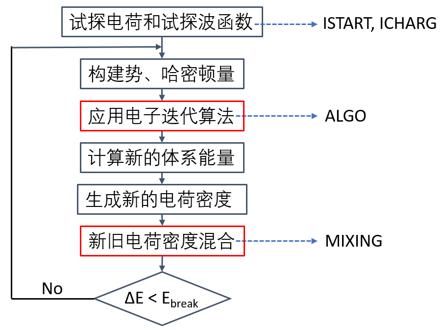
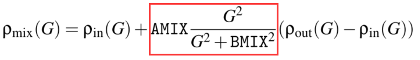
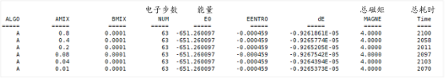
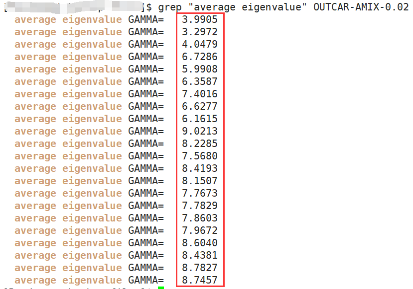
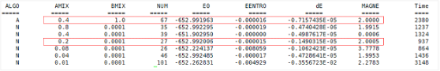
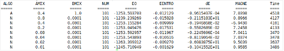

# TS01: 电子自洽迭代收敛问题 （MIXING 参数）

电子自洽迭代计算几乎是所有 VASP 计算的基础。在电子自洽迭代收敛完成后，我们可以获得体系的波函数和电荷密度，由此计算出能量、原子受力情况、态密度等，用于后续计算或者结果分析。相比于非磁材料，带磁性的材料的电子自洽迭代有的时候会难以收敛，或者容易收敛到高能量的磁态。导致电子自洽计算难以收敛以及收敛有误的原因，主要可以归纳为五个方面：

* 机器问题：在某些机器上，由于并行或者其他因素，可能会导致某些体系在某些参数设置下无法收敛。这个问题换一个服务器测试一下即可排查出来。

* 结构不合理：具体可从晶格常数、原子配位结构，原子距离，键长键角等方面考虑。

* 计算方法不合理：例如：PAW 势选取不合适、没有考虑电子强关联效应的影响。

* 自洽迭代相关参数（ALGO 参数、MIXING 相关参数）不合理。

* 初始磁矩MAGMOM 参数未设置或者设置不合理。

**本节讨论 `MIXING `相关参数的影响**。首先简单介绍一下该参数。下图为 VASP 进行电子自洽迭代的简要流程。在完成一步电子自洽计算之后，VASP 产生新的电荷密度。如果程序此时判断自洽计算还没达到收敛标准，程序会将旧的电荷密度和新的电荷密度进行混合，作为下一步自洽计算的输入电荷密度。通过 MIXING 参数可以调节新旧电荷密度的混合方式。调节 MIXING 参数将影响自洽迭代步数，也会影响自洽迭代的结果。

​                            

 图TS01 VASP计算中电子自洽迭代的简要流程 

#### `MIXING` 参数包括：

1. IMIX：新旧电荷密度混合方式。通常使用默认值即可。例如，在` IMIX = 1 `时，新旧电荷密度按照下面式子进行混合：

 

2) AMIX，BMIX，AMIX_MAG, BMIX_MAG：电荷密度混合参数。

结合 ALGO 参数，依据个人计算经验，主要有以下两个建议：

(1) `ALGO = All`，MIXING 参数使用默认值（此时 MIXING 参数不起作用）。

(2) `ALGO = Normal`，IMIX 使用默认值，并使用`线性混合`（即 `BMIX = 0.00001`，`BMIX_MAG = 0.00001`，调节`AMIX`参数）一般来说能有效改善体系的电子自洽收敛情况。

#### 测试实例：

以下提供几个磁性体系的测试结果（若无特殊说明，均为 BMIX = BMIX_MAG = 0.00001）。

* 例子-1：**ALGO = All**，AMIX = 0.01 ~ 0.8。收敛顺利。

​     

使用 ALGO = All 时，AMIX 取值不影响电子自洽，计算的步数、能量以及总磁矩都是一样的。

* 例子-2：ALGO = All 或 Normal，AMIX = 0.01 ~ 0.8。**收敛顺利**。

     

a)    对于易于收敛的体系，使用不同的 ALGO 和 AMIX，体系均能收敛到相同的磁态。

b)   AMIX = 0.04 ~ 0.4 时，自洽迭代步数少，耗时短。

* 例子-3：ALGO = All 或 Normal，AMIX = 0.01 ~ 0.8。**AMIX** **影响明显**。

     

a)    对于不容易收敛的体系，ALGO 和 AMIX 影响收敛情况。即使自洽迭代收敛了，有时也会收敛到能量较高的磁态上。

b)   ALGO = All 比较可靠，体系收敛到了磁基态上（能量 -652.99 eV，总磁矩 2.0 μB）

c)    ALGO = Normal，AMIX = 0.2 比较可靠，体系收敛到了磁基态上，且迭代步数明显少于 ALGO = All，耗时短。

* 例子-4：ALGO = All 或 Normal，AMIX = 0.01 ~ 0.8。**无法收敛**。

    

体系无法收敛。此时需要考虑所使用的结构是否合理，或者所使用的计算方法是否合理。 

####  

#### 总结及建议

1) ALGO 和 AMIX 会影响电子自洽迭代情况。特别是对于催化反应的计算，这一点需要特别注意。如果自洽收敛到不合理的磁态上，将会影响自己对于催化剂性能的判断。

2) 对于磁性体系，建议在结构优化完成之后，测试一下 ALGO 和 AMIX （类似例子-2、-3），以排除计算参数对自洽迭代结果的影响。

3) 个人常用的 ALGO 和 MIXING 参数组合：

a)    ALGO = N，AMIX = 0.2 (若不收敛，则使用 AMIX = 0.08)。

b)   上述不收敛，则使用 ALGO = All。

c)    还是不收敛，测试 ALGO 并扫描 AMIX 值。

d)   依然不收敛，考虑结构和计算方法的合理性。

