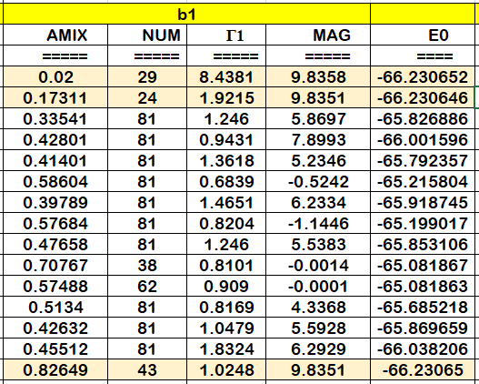
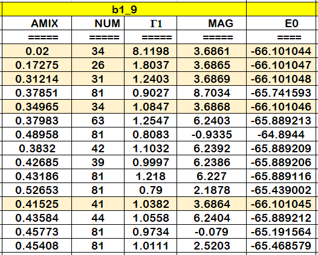
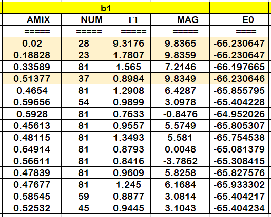
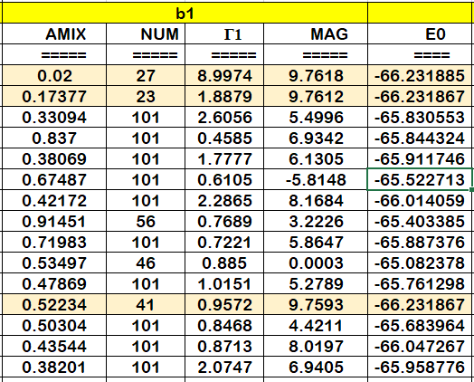
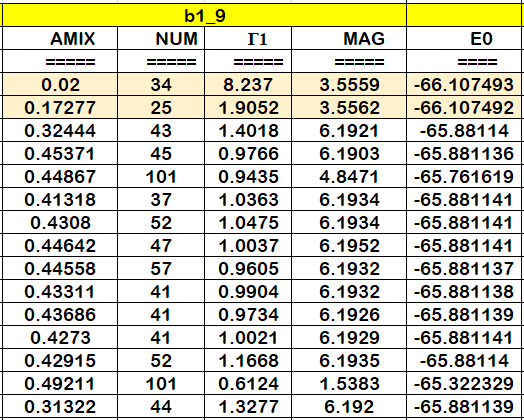
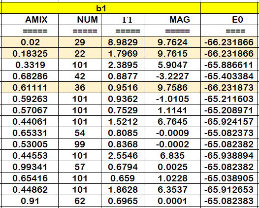
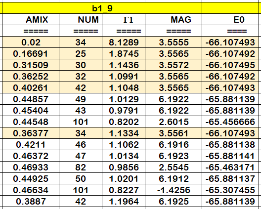
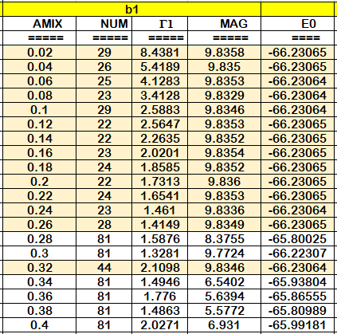
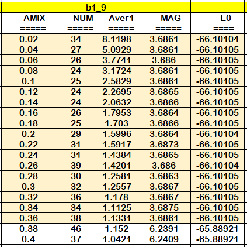

# TS01：电子自洽迭代计算框架介绍

## 前言

电子自洽迭代计算几乎是所有 VASP 计算的基础。在电子自洽迭代收敛完成后，我们可以获得体系的波函数和电荷密度，由此计算出能量、原子受力情况、态密度等，用于后续计算或者结果分析。

相比于非磁材料，带磁性的材料的电子自洽迭代有的时候会难以收敛，或者容易收敛到高能量的磁态。导致电子自洽计算难以收敛以及收敛有误的原因，主要可以归纳为四个方面：

-   机器问题：在某些机器上，由于并行或者其他因素，可能会导致某些体系在某些参数设置下无法收敛。这个问题换一个服务器测试一下即可排查出来。
-   结构不合理：具体可从晶格常数、原子配位结构和原子距离不合理等方面考虑。
-   自洽迭代相关参数：例如：ISTART 参数、MIXING 相关参数、ALGO 参数、MAGMOM 参数不合理。
-   计算方法不合理：例如：PAW 势选取不合适、没有考虑电子强关联效应的影响。

**本小节介绍电子自洽计算的整体框架。后续小节将针对上述四个方面展开讨论。**

## VASP 中电子自洽迭代过程

图 1 电子自洽迭代计算流程图

-   上图为 VASP 进行电子自洽迭代的简要流程，详细流程图可查阅 VASP 手册 Theoretical Background 的说明。在整个自洽迭代过程中，迭代收敛阈值（EIDFF 参数）设置好以后，我们可以干预的主要有三个地方：
1.  如何构建初始电荷及试探波函数（由 ISTART 和 ICHARG 参数控制），常见的有两种做法：

    1.1. 由 VASP 自己生成一个试探波函数。

    1.2. 用现有的波函数作为本次计算的初始波函数：读取现有波函数有两个用处：促进电子自洽迭代过程；约束电子自洽迭代，防止计算收敛到不需要的态。这在频率计算、声子谱计算及杂化泛函计算中很有用。

2.  电子迭代算符 （ALGO）的选择：

    2.1. 可以使用 ALGO 或 IALGO 参数设置所使用的电子迭代算法。其中使用 ALGO 进行设置会更加方便，手册上明确建议使用 ALGO，无法使用 ALGO 设置的迭代算法可能会不稳定。

    2.2. 个人常用 ALGO=Normal、All 和 Fast。

3.  新旧电荷密度如何混合（MIXING）：VASP 在电子迭代过程中，不会把生成的新的电荷密度直接作为下一步迭代的输入电荷密度，而是先混入一部分的旧的电荷密度得到混合的电荷密度, 再输入到下一步迭代。这里就会涉及到两个问题：新旧电荷密度的混合方式以及旧电荷密度的混入比例。混合方式和混合比例都可以通过 INCAR 中的参数进行控制。对于磁性材料，选择合适的 MIXING 参数可以使得计算快速收敛，见后文的说明及测试例子。

## ALGO 的一些说明：

以下是个人整理的 ALGO 参数使用简要说明及注意事项，详细说明可翻阅 VASP 手册。

-   ALGO = Normal（默认值）
1.  即 IALGO = 38，**稳定性最好**（手册原文：Please mind, that the RMM-DIIS algorithm can fail in rare cases, whereas IALGO = 38 did not fail for any system tested up to date.）。
2.  使用这一算法出现问题时，可尝试降低 NSIM。
-   ALGO = Very_Fast
1.  即 IALGO = 48，电子步耗时要比 ALGO = Normal 少得多（至少对于大体系以及小内存带宽的工作站来说是如此）。对于容易收敛（比如体系无磁性或磁性结构很简单）的大体系，可以考虑使用 ALGO = Very_Fast。
2.  可靠性较 ALGO = Normal 差，少数情况下使用 ALGO = Very_Fast 会失败，此时建议换成 ALGO = Normal。
3.  一般来说，使用这一算法主要会遇到两个问题：首先是 MD 和弛豫时未占据带的优化可能会失败，这一问题可以在 INCAR 中加入 WEIMIN = 0 解决。
4.  另外一个问题是轨道初始化不合理时，这一迭代算法可能无法正确收敛：增加 NBANDS 可以有效改善这一问题，若依然无法收敛，建议使用 ALGO = Fast。
5.  无法收敛时，可尝试降低 AMIX，增加 BMIX。
-   ALGO = Fast
1.  使用两种电子迭代算法：在自洽迭代开始几步，VASP 会先使用 IALGO = 38 进行迭代，以获得相对合理的初始电荷密度（以避免出现上面提到的 ALGO = Very_Fast 会遇到的第二个问题），后面再换成 IALGO = 48。对于结构优化，在第一步离子步之后，每一步离子步都会先执行一步 IALGO = 38，然后再换成 IALGO = 48。
2.  这种方法**比较可靠**。
3.  后面切换成 IALGO = 48 后，电子步耗时会比 IALGO = 38 短。因此在相同电子迭代步数前提下，使用 ALGO = Fast 耗时会短于 ALGO = Normal。
-   ALGO = All
1.  即 IALGO = 58。
2.  建议用于绝缘体。对于非自旋极化体系，这一迭代算法通常在能带数目等于电子数一半时具有最佳稳定性（此时这一算法相当可靠，甚至可能优于混合算法，即 ALGO = Fast）。
3.  TIME 的设置非常重要。参见 ALGO = Damped 中的说明。
-   ALGO = Damped
1.  即 IALGO = 53。
2.  对于小带隙体系和金属，常需要更大的 NBANDS，此时可考虑使用 ALGO = Damped。
3.  对于小带隙体系和金属，结合 LDIAG = .TRUE.，可以有效计算这些体系的基态。若使用 LDIAG = .FLASE.,收敛会更快，但是计算可靠性会显著下降。
4.  TIME 的设置非常重要。太小的 TIME 值会导致收敛显著变慢，太大则会导致迭代不收敛。建议优化 TIME 值（特别是体系具有许多不同的组态时）：从小的 TIME 开始测试，逐步增加 1.2 倍直至计算发散，然后取计算稳定收敛情况下最大的 TIME 值，将其用于所有的计算中。这一优化过程可以使用脚本批量测试。
-   选择 ALGO 时需要考虑的因素：
1.  对耗时和稳定性的平衡，其中耗时又具体表现在单步电子步耗时和电子迭代步数上：上述迭代算法，比如 ALGO = Normal，收敛稳定性好，一般来说所用的迭代步数较少，但是单步电子步耗时较长（可以通过增加计算核心数目降低单步电子步耗时），对于小体系计算是很好的选择。而 ALGO = Fast，大部分迭代使用的 IALGO = 48 算法，单步电子步耗时短，用于结构简单的大体系时，自洽计算耗时可能会比 ALGO = Normal 要有优势；但是体系结构复杂或者状态复杂（比如磁性体系）时，ALGO = Fast 可能会收敛困难甚至不收敛。
2.  体系基态是金属还是半导体。若是半导体，带隙大小如何。这不仅会影响 ALGO 的选择（All 和 Damped 哪个更适合），对于磁性体系还会影响 MIXING 参数的设置（见下文）。如何快速判断体系是半导体还是金属见下文说明。
3.  体系是否具有磁性：复杂磁性体系常常会遇到难以收敛的问题。我自己会把收敛稳定性放在更重要的位置，并考虑增加计算核心数目以降低单步电子步耗时。

## 如何快速判断体系是半导体还是金属

-   我个人通常习惯做分步结构优化。在第一步结构优化中，使用较低精度，同时设置 ISMEAR = 0 + SIGMA = 0.1，查看结构优化最后在 OUTCAR 中给出的 EENTRO 值。然后通过 EENTRO 值除以体系原子数去判断体系是半导体和金属：
1.  ( EENTRO / 原子数 ) 大于 1meV，体系为金属。
2.  ( EENTRO / 原子数 ) 小于 0.1meV，体系为半导体。这个值非常小时，比如 0.000001，体系带隙一般较大。
3.  ( EENTRO / 原子数 ) 介于 1meV 和 0.1meV，目前还没有具体测试过，不确定。
-   这一判断的依据是：对于金属体系，ISMAER = 0 会使用 Gaussian smearing，导致在费米面处出现分数占据，进而导致 EENTRO 值不为 0。而对于较大带隙的半导体，SIGMA = 0.1 还无法导致费米面处出现分数占据，EENTRO 值保持为 0（若增大 SIGMA 到一个很大的值时，EENTRO 也将不再保持为 0，但此时的计算可能会出现问题）。
-   这一判断方法是我个人的经验，目前在使用过程中大部分情况下都能给出正确的结果，但不保证对所有体系所有情况都可用。比如在弛豫过程中晶格变化非常大时，用于自洽计算对应的平面波截断球已经严重变形，可能会导致离子步的自洽收敛到的状态本身就有很大的误差。此时再在有误差的自洽结果上用这一方法进行判断是否可行，目前还不确定。不过解决办法也简单，再用弛豫的结构做一次弛豫就可以使用这一方法进行判断了。

## MIXING 参数的一些说明

-   在 VASP 中可以控制新旧电荷密度混合方式以及旧电荷密度混入比例。对于磁性材料，调节 MIXING 参数不仅可以有效减少迭代步数，还可以使得体系收敛到能量更低的磁态上。相关参数简要说明如下：
-   IMIX：新旧电荷密度混合方式

1.  IMIX = 1

    1.1. 使用 Kerker 混合方法，具体 ρout 和 ρin 分别为新旧电荷密度。

    1.2. 这一方法较少使用。目前我仅看到在 vasp 论坛上管理员建议在进行 HSE06 计算，选择 ALGO = Normal 时，使用 IMIX = 1。

2.  IMIX = 4 (默认值)

    2.1. 当参数 WC \> 0 时，使用 Pulay’s scheme，WC = 0 时选择 Broyden’s 2nd method。其中默认值为 WC \> 0。目前 Pulay’s sheme 总是好于 Broyden’s 2nd method。不建议修改 WC 参数。

    2.2. 需要说明的是，VASP 默认使用 WC \> 0，此时在 OUTCAR 中说明使用的是 modified Broyden-mixing sheme。可能这一方法就是 Pulay’s sheme。

    2.3. 此时 AMIX 参数的设置非常依赖于体系。见下面的说明。

-   BMIX：Kerker 混合方法截断波矢量
1.  对于 slab、磁性体系和绝缘体（例如分子和团簇），使用 BMIX = 0.0001 + BMIX_MAG = 0.0001（即 “线性混合” ），可以使得电子迭代更快收敛。
2.  使用 “线性混合” 时，AMIX 的设置非常关键。
-   AMIX：线性混合参数。在 IMIX = 4 时：
1.  AMIX 参数的设置非常依赖于体系：对于金属体系，AMIX 通常相当小（AMIX = 0.02）。而对于半导体体系，从我目前的测试结果来看，使用 AMIX = 0.2 大部分情况下可以使得电子迭代快速收敛。
2.  对于某些磁性金属体系，使用过大的 AMIX 值（比如 AMIX = 0.3）时，虽然也会使得电子迭代快速收敛，但此时体系其实是收敛到更高的磁态上，当使用 AMIX = 0.02 进行迭代时，将获得能量更低的状态。具体例子见下面磁性金属 MIXING 测试结果。
3.  对于磁性材料，特别是结构较复杂、电子迭代不容易收敛的体系，建议扫描 AMIX 值。
-   在 PBE 计算时，OUTCAR 文件中会给出 “average eigenvalue” 的信息，见下面图片。对于“线性混合”，手册认为当该值为 1 时，对应的电荷密度混合最好，电子迭代最好。据此手册给出了一个获得最佳 AMIX 的方法：使用要给 AMIX 值进行迭代计算，然后搜索 OUTCAR 中“average eigenvalue”的数值 Γ，优化的 AMIX 为：AMIXopt = AMIXcurrent \* Γ，然后用新的 AMIXopt 值做电子迭代，直至 Γ = 1。

-   相比于手册推荐的方法，我个人更推荐直接扫描 AMIX 值（比如从 0.02 扫到 0.2，间隔取 0.02）。
-   对于磁性金属体系，使用手册的方法优化 AMIX，有时会给出相当糟糕的结果。见下文的测试例子。

## 磁性金属 MIXING 测试结果

-   第一个测试例子：这里给出两个磁性金属体系 b1 和 b1_9 的测试结果，其中 b1_9 中含有多层过渡金属层，通过 MAGMOM 设置了层间反铁磁耦合。测试内容为：测试 NBANDS、k-spacing 和 AMIX 对体系电子迭代的影响。其他参数：PREC = Normal，ENCUT = 400，ALGO = Normal，ISMEAR = 1,SIGMA = 0.1，NELM = 80。
1.  以下结果的说明：

    1.1. 设置电子迭代步数最大为 81（NELM = 81）。

    1.2. AMIX：所用的 AMIX 值。

    1.3. NUM：电子迭代步数。

    1.4. Γ1：计算完成后从 OUTCAR 中提取 Γ 值，使用最后三个 Γ 值的平均值代入 AMIXopt = AMIXcurrent \* Γ 中产生下一步的 AMIX 值，在此仅展示三个 Γ 值中的一个。

    1.5. MAG：OSZICAR 给出的体系总磁矩。

    1.6. E0： 体系能量。

    1.7. 标淡黄色的部分表示计算正确收敛到了磁态上。

2.  对照组，按照手册的方法以 Γ = 1 为目标优化 AMIX 值：

| NBANDS = 52, k-spacing = 0.020 | NBANDS = 48, k-spacing = 0.020 |
|--------------------------------|--------------------------------|
|          |          |

1.  增大 NBANDS，按照手册的方法以 Γ = 1 为目标优化 AMIX 值：

| BANDS = 76, k-spacing = 0.020 | NBANDS = 76, k-spacing = 0.020 |
|-------------------------------|--------------------------------|
|         |          |

1.  减小 k-spcing，按照手册的方法以 Γ = 1 为目标优化 AMIX 值：

| NBANDS = 52, k-spacing = 0.016 | NBANDS = 48, k-spacing = 0.016 |
|--------------------------------|--------------------------------|
|          |          |

1.  增大 NBANDS + 减小 k-spacing，按照手册的方法以 Γ = 1 为目标优化 AMIX 值：

| NBANDS = 76, k-spacing = 0.016 | NBANDS = 76, k-spacing = 0.016 |
|--------------------------------|--------------------------------|
|          |          |

1.  扫描 AMIX 值:

| NBANDS = 52, k-spacing = 0.020 | NBANDS = 48, k-spacing = 0.020 |
|--------------------------------|--------------------------------|
|          |          |

1.  从以上结果可以看到：

    7.1. 在 b1 和 b1_9 这两个体系中，使用手册所给的方法很难得到合适的 AMIX 值。

    7.2. 对于这两个磁性金属体系，当 AMIX 值设置不合理（过大）时，体系将不收敛，或者收敛到更高的状态上（与能量更低的状态相比，体系能量和总磁矩均有很大差异）。需要取较小的 AMIX 值，才能收敛到更低的磁态。

    7.3. 特别是对于 b1_9 体系，即使通过 MAGMOM 参数设置了层间反铁磁耦合构型，当 AMIX 值设置不合理时，也无法获得需要的层间反铁磁耦合态。

    7.4. 需要注意的是，若不设置 MIXING，VASP 默认使用 AMIX = 0.4（默认 BMIX = 1.0），这一数值对于 b1 和 b1_9 来说可能是过大的。

    7.5. NBANDS 和 k-spacing 足够大以后，再增大 NBANDS 和 k-spacing 对体系收敛性提升不大。对于较大的 AMIX 值，自洽计算依然不收敛或者收敛错误。

-   第二个测试例子：ca1_5 通过 MAGMOM 设置为反铁磁耦合，为磁性金属。在进行结构优化时，k-spacing = 0.02， PREC = Normal，ISMEAR = 0, SIGMA = 0.1， ENCUT = 500。对比 AMIX 值对电子迭代的影响。

| MIXING 参数                                 | 结果                                         |
|---------------------------------------------|----------------------------------------------|
| AMIX = 0.2 BMIX = 0.0001 BMIX_MAG = 0.0001  | 第一步离子步跑了 200 步不收敛 磁态变为亚铁磁 |
| AMIX = 0.02 BMIX = 0.0001 BMIX_MAG = 0.0001 | 第一步离子步跑了 102 步收敛 磁态保持为反铁磁 |

1.  在这一体系中，对于 AMIX 更加敏感，相对于上面的 b1 和 b1_9 体系，使用 AMIX = 0.2 自洽计算无法收敛，需要使用更小的 AMIX 值。

## 总结

1.  相比于非磁体系，磁性体系的自洽迭代常常会遇到难以收敛的问题。使用“线性混合”的方法能有效改善磁性体系的收敛情况。
2.  判断体系为金属还是半导体后，选择 ALGO （一般使用 ALGO = Normal 即可）和 AMIX 值。对于磁性金属体系和磁性半导体，个人（在 ALGO = Normal 基础上）常设置的 AMIX 值分别为 0.02、0.08 和 0.2。
3.  若要进一步优化 AMIX 值，建议进行 AMIX 扫描。

一起干杯！
