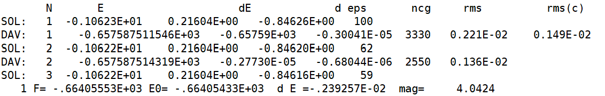
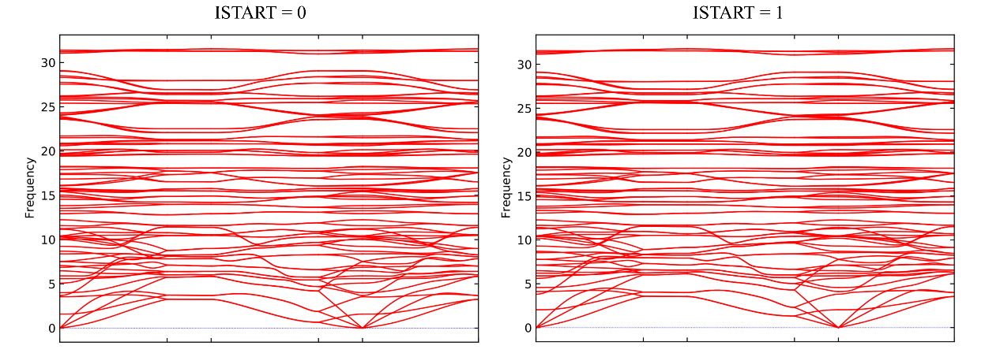
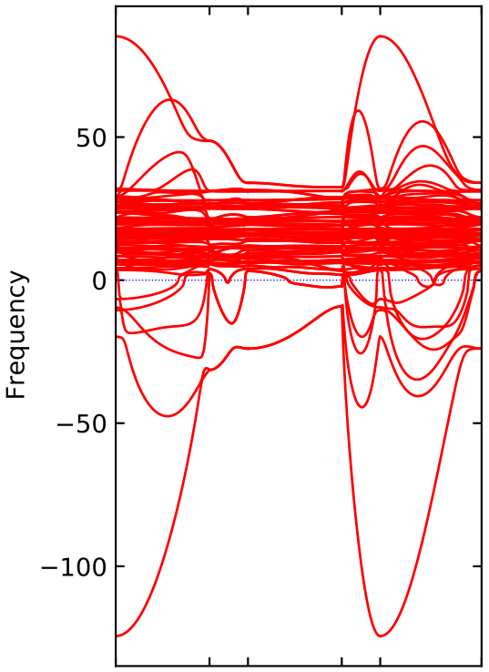
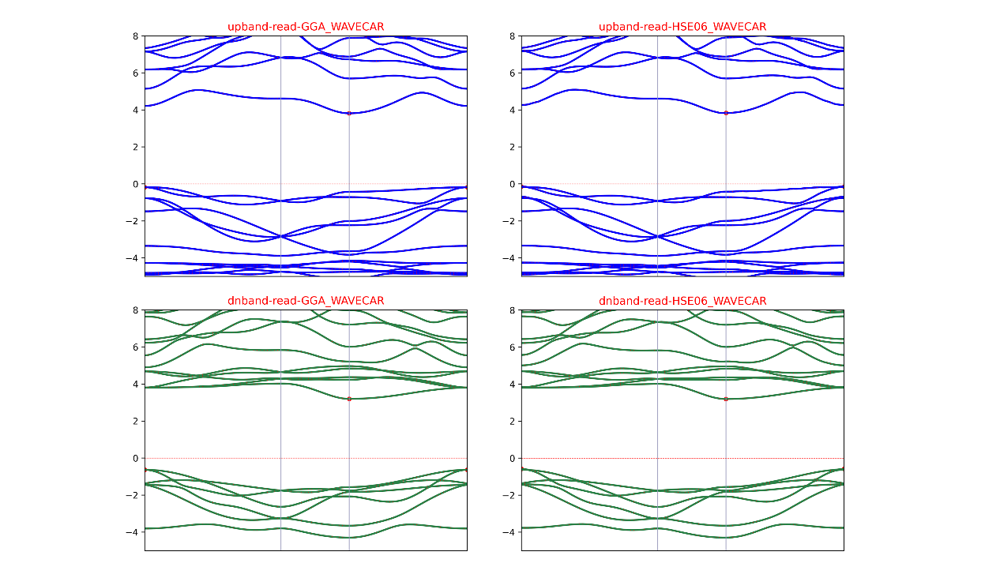
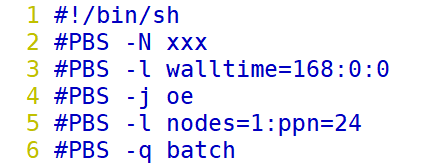
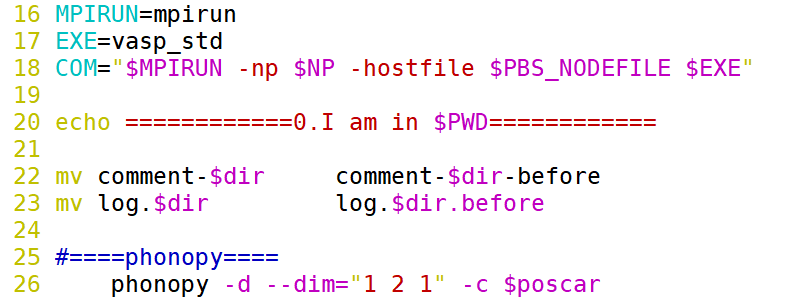

# 电子自洽迭代收敛问题：ISTART 参数的影响

TS01 小节介绍了电子自洽迭代计算的相关参数并给出了一些参考建议。**这一小节继续讨论 ISTART 参数的影响**。

## ISTART 参数介绍

ISTART 参数控制是否读取波函数，常用有两个设置：

1.  ISTART = 0：不读取 WAVECAR，根据 INIWAV 参数设置初始化用于电子自洽计算的轨道。
2.  ISTART = 1：读取 WAVECAR，根据读取的 WAVECAR 构造平面波用于后续的自洽计算。
3.  备注1：ISTART = 1，但是当前计算目录中没有 WAVECAR 时，VASP 无法读取 WAVECAR 文件，将根据 ISTART = 0 的设置进行初始化。
4.  备注2：读取了 WAVECAR 之后，VASP 会根据 WAVECAR 信息，构造出相应的电荷密度。因此，可以不用再读取 CHGCAR 的信息了。本小节中，ISTART = 0 和 ISTART = 1 同时也意味着不读取 CHGCAR 文件。

**关于 ISTART = 1 的分析**：在 ISTART = 1 时，如果读取了合理的 WAVECAR，对于电子自洽收敛是非常有利的，特别是对于一些比较难收敛的磁性体系。主要体现在两个方面：

1.  **有利于电子自洽计算快速收敛**：电子自洽过程亦是一个求解极小值的过程。如果初始的体系波函数与收敛的波函数较远，将需要比较多的收敛步数才能实现自洽收敛。而读取了合理的 WAVECAR 之后，体系的波函数与收敛的波函数更接近，电子自洽收敛步数将会减少。
2.  **有利于电子自洽计算收敛到合理的态**：对于存在多个收敛状态的体系，如存在多个不同磁态的磁性材料，如果从距离目标收敛状态较远的初始波函数出发进行自洽计算（即 ISTART = 0），在自洽计算过程中，体系状态容易落入不想要的收敛态中，得到不合理的结果。而读取合理的 WAVECAR，从目标收敛态附近开始进行电子自洽收敛，有利于电子自洽计算收敛到合理的状态。

**如何得到合理的 WAVECAR：**

1.  使用已有的 WAVECAR 文件，记为方法1。
2.  从相近的结构的电子自洽计算中获得，记为方法2。
3.  使用低耗时的计算方法获得，记为方法3。

下面列举**五个应用场景**：

1.  **频率计算（方法1）**：通过自洽计算得到态密度用于电子结构分析、以及通过频率计算进行吸附物种的吸附自由能校正，是催化计算中的常用操作。见表1，在自洽计算完成的基础上，可以将自洽计算产生的 WAVECAR 用于频率计算。在读取 WAVECAR 之后，频率计算的初始波函数即为已收敛的波函数，因此首个电子自洽迭代无需再经历漫长的自洽迭代过程，仅用两步电子步即完成自洽收敛（图1），从而显著减小了耗时。ISTART = 0 总耗时为 1172 s，而 ISTART = 1 总耗时为 798 s。

表 1 某频率计算 ISTART = 0 和 ISTART = 1 结果对比

| ISTART = 0           |              |                      |                 |
|----------------------|--------------|----------------------|-----------------|
| 校正吸附自由能（eV） | 总磁矩（μB） | **首次电子迭代步数** | **总耗时**（s） |
| 0.0508               | 4.0423       | **27**               | **1172**        |
| ISTART = 1           |              |                      |                 |
| 校正吸附自由能（eV） | 总磁矩（μB） | **首次电子迭代步数** | **总耗时**（s） |
| 0.0511               | 4.0423       | **2**                | **798**         |

​ 

图 1 某频率计算在 ISTART = 1 设置下首次电子迭代过程

1.  **有限位移法计算声子谱（方法2）**：声子谱常用于判断材料的晶格动力学稳定性。使用 phonopy + VASP 通过有限位移法计算结构的声子谱时，phonopy 会先生成 SPOSCAR 结构文件以及许多结构微扰过的 POSCAR-xxx 结构文件，然后 VASP 将对每个 POSCAR-xxx 结构进行一次自洽计算，最后进行后处理。这些 POSCAR-xxx 结构与 SPOSCAR 结构是非常接近的。为了使得针对 POSCAR-xxx 结构的自洽计算能够有效收敛，我们可以先对 SPOCAR 结构进行一次自洽计算，输出 SPOSCAR 的 WAVECAR 文件；接着，后续所有的 POSCAR-xxx 自洽计算均通过 ISTART = 1读取该 WAVECAR。见表2，相对于 ISTART = 0，ISTART = 1 计算虽然额外多了 SPOSCAR 的自洽计算过程，但后续的 POSCACR-xxx 自洽计算均可受益于 SPOSCAR 的 WAVECAR，使得 POSCAR-xxx 电子自洽计算快速收敛，仅需 14 \~ 18 步电子步（ISTART = 0 下，POSCAR-xxx 电子自洽计算则需要 36 \~ 38 步），从而大幅降低了声子谱的总耗时。ISTART = 1 总耗时为 35958 s，约为 ISTART = 0 总耗时的一半。同时，两种方式得到的声子谱非常接近，见图2。

    2.1. 备注1：要想进一步缩短计算耗时，可以舍去 SPOSCAR 自洽计算，输出 POSCAR-001 自洽计算的 WAVECAR，并在后续的 POSCAR-xxx 自洽计算中读取 POSCAR-001 的 WAVECAR。

表 2 某声子谱计算 ISTART = 0 和 ISTART = 1 结果对比

| 耗时（s）  | SPOSCAR         | POSCAR-001 | POSCAR-002 | POSCAR-003 | POSCAR-004 |
|------------|-----------------|------------|------------|------------|------------|
| ISTART = 0 | /               | 3249       | 3192       | 3251       | 3182       |
| ISTART = 1 | 3771            | 1321       | 1331       | 1310       | 1312       |
| 耗时（s）  | POSCAR-005      | POSCAR-006 | POSCAR-007 | POSCAR-008 | POSCAR-009 |
| ISTART = 0 | 3211            | 3196       | 3151       | 3147       | 3259       |
| ISTART = 1 | 1215            | 1211       | 1339       | 1252       | 1321       |
| 耗时（s）  | POSCAR-010      | POSCAR-011 | POSCAR-012 | POSCAR-013 | POSCAR-014 |
| ISTART = 0 | 3139            | 3140       | 3236       | 3216       | 3196       |
| ISTART = 1 | 1337            | 1293       | 1291       | 1291       | 1317       |
| 耗时（s）  | POSCAR-015      | POSCAR-016 | POSCAR-017 | POSCAR-018 | POSCAR-019 |
| ISTART = 0 | 3189            | 3160       | 3151       | 3185       | 3219       |
| ISTART = 1 | 1309            | 1318       | 1285       | 1263       | 1260       |
| 耗时（s）  | POSCAR-020      | POSCAR-021 | POSCAR-022 | POSCAR-023 | POSCAR-024 |
| ISTART = 0 | 3266            | 3212       | 3145       | 3124       | 3187       |
| ISTART = 1 | 1261            | 1646       | 1614       | 1535       | 1555       |
|            | **总耗时（s）** |            |            |            |            |
| ISTART = 0 | **76603**       |            |            |            |            |
| ISTART = 1 | **35958**       |            |            |            |            |

​ 

图 2 某声子谱计算 ISTART = 0 和 ISTART = 1 结果对比

1.  **有限位移法计算声子谱收敛错误排查（方法2）**：在使用有限位移法计算声子谱时，如果某次 POSCAR-xxx 自洽计算没有收敛或者收敛错误，将会产生错误的声子谱，见图3。这种错误的声子谱往往有非常大的虚频，色散关系杂乱。见表3，自洽计算收敛错误，一般表现为：自洽计算得到的能量明显高于其他 POSCAR-xxx 自洽计算的能量、总磁矩明显与其他自洽计算不同、以及 OUTCAR 中输出的 external pressure 不同于其他自洽计算的输出值。自洽计算不收敛，一般表现为：相邻电子步能量差未达到收敛阈值（dE），且耗时明显久于其他自洽计算耗时。此时，利用方法2可以有效改善自洽计算的收敛性，获得合理的声子谱（见图2）。注意：对于某些难收敛或者有多个能量相近磁态的体系，即使使用 ISTART = 1 读取了 SPOSCAR 的 WAVECAR 文件，个别 POSCACR-xxx 自洽计算依然会收敛到不想要的磁态上，此时可以进一步通过调节 ALGO 和 MIXING 参数以处理这一问题。关于 ALGO 和 MIXING 参数的讨论见后续章节的讨论。

表 3 某声子谱计算中 POSCAR-001 自洽计算收敛错误相关信息汇总

|            | **能量**        | dE              | external pressure | 耗时     | **总磁矩**  |
|------------|-----------------|-----------------|-------------------|----------|-------------|
| POSCAR-001 | **-677.358761** | **-0.2001E-04** | -3.32             | **8689** | **24.0018** |
| POSCAR-002 | -682.778793     | -0.3150E-06     | -0.52             | 3192     | 0.0026      |
| POSCAR-003 | -682.778178     | -0.1018E-06     | -0.53             | 3251     | 0.0008      |
| …          | …               | …               | …                 | …        | …           |
| POSCAR-024 | -682.779205     | -0.1220E-06     | -0.52             | 3187     | -0.0152     |

​ 

图 3 某声子谱计算中 POSCAR-001 自洽计算收敛错误得到的声子谱

1.  **杂化泛函自洽计算（方法3）**：杂化泛函的计算量远大于 GGA 泛函计算量。在进行杂化泛函计算之前，可以先使用 GGA 泛函进行自洽计算，得到 GGA 下的 WAVECAR；然后再读取 GGA WAVECAR 进行杂化泛函计算。见表4，相对于 ISTART = 0测试，读取 GGA WAVECAR 之后，杂化泛函迭代步数更少，耗时更短。ISTART = 0 总耗时为 16578 s，而 ISTART = 1 总耗时为 11573 s。

表 4 某杂化泛函计算 ISTART = 0 和 ISTART = 1 结果对比

| ISTART = 0 |              |                        |                 |
|------------|--------------|------------------------|-----------------|
| 能量（eV） | 总磁矩（μB） | **杂化泛函迭代步数\#** | **总耗时**（s） |
| -68.379220 | 4.0000       | **22**                 | **16578**       |
| ISTART = 1 |              |                        |                 |
| 能量（eV） | 总磁矩（μB） | **杂化泛函迭代步数**   | **总耗时**（s） |
| -68.379224 | 4.0000       | **15**                 | **11573**       |

\#：前面四步非自洽计算耗时非常短，不计入内。这里只比较单电子步耗时长的杂化泛函计算步数。

1.  **杂化泛函能带计算（方法3）**：杂化泛函能带计算需要加入用于描绘能带的权重为0的k点，这些 k 点数目通常比较多，导致总k点数目要比杂化泛函自洽计算（不含用于描绘能带的k点）多，计算耗时也比杂化泛函自洽计算更长。直接计算杂化泛函能带，可以得到自洽计算结果的同时，得到能带的结果，但耗时久（在此称作“一步计算”）。为了缩短耗时，我们可以将杂化泛函计算分为两步：第一步：读取 GGA WAVECAR 进行相对低耗时的杂化泛函自洽计算，并输出杂化泛函自洽计算 WAVECAR；第二步：读取杂化泛函自洽计算给出的 WAVECAR 进行杂化泛函能带计算（在此称作“分步计算”）。例子见表5，相对于“一步计算”，“分步计算”中 HSE06 能带计算仅用两步电子步即完成收敛，耗时明显更少。ISTART = 1 总耗时为 1930 s，约为 ISTART = 0 总耗时的三分之一。而且两种方法得到的结果非常接近，见图4。

    5.1. 备注1：HSE06 能带计算建议使用 ALGO = Normal。

    5.2. 备注2：在我测试过的体系中，大多数体系使用分步计算可以得到比较好的能带图。但对于有个别体系，分步计算得到的能带图色散关系不够平滑。此时可以考虑使用 NELEMIN 强制增加自洽计算电子步数，使得权重为0的k点计算更加合理，从而得到更好的能带图。

表 5 读取不同 WAVECAR 文件某杂化泛函计算结果对比

| ISTART = 1，读取 GGA WAVECAR 文件            |                         |                            |                 |
|----------------------------------------------|-------------------------|----------------------------|-----------------|
| HSE06 自洽计算耗时（s）                      | HSE06 能带计算耗时（s） | HSE06 能带计算**迭代步数** | **总耗时**（s） |
| /                                            | 5857                    | **13**                     | **5857**        |
| ISTART = 1，读取 HSE06 自洽计算 WAVECAR 文件 |                         |                            |                 |
| HSE06 自洽计算耗时（s）                      | HSE06 能带计算耗时（s） | HSE06 能带计算**迭代步数** | **总耗时**（s） |
| 661                                          | 1269                    | **2**                      | **1930**        |

​ 

图 4 读取不同 WAVECAR 文件某杂化泛函计算结果对比

## 总结及建议

1.  通过 ISTART = 1 读取合理的 WAVECAR 可以明显改善电子自洽计算的收敛性。
2.  本文通过五个计算场景讨论了 ISTART = 0 和 ISTART = 1 的区别。
3.  在自己实际工作中，可以多进行测试，亲自感受一下二者的区别，将会有更深入的体会。另外，ISTART = 1 的应用并不仅限于本小节提到的这些计算场景，在自己的工作中可以多想想还有哪些合适的应用场景。

## 

## 相关脚本

应用方法2计算有限位移声子谱涉及比较繁琐的操作，在此提供两个脚本用于简化操作：

1.  gene-comment-file.sh：（下载地址：xxx）
    1.  功能：在计算完成后，将相关数据（能量、EENTRO、总磁矩、耗时等）收集整理到 commnet 文件夹中。
    2.  使用方法：导入到自己的账户中添加可执行权限将其添加到环境变量中。
2.  batch-phono-read-WAVECAR.pbs：（下载地址：xxx）
    1.  功能：集成了方法2的有限位移声子谱计算脚本，自动执行 phonopy 前处理及后处理命令，自动部署 SPOSCAR 及 POSCAR-xxx 的自洽计算，调用gene-comment-file.sh生成 comment 文件用于计算检查。
    2.  使用方法：确保服务器上已经安装好 phonopy 并将其添加到环境变量中准备好 INCAR-POSCAR、INCAR-SPOSCAR、KPOINTS、POSCAR-origin、POTCAR、band.conf 文件（文件说明见下文）将该脚本导入到计算目录下修改脚本中相关设置提交计算计算检查
    3.  相关文件说明：

        3.1. INCAR-SPOSCAR：进行自洽计算，输出 WAVECAR 文件。若体系有磁性，根据体系原子数及声子谱计算所使用的超胞数设置 MAGMOM。建议使用 ISYM = 0。

        3.2. INCAR-POSCAR：进行自洽计算，ISTART = 1读取WAVECAR文件，计算完成后不输出 WAVECAR。注释掉 NELMDL 和 MAGMOM。使用 ISYM = 2。

        3.3. KPOINTS：根据要构建的超胞大小进行准备。

        3.4. POSCAR-origin：单胞的结构文件

        3.5. POTCAR：单胞的 POTCAR 文件

        3.6. band.conf：根据结构对称性和所使用的超胞数进行设置

    4.  脚本修改说明：

        4.1. 1\~6行及16\~18行：根据自己实际情况（任务名字、队列名、调用核心数、并行计算设置）进行设置。

        4.2. 26行：根据声子谱计算所使用的超胞数进行修改。

​   
​ 

图 5 batch-phono-read-WAVECAR.pbs 文件部分内容

一起干杯！